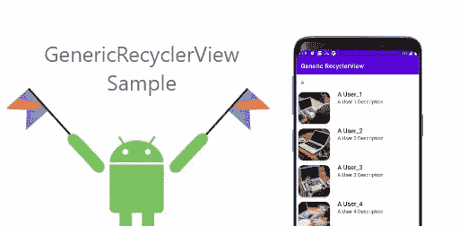

# 什么是 GenericRecyclerView？

> 原文：<https://medium.com/nerd-for-tech/what-is-genericrecyclerview-63f940f65139?source=collection_archive---------15----------------------->



在本文中，我们将讨论 **GenericRecyclerView** 组件和其中使用的 **GenericAdapter** 。您可以使用 **GenericRecyclerView** 组件，而不是单独为每个回收器视图创建适配器。在 **GenericRecyclerView** 中，你只需要为你的项目创建一个布局文件和一个项目的模型类，其余的都由组件本身处理。它在 RecyclerListListener 中提供了某些方法，通过这些方法可以对列表中的项目进行修改。

# 先决条件

在深入了解更多细节之前，请确保您已经检查了以下几点。
*—您系统中安装的 Android studio。
—运行您的应用程序的 Android 设备或仿真器。*

*   我们将从从 GitHub 获取代码开始。
*   您可以从 [GenericRecyclerView](https://github.com/developerspace-samples/GenericRecyclerView) 存储库中**克隆**项目。

```
//Clone this repository
*git clone* [https://github.com/developerspace-samples/GenericRecyclerView.git](https://github.com/developerspace-samples/GenericRecyclerView.git)
```

一旦您克隆或下载了 repo，您就可以检查“recyclerView”文件夹，其中包含 GenericRecyclerView 以及与 GenericRecyclerView 相关的所有文件。

> 注意~启用数据绑定以使用 GenericRecyclerView。

要启用数据绑定，请在您的 **build.gradle** (应用程序级别)中的` *android* '部分下添加以下行

```
dataBinding { enabled = true }
```

# 如何使用 GenericRecyclerView？

要使用 GenericRecyclerView，需要将其添加到布局文件中，类似于 recycler 视图。

请检查下面的代码片段

一旦在布局文件中添加了 GenericRecyclerView。您需要将元素绑定到您的 ***中。kt** 或* **。java** 文件并使用***genericrecyclerview . initialize(listener:onrecyclerlistener)***来使用它的方法。

请检查以下代码片段以供参考。

*   **override fun getitem layout():Int—**该方法用于设置回收器视图中项目的布局。必须返回布局文件，否则 GenericRecyclerView 将无法工作。
*   **override fun onItemSet(mite binding:view data binding，item:Any)——**该方法用于设置回收器视图中的项目。因为我们使用的是数据绑定，所以你只需要转换这个项目，并用“*mite binding”*来设置它。
*   **override fun on Header set(textView:textView，Any:Any)——**该方法用于设置 recyclerView 的头。如果不需要，您可以设置自己选择的标题或将其留空。
*   **override fun getHeaderId(var 1:Int，item: Any): Long —** 如果打算在 RecyclerView 中设置 Header，就使用这个方法。您可以使用它，如果不使用，则返回 0。
*   **override fun onItemClick(mdata binding:view data binding，item:Any)——**每当您需要在单击任何回收器视图项目时执行操作时，都会使用此方法。
*   **override fun onItemLongClick(mdata binding:view data binding，item:Any)——**每当您需要对任何回收器视图项执行长时间单击操作时，就会使用此方法。

# 如何生成循环视图作品？

GenericRecyclerView 是一个自定义的回收视图，它扩展了普通回收视图的属性。它包含了几个类似于 ***initialize()、setList()*** 的方法，任何人都可以通过这些方法轻松使用它。它在内部设置了 [**GenericAdapter**](https://github.com/developerspace-samples/GenericRecyclerView/blob/master/app/src/main/java/com/developerspace/genericrv/recyclerview/GenericAdapter.kt) ，因此如果使用 GenericRecyclerView，就不需要创建单独的适配器。

# 什么是 GenericAdapter？

GenericAdapter 是一个包含一些通用属性的 RecyclerView 适配器，因此您可以对它使用任何模型或对象。

您也可以将 GenericAdapter 用于普通的回收器视图。您只需要创建一个 GenericAdapter 的实例，并在 GenericAdapter listener 的方法中进行所需的更改。最后将适配器设置为回收器视图。

*请查看以下代码片段以供参考。*

> GenericAdapter 包括对 StickyHeaderDecoration 的支持，该支持用于在 recyclerview 中添加标头作为装饰

# OnRecyclerListListener

我们正在使用“**onrecyclerlistener**”接口为用户提供使适配器成功工作所必需的方法，并且一些方法用于在回收器视图的每个子视图上进行修改。

# 参考

[https://developer . Android . com/guide/topics/ui/layout/recycler view](https://developer.android.com/guide/topics/ui/layout/recyclerview)