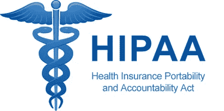
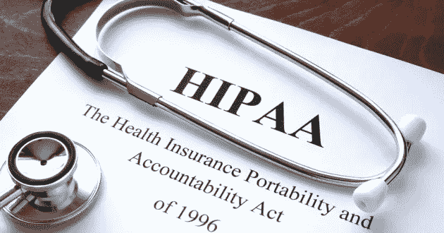
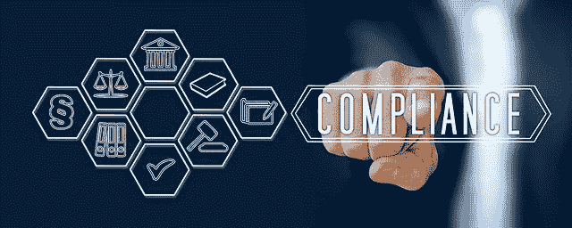

# HIPAA 是什么？

> 原文：<https://medium.com/nerd-for-tech/what-is-hipaa-a43094d9c4d6?source=collection_archive---------13----------------------->

在本教程中，您将了解 HIPAA，它是什么，它是如何产生的，以及它在远程医疗保健中的作用。

# 先决条件

对医疗保健技术的好奇。

# 介绍

在一个数据驱动的世界里，数据盗窃和数据泄露正在上升，数据保护法的需要是非常受欢迎的。例如，如果患者的健康信息被泄露，他/她会怎么做？人们如何保护自己的健康信息，防止无数公司需要他们的数据？是否有法律起诉未经您同意泄露或共享您的健康信息的实体？遵循本教程，所有这些答案都将得到解决。

# HIPAA 是什么？

HIPAA

首先，我要告诉你 HIPAA 不是什么。 **HIPAA** 不是**河马**！HIPAA 是健康保险流通和责任法案的首字母缩写。这是一项联邦法律，旨在保护您的健康信息免受未经授权的披露。

HIPAA 是一项联邦立法，要求建立国家标准，以防止在未经患者同意或患者不知情的情况下泄露敏感的患者健康信息。

# HIPAA 简史

HIPAA 历史

HIPAA 的历史始于 1996 年 8 月 21 日，当时签署了 HIPAA 法案，但为什么要引入它呢？HIPAA 的成立是为了“增强健康保险覆盖范围的流动性和问责制”,适用于所有工作场所的员工。该法案还旨在防止医疗和健康保险中的浪费、欺诈和滥用。该法案还包括通过实行税收优惠、覆盖雇员现有的医疗问题和简化健康保险管理来促进使用健康储蓄债券的规定。

简化健康保险管理的程序已成为促进卫生部门将病人病历电脑化的一种手段。该法案的这一部分导致了 2009 年“管理使用激励计划”的建立，卫生部门的领导人在《经济和临床健康卫生信息技术法案》(HITECH)中称之为“过去 20 至 30 年的主要卫生立法”。

# HIPAA 法规

HIPAA 法规

HIPAA 中提供了大约四项监管法案来保护健康数据，具体如下。

**隐私规则**

HIPAA 隐私规则为医疗记录和其他个人健康信息的保护制定了国家标准，包括健康计划、票据交换所和进行某些数字医疗交易的医疗保健提供商。

**安全规则**

HIPAA 安全规则确立了由所涵盖的组织创建、接收、使用或保留的个人电子健康数据保护的国家要求。

**实施规则**

HIPAA 执行规则包括关于遵守和调查违反 HIPAA 行政简化规则、适用民事罚款和听证程序的法律。

**违约通知规则**

HIPAA 违约通知规则要求分类实体向受影响的人报告未担保 PHI 的侵权行为；HHS；在某些情况下，还有媒体。根据数据保护规则，侵权通常是指危及 PHI 隐私或安全的不可接受的使用或披露。

# HIPAA 术语的定义

HIPAA 条款

你一定会说，“这些首字母缩略词和缩写是什么意思？”。别担心，我们会掩护你的。下面是讨论 HIPAA 时你必须了解的术语定义。

**HIPAA**——健康保险流通与责任法案。

**HHS** —人类健康服务部，美国一个保护所有美国人健康并提供基本人类服务的部门。

**PHI** —受保护/个人健康信息。

**BAA** —这意味着业务合作协议。它是 HIPAA 覆盖的实体与该实体使用的供应商之间的合同。

**涵盖的实体** —这是需要遵守 HIPAA 的任何个人、企业或组织。

# HIPAA 中 PHI 的使用和披露

*HIPAA 隐私规则何时要求使用和披露 PHI？*

根据 HIPAA 隐私规则，仅在以下两种情况下要求承保实体披露受保护的健康信息:

*   寻求访问或说明其受保护健康信息的人(或其个人代表);和
*   当卫生与公众服务部(HHS)执行法规查询、审查或强制措施时。

# HIPAA 和远程医疗

远程医疗保健

您应该关注远程医疗的一些原因，但首先什么是远程医疗？

维基百科将远程医疗定义为通过电子信息和电信技术分发与健康相关的服务和信息。它允许远程患者和临床医生联系、护理、建议、提醒、教育、干预、监测和远程入院。

【HIPAA 适用于您和您的远程医疗实践吗？

如果您是提供个人医疗信息的医疗保健提供者，HIPAA 适用于您。如果是，您就是受保护的组织(承保实体)。

*您传输的信息是否被视为 PHI？*

所有能用来识别某人的都是潜在的 PHI。有 18 种标识符被认为是 PHI。与远程医疗保健相关的示例包括姓名、电话号码、纪念日、IP 地址、电子邮件地址、设备标识符和图片。

我有商业伙伴吗？

业务伙伴是代表您创建、接收、维护或传输 PHI 的个人；或者在你的实践中谁有能力与 PHI 沟通。

# HIPAA 合规性

HIPAA 合规性

使用物理、管理和技术预防措施来确保 HIPAA 合规性。HIPAA 合规性不能仅仅通过技术来实现。以下是你和你的商业伙伴应该执行和记录的一些事情。

**风险评估**

对您存储或访问 PHI 的位置以及每个位置的安全性进行全面检查。采取必要的措施，以适合您公司的方式保护它。列出您的安全策略和流程，并记录下来。定期、持续地培训你的员工。

**信息系统活动回顾**

对访问日志或其他记录进行定期检查，并记录未经授权的活动。如果你找到了，这可能是个可怕的消息，但你想成为第一个找到它的人。报告漏洞并尽快部署补丁。向专业人士咨询你接下来的步骤。

# 结论

总之，今天我们已经了解了很多关于健康保险流通和责任法案(HIPAA)的事情。我们已经看到该法律如何保护用户免受数据窃取和泄露的影响，以及如何解决患者数据侵权引发的问题。我们已经看到 HIPAA 对医疗行业的重要性，尤其是在信息技术和医疗保健/医药日益融合的情况下。

在 [CometChat](https://cometchat.com/) 这里，我们致力于让你对教育话题更加敏感，这将填补在理解通信技术在改善生活中的作用方面的空白。您可以在我们的网站上查看我们的产品，这些产品可以与您的[网站](https://cometchat.com/)或应用程序(如 [CometChat SDK](https://www.cometchat.com/pro) 和 CometChat API)集成。

# 关于作者

**Bio** :福音达林顿是一个远程全栈 web 开发者，在**前端**和 **API** 开发方面多产。他对开发高级的、响应迅速的 web 应用程序非常感兴趣。他目前正在探索改进渐进式网络应用的新技术。福音书达林顿目前是一名自由职业者，他利用空闲时间指导年轻人如何在生活中获得成功。他的爱好包括发明新食谱、写书、写歌和唱歌。你可以通过 [LinkedIn](https://www.linkedin.com/in/darlington-gospel-aa626b125/) 、 [Twitter](https://twitter.com/idaltonic) 、[脸书](https://www.facebook.com/darlington.gospel01)或 [GitHub](https://github.com/Daltonic) 联系我。

# 了解 HIPAA 更多信息的主要资源

*   [HIPAA 历史。](https://www.hipaajournal.com/hipaa-history/)
*   [面向专业人士的 HIPAA。](https://www.hhs.gov/hipaa/for-professionals/index.html)
*   [使用&披露φ](https://compliancy-group.com/use-and-disclosure-of-phi/)
*   [HIPAA 项目 1027](https://www.ssa.gov/ndf/documents/HIPAA%20Project-1027.pdf)