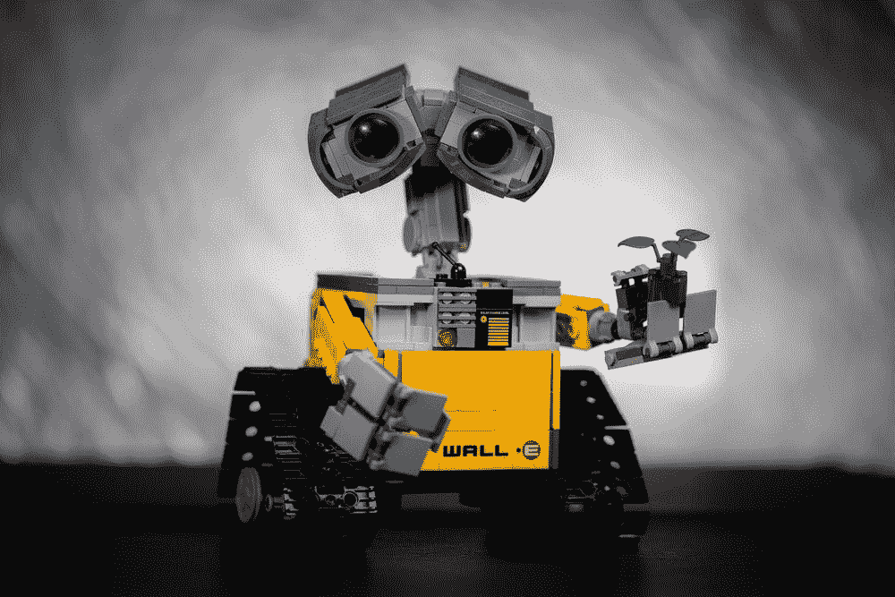

# 现代汽车的机器人项目在收购波士顿动力后在做什么？—第二部分

> 原文：<https://medium.com/nerd-for-tech/what-is-hyundai-motors-robotics-program-doing-after-the-acquisition-of-boston-dynamics-part-2-1fd8b5384120?source=collection_archive---------1----------------------->

## **汽车人**

现代汽车集团早在 2021 年 10 月就已经在元宇宙平台 Roblox 上推出了元宇宙游戏《现代汽车大冒险》。这个游戏是一个集体共享的虚拟空间，不同的用户可以通过游戏见面和交流。同时，玩家可以使用特定的数字角色来体验现代汽车的移动产品和服务。

传统上，我们认为元宇宙及其原型产品的成熟度往往从八个维度量化:硬件、网络层、计算能力、虚拟平台、协议和标准、支付方式、内容、服务、资产和消费者行为。而现在实现的条件还远远没有达到，这还需要其他技术条件的支持，比如 5G，6G，甚至更高速的网络传输，更强的计算能力，更多的可穿戴设备，云计算，这样一万个人就可以在世界各地的同一个屏幕和服务器上，提供更好的沉浸式体验。

但现代认为，元宇宙的核心目的不是完全虚拟，而是以各种方式链接。虚拟和现实链接的载体可以是汽车、任何移动物体或机器人。例如，汽车、可穿戴外骨骼设备和各种移动机器人旨在实现不同目的的人类体验、旅行和工作需求的持续扩展。

于是，现代汽车于 2021 年 6 月从软银手中收购了世界顶级机器人研发公司波士顿动力公司。波士顿动力公司一直以世界顶尖的机器人研发能力著称。现代汽车集团希望通过结合可穿戴技术、机器人技术和波士顿动力公司的创新，在更多领域大幅提升实力，带来更大的机动性。也为虚拟与现实的技术链接提供了更多的方向。

## 机器人无疑是一个很好的送货载体

通过更多的传感器，有望实现更大范围的感官信息采集，完成一些特定的任务。它需要更强的移动承载能力。据现代汽车称，未来将使用技术创造的升级智能机器人。

至于这个升级后的智能机器人，可能是现代汽车收购的机器狗 Spot，工厂里的人形机器人 ATLAS，stretch，或者干脆就是一辆汽车。现代不仅将汽车视为一种交通工具，还将其视为公司办公室或 3D 娱乐室、**、数据分发和处理中心**，或进入元宇宙的综合窗口。

值得一提的是，汽车机器人的概念也在 2022 CES 期间盛行。据称，具备 L4 级自动驾驶能力的汽车机器人有望在 2023 年上市。该产品的概念车于 2022 年 4 月北京车展正式亮相。2021 年 12 月，百度创始人李彦宏提出，未来的汽车机器人将采用“自由运动、自然交流、自我成长”三大产品理念。

## **高质量的训练数据正在帮助人工智能打破新的壁垒**

目前，各行业对最优质的 AI 训练数据需求迫切。人工智能应用于各个领域，如教育、法律、智能驾驶、银行和金融等。每个领域都有细分和专业化的要求。

其中，尤其是智能转型的传统企业和科技企业，更需要有丰富项目经验的培训数据服务商的协助，帮助整理数据标注指令，获取更合适的数据。在特殊场景下使用高质量的数据，减少研发周期，加速实施过程，帮助企业更快更好地进行智能化转型。

在深入的产业落地过程中，人工智能技术与企业需求仍有差距。企业用户的核心目标是利用人工智能技术实现业务增长。实际上，人工智能技术本身并不能直接解决所有的业务需求。它需要创建可以基于特定业务场景和目标大规模实现的产品和服务。

我们需要明确的是，对于 AI 公司和整个行业来说，数据标注是实现人工智能的重要一环。标注数据的准确性和效率影响着人工智能算法模型的最终结果。

# 结束

将您的数据标注任务外包给[字节桥](https://tinyurl.com/3umtbc3m)，您可以更便宜、更快速地获得高质量的 ML 训练数据集！

*   无需信用卡的免费试用:您可以快速获得样品结果，检查输出，并直接向我们的项目经理反馈。
*   100%人工验证
*   透明标准定价:[有明确定价](https://www.bytebridge.io/#/?module=price)(含人工成本)

为什么不试一试呢？

资料来源:https://www.robot-china.com/news/202201/13/69451.html