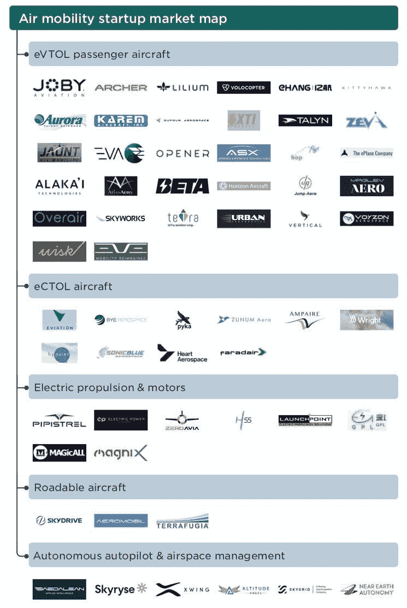
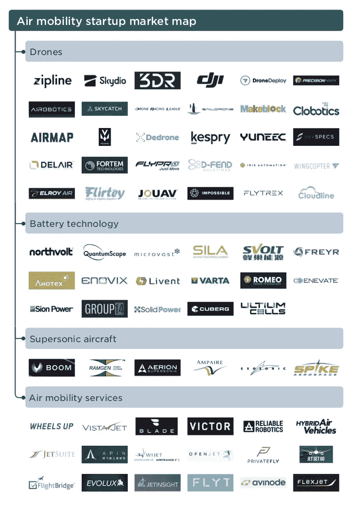

# 空气中有什么？

> 原文：<https://medium.com/nerd-for-tech/what-is-in-the-air-958258389cc1?source=collection_archive---------13----------------------->

Pitchbook 发布了电动垂直起降空中出租车启动手册和空中交通地图。我决定完成分析性审查。

6 年多来，我一直在积极监测无人机和相关技术，并在这一领域达成了 4 笔交易:HyPoint、Zeroavia、UVL 机器人公司和 Krtkl。该列表的 50%在当前市场地图中有所体现。

我想强调几个没有写在报告中的有趣事实，并对市场地图进行评论。

1.  空中出租车初创公司在 Q1 2021 年筹集了 38 亿美元。这几乎是之前破纪录的 2020 年投资总额的 4 倍。然而，值得注意的是，如此大的数字来自美国 Joby Aviation(特殊目的收购公司 7 亿美元)、德国 Lilium(腾讯、Palantir Capital、贝莱德 4.5 亿美元)和 Archer Aviation(特殊目的收购公司 5 亿美元)的几笔大交易。

2.据报道，到 2025 年，空中出租车市场将达到 15 亿美元。一个有意义的市场出现的时刻，就 20 亿美元的交易量而言，又一次被推迟了.我个人不相信空中出租车或 aerometros(通过固定车站在城市内运送乘客)在城市内迅速出现是有原因的。有很多监管障碍，安全和可靠性问题，飞行测试，认证，当然无人机需要，当然无人机需要至少 40 分钟的飞行时间，等等。我认为，在 5 年内，世界将会大量采用无人机送货，城市内的包裹重量可达 5-8 公斤，城市以外的包裹重量可达 100 公斤。之后，空中出租车商业化的时机就会到来。

3.有一个有趣的飞行汽车部分，出于某种原因，包括日本的 SkyDrive the flying，但没有轮子(去年筹集了 3800 万美元)。还有一些真正会飞的汽车，其中一辆 terra fugia(2017 年被中国吉利收购)的汽车设计非常奇怪，看起来更像一架真正的飞机，但有可伸展的翅膀。据称，这是一个垂直起降。更令人印象深刻的是斯洛伐克 Aeromobil，它推出了飞行汽车概念，已经在空中进行了测试，汽车和飞机配置都具有良好的空气动力学性能。值得注意的是，两者都由内燃机驱动。这并不奇怪，飞行器缺乏大规模生产的耗能电化学存储是一个问题。

4.在自动驾驶和飞行支持系统部分，只提到了 6 家公司，我认为这是不够的。至少我们应该加上 WeControl，这是一家以可靠性闻名的瑞士自动驾驶仪，以及 Airmap(出于某种原因被放在无人机交付部门)，这是一家飞行支持调度系统，去年以 1.3 亿美元的前期估值筹集了 3200 万美元。

5.无人机板块吸引了我的兴趣，独角兽公司(unicorn Zipline，该公司在过去 12 个月积极出售其二级市场)、Skydio classic 两用多翼飞机(sky dio classic dual-dual-dual-purpose multi copters，该公司今年 3 月以 9 亿美元的 pre 从 Andreessen Horowitz and Co 融资 1.71 亿美元)。这份名单上也有一些奇怪的参与者。不知何故，漂浮气象机器人 Saildrone 出现在这里，显然是因为它的名字，他们把它放在了无人机区。Makeblock 是一个儿童骑行机器人的设计师，我甚至在网站上找不到任何会飞的机器人。JOUAV 是一家上市的中国无人机制造商，我真的认为这份报告中不应该有任何上市公司。在 30 家公司中，几乎所有都是电动多翼机，有效载荷不超过 5 公斤。有几个重量级的产品:Volansi(概念上，500 公里飞行的有效载荷为 13 公斤)，Elroy Air(概念上，500 公里飞行的有效载荷为 100 公斤)——两者都由内燃机驱动，但都说有电动混合动力。奇怪的是，在这一部分没有看到任何领先的大载荷直升机无人机(30 公斤以上，200 公里)，我指的是 Schiebel，Skeldar 这些已经量产多年。在这里看不到马特网也很奇怪。

6.报告中有一节是关于超声波飞机的，在我看来，这是一个商业上非常有前景的客运领域，今天的长途飞行。“超声波”可以将飞行时间缩短 2 倍。有一款名为 Boom Supersonic 的乘客超声波飞机，可以让你在 3 小时内从伦敦飞到纽约(美国运通风险投资公司于 2021 年 3 月投资了它们)，一款名为 Aerion 的 12 座超声波超级喷气式飞机，据说将于今年通过反向合并上市。exo sonic YC 2020 届毕业生正在制作超声波衬垫。Ampair 也在展区内，它是一架电动飞机(Surf Air 在 2 个月前以 1 亿美元的价格收购了它们)，尽管它们与超声波没有任何关系。

7.报告中有 3 家公司的创始人是俄罗斯人，其中两家来自我们的投资组合:HyPoint 和 ZeroAvia，第三家是令人惊讶的 Liotech(由 Rusnano 控制的公司)。说实话，我之前没有听说过 Liotech 电池用在无人机或者 aerotaxis 上。我也看了他们的网站，没有发现任何类似的东西。90 Wt*h/kg 的能量密度很难满足飞行机器人的需求。现在，世界领导人的目标是 400-450 瓦时/千克，而燃料电池已经在 1000 瓦时/千克左右，目标是 2000 瓦时/千克。