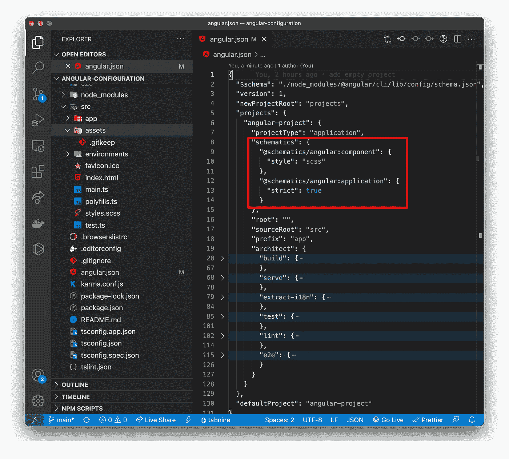
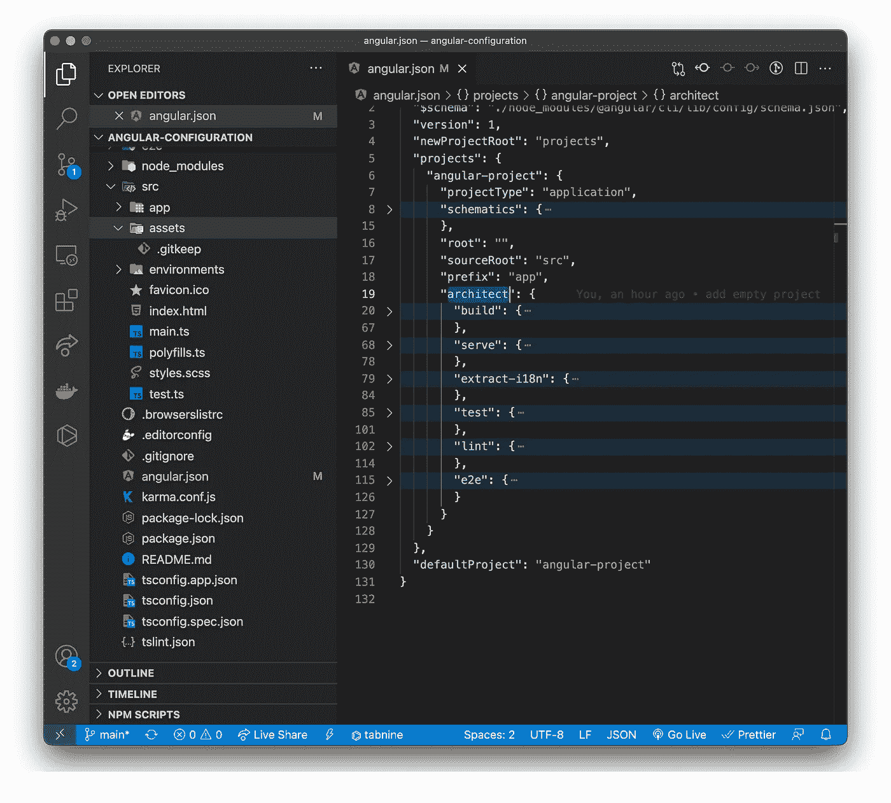
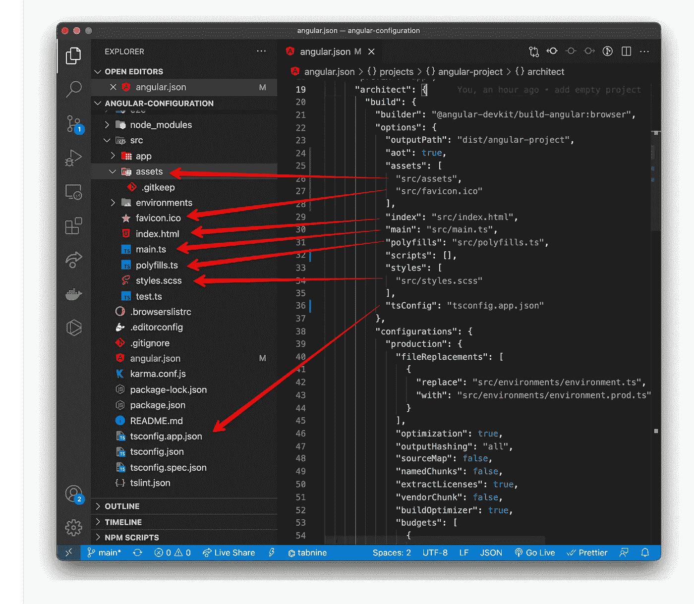

# Angular JSON 文件里面是什么

> 原文：<https://medium.com/nerd-for-tech/what-is-inside-of-angular-json-file-636e81e67651?source=collection_archive---------0----------------------->

每个 angular 项目都有一个“angular.json”文件。我们都明白这份文件非常重要。该文件包含角度项目的设置。你真的知道这个文件包含什么信息吗？让我们仔细看看这个文件。

**项目类型**:项目的类型。值“application”表示项目将代表可以在浏览器中启动的应用程序。

**根**:指向相对于工作环境的项目文件文件夹。空值对应于项目的根文件夹。

**sourceRoot** :指定源文件的根文件夹。实际定义所有应用程序文件的地方。

**原理图**设置部分用于通过 CLI 生成新文件。例如，如果我使用命令' ng 生成'组件默认情况下，组件将使用 SCSS 文件的样式。

**architect** :指定构建项目的设置。每个人都知道命令“ng serve”或“ng build”。在 architect 部分，我们可以找到“serve”和“build”命令的设置。我们还可以创建自己的 architect 设置，并使用命令“ng”运行它们。

在目标架构师内部，我们通常会设置一个指向正确文件的路径。

**脚本**部分是关于 js 文件，你将在你的项目中使用附加库 JQerry，Bootstrap 等。

**样式**部分是关于你将在项目中使用的 CSS 文件。比如自举风格。

**outputPath** 指定编译后的应用文件的目录。

**配置**:包含不同工作空间(生产、开发)的特定设置。我们还可以为舞台等添加一个新的工作空间。

在配置部分，我们可以设置以下设置:

**优化**:表示是否使用优化

**outputHashing** :表示生成的文件名是否会附加一个哈希值。值 all 表示向所有生成的文件的名称添加一个哈希

**源映射**:决定是否生成源映射文件。如果您设置为“真”，您将看到您在项目中看到的原始文件名。

**namedChunks** :决定文件名是否将用于命名的可加载块。

**vendorChunk** :决定是否为应用程序中使用的第三方库生成单独的文件。

**buildOptimizer** :包含@ angular-dev kit/build-optimizer 包，在使用 AOT 选项时进行优化。

*最初发表于 2021 年 12 月 1 日*[*【http://tomorrowmeannever.wordpress.com】*](https://tomorrowmeannever.wordpress.com/2021/12/01/what-is-inside-of-angualr-json-file/)*。*