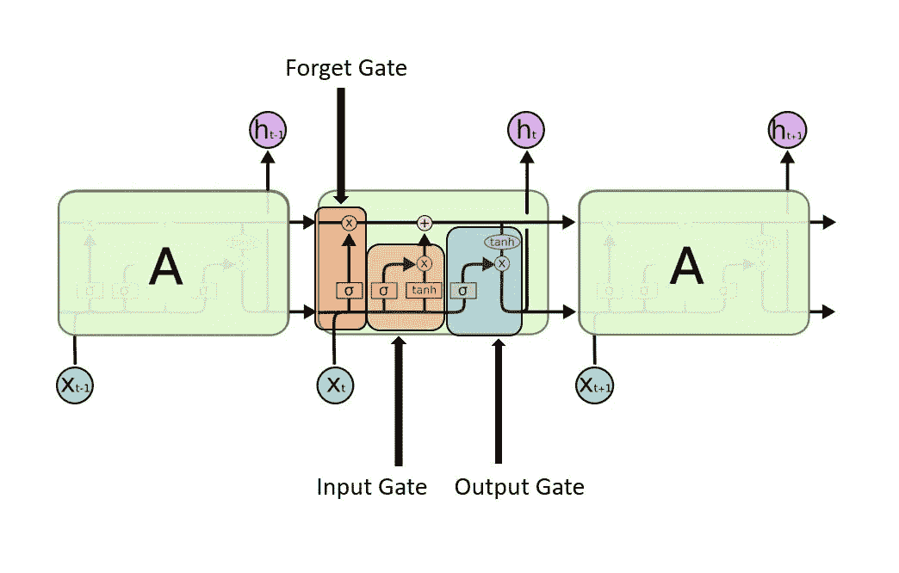

# 什么是 LSTM，窥视孔 LSTM 和 GRU？

> 原文：<https://medium.com/nerd-for-tech/what-is-lstm-peephole-lstm-and-gru-77470d84954b?source=collection_archive---------0----------------------->

长短期记忆(LSTM)是由 hoch Reiter(1997)提出的，并被许多研究者完善。LSTM 是一种特殊的 RNN，它能记住长期的依赖关系。LSTM 是专门为避免 RNN 面临的问题而设计的。你可以在我之前的文章[了解 RNN](https://jaimin-ml2001.medium.com/understanding-rnn-91d548c86ac9?source=friends_link&sk=b7458cecd44b469c88e1887516cabf69) 中了解 RNN。架构行为使得它很难记住长期的依赖关系。在简单的 RNN 网络中，它具有简单的重复神经网络，例如简单的 tanh 或 relu 网络，如下图所示。

**标准 RNN 中的重复模块包含一个单层。图片取自**[https://colah.github.io/](https://colah.github.io/)

LSTM 也有同样的链式结构，但是重复模块没有简单的神经网络结构。这些重复模块包含 4 个神经网络。

Gates 盖茨

上图中的符号可以这样解释。在这个符号中，黄色方框代表神经网络。粉红色的点是点的操作，不管是矢量乘法还是加法。线的合并是连接，线的分离意味着相同的内容在不同的位置。

**图片取自**[https://colah.github.io/](https://colah.github.io/)

LSTM 建筑中有三个门，它们是

1.  忘记大门
2.  输入门
3.  输出门

# LSTM 背后的核心理念

图的顶部包含单元状态，这是一条信息可以通过一些小的线性操作轻松传递的路径。门可以添加或删除单元状态中的信息。

该门由 sigmoid 神经网络和逐点乘法运算组成。因为 sigmoid 给出了输出 0 & 1，这意味着如果它是 0，那么什么都不会被传递，如果是 1，那么所有的东西都会被传递。

**忘记门**

这是 LSTM 网络中的第一步，它决定哪些信息将通过信元状态传递，这个决定由遗忘门做出。

它采用 ht-1 和 xt，输入和输出为 0 和 1，然后逐点乘以 Ct-1，最后它将决定哪些信息将被传递。如果我们正在处理一些基于上下文的数据，如果上下文改变了，这个遗忘单元将丢弃与上下文无关的信息。

**输入门**

在此步骤中，将决定哪些信息将存储在单元状态中。该操作分两步进行。首先，一个 sigmoid 神经网络决定我们将更新哪些值，一个 tanh 层创建一个新的候选值 Ct 的向量，该向量可以添加到状态中。

现在我们必须将在 Ct-1 获得的细胞状态更新到 Ct。

我们将旧状态 Ct-1 乘以 ft，并忘记不需要的东西。然后我们添加它*Ct 来更新我们需要记住的上下文。在这里，我们在要记住的上下文中添加新信息，并传递到下一阶段。

**输出门**

在这个阶段，我们必须决定在输出中发送什么。这将基于我们的细胞状态，但是我们运行一个 sigmoid 神经网络来决定我们将输出细胞状态的哪一部分。然后，我们将单元状态通过 tanh(将值推到 1 和 1 之间)并乘以 sigmoid 门的输出，这样我们就可以决定输出数据。

在这里，我们可以看到一个关于 LSTM 的 gif 的整体想法。

**窥视孔建筑**

到目前为止，我们已经看到了简单的 LSTM 网络，但在每一篇研究论文中，这种架构都随着时间的推移而修改。由 Gers & Schmidhuber (2000)提出的一个流行的 LSTM 变体，是增加“窥视孔连接”这意味着我们让栅极层查看单元状态。

在这个窥视孔连接中，我们可以看到所有的门都有一个输入和细胞状态。

**GRU**

LSTM 的另一个变体是门控循环单元，或 GRU，由 [Cho 等人(2014)](http://arxiv.org/pdf/1406.1078v3.pdf) 引入。它将遗忘门和输入门结合成新加入的更新门。它还合并了单元格状态和隐藏状态。由此产生的模型比传统的 LSMT 更简单，而且越来越受欢迎。

整个 GRU 行动可以被视为。

在这里，我们检查了一些 LSTM 变种，但也有其他变种。RNN 的所有缺点都已经在 LSTM 实现了，但研究人员仍然要求采取另一个步骤，即所谓的关注。

# 参考

# [理解 LSTM 网络——colah 的博客这些循环使得递归神经网络看起来有点神秘。然而，如果你想得更多一点，原来…](https://colah.github.io/posts/2015-08-Understanding-LSTMs/)

## [colah.github.io](https://colah.github.io/posts/2015-08-Understanding-LSTMs/)

[https://towards data science . com/animated-rnn-lstm-and-gru-ef 124d 06 cf 45](https://towardsdatascience.com/animated-rnn-lstm-and-gru-ef124d06cf45)