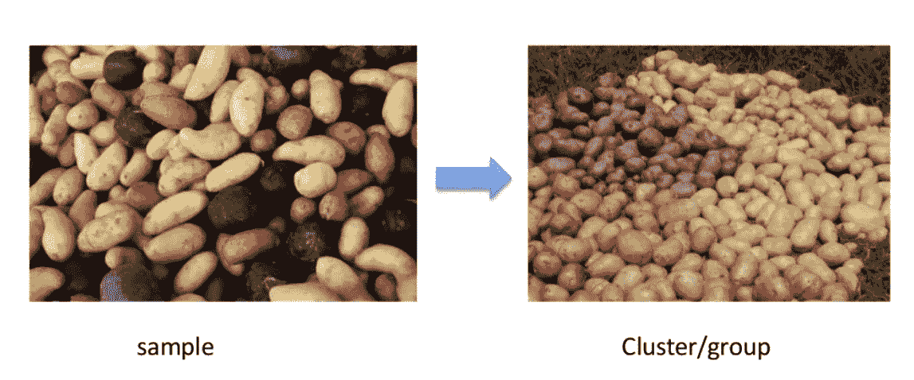
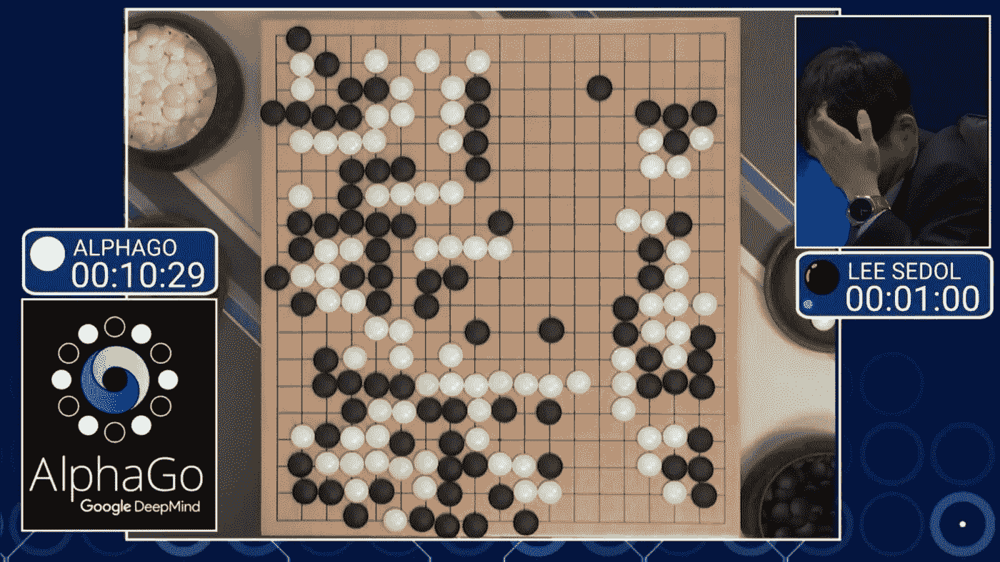

# 什么是机器学习？？

> 原文：<https://medium.com/nerd-for-tech/what-is-machine-learning-72144e57d6a6?source=collection_archive---------3----------------------->

来源:网络生活

**什么是机器学习？**

> 机器学习是在没有明确编程的情况下赋予计算机学习能力的研究领域。
> 阿瑟·塞缪尔，1959 年。

例如，您的垃圾邮件过滤器是一个机器学习程序，它可以在给定垃圾邮件示例(例如，由用户标记)和常规邮件示例的情况下，学习标记垃圾邮件。

**为什么要用机器学习？**

机器学习大放异彩的另一个领域是对于传统方法来说过于复杂或者没有已知算法的问题。

## 机器学习系统的类型

资料来源:EduCBA

**A)监督学习:-**

在监督学习中，输入算法的训练数据包括所需的解决方案，称为标签。一个典型的监督学习任务是 C ***分类*** 。垃圾邮件过滤器就是一个很好的例子:它用许多示例电子邮件及其类别(垃圾邮件或业余爱好者邮件)进行训练，它必须学会如何对新电子邮件进行分类。

另一个典型的任务是在给定一组特征(里程、年龄、品牌等)的情况下，预测目标数值，例如汽车的价格。)称为预测者。这种任务叫做 ***回归*** 。

**B)无监督学习:-**

在无监督学习中，正如你可能猜到的，训练数据是无标签的。系统试图在没有老师的情况下学习。

例如，假设你有很多关于你博客访客的数据。你可能需要运行一个算法来检测相似的访问者群体。你根本不需要告诉算法一个访问者属于哪个组，它就可以在没有你的帮助下找到这些联系。这就是所谓的 ***聚类。***

资料来源:Guru99

例如，假设你拥有一家超市。在你的销售日志上运行关联规则可能会发现购买面包和黄油的人也倾向于购买果酱。因此，您可能希望将这些项目彼此靠近放置。这称为**关联规则挖掘**。

来源:媒体

C)半监督学习:-

有些算法可以处理部分标记的训练数据，通常是大量的未标记数据和少量的标记数据。这被称为半监督学习。一些照片托管服务，如谷歌照片，就是很好的例子。

一旦你把你所有的家庭照片上传到该服务，它会自动识别出同一个人 A 出现在照片 1、5 和 11 中，而另一个人 B 出现在照片 2、5 和 7 中。这是算法的无监督部分(聚类)。现在系统需要你告诉它这些人是谁。每个人只有一个标签，而且它能够说出每张照片中每个人的名字，这对搜索照片很有用。

**D)强化学习:-**

例如，许多机器人实现算法来学习如何行走。【2016 年 3 月，DeepMind 的 AlphaGo 程序在围棋比赛中击败世界冠军李·塞多尔，成为头条新闻。它通过分析数以百万计的游戏，然后与自己进行多次对弈，了解了自己的制胜策略。这被称为**强化学习。**

来源:无量纲