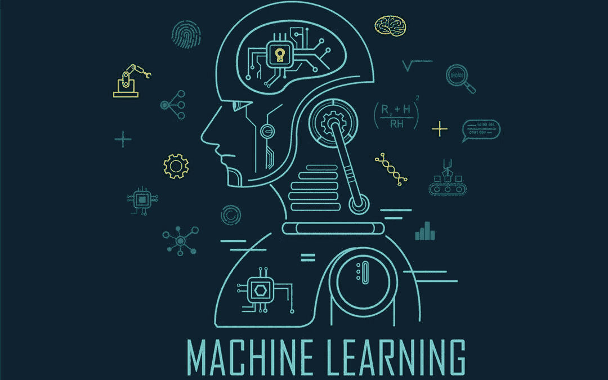
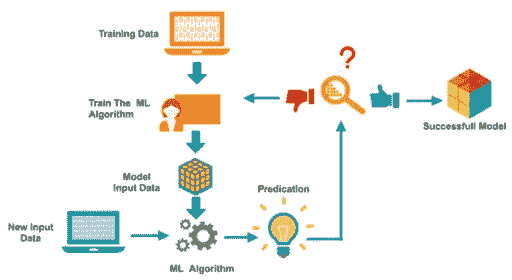

# 什么是机器学习？

> 原文：<https://medium.com/nerd-for-tech/what-is-machine-learning-a54554e6b7ff?source=collection_archive---------0----------------------->

## 机器学习领域入门指南

> “机器学习将使大多数人认为只能由人完成的工作自动化。”戴夫·沃特斯

# 介绍

最近，我们可能都听说过“机器学习”或“ML”这个术语。这项技术现在已经发展到极致，许多崭露头角的工程师甚至非工程背景的人都想学习 ML，并在这个领域开始他们的职业生涯。

**所以你可能会觉得奇怪，为什么“机器学习”只是在最近几年才变得如此流行？**

这个问题的答案是，在过去的几年里，IT 部门得到了提升，由于这一点，我们看到了计算能力的巨大进步，更便宜更快的存储系统以及大量数据的产生。这三个是最近几年 ML 蓬勃发展的主要原因。

由于上述三个原因，现在更容易用强大的处理器和 GPU 更快地训练机器学习模型，这些处理器和 GPU 具有足够的数据量和容易获得的数据。

我们可能都想知道什么是“机器学习”，并想了解它，所以让我们开始讨论这个话题。

# 机器学习到底是什么？

机器学习的意思是，让机器像人类一样学习一些数据，以便机器可以识别、预测、推荐和分类与机器学习的数据相关的任何其他数据。

用技术术语来说，我们可以说机器学习是对计算机算法的研究，它试图学习提供给它们的数据，并对一些相关但看不见的数据做出预测。随着我们向算法提供越来越多的数据，它们会有更大的改进。

就像一个小婴儿从他的父母、长辈和老师那里学到一些东西一样，将来无论何时，当他与任何未知但与他已经学到的东西相关的东西互动时，他肯定能识别出它。

机器学习算法从数据中学习的方式与婴儿学习的方式相同，这些算法学习并发现数据中的模式，并可以识别和预测与训练数据相关的未知数据。

# 制作机器学习模型涉及的步骤？

## 1.数据收集

训练任何机器学习模型的第一步都涉及数据的生成。算法需要学习的数据，并从中发现模式。数据收集可以由开发人员手动完成，或者开发人员可以使用任何现有的数据集。

数据需要分为训练数据(算法将被训练的数据)和测试数据(测试算法学习的数据)。

## 2.训练算法

第二步涉及在训练数据集上训练机器学习模型，以了解它并找到其中的模式。

## 3.确认

制作机器学习模型的第三步涉及在训练数据集上测试模型，以便发现它如何准确地预测它所训练的数据。

如果模型在这一步中没有达到标准，那么它将被再次调整，以便使模型更准确地工作。

## 4.测试

制作机器学习模型的最后一步涉及在看不见的数据上测试模型，即没有对其进行训练的数据，即测试数据。

在这一部分中，模型用于预测测试数据，模型的最终准确性和性能在这一部分中根据模型对数据的预测程度和准确性进行评估。

# 结论

在这篇文章中，我们来看看什么是“机器学习”以及制作机器学习模型的步骤。

1.  机器学习是一个过程，在这个过程中，计算机算法被训练在一个数据上，以预测一些未知的数据，但相关的数据。
2.  制作机器学习模型的步骤包括:数据收集、训练、测试和验证。
3.  训练机器学习模型来预测和识别数据，就像训练婴儿识别事物一样。

> “计算机能够看、听和学习。欢迎来到未来。”戴夫·沃特斯