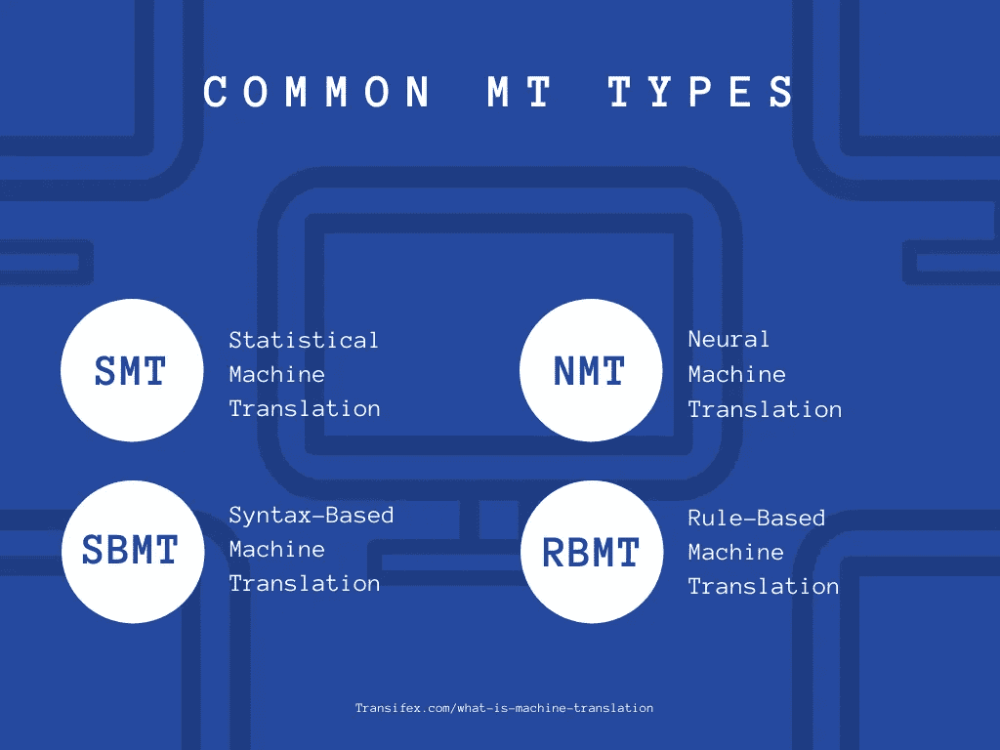
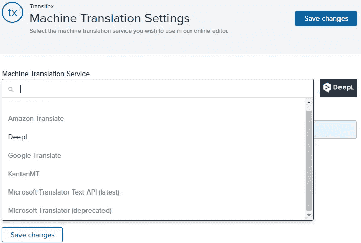
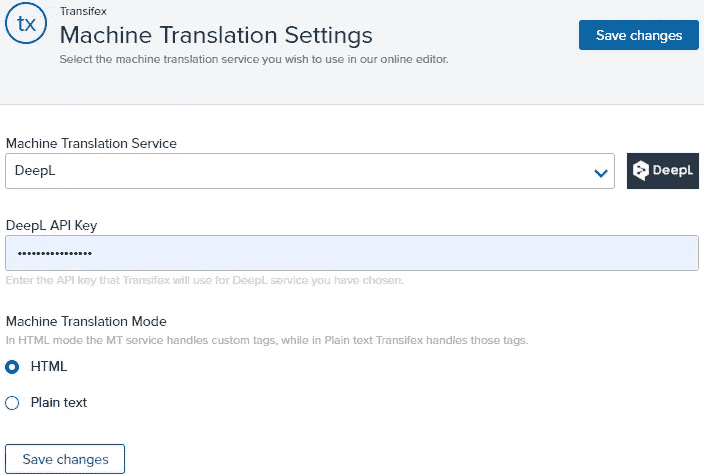
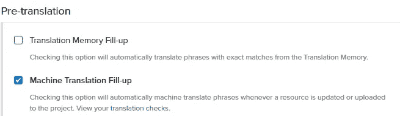

# 什么是机器翻译，它是如何工作的？

> 原文：<https://medium.com/nerd-for-tech/what-is-machine-translation-and-how-does-it-work-2916a6202042?source=collection_archive---------9----------------------->

什么是机器翻译？这当然与雇佣一个智能机器人无关——但这是你能得到的最接近的了。当提到机器翻译(MT)时，我们说的是 Google Translate、Amazon Translate、 [DeepL](https://www.transifex.com/blog/2021/deepl/) 等软件。

虽然所有的机器翻译工具实际上都在做同样的工作，但每一种工具都有不同的优缺点。这里是你需要知道的一切！

# 什么是机器翻译？

机器翻译是指利用各种形式的 AI(人工智能)来**自动翻译内容**的软件。令人敬畏的是，它可以在没有任何人为干预的情况下工作。

[谷歌翻译](https://translate.google.com/)可能是最受欢迎的机器翻译软件。

然而，值得指出的是，MT 软件通常没有那么准确。人工翻译不会马上去任何地方。

而且还值得一提的是，MT 和[翻译记忆](https://www.transifex.com/blog/2021/translation-memory-software/)不是一回事。翻译记忆库是一种不同的、更精确的工具，它需要你向它输入信息。另一方面，机器翻译可能不太准确，但它可以立即自动开始翻译，无需任何人工协助。

但是这两种选择都有助于使[本地化](https://www.transifex.com/blog/2021/what-is-localization/)更加容易和快速，同时降低本地化成本。你只需要知道如何正确利用它们。

# 机器翻译是如何工作的？

所以，机器翻译所做的就是自动翻译内容。很简单，对吧？但是它的工作方式一点也不简单。

有多种类型的多边贸易体制，其中一些比另一些更复杂。[最常见的四种](https://omniscien.com/faq/different-types-of-machine-translation/)是:

1.  统计机器翻译
2.  神经机器翻译
3.  基于句法的机器翻译
4.  基于规则的机器翻译

值得指出的是，大多数现代的 mt 都使用上述类型的组合来交付最佳结果。因此，很有可能你喜欢的工具实际上是一种混合机器翻译。

然而，最受欢迎的 MTs，如 Google Translate、Amazon Translate、DeepL 和 Microsoft Translate，都非常依赖神经网络。

更多的技术细节在下面，对那些感兴趣的人来说。

# 统计机器翻译

顾名思义，SMT(统计机器翻译)依靠人工翻译来完成工作。它分析一个或多个数据库，以教会自己如何翻译某些内容，以及如何选择最佳的翻译。

尽管是最古老和最基本的机器翻译类型之一，许多人仍然结合使用 SMT 和其他类型来创建更有效的混合机器翻译。

# 神经机器翻译

神经机器使用神经网络，通常与表面贴装技术相结合，以提供最佳结果。

在 NMT，没有双关语，你还会发现深度 NMT，它使用机器学习和人工智能。

由于神经网络旨在模仿生物大脑，因此它们太复杂了，无法在这么短的文章中进行解释。因此，你可以在本页找到更多关于他们的信息。

# 基于句法的机器翻译

SBMT 翻译的是语法，而不是单个单词，它是通过将数据整合到 SMT(统计机器翻译)工具中来完成的。

# 基于规则的机器翻译

RBMT 在很大程度上依赖于语境，如语言和语法规则。通过考虑上下文，这种机器翻译类型可以重新排列单词，以形成正确的翻译。

# 人类对机器

尽管机器翻译技术不断进步，人工翻译仍然是翻译内容的首选。对于[本地化](https://www.transifex.com/blog/2021/what-is-localization/)来说更是如此。

但是为什么我们不能完全自动化翻译呢？我们甚至有努力模仿真实事物的神经网络。

简单的答案是，机器翻译工具还不够先进，无法将上下文考虑在内。

暂时忘记翻译和本地化。即使我们指的是一种语言，一个词也可能有多种含义，不同的文化可能会使用不同的说法，这些说法没有任何字面意义。

加上翻译和本地化的挑战，你可以清楚地看到为什么机器如此努力地与人类竞争。显然，只是在复杂的事情上。

# 如何使用机器翻译

机器翻译可能不如人工翻译准确，但这并不是说你应该完全无视它。如果使用得当，机器翻译是另一种工具，可以节省你的时间和精力，同时降低成本。

大多数人似乎都同意 MT 是一个不错的起点选择。即使它只能正确翻译你所有字符串的 10%,那也是 1000 个单词/句子，你不必为一个 10000 个单词的项目费心。

不要担心破坏你的文档和代码。有了像 [Transifex](https://www.transifex.com/) 这样的现代翻译管理系统，这应该不成问题。

# Transifex 中的 MT 集成

Transifex 是一个翻译管理系统(TMS ),允许您:

1.  将整个本地化团队集中到一个地方
2.  与我们的编辑一起翻译，以避免在文档之间来回切换
3.  通过使用自动化工具和集成，更快、更有效地进行本地化

就第三点而言，我们目前提供 5 种机器翻译工具可供选择:

1.  谷歌翻译
2.  亚马逊翻译
3.  微软翻译
4.  DeepL
5.  坎坦姆

每一个都有自己的优点和缺点，但大多数都很相似。例如，[有些人声称与竞争对手相比，DeepL 对于欧盟语言](https://www.reddit.com/r/TranslationStudies/comments/9ww6lo/google_translate_vs_deeplcom_which_is_better/)更准确，但对此要有所保留。我们鼓励你自己尝试所有的事情，并得出你自己的结论。

另一方面，亚马逊翻译给了你[链接你的词汇表数据库的选项](https://docs.transifex.com/machine-translation/glossary-for-amazon-machine-translation-mt)，以获得更准确的翻译。

我们所有的 MT 集成都可以免费用于我们所有的计划。如果您已经购买了高级 MT 计划，您也可以将它与您的 API 密钥一起带到 Transifex。

# 如何在 Transifex 中启用机器翻译

要在 Transifex 中开始使用机器翻译:

1.  登录您的 Transifex 账户([或免费创建一个账户](https://www.transifex.com/)
2.  点击屏幕右上方的“Transifex”
3.  组织设置
4.  机器翻译
5.  从下拉菜单中选择一个 MT
6.  获取您的 MT 帐户的 API
7.  开始翻译

启用机器翻译后，您还可以在以下位置激活机器翻译填充:

1.  (您选择的项目)
2.  设置
3.  工作流程
4.  机器翻译填充

但值得指出的是，自动 TM 填充仅适用于高级用户及以上——无论如何，这是我们的免费试用版。

您还可以选择为特定项目使用不同的机器翻译，或者根本不使用机器翻译。你所要做的就是转到你的项目设置，并在屏幕的右边选择“覆盖机器翻译设置”。

# 包扎

所以，这就是你现在需要知道的关于机器翻译的全部内容。本帖[原载于本页面](https://www.transifex.com/blog/2021/what-is-machine-translation/)。

继续阅读:

1.  [DeepL 加入 Transifex 成为机器翻译工具](https://www.transifex.com/blog/2021/deepl/)
2.  [什么是本地化？](https://www.transifex.com/blog/2021/what-is-localization/)
3.  [翻译记忆软件 101](https://www.transifex.com/blog/2021/translation-memory-software/)