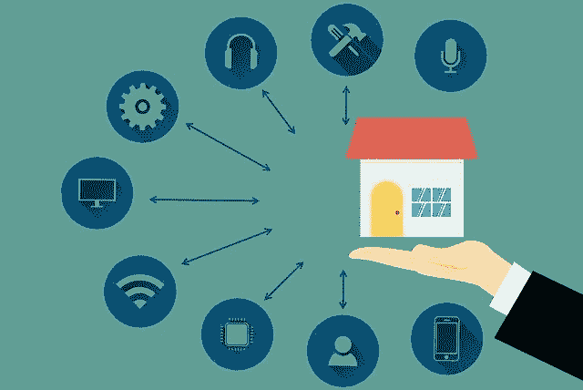
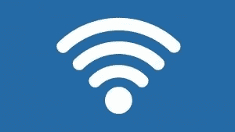

# 什么是网状 WiFi 网络？

> 原文：<https://medium.com/nerd-for-tech/what-is-mesh-wifi-network-7a17f10322f1?source=collection_archive---------5----------------------->

# 介绍

在这个技术时代，消费者正在转向一种更新的拓扑结构，即众所周知的网状网络。这是为了创造一个连接更紧密、通信更可靠的智能家居。网状 [**WiFi**](https://www.technologiesinindustry4.com/what-is-wireless-power-transfer-technology/) 网络有时被称为每个房间一个 pod。

网状网络只是扩展了无线设备的范围。它可以在办公室、家庭甚至户外提供可靠的高数据速率。此外，每个房间使用一个具有多协议能力的 pod 的网状网络可以减少家庭中具有许多网状系统的开销。

# 描述

网状网络是 [**Wi-Fi**](https://www.technologiesinindustry4.com/what-is-wireless-power-transfer-technology/) 进程中的重大发展。这是智能家居领域的一大进步。

**什么是 WiFi 网状系统？**

*   Wi-Fi 网状系统包含一个连接到主互联网连接的路由器和许多类似卫星路由器的设备或节点，位于家庭周围，以提供完整的 [**Wi-Fi**](https://www.technologiesinindustry4.com/what-is-wireless-power-transfer-technology/) 家庭物联网覆盖。
*   这种先进的网状网络提供了完全的冗余并最大化了网络性能。
*   节点越多，连接传播得越远。
*   网状网络成功地将信号范围扩展到整个家庭。
*   这提高了可靠性，并允许与所有设备进行实时通信。
*   [**Wi-Fi**](https://www.technologiesinindustry4.com/what-is-wireless-power-transfer-technology/) 部署的进步支持分离频谱。
*   这些还确保了信息进出云的专用回程数据路径。
*   它们同样为设备提供专用流。
*   此外，一些设备存储数据，这可以节省用户的钱，更增加网络可靠性，并允许更智能的数据驱动的应用程序。

# 我们需要多少保险？

*   因为更多的覆盖通常意味着更多的节点，
*   在我们出去买一个网状 Wi-Fi 系统之前，我们需要弄清楚需要多少无线覆盖。
*   先算出房子的面积。
*   我们想覆盖的任何户外区域。
*   不要忘记影响多层住宅的楼层间距。
*   覆盖范围因系统而异。
*   因此，在花血汗钱之前，一定要检查规格。
*   记住所有的家都是不同的。
*   墙壁、门口和地板等结构会影响无线信号传输。
*   这将受到其他无线设备的干扰，例如微波炉和便携式电话系统。
*   如上所述，几乎所有的网格系统都是可扩展的。
*   因此，如果我们发现我们的系统不能完全覆盖我们家中的某些区域，不要担心:
*   在早期安装之后，我们可以很容易地添加另一个节点。

# 重要特征

*   网状网络可以自动将新节点加入当前网络，而不需要网络管理员进行改变。
*   这标志着网络具有更强的适应性和可扩展性。
*   网状网络还可以自动找到最快和最可靠的信号来传输数据。
*   即使节点被阻塞或失去信号，这种情况也会发生。

# 网络使用

*   几个当前的网状网络使用三频带 [**Wi-Fi**](https://www.technologiesinindustry4.com/what-is-wireless-power-transfer-technology/) 网关和端节点。
*   三频 Wi-Fi 增加了数据容量和覆盖范围。
*   它通过使用 2.4 GHz、5.2 GHz 和 5.6 GHz 频段来提高覆盖范围。
*   该覆盖范围在网关和端节点内部。
*   三频带系统中的第二个 5.6 GHz 频带充当网络上两个路由器之间的稳定消息线路，以加速整个系统。
*   这比旧的双频配置系统高出 180 %。

# Wi-Fi 三频的优势

*   [**Wi-Fi**](https://www.technologiesinindustry4.com/what-is-wireless-power-transfer-technology/) 三频的好处是丰富的。
*   它支持在开始时使用更快的 5 GHz 频段将更多无线设备连接到互联网。
*   也有助于 Wi-Fi 6E，5 和 6 GHz 频段。
*   如果我们的网络是一个网状系统，这个较高的频带充当两个路由器之间的稳定通信线路，以加速整个系统。
*   一个三频系统的第三个无线电也用于网状网路由器之间的回程通信。
*   因此，它制作了一条专用线路，只用于驱动路由器之间的数据流。
*   三频段中的终端设备可供设备直接连接。
*   这将工作效率提高了 50%，主要是因为添加了更多的网络设备。
*   DSL 或电缆调制解调器的快速连接速度并不止于此，因为无线电速度更快。
*   作为一种选择，它们被带到整个网络。
*   这对于 [**Wi-Fi**](https://www.technologiesinindustry4.com/what-is-wireless-power-transfer-technology/) 视频流至智能电视和相机非常有帮助。
*   那些分散在今天和明天的智能家居中。
*   我们需要使用一个三频系统来保护现有的家庭网络系统。
*   千兆位服务将很快成为每个人的现实。
*   三频系统的应用是未来保障容量和速度的最佳方式。

# 过滤技术

*   网状网络系统中一个更重要的发展是过滤器技术的出现。
*   它可以进一步增加每个房间一个 pod 拓扑的尺寸和范围。
*   使用 bandBoost 滤波器支持最大化容量。
*   它有助于通过改善三频带网状系统中的频带隔离来实现最大范围。
*   通过使用 edgeBoost 滤波器增加容量和范围，最大限度地利用频带边缘附近的 [**Wi-Fi**](https://www.technologiesinindustry4.com/what-is-mesh-wifi-network/_wp_link_placeholder) 信道的输出功率。
*   一些著名的生产商正在开发一种新的标准，叫做 IP 互联家庭(CHIP)。
*   即提高设备互操作性和降低网状网络中的难度。
*   在向芯片过渡期间，将需要多标准无线电。
*   这些无线电将使网络面向未来，有助于向芯片迁移。
*   这些将提供向后兼容性，以连接使用传统标准的节点。

更多详情请访问:[https://www . technologiesinindustry 4 . com/what-is-mesh-wifi-network/](https://www.technologiesinindustry4.com/what-is-mesh-wifi-network/)