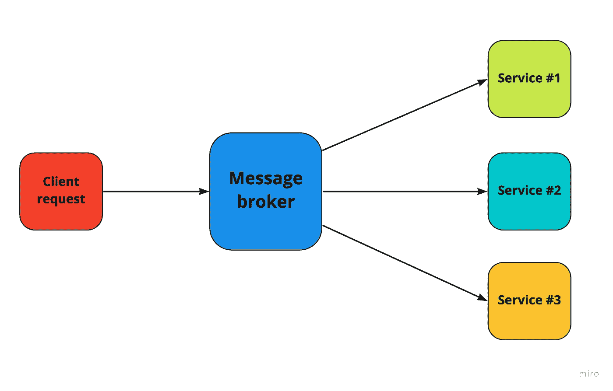
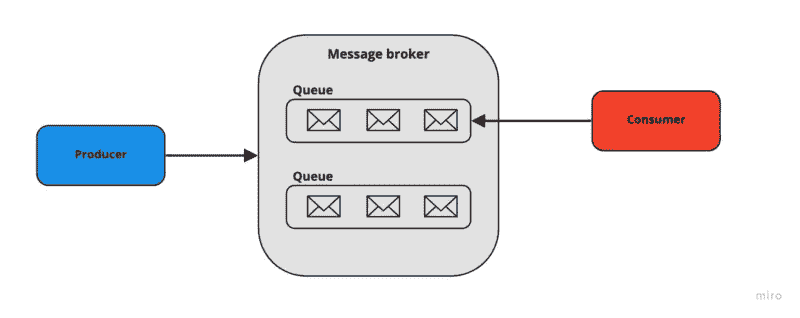
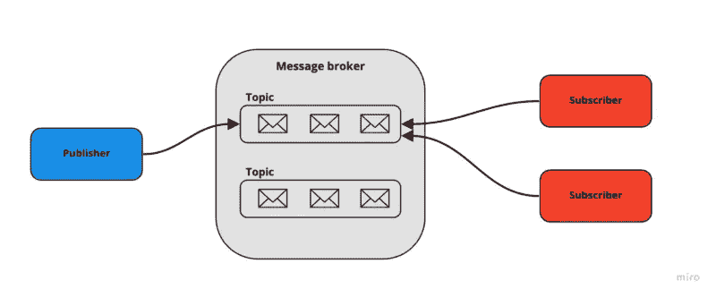

# 什么是消息代理？

> 原文：<https://medium.com/nerd-for-tech/what-is-message-broker-bcbd35f96215?source=collection_archive---------0----------------------->

将讨论什么是消息代理，它的优点和缺点，以及它的模型和类型。

让我们从探究什么是消息代理以及我们为什么需要消息代理开始。

# **消息代理**

*“消息代理将消息从发送方的正式消息协议翻译成接收方的正式消息协议。”—Wikipedia.org*

信用 https://tsh.io/blog/message-broker/

M**message Broker**是一款软件，它允许服务和应用程序通过使用消息相互通信。消息的结构是正式定义的，并且独立于发送它们的服务。

这允许相互依赖的服务直接相互“交谈”,即使它们用不同的语言编写或在不同的平台上实现。

消息代理可以验证、存储、路由和交付消息到适当的目的地。它们充当其他应用程序之间的中介，允许发送方在不知道接收方在哪里、接收方是否活动或者接收方有多少的情况下发布消息。这有助于系统内流程和服务的分离。

# 消息代理的基本概念

消息代理中使用的一些基本术语如下:

*   生产者:他们负责将消息发送给消息代理。在发布/订阅模式中(我们将继续讨论)，他们被称为*发布者。*
*   **消费者:**他们从消息代理获取消息请求，然后消费它们，并为它们提供响应。在发布/订阅模式中(我们将继续讨论)，他们被称为*订阅者。*
*   **队列:**这是消息代理使用 FIFO(先入先出)逻辑存储消息的数据类型。
*   **交换器:**位于队列顶部的逻辑配置，甚至是实体，它指示消息代理创建某种组，消费者和生产者可以写入或监听该组，以便发送和接收消息。

做 *你知道:消息代理又称为* [***集成代理***](https://www.gartner.com/en/information-technology/glossary/integration-brokerage-ib) *或* [***接口引擎***](https://www.gartner.com/en/information-technology/glossary/integration-brokerage-ib) ***。***

# **消息代理的模型**

有两种基本的消息分发模式或消息传递风格:

1.  ***点对点消息***

信用 https://tsh.io/blog/message-broker/

*   消息的发送者和接收者之间具有 1-1 关系的模式(req/res)。
*   当你只想给一个人发信息的时候。
*   适合这种消息传递风格的用例包括工资单和财务交易处理。

**2*。发布/订阅消息***

演职员表[https://tsh.io/blog/message-broker/](https://tsh.io/blog/message-broker/)

*   也称为“发布/订阅”模式，广播式分发。
*   每个生产者将其消息发送到一个称为“主题”的结构或文件夹中
*   然后，每个主题由预定的订阅者订阅。消息将以先进先出(FIFO)的方式发送给任何订阅者。
*   这是一种广播式的分发方法，在这种方法中，消息发布者与其使用者之间是一对多的关系。
*   例如，如果一家航空公司要发布关于其航班的着陆时间或延误状态的更新，多方可以利用该信息:执行飞机维护和加油的地勤人员、行李处理员、空乘人员、为飞机的下一次旅行做准备的飞行员，以及通知公众的视觉显示器的操作员。在这种情况下，发布/订阅消息风格是合适的。

***3。混合动力车型***

混合模型在实践中确实存在。例如，当多个系统需要一个消息的副本，同时还需要消息丢失的永久性和持久性时。在这些情况下，消息必须像主题一样分发。每条消息都被路由到对它最感兴趣的系统。这些收件人能够指定其他哪些消费者将接收消息。

# 消息代理用例

消息代理通常以下列方式使用:

1.  ***财务交易&付款处理***

每当我们构建支付服务时，付款只发送一次对我们来说是至关重要的。在用于处理这些交易数据的 P2P 消息代理的帮助下，可以确保支付信息既不会丢失，也不会被意外复制，即使在中间网络中断的情况下，系统也能可靠地通信。

***2。电子商务订单处理和履行***

对于任何电子商务网站来说，确保订单得到正确处理并且没有任何中间商是至关重要的。我们想尽可能降低故障率。消息代理能够增强容错能力，并保证消息只被使用一次，这使其成为处理在线订单时的自然选择。

***3。保护静态和传输中的高度敏感数据***

如果您的行业受到严格监管，或者您的企业面临重大安全风险，请选择具有端到端加密功能的消息解决方案。

> **总结**:当有**耗时耗资源的任务**并且**不需要立即响应请求**时，使用消息代理是最佳解决方案。

# 使用消息代理的优势

1.  ***提供同时不活动的服务成员之间的通信***

无论使用者是否处于活动状态，生产者都可以发送消息。它只需要一个消息代理就可以运行。消费者也不例外。

**2 *。异步处理提供更好的系统性能***

需要大量时间的任务可以分成不同的过程。这将通过加快应用程序的响应速度来改善用户体验。

***3。消息代理提高可靠性***

消息代理提供了一种重新传递的机制。在消费者失败的情况下，可以立即或者在预定的时间段之后重新传递消息。它还允许路由无法传递的消息，称为“死信”机制。

# 使用消息代理的缺点

消息代理的使用涉及异步处理。因此，使用它的缺点与我们在使用异步调用时面临的挑战有关。

1.  ***系统复杂度增加***

向您的系统添加消息代理会向您的整个系统架构添加一个新的组件。因此，需要考虑一些额外的因素，比如组件之间的网络维护或安全问题。

**2。*调试可难***

假设您有多个使用消息代理处理单个请求的异步阶段。您发送了一条消息，但没有收到回复。找到失败的根本原因可能很困难，因为每个服务都有自己的日志。在实现使用消息的系统时，请记住要包含一些消息跟踪功能。

# 最流行的二手消息代理

一些最著名的消息经纪人是 Apache Kafka、RabbitMQ 和 Amazon SNS。

## **卡夫卡**

Kafka 是一个健壮的队列代理和开源消息传递系统。它是一个分布式事件流平台，可以处理大量消息。

## **ActiveMQ**

主动 MQ(代表主动消息队列)是由 Apache 软件基金会在 2004 年开发的。

ActiveMQ 和 Kafka，都是 Apache，都是用 Java 写的。

## **RabbitMQ**

这是使用最广泛的开源消息代理软件——一个消息传递中介。它是用 Erlang 编写的，由 Pivotal 软件基金会提供支持。它为您的应用程序发送和接收消息提供了一个公共平台和一个安全的位置。

## 亚马逊社交网络

***亚马逊简单通知服务(SNS)*** 是一种云服务，协调从软件应用程序向订阅的端点和客户端发送推送通知。

## 雷迪斯

***Redis*** 是一个内存中的数据存储，可以充当高性能的键值存储或消息代理。它是一种数据结构，存储保存在内存中数据。

我希望您喜欢阅读关于消息代理的内容。它们是什么，现在市场上最好的工具是什么，消息代理模型，使用它们的好处和缺点是什么？

如果你喜欢我的内容，请关注我。一定要给这篇文章点个“赞”。

你可以在 [Linkedin](https://www.linkedin.com/in/gaurang-mittal-a65a6a170/) 上和我联系。点击这里。

**参考文献**

1.  [https://www.ibm.com/in-en/cloud/learn/message-brokers](https://www.ibm.com/in-en/cloud/learn/message-brokers)
2.  [https://tsh.io/blog/message-broker/](https://tsh.io/blog/message-broker/)