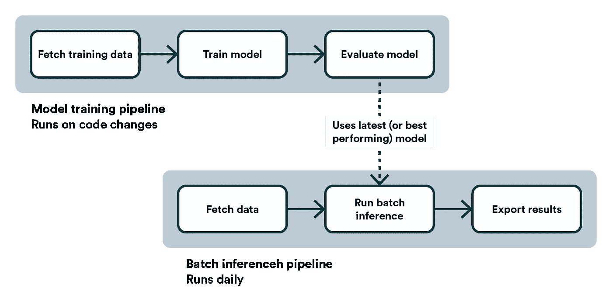
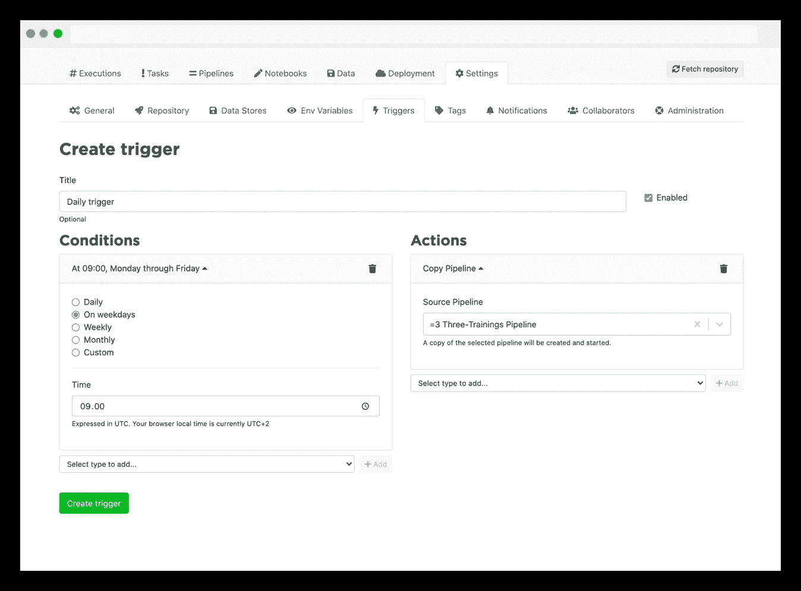
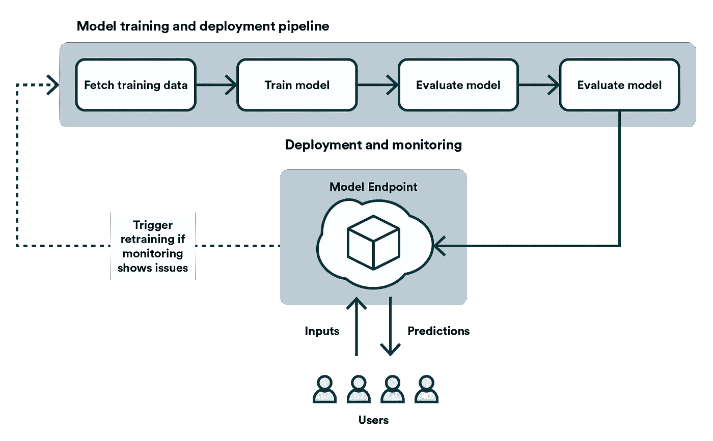
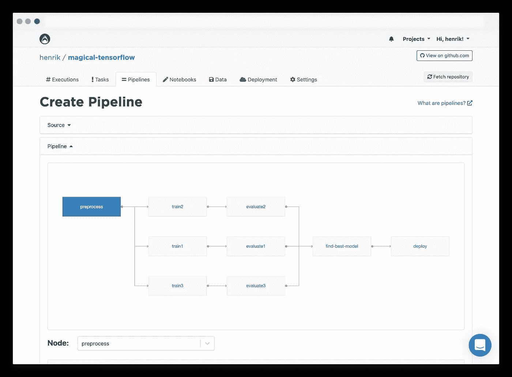
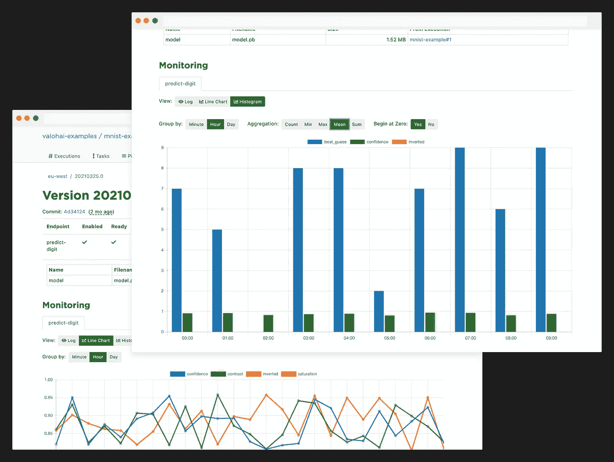

# 什么是模型部署

> 原文：<https://medium.com/nerd-for-tech/what-is-model-deployment-2c37ce69a753?source=collection_archive---------18----------------------->

模型部署只是将 ML 模型展示给实际使用的工程任务。该术语通常与通过实时 API 使模型可用同义。尽管如此，我们应该更广泛地考虑模型部署——因为云中的在线推理并不总是必要的，甚至不是理想的解决方案。

本文将介绍模型部署中的关键考虑事项，以及它在不同上下文中的含义。最后，我们将展示我们的 MLOps 平台 Valohai 中的两个用例。

# 词汇表

*   **部署:**向外界展示一个 ML 模型的工程任务。
*   **推理:**模型将问题转化为答案的计算任务。
*   **测试:**构建自动化测试以验证基线功能和基础设施健壮性的工程任务。
*   **监控:**一旦部署，对模型的健康和性能的监督。

# 我应该如何考虑模型部署？

解决这个难题的第一个问题是，您的模型是否需要使用实时(在线)的最新数据立即提供答案，或者在一定的可接受的延迟时间内(批量)提供答案。第二个问题是将计算资源内部化(云)还是众包给用户(edge)。对这些问题的回答为接下来的所有其他决策奠定了基础。

在线推断就像类固醇上的批量推断。对具有最新数据的即时答案的要求限制了您的选择，并给计算资源和监控带来了额外的压力。考虑一下拍摄电影和直播电视节目的区别。您可以随时停止影片设置(批处理)中的所有内容，并在不影响最终产品的情况下进行另一次拍摄。在现场表演(在线)中，你必须行动迅速，保持警惕，并随时准备好 B 计划。

# 部署

60%的模型从未投入生产。其中一个关键障碍是将实验室环境下的工作转化为可靠的公共服务的难度。

一些公司认为部署是一个过程，其中由流氓数据科学家创建的概念验证由 hero 软件工程师精心重写并手工制作成优化的云服务端点。这是错误的心态。

正确的思维方式是建立一个自动化的管道，将问题分解成更小的组件。数据科学家专注于组件，软件工程师专注于管道。默认情况下，这两方说的不是同一种行话，所以他们选择的平台需要引入一种通用语言。在这种环境中，部署只是简单地点击一下按钮，甚至是完全无人监管的事情。

关键问题

*   模型部署管道是自动化的吗？
*   新型号比旧型号好吗？如何确定？
*   有哪些后备机制？它们是自动的吗？
*   开发环境和生产环境匹配吗？

# 推理

推理是将问题(输入)转化为答案(输出)的行为。仅仅有一个能做到这一点的模型是不够的。这个模型需要一个围绕它的基础设施。

输入需要来自某个地方。该模型需要计算资源，并且需要捕获和存储其日志和元数据。最后，输出需要一个渠道反馈给客户。特别是对于在线推理，所有这些不同的组件都需要根据不可预测的实时流量自动调整。通常，这意味着在像 Kubernetes 这样的可伸缩框架上构建端点。

边缘推断是当模型生活在客户的硬件上(想想手机)。边缘推理的好处是计算是免费的。有接近零的延迟；不利的一面是，环境超出了你的控制，解决问题有时是完全不可能的。

关键问题

*   在线推断还是批量推断？
*   云部署还是边缘部署？
*   突然 10 倍的需求会发生什么？1000x 呢？
*   最大可接受的延迟是多少？

# 测试

测试是构建自动化测试以验证基线功能和基础设施健壮性的工程任务。测试的目的是作为任何修改的冒烟测试，并确保基础设施将按预期继续工作。测试还有一个记录的目的。它们揭示了原作者的期望和假设。

测试与软件工程非常相似，但是在 ML 环境中构建测试套件存在一些不同。模型本身通常是不可测试的黑盒。测试需要着重于验证对数据和基础设施可再现性的期望。对于在线推理，要额外努力测试回退机制。

关键问题

*   培训管道的再现性是否经过测试？
*   是否测试了回退机制？
*   模型的推理性能是否经过测试？

# 监视

监控模型的健康状况和预先测试它一样重要。同样，该模型的黑盒性质为监控其健康状况带来了挑战。

最紧迫的需求是监控基础设施的健康状况。足够的计算资源？有足够的带宽来移动数据吗？总延迟是多少？当这里出了问题，他们会很快出问题。你的产品开始流行的那一天可能会占你全年流量的 99%。

不太紧迫的需求是监控模型本身的健康状况。模型是用数据训练出来的，预测能力是和数据质量绑定在一起的。随着时间的推移和世界围绕模型的变化，它的准确性最终开始直线下降。这种现象被称为“漂移”，它可以被监控，甚至可以用作重新训练模型的触发器。还应监控数据，并与昨天的数据进行比较。数据的统计属性是否发生了变化？是否有比以前更多或不同的异常值？

关键问题

*   当模型最终开始漂移时，是否被检测到？
*   当数据发生意外变化或有异常值时，是否被检测到？

# 如何用 Valohai 部署批量推理的模型？

例如，批量推断的一个用例是客户评分，它不必一直运行，但可以每天运行一次。在这种类型的设置中，拥有一个模型训练管道和一个批处理推理管道是有意义的。实际的模型部署简单地通过批量推理管道使用训练管道产生的最新(或最佳执行)模型来完成。

在 Valohai 中，你可以在同一个项目中定义两条管道，并且这些管道可以被不同地触发。例如，每当 Git 中有新版本的模型代码时，就可以触发模型训练管道(通过 GitHub 操作)，而批处理推理管道可以在午夜自动触发(通过 Valohai 调度程序)。

# 瓦罗海调度程序

# 如何用 Valohai 部署一个在线推理的模型？

在线推理的一个用例是推荐引擎，其中用户输入需要接收相应的预测。该模型需要通过 API 端点全天候可用。在这种类型的场景中，您将定义一个 Valohai 管道来自动训练、评估和部署模型。Valohai 将您的模型部署到一个自动伸缩的 Kubernetes 集群，并允许您输出任何您需要的指标。

如果您的指标显示已部署模型的性能下降，模型部署中的监控允许您触发模型培训管道，从而确保您可以始终为您的用户提供最佳的预测。

# 瓦罗海管道

# 瓦罗海监测

*最初发表于*[*【https://valohai.com】*](https://valohai.com/model-deployment/)*。*