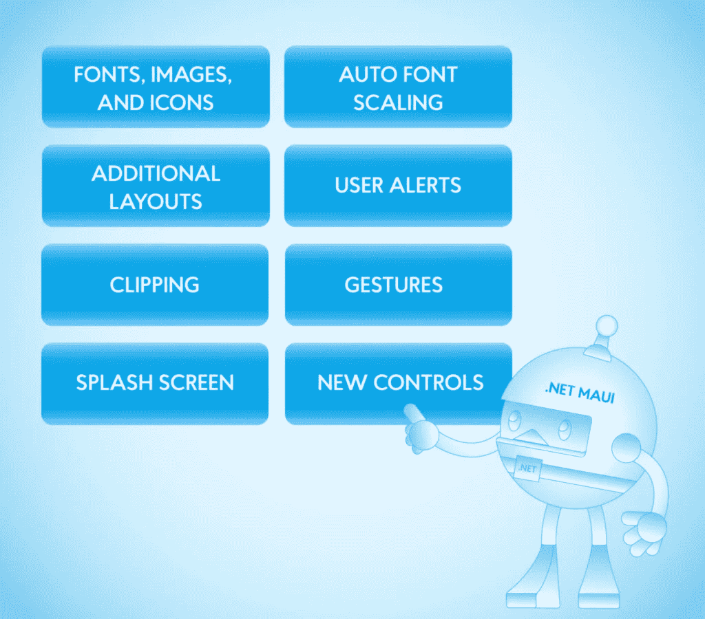
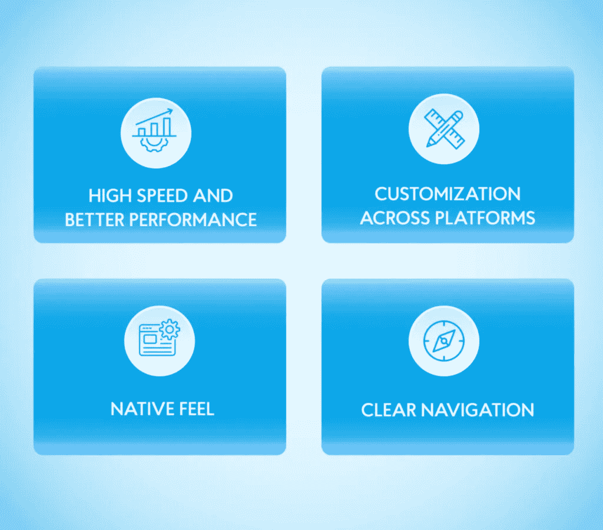
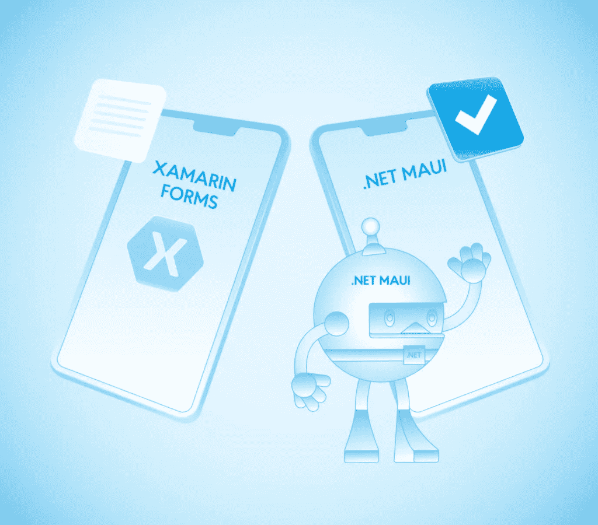

# 什么是。网毛伊岛，这是否意味着 Xamarin 形式的终结

> 原文：<https://medium.com/nerd-for-tech/what-is-net-maui-and-does-it-mean-the-end-of-xamarin-forms-nix-united-a1f1742dad1?source=collection_archive---------3----------------------->

由于成本降低和上市时间缩短，跨平台应用程序开发越来越受欢迎。尽管有一些小的缺点，企业仍然选择平台无关的路线，在不超出预算的情况下跨平台发布他们的应用程序。幸运的是，[跨平台开发](https://nix-united.com/services/cross-platform-app-development/)工具和技术正在扩展并变得更加有效。如今，他们可以向用户提供近乎原生的体验，同时仍然使用单一的代码库。其中一项技术是 Xamarin，这是一个用于跨平台构建应用程序的移动应用程序平台。Xamarin Forms 是这项技术的一部分，它允许开发人员为 iOS、Android、Windows 和 macOS 创建 ui。在本文中，我们将重点介绍 Xamarin 表单的高级版本。NET 多平台应用程序 UI (MAUI)，讨论它的好处，并指出它的新特性。

一方面，Microsoft MAUI 允许您编写单个代码库并将其应用于任何平台，另一方面，您可以通过添加原生方面来丰富每个平台特定的功能。换句话说，开发人员可以将毛伊岛作为一个单一的。NET 项目并包含特定于平台的子文件夹，以创建类似本机的应用程序。例如，Android 应用程序从 C#编译成通用中间语言(CIL)，然后编译成 Android 原生代码。与 Android 类似，iOS 应用程序也被编译成原生汇编代码，以提供最佳性能。

# 什么是 Xamarin 形式？

Xamarin Forms 是一个 UI 开发框架，在 C#和 XAML 中运行，允许开发人员构建跨平台的应用程序。该框架以其快速原型制作能力而闻名，通常用于创建不关注特定于平台的属性的产品。您可以共享高达 99%的代码，这使得 Xamarin 表单非常适合需要跨平台一致性的应用程序。该技术已经成功地聚集了相当忠实的社区基础，定期贡献预配置的 UI 组件。

尽管在开发社区中相对受欢迎，但在 2020 年 5 月，微软宣布他们将合并。NET 与 Xamarin 窗体和启动。网毛伊岛。新工具将提供对原生 API 的访问，并包含原生 ui，以制作更快、更可靠的应用程序。

# 跨平台与原生应用开发

原生应用开发是指专门为某个平台构建产品。你可以使用 Kotlin 开发一个 Android 应用程序，或者使用 Swift 创建一个 iOS 应用程序。尽管本地开发提供了卓越的质量和性能，但成本可能非常高。这种类型的开发也很漫长，尤其是如果您的目标是跨多个操作系统启动一个应用程序。

跨平台应用程序开发需要使用单一代码库在 Android 和 iOS 上启动您的应用程序。像 Reach Native 和 Xamarin 这样的工具经常被用来构建平台无关的应用程序，因为它们可以规避这类产品的缺点。缺点包括功能有限，性能和质量较低。然而，像 Xamarin 这样的现代工具提供了特定于平台的功能，可以在平台上启动应用程序之前对其进行微调。

# 。网络毛伊岛用户界面/UX 功能

在这一节中，我们将深入探讨最重要和最流行的 MAUI 特性，这些特性将使 UI 开发过程更加高效和多产。

所有这些元素都可以存储在一个位置。NET 毛伊岛将访问使用字体和图像的所有平台上你选择。

由于这个特性，每当用户在设置中调整他们的字体大小偏好时，你的 UI 会自动采用这个选择。

除了 Xamarin 表单库中的现有布局，您还可以访问新的布局。这些更新包括更好的一致性和可维护性，以及更高的可定制性。

该框架现在提供了各种类似本机的用户警报和通知，从简单的表单和弹出窗口到带有几个导航选项的操作表。

剪辑用于屏蔽部分内容，允许您隐藏某些元素。一个常见的例子是可用于个人资料图片的圆形图像。

使用手势，开发人员可以实现点击、滑动、拖动和其他物理功能，以实现更多高级功能。

这是一个允许您实现静态闪屏的特性，它通常被用作用户看到的第一个屏幕。如果其余的内容需要更长的时间来加载，闪屏是一个很好的占位符供用户交互。

其他控件包括按钮、标签、滑块和开关，它们可以用来完成各种任务，使您的产品更加令人兴奋和有用。

# Xamarin 窗体与. NET MAUI

主要想法是将 Xamarin 构建到。NET 并启用一次编写随处运行的方法。向微软毛伊岛的转变允许开发者在不太强调设备的情况下创建代码。这些改进集中在性能、设计一致性和桌面应用程序功能上。

# 单一项目

团队不是同时处理多个项目，而是使用一个适用于各种操作系统的代码库。团队可以专注于编写、调试和改进代码，而不用担心特定于设备的方面。因此，软件工程师在他们的项目中使用一种语言，然后跨平台共享代码以微调细节。您可以获得特定于平台的特性和功能，同时保持单一的代码库。

# 。C#的. NET 热重装

热重新加载是一个受欢迎的功能，它简化了开发人员的编码过程，并缩短了移动应用程序开发周期的阶段。使用这一特性，每当代码发生变化时，开发人员都会收到即时更新，从而不必每次都进行部署。在节省时间和资源的同时，您可以开发一个无错误的应用程序，并在更短的时间内启动它。

# 附加应用模式

除了 Xamarin 表单模型-视图-视图模型(MVVM)模式之外，NET 毛伊岛扩展了模型-视图-更新(MVU)。这两种模式都广泛用于应用程序开发，拥有这种选择将允许您的 IT 团队更有效地交付最好的产品。

# 图形 API

毛伊岛带有图形功能，让设计师在内置的画布上绘制元素。与 Xamarin 不提供任何 API 来促进绘图或绘画相反，Microsoft MAUI 扩展了它的功能，允许用户轻松创建独特的原创设计。

作为最受欢迎的 web 应用程序编程模型之一，Blazor 可以使用 MAUI 框架。它允许应用 Blazor 开发 C#和 HTML 的交互式原生桌面应用程序。

# 的好处。网毛伊岛

根据[的数据。NET 发布会:聚焦毛伊](https://focus.dotnetconf.net/)，毛伊的性能相比 Xamarin Android 提升了 68%，相比 Xamarin Forms 提升了 44%。MAUI 框架提供了一种使用 C#作为单一编码语言来构建各种应用程序的简化方法。该框架消除了学习多种技术的要求，允许开发人员利用一个代码源在 Windows、macOS、Android 和 iOS 上启动应用程序。

从商业的角度来看，你可以通过只雇佣一个团队来节省项目成本。无需投资资金对员工进行其他技术培训或扩充新成员，您就可以将资源集中在其他业务目标上。这对于那些无力维持拥有各种技术堆栈的多个开发团队的初创公司来说尤为重要。让我们讨论一下的好处。网毛伊岛更详细:

# 速度更快，性能更好

根据微软的说法，MAUI 可以将加载速度提高 1/3，并为您的客户提供更好的用户体验。凭借更快的用户界面渲染和更少的用户界面层，您可以在更短的时间内构建您的应用程序，并在竞争对手之前推出您的产品。更短的上市时间是企业努力实现的宝贵优势，毛伊岛实现了这一点。

# 跨平台定制

由于其单一代码库的性质，MAUI 允许更容易的定制功能。例如，当您从源代码中添加或删除某个特性时，该特性将跨平台消失。这使得开发团队能够在所有设备上创建和维护一致的整体设计，而无需花费大量时间来仔细检查每个功能。

# 自然的感觉

即使该框架是跨平台的，并且使用单一代码源，您的最终用户仍然可以从类似本机的应用程序中受益。这种 UI 技术提供了广泛的功能，丰富了应用程序，并提供了特定于平台的高质量产品。因此，您可以更快地构建和发布应用程序，而不会影响质量、速度或性能。

毛伊岛还可以通过提供易于使用的文件夹导航来提高生产率。安装后。NET 6 或 7 中，您可以访问各种文件夹，在这些文件夹中可以添加和删除图像、UI 元素、字体等资产。由于清晰的导航，开发人员获得了简化的学习体验，从而减少了员工的空闲时间。如果你迷路了，你可以去。NET MAUI 解决方案资源管理器，并找到完成任务所需的任何文件夹。

# 毛伊岛的缺点

在为您的项目选择工具时，该技术有一些可能的缺点值得考虑。自从。NET MAUI 在 2022 年 4 月才发布，这项技术仍然是全新的，因此容易出现潜在的错误和不一致。经过几个周期的反馈，毛伊岛对公众来说似乎更可靠，可能会越来越受欢迎。另一个缺点是使用 XAML 语，这在开发人员中很少见。由于缺乏 XAML 专家，你可能很难组建一个团队来使用这些技术开发一个应用程序。

# 。NET MAUI 示例用例

Microsoft MAUI 是为 web 和桌面构建具有本机感觉和快速响应的应用程序的理想选择。另一个伟大的。NET MAUI 示例正在生成自定义控件和 UI 元素，以便在各种应用程序中使用。您还可以通过图表、图形和仪表盘以清晰简洁的方式直观显示数据。该框架通常用于构建游戏和交互式应用程序，以及商业移动和桌面工具。

。NET MAUI 提供高级功能来创建复杂的设计元素，可以帮助您构建出脱颖而出的应用程序。使用扩展的布局引擎，您可以创建各种设计，内置所有类型的导航，并自定义控件以最合适和最吸引人的方式显示 UI 元素。另一个。NET MAUI 示例正在构建应用程序，这些应用程序利用设备的本机功能(包括 GPS、电池、照相机等)来扩展功能。毛伊岛还可以通过提供允许您绘制图像的图形功能来丰富其设计功能。

使用 MAUI 的公司专注于跨平台推出应用，包括 Windows、macOS、Android 和 iOS。如果您有兴趣在更短的时间内为多种设备构建性能更高的应用程序。网毛伊岛可能是一个最佳选择。

# 从 Xamarin 应用程序迁移

将应用程序从 Xamarin Forms 迁移到 MAUI 不需要重写整个产品。但是，您需要对代码进行一些增量更改，以成功执行迁移。首先，您需要将项目从。净到。NET SDK 并更新命名空间和不兼容的 NuGet 包。然后注意任何有害的 API 变化，并运行应用程序以确保它正常工作。

微软还提供了一个助手，可以帮助你简化迁移过程——访问该公司的网站，搜索升级助手。然而，雇佣一个有经验的移动应用程序开发合作伙伴将帮助你避开障碍，实现成功的过渡。[如何选择一家不会让你失望的手机 app 开发公司](https://nix-united.com/insights/guide-to-choose-app-dev-company/)？为了选择一个能提供最好产品的有信誉的代理机构，强烈建议仔细浏览该公司的在线产品组合和成功案例。使用这些信息，您将了解他们的客户、项目、流程和技术堆栈。另一个有用的建议是查看公司客户的反馈，以了解他们是如何运作的，以及他们是否是值得信赖和可靠的合作伙伴。

协作最有价值的部分之一是沟通和持续的支持。即使在你发布了你的数码产品之后，你也肯定会需要更新、修复漏洞和发布新功能。确保您的 IT 合作伙伴愿意提供这些服务，并将与您一起扩大规模。如果您在迁移过程中需要帮助，或者您想从头开始使用 Microsoft MAUI 构建一个应用程序，NIX United 团队将随时为您提供支持。我们是经验丰富的开发人员和设计师，非常重视客户体验。我们的专业知识使我们能够构建跨行业的各种复杂性和功能的应用程序。联系我们的专家，讨论您的项目想法并获取报价。

*原载于 2022 年 12 月 21 日*[*【https://nix-united.com】*](https://nix-united.com/blog/can-maui-fully-replace-xamarin-forms-a-deep-dive-into-net-maui/)*。*