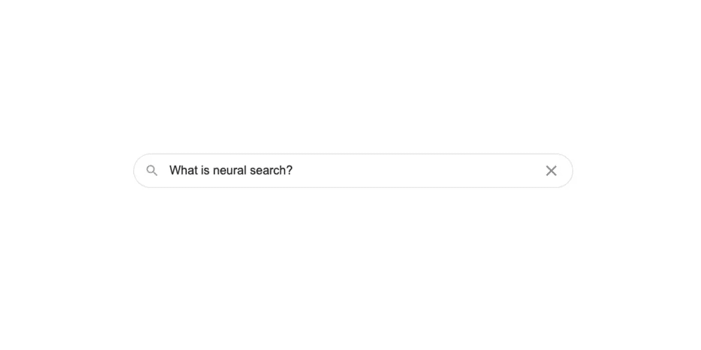
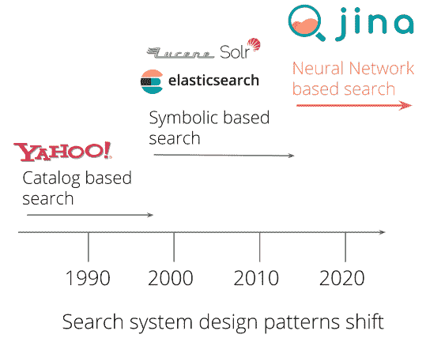
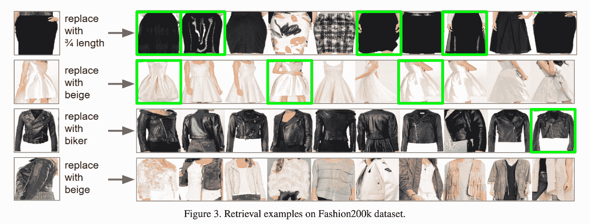

# 什么是神经搜索？

> 原文：<https://medium.com/nerd-for-tech/what-is-neural-search-537853f3d628?source=collection_archive---------4----------------------->

## 以及在没有机器学习经验的情况下如何入门。

> TL；DR:神经搜索是一种使用神经网络检索信息的新方法。传统的搜索技术通常意味着编写规则来“理解”被搜索的数据并返回最佳结果。但是有了神经搜索，开发者不需要绞尽脑汁寻找这些规则；系统会自己学习规则，并在学习过程中变得更好。即使是不懂机器学习的开发者，也可以使用[纪娜](https://github.com/jina-ai/jina)等开源框架快速构建一个搜索引擎。

目录

*   什么是神经搜索？
*   搜索方法的演变
*   规则与神经网络
*   神经搜索的应用
*   开始神经搜索

# 什么是神经搜索？

网络上有大量的数据；我们如何有效地通过它搜索相关信息？我们需要的不仅仅是网络:我们的电脑存储了我们需要处理的数万亿字节的公司和个人数据；我们需要有效的搜索来完成日常工作。我所说的有效搜索是什么意思

*   我们能超越仅仅匹配关键词吗？
*   我们能用自然语言进行搜索吗，就像我们会写字或说话一样？
*   我们能让搜索变得足够聪明来原谅我们的小错误吗？
*   我们能搜索不完全匹配但“足够接近”的东西吗？

我们可以用一个词来回答所有这些问题:是的。为了理解这一点，我们需要进入自然语言处理的世界。NLP 是计算机科学的一个领域，处理分析自然语言数据，比如人们每天的对话。

NLP 是智能搜索的基础，我们在这个领域已经看到了如下三种不同的方法。

# 搜索方法的演变

1.  **规则(1950-1990)**
    模仿自然语言理解的复杂手写规则。
    **缺点:**手写规则只能通过增加它们的复杂性来变得更加准确，这是一项更加困难的任务，随着时间的推移变得难以管理。
2.  **统计(90 年代—2010 年代)**
    基于权重、机器学习和特征工程的概率决策。
    机器学习解决了创建和管理规则的问题，系统通过分析大量真实文本来自动学习规则。
    **缺点:**这些统计方法需要精细的特征工程。
3.  **神经网络(Present)**
    深度神经网络、表征学习等先进的机器学习方法。
    自 2015 年以来，统计方法在很大程度上被放弃，机器学习中出现了向[神经网络](https://en.wikipedia.org/wiki/Neural_network)的转移。使用这种方法的流行技术使它成为一种更精确和可伸缩的替代方法。它涉及
    *使用单词嵌入来捕获单词的语义属性
    *关注更高级任务的端到端学习(例如，问答)

> 当你使用神经网络让你的搜索更智能时，我们称之为**神经搜索系统**。正如您将看到的，它解决了其他方法的一些关键缺点。

注意，神经搜索的应用不仅限于文本。它远远超出了 NLP 所涵盖的范围。通过神经搜索，我们获得了搜索图像、音频、视频等的额外能力。

让我们来比较一下搜索方法的极端——“规则”与“神经网络”:

# 规则(符号搜索)与神经网络(神经搜索)

符号搜索与神经搜索的比较

虽然神经搜索方法自 2015 年以来变得更加广泛，应该是任何新搜索系统的主要关注领域，但我们不应该完全排除符号(基于规则的)搜索方法。事实上，结合使用神经搜索和符号搜索可能会得到优化的结果。

让我们来看看神经搜索的一些强大应用

# 神经搜索的应用

## 语义搜索

🔍addidsa trosers

(拼错品牌和类别，仍返回类似查询“阿迪达斯裤子”的相关结果)

## 在数据类型之间搜索

通过神经搜索，您可以使用一种数据来搜索另一种数据，例如使用文本来搜索图像，或使用音频来搜索视频。

跨模态搜索示例

## 使用多种数据类型进行搜索

使用神经搜索，您可以使用多种查询数据类型构建查询，例如使用文本+图像搜索图像

多模态搜索示例

# 开始神经搜索

对于基于规则的搜索，Apache Solr、Elasticsearch 和 Lucene 是事实上的解决方案。另一方面，神经搜索相对较新，没有那么多现成的软件包。更不用说，为这样的系统训练神经网络需要相当多的数据。这些挑战可以通过使用开源神经搜索框架[纪娜](http://github.com/jina-ai/jina/)来解决。要开始使用纪娜构建自己的神经搜索系统:

*   [学习纪娜的基本概念](https://youtu.be/zvXkQkqd2I8)
*   [开始和纪娜玩耍](https://github.com/jina-ai/jina/)
*   [打造你的第一个纪娜应用](https://docs.jina.ai/chapters/my_first_jina_app/)

**参考文献**

*   神经搜索术语是神经信息检索术语的学术形式，首次出现在 2016 年的[研究研讨会上](https://www.microsoft.com/en-us/research/event/neuir2016/)
*   [学习排名](https://en.wikipedia.org/wiki/Learning_to_rank)
*   [自然语言处理](https://en.wikipedia.org/wiki/Natural_language_processing)
*   [神经网络](https://en.wikipedia.org/wiki/Neural_network)
*   [使用 Tensorflow 构建跨语言产品搜索](https://hanxiao.io/2018/01/10/Build-Cross-Lingual-End-to-End-Product-Search-using-Tensorflow/#recap-symbolic-approach-for-product-search)
*   [什么是神经搜索，为什么要关注](https://towardsdatascience.com/what-is-neural-search-and-why-should-i-care-4a6cee6b2249)
*   [信息检索](https://en.wikipedia.org/wiki/Information_retrieval)
*   [与信息检索相关](https://en.wikipedia.org/wiki/Category:Information_retrieval_genres)
*   [搜索引擎技术](https://en.wikipedia.org/wiki/Search_engine_technology)
*   [神经信息检索简介](https://www.microsoft.com/en-us/research/uploads/prod/2017/06/fntir2018-neuralir-mitra.pdf)
*   [基于内容的图像检索](https://en.wikipedia.org/wiki/Content-based_image_retrieval)
*   [对神经搜索引擎的剖析](https://www.sciencedirect.com/science/article/pii/S0020025518309952)
*   [谷歌搜索如何工作](https://www.youtube.com/watch?v=0eKVizvYSUQ)，以及[一个更深入的视频](https://www.youtube.com/watch?v=tFq6Q_muwG0)