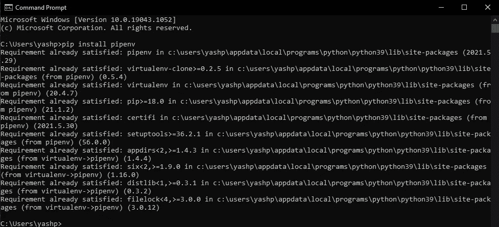
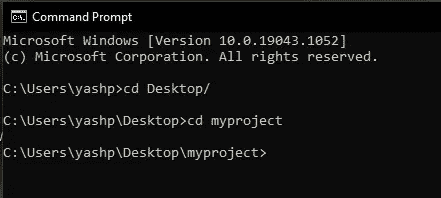
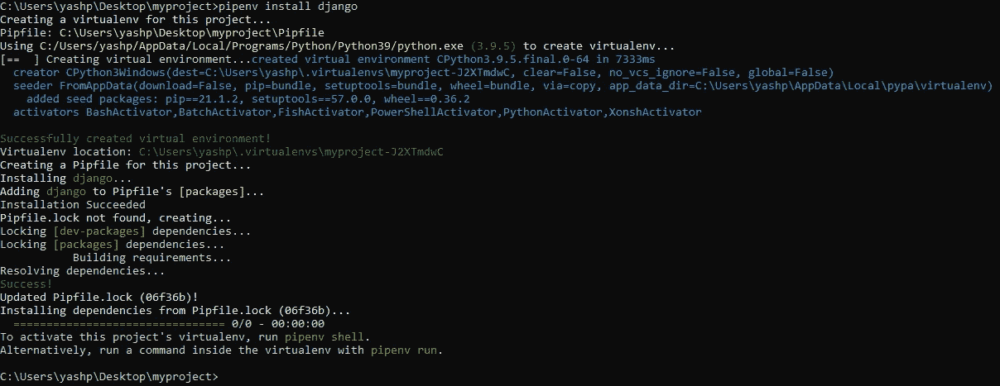
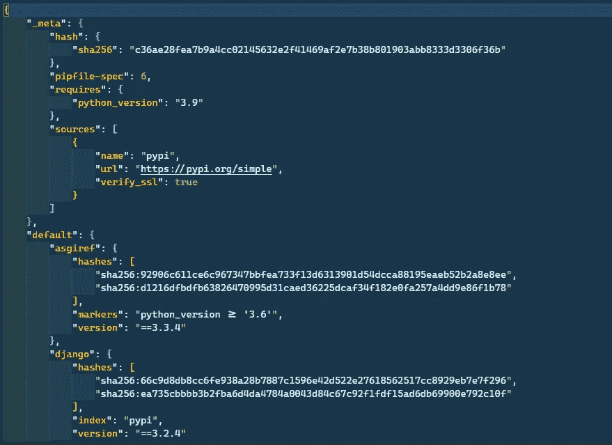
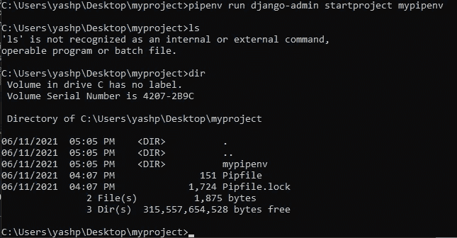
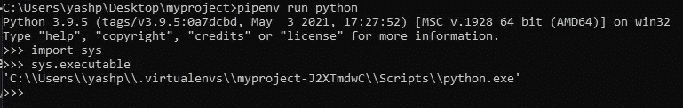
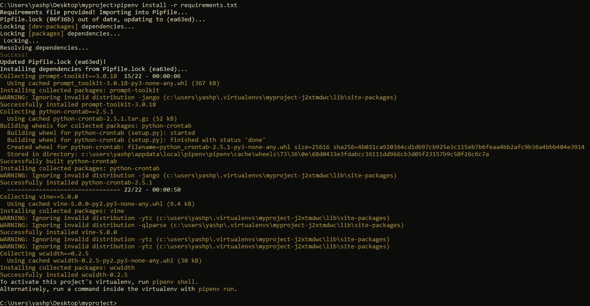
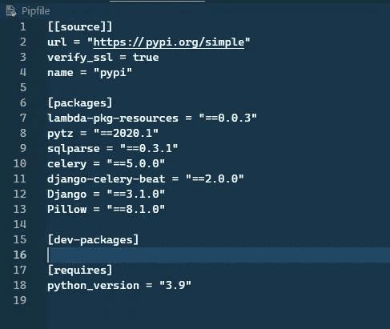
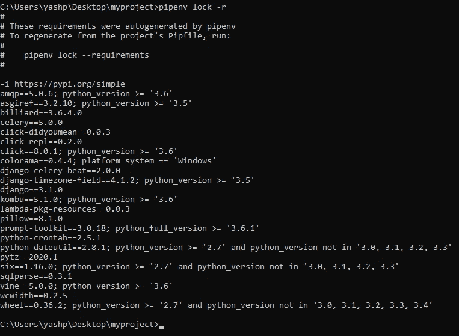

# pipenv 是什么？

> 原文：<https://medium.com/nerd-for-tech/what-is-pipenv-5b552184852?source=collection_archive---------4----------------------->

*   在这个博客中我们将看到 **pipenv** ， **pipenv 是我们将包管理与虚拟环境**相结合的新途径，也是 python.org**强烈推荐的打包工具**
*   **pipenv 基本上是 pip 和 virtualenv 的组合**

# **首先让我们看看皮普和虚拟人**

1.  ****PIP** → pip 是我们安装附加包的一种方式，允许我们添加 python 标准库中不存在的大量功能**

****示例** →如果您想进行一些图像处理，python 可能没有现成的最佳工具，但您可以使用 pip 来安装 pillow 库，并对图像进行处理。**

*   **所以我想很多人可能以前都看过 pip，但是很少有人用过虚拟环境，现在很多人都用过了。**

****2。VIRTUALENV →** 基本上，虚拟环境是我们为正在构建的每个应用程序或项目提供特定环境的一种方式。**

****示例** →您可能有一个运行在 python-3.9 和 django-3.0 上的应用程序和另一个运行在 python-3.8 和 django-2.8 上的项目，因此这些项目中的每一个都有自己的 python 版本和自己的包版本，这通常是想要做的， 因此，有些人推迟学习 virtualenv，只是试图使用 python 的全局安装和安装在一个地方的所有包来运行每个项目，但如果你这样做，那么一旦你更新 python 的下一个版本或更新你的包，那么它可能会破坏你的应用程序，而你的应用程序在那里运行得很好，所以最好使用 virtualenv 将它们分开**

# **→ Pipenv 工具**

*   **因此，首先我们将使用命令`pip install pipenv`使用 pip 安装 pipenv**

****

*   **我已经安装了这个包，所以它会显示你的要求已经满足截图**
*   **所以现在你可以在任何地方创建你的项目文件夹，我会在桌面上创建**
*   **现在使用命令行导航到项目文件夹或空文件夹**

****

*   **现在，如果您将只使用 pip 安装软件包，那么您需要创建 virtualenv 并手动激活它，然后安装软件包。但是在 pipenv 中，这些都是内置的**
*   **因此，我们可以在 pipenv 的帮助下直接开始安装包，而不是创建 virtualenv 等。**
*   **以免说我想在 pipenv 的帮助下安装 django 包，所以这个命令是`pipenv install django`**

****

**现在，为了避免在截图上看到这个命令做了什么，我将一步一步地写下来**

1.  **首先，pipenv 在我们创建的文件夹中检查 virtualenv，如果它能找到任何 virtualenv，那么它将创建一个新的并安装软件包，如第二行所示**
2.  ****然后 pipfile 有五个位置，我们马上会看到这一点。****
3.  ****然后它说它使用的是 whoch python 版本，然后它为我们创建了 virtualenv。****
4.  ****创建 virtualenv 后，它向我们展示了该 env 的位置。pipenv 创建的这个 virtualenv 是您可能正在使用的常规 env，如果您愿意，您可以手动激活该 env。****
5.  ****Pipenv 给了我们简单命令来与 virtualenv 交互，而不是手动操作****
6.  ****在 virtualenv location 消息之后，您可以看到为这个项目创建 pipfile 的消息，所以这一堆将是描述 out env 的文件。这个**文件类似于 requirements.txt 文件。******
7.  ****安装后，它说，它已经添加了对 pipfile 包的请求。****
8.  ****现在它说 pipfile.lock 没有找到，所以它会自动创建。它类似于 pipfile，但有一些关键的区别。**(我们不应该自己编辑这个文件，因为这个文件是由 pipenv 命令控制的)******
9.  ****最后，它说我们可以使用下面的命令`pipenv shell`激活我们的新环境，我们希望在其中运行命令，然后我们可以使用命令`pipenv run`。****

# ****pipfile****

*   ****我已经用我的 visual studio 代码打开了这个文件。(您可以使用任何编辑器)****

********

****pipfile****

*   ****这个文件使用的格式是 **toml，这是一种最小格式，主要包含了部分中的键&值。******
*   ****所以这个文件有 4 个部分，让我们一个一个来看****
*   ******[[source]]** **节** →这一节简单的说了 pipenv 从哪里下载包。****
*   ******【packges】部分→** 它列出了我们已经安装的软件包，这里我们有 **django = '* '，所以星号表示我们在安装**时还没有指定该软件包的任何版本(你可以在使用 pipenv 安装 dajngo 的截图上看到)。****
*   ******【requires】section→**这里简单描述了我们使用的 python 版本。****

# ****Pipfile.lock****

*   ****我在 visual studio 代码中打开了 pipfile.lock。(您可以使用任何编辑器)****

********

****这个文件非常大，所以不要担心，因为这是一个我们不打算改变的文件。这是自动生成的文件，包含有关我们当前环境的更多详细信息。****

****所以你可以向下滚动，看到除了 django 之外还有其他的包，所以这些包是和 django 一起安装的包。并且该文件与已安装的软件包版本完全相同。****

# ****激活 virtualenv****

*   ****打开你的命令行，写下命令`pipenv shell`****

********

****激活的虚拟****

*   ****现在，当您的 virtualenv 被激活时，您将在命令行的开头看到 virtualenv 的名称。****

# ****停用 virtualenv****

*   ****要停用我们的 virtualenv，有不同的命令来停用由我的`pipenv`创建的 virtualenv，因此该命令是`exit`。****

********

****从 virtualenv 退出。****

## ******如何在不激活的情况下运行** virtualenv **中的命令？******

*   ****所以要在 virtualenv 中运行命令而不激活，我们可以使用命令`pipenv run`来运行。****

********

****使用 pipenv run 命令创建 django 项目****

********

*   ****在上面的截图中，我已经在 virtualenv 中运行了 python shell，并显示了 virtualenv 的路径，以确认它是否在使用 virtualenv。****

## ****如何在 pipenv 中安装 requirements.txt？****

*   ****安装 requirements.txt 文件的命令是`pipenv install -r reqirements.txt`。****

********

****安装要求. txt****

*   ****现在你会看到 pip 文件，它将被更新****

********

****安装 requirements.txt 后更新了 pip 文件****

## ******如何使用 pipenv 创建 requirements.txt？******

*   ****所以在 pipenv 中，我们有类似于`pip freeze`的命令，这个命令是`pipenv lock -r`，这个命令将列出包，你可以复制并粘贴到 requirements.txt****

********

> ****希望这篇博客对你有所帮助，谢谢你
> ——亚什·帕特尔·❤️****