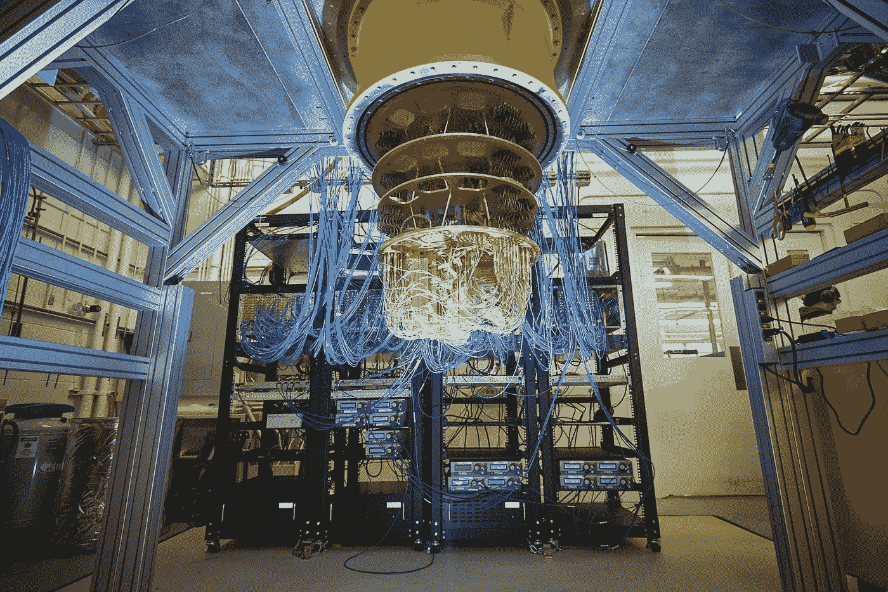
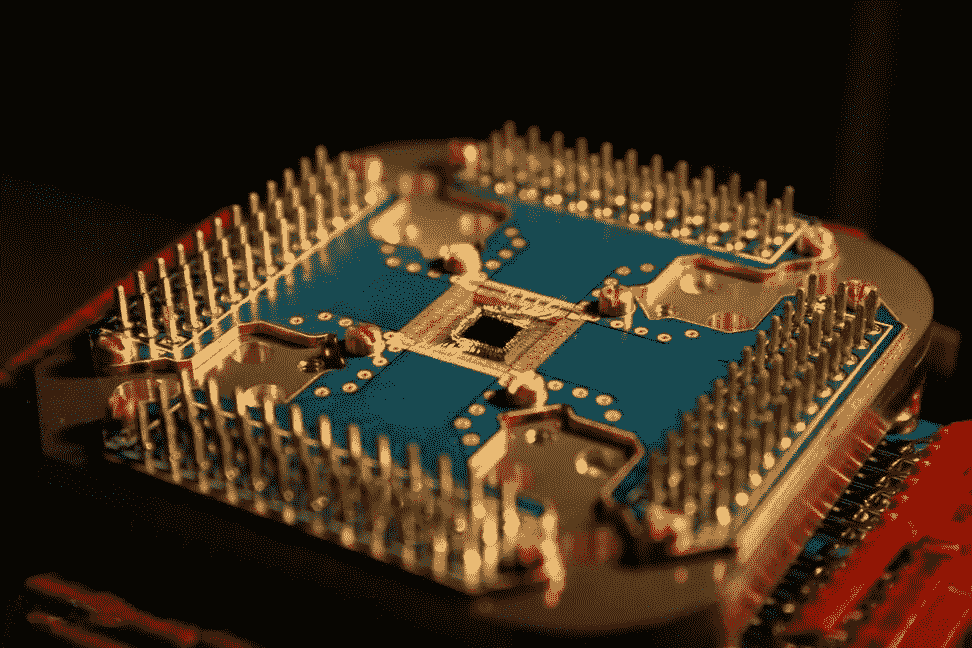

# 什么是量子计算？

> 原文：<https://medium.com/nerd-for-tech/what-is-quantum-computing-4042551316f2?source=collection_archive---------5----------------------->

[谷歌的量子计算机 Sycamore](https://mobygeek.com/features/google-sycamore-quantum-computer-9765)

量子计算的持续增长将极大地影响安全的未来。随着量子计算开始被引入，其他技术的出现对于确保未来的安全性至关重要。在整个报告中，我将描述量子计算的基础知识以及对现代安全技术(如密码学和加密)的可能影响。我还将确定短期、中期和长期风险的缓解策略，并讨论如何确保组织环境中的关键资产得到保护。

“量子计算是指系统用来计算输出的量子力学”(微软)。与使用二进制 1 和 0 进行计算的传统计算不同，量子计算使用量子位。“一个量子位是信息的基本单位，之所以不同，是因为一个量子位可以容纳所有可能状态的叠加”(微软)。这是什么意思？量子位能够同时存储所有可能的二进制 1 和 0。这使得量子计算能够解决现代计算机无法解决的极其复杂的算法和数学因素。

[D-Wave 演示 28 量子位量子计算机](https://thefutureofthings.com/3248-d-wave-demonstrates-28-qubit-quantum-computer/)

理解量子计算对安全技术的潜在影响并不需要深入理解。随着量子计算的不断发展，理解为国家安全系统完全开发新的加密技术需要 20 年或更长时间是令人担忧的，也是重要的。(美国国家安全局)如果量子计算目前可用，将对当今组织使用的当前信息系统产生灾难性的影响。这些组织将会受到影响，因为他们当前的加密技术将会过时。有人说“量子计算有潜力打破大多数企业、数字基础设施和经济所依赖的加密”(Louise)。

组织现在可以实施几种风险缓解策略，并且这些策略可以扩展到未来。关键资产的物理隔离使其成为可能，因此它们无法通过互联网访问，也不容易受到量子计算机的影响。将所有当前的加密技术更新为 256 位或更长的密钥，如 RSA 或 AES 加密算法，是另一种有效的策略。量子密钥分发(QKD)等新兴技术可以在未来实现，它使用量子创建的加密传输密钥来保护信息。人们也可以使用混合分离通道解决方案，如 Phio TX 的产品 Quantum Xchange。混合分离信道技术将加密通信分成两个独立的信道。一个通道用于加密数据，另一个用于安全地传递用于加密数据的加密密钥。单独的通信通道只能与硬件认可的设备通信，限制了拦截密钥和中间人攻击的能力。(Grimes)可以实施所有这些策略来保护和减轻组织的短期、中期和长期风险。

引用的作品

巴特勒，悉尼。“当今最强的加密是什么？”*泰克纳杜*，泰克纳杜，2018 年 8 月 8 日，【https://www.technadu.com/strongest-encryption/37596/. 

罗杰·格莱姆斯:“成为一名变革推动者要从提高你的量子素养开始。”*提高你的量子素养| Quantum Xchange* ，2020，[https://go . Quantum xc . com/LP-WP-Improving-Your-Quantum-literature。](https://go.quantumxc.com/lp-wp-improving-your-quantum-literacy.)

微软。“什么是量子计算:微软 Azure。”*什么是量子计算|微软 Azure* ，2020，[https://Azure . Microsoft . com/en-us/overview/What-Is-Quantum-Computing/。](https://azure.microsoft.com/en-us/overview/what-is-quantum-computing/.)

NativeTech。“量子计算将如何影响网络安全？” *TechNative* ，TechNative，2018 年 3 月 28 日，[https://tech native . io/how-will-quantum-computing-impact-cyber-security/。](https://technative.io/how-will-quantum-computing-impact-cyber-security/.)

国家安全局。"量子计算和后量子密码学."*量子计算与后量子密码术*，NSA，2021 年 8 月，[https://media . defense . gov/2021/Aug/04/2002821837/-1/-1/1/Quantum _ FAQs _ 2021 08 04 . pdf .](https://media.defense.gov/2021/Aug/04/2002821837/-1/-1/1/Quantum_FAQs_20210804.PDF.)

Louise，Axon，网络安全研究助理。"我们必须解决量子计算机带来的安全风险."*为什么我们需要解决我们的量子安全挑战*，世界经济论坛，2020 年 6 月 23 日，[https://www . weforum . org/agenda/2020/06/Quantum-computers-Security-Challenges。](https://www.weforum.org/agenda/2020/06/quantum-computers-security-challenges.)