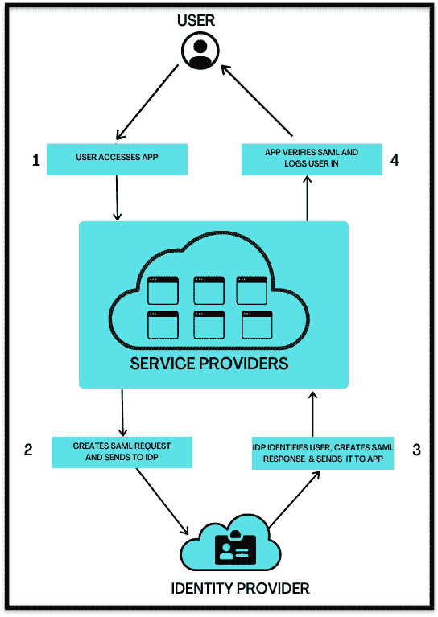

# 什么是 SAML 认证

> 原文：<https://medium.com/nerd-for-tech/what-is-saml-authentication-8163cc497da8?source=collection_archive---------17----------------------->

在当前的数字世界中，我们越来越依赖在线解决方案来开展日常活动。为了开展这些活动，我们必须访问多个应用程序和基于 web 的门户。随着系统数量的增加，适当的身份管理和认证变得越来越重要。无论您是程序员、沮丧的最终用户还是负责保护应用程序安全的经理，记住一组用于访问多个系统的凭据都非常困难，并且很有可能忘记这些凭据。

为了防止这种情况，组织最近开始使用集中式身份认证来访问所有内部应用程序和基于 web 的门户。如果配置得当，这种集中身份验证消除了记住不同系统的所有密码的需要，并提供了强大的安全性。利用这一点，组织可以控制所有用户数据，并使用户的管理和审计变得前所未有的简单。是的，我们正在讨论单点登录(SSO)功能。

但是这篇博文是关于 SAML 的，SAML 是一种支持单点登录(SSO)的 web 协议。我们将研究什么是 SAML，以及它如何通过简化授权和认证过程来帮助组织和用户。

**目录**

1.  什么是 SSO？
2.  什么是 SAML 认证？
3.  SAML 认证的优势
4.  SAML 认证是如何工作的？
5.  SAML 认证的真实例子
6.  结论

# 什么是 SSO？

单点登录(SSO)是一种身份验证类型，允许用户使用一个用户名和密码访问多个移动和 web 应用程序。基本上，SSO 充当主要的身份验证中心。当用户登录到一个系统时，他/她被自动授予访问所有允许的系统的权限。

整个 SSO 概念不是你以前不知道的。我们大多数人每天都会经历这种情况。例如，当您登录 Gmail 等一个谷歌账户时，您会自动获得 Youtube、谷歌应用程序、Adsense 和谷歌分析的认证。同样，如果您注销，您将自动从所有服务中注销。

# 什么是 SAML 认证？

SAML 或“安全声明标记语言”是最常用的支持单点登录(SSO)的 web 协议之一。几乎所有的互联网用户和组织每天都在使用它。这是一个通用协议，它减少了本地域和任何需要知道登录凭证的外部应用程序/web 服务之间的差距，从而消除了不安全的密码扩散。例如，您可以将 SAML 身份验证视为一张身份证:一种简单、开放和标准化的方式来显示某人是谁。你不需要进行一系列的 DNA 测试来确定一个人的身份。你所要做的就是看他们的身份证。

此外，计算和网络的主要挑战之一是互操作性；让不同厂商构建的具有不同技术规范的不同系统协同工作。SAML 身份验证是一种可互操作的标准，被各种行业、政府机构和大型企业广泛接受，用于联合身份部署。

# SAML 认证的优势

## 改善用户体验

当需要为每个应用程序分别使用用户名和密码登录时，这会增加用户体验的摩擦，并使他们面临更高的被黑客攻击或丢失密码的风险。这诱使用户不断重复或使用弱密码，或者定期更新密码。

SAML 允许用户只登录一次就可以访问多个服务。这节省了时间，并使身份验证过程更快更简单，因为它消除了为每个 web 和云服务记住多个登录凭据的需要。

## 增强安全性

SAML 使用在高度安全的身份提供者处进行的单点身份验证。然后，它将身份凭证传送给相应的服务提供商。这种形式的身份验证保证凭据直接发送给身份提供者。

## 目录的松散耦合

目录的松散耦合促进了单一责任，并允许更好的互操作性。SAML 促进了隔离，并且不需要在各种目录之间维护和同步用户数据。

# SAML 认证是如何工作的？

典型的 SAML 认证过程包括三个部分:

*   **主题:**这通常是试图访问云托管服务的用户或员工。
*   **身份提供商(IdP):** 一种云软件服务，通常通过登录过程存储和检查用户身份。基本上，一个 IdP 的工作就是说，“我认识这个人，这是他们被允许做的事情”。SAML 系统实际上可能与 IdP 分离，充当 IdP 的代表。
*   **服务提供商(SDP):** 用户想要使用的云托管应用或 web 服务。比如 Gmail 或 Microsoft Outlook 这样的云邮件平台，AWS s3 或 Google Drive 这样的云存储服务，以及 Skype 或 Slack 这样的通讯应用。通常，用户只需直接登录这些应用程序。然而，在 SAML 的情况下，用户登录到 SAML，这给予他们所需的访问权，而不是直接登录。

SAML 的工作原理是将用户的身份从一个点(IdP)移动到另一个点(SDP)。这是通过交换数字签名的 XML 文档来完成的。当用户需要登录到远程应用程序(如簿记应用程序(服务提供商))时，会发生以下情况，

1.  用户使用互联网上的链接请求访问远程应用程序，当用户具有现有的活动登录会话时，应用程序加载。
2.  应用程序通过用户的 IP 地址或应用程序子域来识别用户，并将用户转移到身份提供商，请求进行身份认证。
3.  身份提供者以 XML 文档的形式组装身份验证响应。这通常包含用户的详细信息。然后用 X.509 证书对其进行签名。最后，该信息被呈现给服务提供商。
4.  服务提供者肯定知道身份提供者具有唯一的证书指纹。使用它，它从身份提供者检索身份验证响应并对其进行验证。
5.  验证用户的身份，并授予用户应用程序访问权限。

下图说明了应用程序触发 SSO 时的 SAML 身份验证工作流。

# 结论

底线是 SAML 的优势是丰富的。组织或最终用户可以轻松安全地共享用户的身份信息。随着云计算技术的出现，SAML 可以获得更多的意义。通过消除共享账户和被盗密码的可能性，它将大大减少被黑客攻击的机会。

*原载于*[*https://www . partech . nl*](https://www.partech.nl/nl/publicaties/2021/06/what-is-saml-authentication)*。*