# 什么是萨斯？使用 Sass CSS 进行样式反应

> 原文：<https://medium.com/nerd-for-tech/what-is-sass-styling-react-with-sass-css-60e7a8a5e62?source=collection_archive---------2----------------------->


S ***ass*** 代表 ***语法牛逼的样式表*** 。它是 CSS 的扩展。在我谈论 Sass 之前，让我稍微回顾一下什么是前端开发。浏览器理解三个概念***HTML******CSS******JavaScript(ES5)***。如果你写静态网站，你用 HTML。纯 HTML 会创建网站，类似于一个文档。你用 CSS ( ***层叠样式表*** )赋予 HTML 网站生命。这是你添加背景、表格、动画的地方……如果你想让你的网站动态起来，你可以使用 *JavaScript(特别是 ES5)* 。所以，如果你只知道这三种语言(HTML、CSS 和 JavaScript)，你就可以创建一个非常好的网页。你可能会问这个问题，为什么我们会有这么多令人困惑的其他语言和技术，如 TypeScript、Babel、React、Vue、Angular、Sass、CSS 模块等等……简单地说，所有这些都是编译三种主要语言(HTML、CSS 和 JavaScript ES5)的编译器。他们每个人都来帮助解决一个问题或使写东西更容易。类似于过去的机器语言。他们过去在学校告诉我们，计算机只理解 0 和 1。所有这些语言都将被翻译成 0 和 1。浏览器也一样。浏览器只懂(HTML，CSS，JavaScript ES5)。所以，所有那些都只是让开发更丰富的编译器和库。例如，TypeScript 将类型添加到 Javascript 中，但它在最后编译成 JavaScript ES5，以便浏览器理解。

回到萨斯。Sass 是对 CSS 的扩展，它使用户能够使用变量、内联导入、嵌套规则以及其他我们将进一步讨论的东西。

像往常一样，我喜欢用行动来解释事情。所以，让我们开始在一个新项目中使用 Sass。

如果您从未开发过 node 或 React，请参考下面的文章来设置您的机器

[](https://ranyel.medium.com/preparing-your-mac-for-react-and-node-development-install-nodejs-npm-vs-code-and-configure-vs-e4f0cf1e99a4) [## 为 React 和节点开发准备您的 Mac，安装 NodeJS、npm、VS 代码，并配置 VS…

### 按照以下步骤/视频安装 Nodejs

ranyel.medium.com](https://ranyel.medium.com/preparing-your-mac-for-react-and-node-development-install-nodejs-npm-vs-code-and-configure-vs-e4f0cf1e99a4) 

现在，让我们创建一个新项目，将其命名为 react-sass，并在 Visual studio 代码中打开它，如下所示:(最终项目在[https://github.com/ranyelhousieny/react-sass](https://github.com/ranyelhousieny/react-sass))

```
npx create-react-app react-sasscd react-sasscode .
```

1.  当您打开 Visual Studio 代码时，使用(Ctrl +`)打开一个终端。请参见左边的图像。

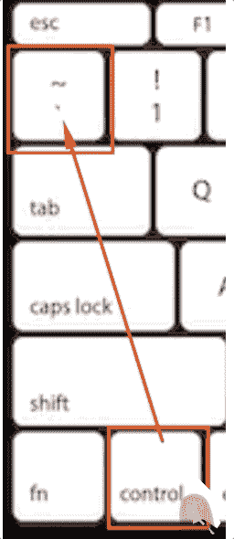

2.安装节点-sass

```
npm install -save node-sass
```

3.将所有 src/App.css 和 src/index.css 重命名为 src/App.scss 和 src/index.scss

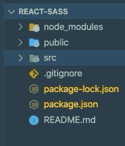

4.更改 index.js 和 App.js 中的导入以反映新的扩展

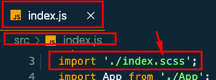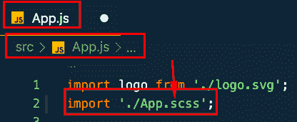

现在运行 npm start 并在浏览器上观察页面

```
npm start
```

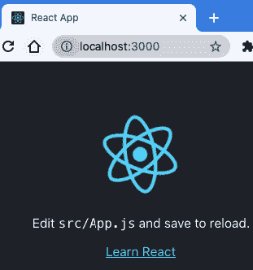

# 为 Sass 安装 VSCode 扩展

您可以安装以下扩展来帮助格式化 Sass

[](https://marketplace.visualstudio.com/items?itemName=Syler.sass-indented) [## Sass - Visual Studio 市场

### 从 VSCode 中的扩展安装程序中搜索 Sass，或者将它放入命令面板中。外部安装…

marketplace.visualstudio.com](https://marketplace.visualstudio.com/items?itemName=Syler.sass-indented) 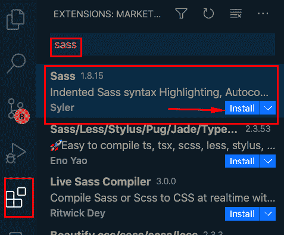

# 第一个 Sass 特征(变量)

让我们使用第一个 Sass 特性，即使用变量。转到 Ap.scss 定义一个名为 *headerBackgroundColor* 的变量，并将其值设为橙色。更改中的当前值。App-header 设置为该值，如下所示

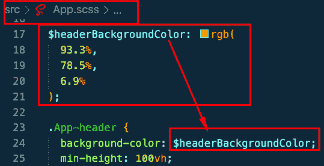

```
$headerBackgroundColor: rgb(
  93.3%,
  78.5%,
  6.9%);
```

保存文件并观察浏览器。检查浏览器

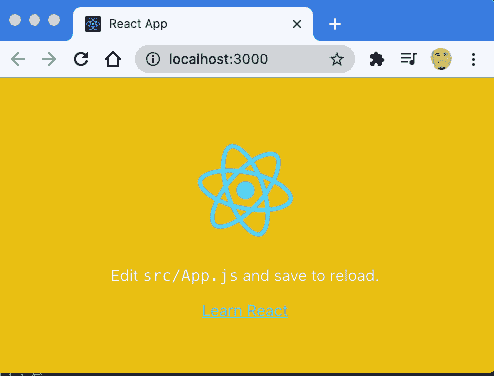

这是 Sass 的好处之一，您可以为项目中可能用到的东西使用变量名，并不断引用它们。我通常有一个主色和一个辅色，我在页面上使用它们来保持感觉和外观的一致。

# 嵌套

CSS 中的一件事是，你必须重复标题名称，以创建一个像悬停或嵌套类的效果。在 Sass 中，您可以像下面这样嵌套它们

在 App.scss 中，有以下类

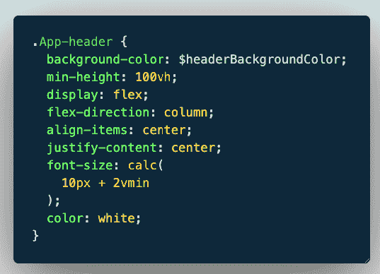

现在让我们改变背景颜色悬停如下:

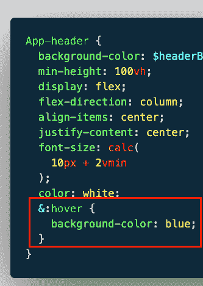

所以，现在当你悬停时，它会从橙色变为蓝色，如下所示:

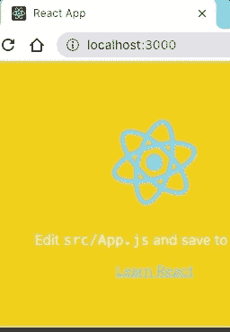

在 CSS 中，您应该在单独的类中完成，如下所示:

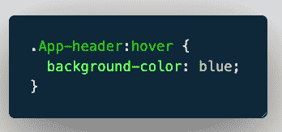

发布于 LinkedIn:

[](https://www.linkedin.com/pulse/what-sass-styling-react-css-rany-elhousieny-phd%E1%B4%AC%E1%B4%AE%E1%B4%B0/) [## 什么是萨斯？使用 Sass CSS 进行样式反应

### Sass 代表“语法上令人敬畏的样式表”。它是 CSS 的扩展。

www.linkedin.com](https://www.linkedin.com/pulse/what-sass-styling-react-css-rany-elhousieny-phd%E1%B4%AC%E1%B4%AE%E1%B4%B0/)