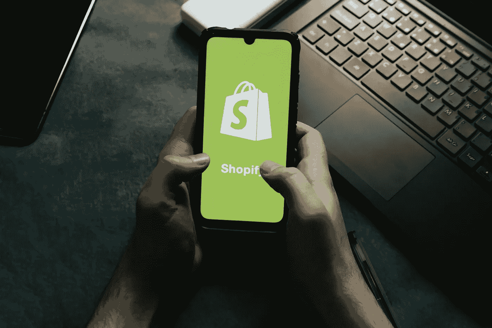

# 什么是 Shopify 2.0，为什么以及如何迁移？

> 原文：<https://medium.com/nerd-for-tech/what-is-shopify-2-0-why-how-to-migrate-8a2b18799a47?source=collection_archive---------4----------------------->

信用:burst.shopify.com

Shopify 就是这样一个平台，让你毫不费力地开始和管理你的业务。这是一个完整的电子商务平台，有如此多的定制和数百万个主题。随着 Shopify 2.0 的发布，该公司更进一步。

Shopify 2.0 不仅仅是一些主题引擎，而是新的下一代改进，旨在使平台可扩展到中小型企业。你不必为 Shopify 2.0 付费；这不是另一个付款计划。相反，2.0 是一组新功能，为商家提供了更大的销售机会，增强了灵活性和所有权。

那么这些变化是什么呢？它们值得升级吗？在这里，我已经谈了你需要知道的一切。

我们开始吧！

## 为什么要迁移到 Shopify 2.0？

**1。加载速度更快**
随着“黎明”的推出，Shopify 的默认店面主题比之前的默认主题快了 35%。这意味着加载时间不应超过 2 秒。此外，新版本还增加了许多新功能，例如:

*   主题“黎明”快了 35%。
*   比‘出道’适应性更强，更直观。
*   多亏了 JSON 模板，加载速度显著提高。
*   结账延迟的显著减少。

**2。增强的 UI**
随心所欲地四处走动和导航。2.0 版本让这变得简单多了。这个功能不仅能吸引买家，还能节省你很多时间。以下是一些亮点:

*   由于 HTML 和 CSS，更加移动友好
*   更好的用户体验(UX)和更高的搜索排名
*   和谐的调色板来编辑整个网站的颜色。
*   你可以选择任何主要/次要的配色方案，并控制你的网站的外观。

**3。元字段的灵活性**
自定义字段，也称为元字段，只不过是应用程序添加关于 Shopify 资源的&商店详细信息/信息的一种方式。在早期的 Shopify 版本中，必须在冷级别完成。有了 2.0，一切都变了。现在，您可以直接在主题编辑器中添加一个元字段。

**额外提示:**元文件很重要，因为当输入不可用时，它们允许商家将信息连接到资源。

**4。改进开发工具以高效运营您的商店**
您一定遇到过很多次这样的情况:您要求您的 Shopify 开发人员对您的网站进行某些改进，但由于存在限制，他/她无法做到。如果这听起来很熟悉，那么 2.0 不会让你失望。

以下是 Shopify 2.0 的改进之处。

*   **主题编辑器**
    导航&更新主题现在很容易。感谢管理界面，这是大大改善。
*   **主题 App 扩展**
    添加动态元素，不进入液体模板。这无疑让 Shopify 松了一口气。使用主题应用程序扩展，您可以将应用程序添加到电子商务网站。结果，站点性能得到了提高，不再需要直接编辑主题的代码。
*   **Shopify CLI**命令行界面(CLI)也有所改进。现在，你可以自动化一般的开发任务，并在基础层面上定制 [Shopify 应用](https://www.resourcifi.com/blog/best-shopify-apps-to-increase-sales) &主题。
*   **树形显示视图**
    如果我说你可以像样的查看每个网页上的所有内容呢？很可爱，对吧？Shopify 2.0 向你展示了一个树形显示，可以在侧边栏中找到。树形显示视图使编辑内容变得更加容易。
*   **内容灵活性**
    添加字段和属性，无需进入 API 或代码。有了 Shopify 2.0，卖家可以随心所欲地添加任何内容。例如，可以包括详细描述、运输信息或订单大小选项等等。

## 如何从 Shopify 1.0 迁移到 Shopify 2.0？

你想通过从 Shopify 版本 1.0 升级到 2.0 来提升你的业务，这很好，但是你同样需要 Shopify 开发者的帮助。以下是你可以考虑的顶级 Shopify 开发公司。

虽然我强烈建议你雇佣一个 Shopify 开发人员，但是在这里我已经为你解释了 3 个简单的方法来开始使用 Shopify 2.0。

**方法 1**
从 Shopify 商店下载一个 Shopify 2.0 主题。一旦你下载了它，你将可以访问新的主题以及 Shopify 2.0。

**方法二**
更新你现有的主题。一些现有的主题可以让你保持相同的外观，同时获得 2.0 的功能。

**方法 3**
手动迁移主题，这需要 Shopify 开发人员的帮助。

## 结论

新的 Shopify 2.0 本质上是基于样本 JSON，因此您肯定会获得创作自由、性能改进和主动管理。为了在竞争中保持领先，该公司进行了大量投资。

本指南涵盖了让您开始使用 Shopify 2.0 的大部分内容。升级到 it，以增强的灵活性和所有权进行销售，并取得更多成功。

## 常见问题

**什么是 Shopify 2.0，我为什么要升级到它？Shopify 2.0 是一个真正的客户体验增强版本，具有更强的定制性。升级到 2.0，吸引更多相关买家。**

**如何从 Shopify 1.0 迁移到 Shopify 2.0？**
迁徙容易。只需雇佣一个你认为可以帮助你的 Shopify 开发者。这里有一些领先的 Shopify 开发公司供你考虑。

**2.0 是 Shopify 的另一项支付计划吗？**
当然不是！与价格无关。Shopify 2.0 是一套为企业主提供的功能，让他们的生活更轻松。它还为 Shopify 开发者提供了额外的灵活性。

**有没有兼容 2.0 的主题？**
下面是一些 Shopify 2.0 兼容的主题:
帝国 v6.0.0+
启动 v11.0.0+
大西洋 v15.0.0+
版本 v11.0.0+
网格 v5.0.0+