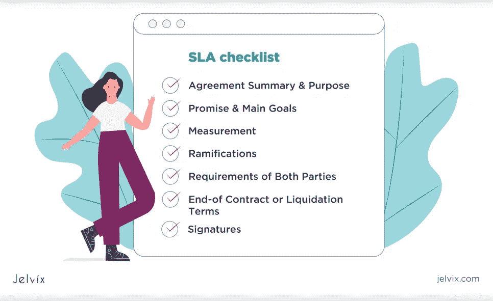
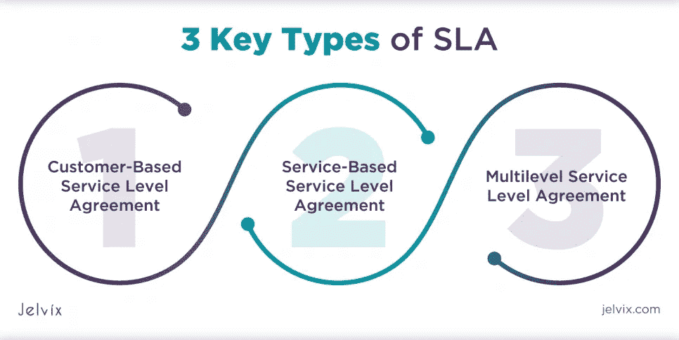
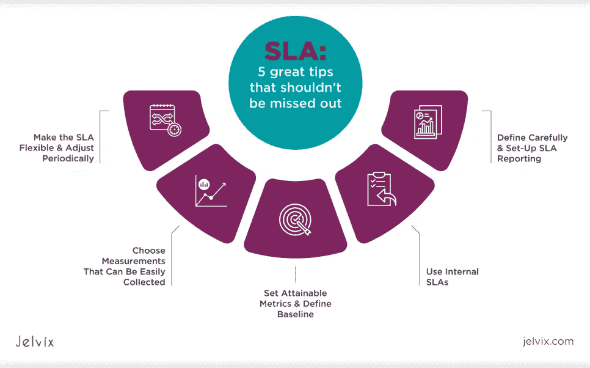
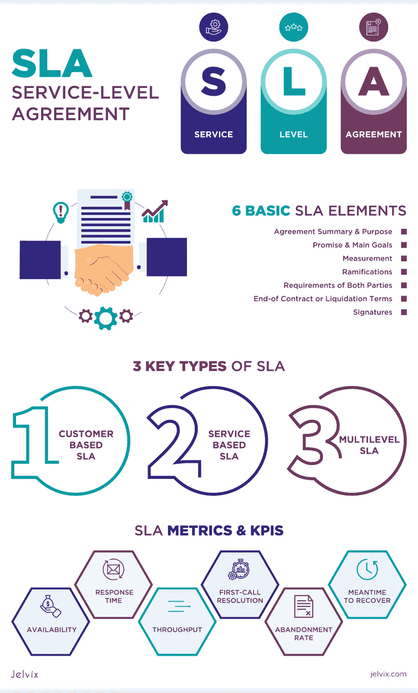

# 什么是 SLA &它如何有利于您的业务发展？

> 原文：<https://medium.com/nerd-for-tech/what-is-sla-how-can-it-benefit-your-business-development-179213fac360?source=collection_archive---------4----------------------->

## SLA 是任何技术供应商合同的重要组成部分

## 服务级别协议的最佳实践

SLA 是任何技术供应商合同的重要组成部分，尤其是那些[外包相关的合同](https://jelvix.com/blog/main-risks-of-outsourcing)。除了列出对服务类型和质量的期望之外，SLA 还定义了当这些期望没有得到满足时的商定惩罚。

传统上，SLA 用于定义服务提供商对客户的承诺。然而，它也可以服务于供应商的内部运营。例如，在协调销售和营销工作或改善团队沟通时。根据最近 [LinkedIn 的调查](https://business.linkedin.com/marketing-solutions/aligning-sales-and-marketing-the-art-of-winning)，大约 60%的全球受访者认为销售和营销之间的不一致会损害财务表现，而[微软](https://query.prod.cms.rt.microsoft.com/cms/api/am/binary/RE36vJj)发现这些部门的一致可以提高 36%的客户保持率。

但是 SLA 代表什么，它如何提高业务绩效？本文将解释 SLA 的基础知识，描述它的主要类型、关键指标，以及为什么 SLA 在今天如此重要。

# 什么是 SLA &它是如何工作的？

SLA 也称为服务水平协议，指的是供应商和客户之间达成一致的服务水平( [Gartner 的 IT 术语表](https://www.gartner.com/en/information-technology/glossary/sla-service-level-agreement#:~:text=A%20service%2Dlevel%20agreement%20(SLA,process%20is%20monitored%20and%20approved.)，)。SLA 中涵盖的指标有助于确定协议的成功或失败，以及在未达到任何商定的服务级别时清除补救措施或处罚。SLA 是在公司和外部供应商之间安排的，但也可能是在公司内部的两个部门之间。

术语“服务级别协议”的使用范围非常广泛。通常，它用于 [IT 外包](https://jelvix.com/blog/outsourcing-during-covid)，但是现在越来越多的企业、电子商务商店和其他特定行业的人也已经在实施 SLA 来使他们的服务合法化。

虽然 SLA 定义初看起来有点困难，但是这个协议的结构非常简单。在大多数情况下，它包括六个基本要素:

*   **协议摘要&目的:**这个数据 SLA 为什么存在？需要解决的主要问题是什么，如何实现这些问题？
*   **承诺&主要目标:**对对方(客户、团队或部门)的核心承诺是什么？
*   **测量:**你将如何测量数据 SLA，谁来测量？SLA 审查多久进行一次？
*   **后果:**当错过数据 SLA 时会发生什么？谁应对此负责？如果有处罚的话，可以实施什么处罚？
*   **双方要求:**你期望从 SLA 中得到什么回报？你的承诺是如何有条件的？
*   **合同终止或清算条款:**一方如何以及何时可以选择退出 SLA？
*   **签名:**谁负责数据 SLA？

在得出结论之前，应该仔细评估和设计 SLA，以便为双方提供最大价值。最佳实践还建议保持简短，确保没有歧义或意思的变化。

交付服务级别协议的实践并不是一个新概念。它已经被许多行业数以千计的知名公司和企业应用，包括[微软](https://www.microsoft.com/licensing/docs/view/Service-Level-Agreements-SLA-for-Online-Services)、 [HubSpot](https://offers.hubspot.com/sla-template?hubs_post=blog.hubspot.com%2Fblog%2Ftabid%2F6307%2Fbid%2F34212%2Fhow-to-create-a-service-level-agreement-sla-for-better-sales-marketing-alignment.aspx&hubs_post-cta=HubSpot%27s%20Marketing%20%26%20Sales%20SLA%20Template&hubs_signup-url=blog.hubspot.com%2Fblog%2Ftabid%2F6307%2Fbid%2F34212%2Fhow-to-create-a-service-level-agreement-sla-for-better-sales-marketing-alignment.aspx&hubs_signup-cta=HubSpot%27s%20Marketing%20%26%20Sales%20SLA%20Template&_ga=2.146243060.1550557919.1653545593-689874118.1646771220) 、 [AT & T](https://www.corp.att.com/agreement/) 、 [PandaDoc](https://www.pandadoc.com/service-level-agreement-template/) 等。

# SLA 的 3 种主要类型

最终，SLA 的核心含义是通过定义明确的期望并在问题发生前减轻问题，在双方之间建立一致性。然而，并非所有 SLA 的目标受众和内容都是相同的。

根据使用情形，需要了解多种类型的服务级别协议:

# 基于客户的服务水平协议

基于客户的 SLA 是一种与单个客户达成的协议，旨在提供所需的特定级别的服务。通常，这种类型利用单个契约，这对于供应商来说很方便，因为它很简单。例如，电信服务提供商可能会将其提供的所有服务(有线电视、互联网等)包含在针对特定客户的一份合同中。

# 基于服务的服务水平协议

基于服务的 SLA 是适用于所有客户的标准合同。通常，它以不变的标准为特色，这些标准对供应商来说更加简单明了，对他们的客户来说更加全面。这种类型的一个很好的例子是对同意使用服务的所有客户有效的移动运营商协议。

# 多级服务水平协议

多级 SLA 是一个特定的文档，在该文档中，最终用户可以根据他们的偏好和需求优化所提供的服务，创建附加条件，并指出一些其他方面来创建个性化服务模型。这类 SLA 最典型的例子存在于很多免费增值软件产品中( [YouTube](https://www.youtube.com/) 、 [Google 云平台](https://cloud.google.com/storage/sla)、 [Trello](https://trello.com/power-ups/5decb67ce9bafb579ed0e794/slas-for-trello) 、 [WordPress](https://wpengine.com/legal/sla/) 等。)，其中供应商列出了有保证的服务级别、针对较高价位提供的服务级别或特定订阅计划独有的服务级别。

# 为什么服务级别协议很重要？

SLA 不仅仅是一个合同本身——在服务级别协议定义的背后，是服务提供商和其客户之间达成一致的大量条款。任何达成一致的条款都侧重于确保所提供的服务满足某些阈值(例如，正常运行时间、响应能力、首次呼叫解决率等等)。

传统上，SLA 是公司承诺的服务的蓝图。他们可以保护供应商的声誉和资产，这是任何企业的首要任务之一。除此之外，在合同中实施 SLA 的原因还包括:

*   **SLA 有助于设定清晰、可衡量和可实现的指导方针。**因此，公司和客户对标准和服务的意见是一致的。这也有助于客户形成一定的期望，并确保他们得到他们所支付的。对于提供者本身来说，SLA 指标允许更好地理解服务质量以及改进服务质量的方法。
*   服务水平协议决定了未能履行服务义务时的后果。如果绩效标准不符合合同中规定的标准，这有助于公司制定替代行动计划。例如，供应商可以提供罚款，这可以缓解这种情况，而不会对声誉造成巨大损害。此外，它有助于预测公司可能面临的可能情况，这意味着如果发生任何情况，员工总是知道如何行动。
*   **SLA 允许根据客户的要求和期望寻找服务提供商。**这对消费者来说格外重要:在大多数情况下，客户会得到出色的客户服务，或者在遭受任何损失时得到体面的赔偿。相反，公司应用坚如磐石的 SLA 来提高客户保持率，并获得相对于竞争对手的优势。

也就是说，服务水平协议在建立一个拥有专业服务、良好声誉和满意客户的[竞争性企业](https://jelvix.com/services)中发挥着重要作用。他们在帮助组织实现其承诺时提供了优势。创建和管理 SLA 指标的能力可以确保供应商及其客户对满足共同需求有一个共同的愿景。

# 如何正确设置 SLA 指标和 KPI

服务水平协议的核心价值在于它们的衡量标准。这些测量有助于更好地控制所交付服务的质量，并且应该对双方都公平合理。通常，SLA 指标的数据是在一定时期内定期自动捕获的，这进一步加强了基准测试。

观看视频，了解 SLA 和 KPI 之间的区别:

这些指标正在不断改进，以涵盖客户-供应商关系中最重要的服务质量方面。一个 SLA 可以涵盖一个或多个商定的度量标准来衡量供应商的[性能](https://jelvix.com/blog/best-scrum-tools)。例如，下面您会发现云解决方案范围内最常见的 SLA 指标类别。

*   **可用性** —服务为其用户工作的时间百分比。该指标的常见例子是正常运行时间、服务可用性或缺陷率。
*   **响应时间(延迟)** —请求后返回响应所需的时间。这里，典型的跟踪指标是平均修复时间(MTTR)、事务响应时间等。
*   **吞吐量** —云资源在一段时间内发送和接收票证的数据量可以用磁盘写入字节、链路吞吐量等指标来解释。
*   **第一次呼叫解决** —在第一次请求时解决的票据的百分比。
*   **放弃率** —在响应时间内没有得到响应的查询的百分比。例如，HTTP 错误、磁盘读取错误、客户端错误等等。
*   **恢复所需的时间** —解决特定类型的服务中断所需的平均时间。

SLA 可以为不同类型的客户基础设施指定参数，为分析师提供最新的服务性能和质量。因此，这个 SLA 指标列表是可变的，完全取决于特定的业务目标和需求，以及它所运营的行业。

# 适用于任何企业的 SLA 最佳实践

建立服务级别协议的最简单方法是在线查找模板和示例。例如，公司可以以[微软 Azure 云服务 SLA 示例](https://azure.microsoft.com/en-gb/support/legal/sla/)为例，使用 [HubSpot](https://blog.hubspot.com/) 上提供的营销和销售服务模板，或同一行业内提供的任何其他样本。

但是如何从零开始制定一个优秀的服务级别协议契约呢？这里有一些不应该错过的好建议。

# 使 SLA 变得灵活并定期调整

随着任何业务的发展，它都会经历不同类型的波动。小公司比大公司更加灵活，发展速度也更快。因此，供应商可以看到积极或消极的变化，例如，交易、收入和客户保持，或者面临不可预见的问题，可能会破坏所有的估计。

这就是为什么公司应该寻找严格集中于业务目标的可伸缩和灵活的 SLA 指标。还建议设定可实现的目标，在困难时期可以重新定义。

此外，按时审查 SLA 可以帮助公司确保他们朝着正确的方向发展。

# 选择容易收集的测量值

一个好的 SLA 指标的最佳特征之一是它易于收集。理想情况下，它们是用特定的软件自动捕获的( [Datadog](https://www.datadoghq.com/blog/set-and-monitor-slas/) 、 [ManageEngine](https://www.manageengine.com/products/applications_manager/sla-management.html#:~:text=ManageEngine%C2%AE%20Applications%20Manager's%20SLA,of%20IT%20and%20IT%20processes.) 、 [SuperOps](https://superops.ai/psa-software/sla-management) 等等)。尽管并不总是可能得到所有期望的度量，但是供应商应该寻找优化这个过程的有效方法，以获得最大的价值或者折衷一个合适的替代方案。

# 设定可达到的指标并定义基线

公司创建 SLA 的主要目的是改善客户服务。因此，增量的、可追溯的改进是实现这个目标的最可靠的方法。

在[定义基线指标](https://www.linkedin.com/pulse/how-define-performance-requirements-sla-baseline-agile-sarker)之后，服务提供商应该通过将 KPI 设置在适当的级别来选择可实现的 SLA 指标。找到时间和目标之间的黄金中间点很重要:不切实际的 KPI，或者那些太容易获得的 KPI 对公司和交付的服务没有任何用处。

# 使用内部 SLA

除了以客户为中心的 SLA 指标，还建议使用内部指标，即负责部门间沟通的指标。 [IBM](https://www.ibm.com/docs/en/maximo-eam-saas?topic=overview-types-service-level-agreements) 对此类协议给出了很好的解释:内部 SLA 是服务提供商和内部客户(例如，另一个组织、站点或部门)之间的协议。

正确设置内部 SLA 有助于为内部使用提供现实的预期。根据公司的文化，有多种方式来提供 SLA 数据:

*   普通 SLA 模板，针对内部客户进行了调整
*   包含关键指标和期望的 SLA 草案

内部服务水平协议对于大型和小型团队来说都是一个很好的选择，有助于在团队成员中设定明确的期望。

# 少即是多

刚接触 SLA 文档的公司最常见的错误之一是试图跟踪尽可能多的参数。然而，这种策略可能没有用:覆盖 SLA 数据需要几个小时。

为了确保公司充分利用 SLA，最佳选择是优先考虑 SLA 指标列表。这样，供应商可以过滤掉价值较低的参数，同时关注关键的参数。

# 仔细定义并建立 SLA 报告

设置 SLA 指标只是战斗的一半。在某些情况下，提供商可能会调整这些参数，以确保它们处于领先地位。例如，首次呼叫解决率达到 100% SLA，因为提供了对事件的自动票证响应。事实上，没有采取任何行动。这种策略大大贬低了服务级别协议的所有原则。因此，供应商应该始终清楚地定义他们的 SLA，以获得清晰、最新的性能数据。

SLA 管理流程的另一个重要方面是监控。换句话说，文档记录了服务性能的发展趋势，并对结果进行了比较。供应商应该始终考虑数据捕获的频率和方式，以及谁负责这个过程。

# 我们能帮上什么忙？

创建一份全面的 SLA 文档可以成就或毁灭公司的业绩。虽然它通常被称为对客户的公开承诺，但它们是一种双边协议:供应商提供某些服务，同时获得客户的忠诚和信任。换句话说，SLA 可以保持供应商的诚实和早期的期望，并推动业务向前发展。

[Jelvix 专家](https://jelvix.com/services)在[数字化转型](https://jelvix.com/services)领域拥有多年的专业知识。我们最优秀的专家知道如何确定业务目标和需求，并随时准备为公司的发展制定卓越的发展战略。

如果您对 SLA 有任何疑问，请联系 Jelvix 。我们已经帮助不同的公司设置了与目标业务目标一致的正确 SLA，并创建了一个将受益多年的个性化文档模型。

# 结论

服务水平协议是改善客户和服务提供商之间关系的第一步。SLA 有助于更好地理解每一方的责任，并形成对所交付服务的明确期望。因此，它现在被不同规模的公司广泛应用于许多行业。

创建一个专业的 SLA 文档可以让你的公司发展到一个全新的水平。一旦您了解了什么是服务级别协议并准备好开始实施它，就值得考虑以下模型之一:

*   基于客户的 SLA
*   基于服务的 SLA
*   多级 SLA

但是，如果您对 SLA 的含义、性能或效率还有任何疑问，请立即联系 [Jelvix](https://jelvix.com/) 。我们的经理时刻准备着为您的企业提供强大的服务水平协议。

*最初发表于*[T5【https://jelvix.com】](https://jelvix.com/blog/what-is-sla)*。*