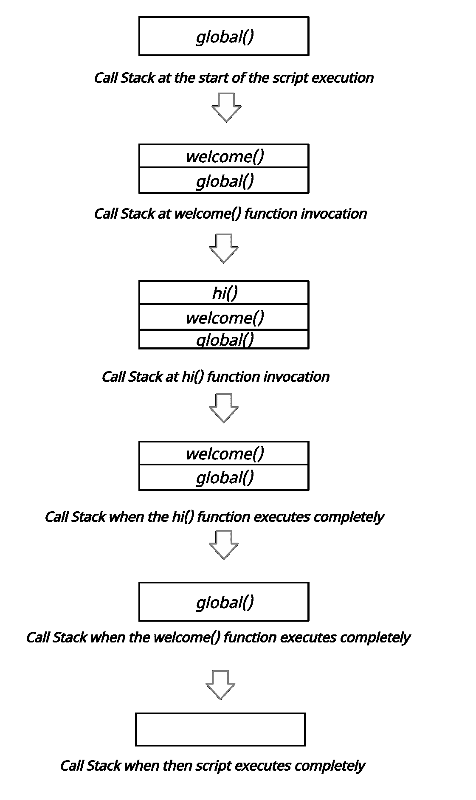
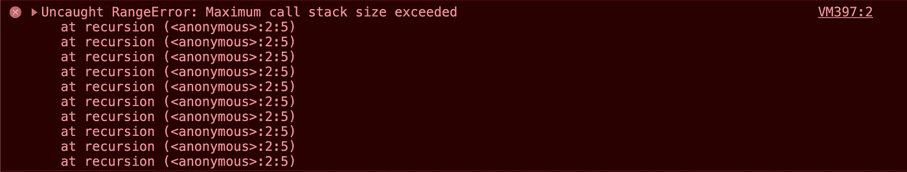

# Javascript 中什么是堆栈溢出？

> 原文：<https://medium.com/nerd-for-tech/what-is-stack-overflow-in-javascript-540e7067b894?source=collection_archive---------2----------------------->


[食客集体](https://unsplash.com/@eaterscollective?utm_source=unsplash&utm_medium=referral&utm_content=creditCopyText)在 [Unsplash](https://unsplash.com/s/photos/stack?utm_source=unsplash&utm_medium=referral&utm_content=creditCopyText) 上的照片

你可能听说过堆栈溢出。不，我说的不是[著名的开发者平台](https://stackoverflow.com/)，而是一个概念；而且，这是一种情况。在本文中，我们将了解情况，Javascript 中的堆栈溢出！但是在开始之前，我们需要理解什么是调用堆栈？

# 什么是调用栈？

通过调用栈，解释器跟踪脚本执行时调用的任何函数。调用栈的工作方式非常简单。它遵循以下步骤:

1.  当脚本调用一个函数时，它被解释器添加到一个*调用栈*中，之后它继续执行那个函数。
2.  当函数执行完成时，解释器将它从堆栈中移除(弹出)并继续执行脚本。

让我们用一个简单的例子来理解这一点。

```
function welcome(){ 
    hi(); 
}function hi(){ 
    console.log("Hey there, welcome!"); 
}welcome();//... More JS code.
```

上述代码将以如下格式执行:

1.  当解释器到达`welcome()`函数调用时，它被添加到调用堆栈中。
2.  将`hi()`函数调用添加到调用栈中(在将`welcome()`函数添加到调用栈中之后，执行该函数。解释器还发现了`hi()`函数调用，因此将`hi()`函数也添加到了调用堆栈中！)
3.  执行`hi()`功能。
4.  `hi()`函数被移除/弹出堆栈。
5.  执行`welcome()`功能。
6.  从调用堆栈中移除/弹出`welcome()`函数。
7.  javascript 代码的其余部分被执行。

> **重要提示**:当脚本运行时，由`*main()*`或`*global()*`表示的全局执行上下文函数被添加到调用栈中。

以下是上述步骤的直观表示:



调用堆栈的可视化表示。

# 什么是堆栈溢出？

现在，我们来讨论一下主要概念。堆栈溢出的情况是建立在调用堆栈上的，因此理解它是很重要的。

调用堆栈具有指定的最大大小。当添加到堆栈中的函数调用数量增加到堆栈的最大限制(调用堆栈有一个最大大小)时，就会发生堆栈溢出。导致这种情况的一个经典例子是递归。递归是一个函数调用自身直到找到终止条件的过程。

*举个例子:*

```
function recursion(){ 
    recursion(); //a function calling itself 
}recursion();
```

上面例子中有趣的部分是没有终止条件。因此，该函数无限地调用自己，从而导致堆栈溢出，并因此发生错误。

如果我们在 chrome 中执行上述代码，我们会收到以下错误:



执行上述代码时收到的错误。

*我们走吧！这是堆栈溢出！*

如果你喜欢这篇文章，掌声会激励我写更多这样的文章:)