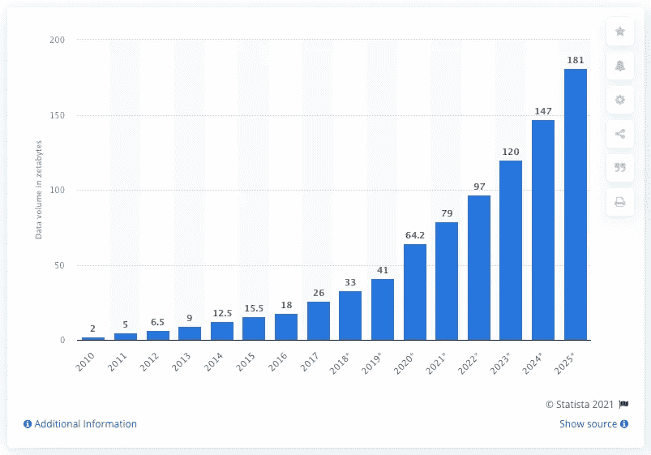

# 什么是合成数据，为什么它如此重要？

> 原文：<https://medium.com/nerd-for-tech/what-is-synthetic-data-and-why-is-it-so-important-26fdeff80376?source=collection_archive---------9----------------------->

*原载于* [*Dedomena 的网站*](https://dedomena.ai/) 。

我们生活在一个数据驱动的世界。据 Statista 称，与 2021 年相比，2025 年全球创建、捕获、复制和消费的数据总量预计将达到两倍以上。这些数据中有许多是个人的或敏感的，如果泄露，会对我们的隐私构成威胁，并且在意外发生数据泄露时会给公司带来数百万美元的损失。

从 2010 年到 2025 年，全球创建、捕获、复制和消费的数据/信息量。

此外，人工智能(AI)解决方案需要创建大量数据。为了做出预测，避免欺诈或更好地了解他们的客户，公司需要分析这些数据湖。但一件事是你想要什么，另一件完全不同的事是你能做什么。隐私对所有人来说都太重要了，正因如此，监管无处不在。欧洲的一个很好的例子是通用数据保护条例(简称 GDPR)。

但这还不止于此，据 Gartner 称，世界上 65%的人口的个人数据将受到现代隐私法规的保护。然后，工程师、数据科学家、分析师和其他类似人工智能的专业人士会提出一些问题:我们如何为机器学习(ML)模型提供信息，我们如何改进当前的算法，或者如果我们无法访问真实数据，我们如何开发应用程序。所有这些问题的答案已经有一段时间了，但直到 21 世纪 10 年代深度学习(DL)的进步才变得足够好。今天，我们可以说它是决定性的解决方案:合成数据。

哦，我怎么没想到…等等…你说的合成数据是什么意思？

即使合成数据也适用于图像和文本，让我们解释一下结构化数据的情况，即您在表格中找到的具有行和列的数据。

现代合成数据是由人工智能生成模型生成的数据，这些模型通过算法获得，这些算法学习真实数据的概率分布和底层模式，保留统计信息和值。所得到的合成数据的行为几乎与原始数据相同，但是被合成是不可能从原始数据中重新识别主题或实体的。

想象一下，数据是牛奶，人是奶牛，你想在早餐咖啡中加入牛奶(应用无监督的 ML 算法)，但你是素食主义者(这是规定——GDPR)。那么合成数据将是豆奶。它类似于原始值，并保持该值对于相同的目的完全有用。那么你就保护了受试者(牛)的“隐私”，因为看着基于大豆的受试者是不可能重新识别他们的，而且你已经解决了你的问题。

这就是为什么合成数据生成器被用来匿名化数据。

但是…为什么这么重要？

它极其重要，因为它打开了通向无限可能的大门。拥有保留信息但安全的合成数据，因为它“匿名化”了原始数据，超越了已被证明有缺陷的其他数据匿名化技术，允许公司使用和共享以前被禁止的数据。这将产生新的或改进的应用程序、产品、ML 模型、分析、更好的理解、跨行业结果等。天空将是创新的极限，访问以前被拒绝的数据。

公司将能够提取价值并利用数据赚钱，从而提高门槛。有时我们会听到“合成数据革命”这个词，再准确不过了。获得合成数据将会像 ML 和 DL 一样改变世界。

更多在数据科学方面，也会对 AI & ML 模型产生影响。基于用于创建生成器模型的数据量，合成数据生成器允许创建您想要的所有数据。在某些情况下，这将提高市场上现有 ML 型号的性能。再次引用 Garter，他们估计到 2022 年，40%的 AI & ML 模型将在合成数据上训练。

准备好，革命已经来了！

# 参考

1.  [从 2010 年到 2025 年](https://www.statista.com/statistics/871513/worldwide-data-created/)，全球范围内创建、捕获、复制和消费的数据/信息量。阿恩·霍尔斯特，2021 年 6 月 7 日。
2.  [高德纳公司称，到 2023 年，65%的世界人口的个人数据将受到现代隐私法规的保护。Gartner，2020 年 9 月 14 日。](https://www.gartner.com/en/newsroom/press-releases/2020-09-14-gartner-says-by-2023--65--of-the-world-s-population-w)
3.  [特立独行*研究:利用模拟给机器想象力](https://www.gartner.com/en/documents/3891397/maverick-research-use-simulations-to-give-machines-imagi)。安东尼·马伦，马格努斯瑞文，2018 年 10 月 8 日。