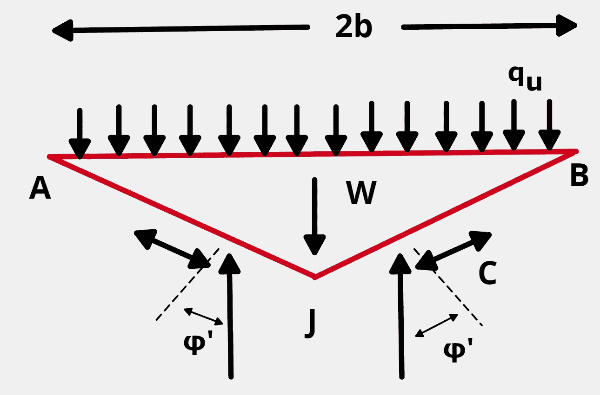
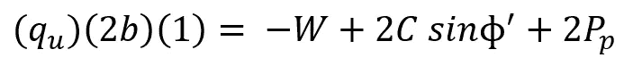
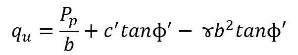
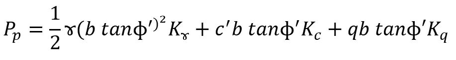
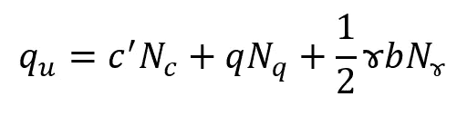

# 太沙基的极限承载力方程是什么？

> 原文：<https://medium.com/nerd-for-tech/what-is-terzaghis-ultimate-bearing-capacity-equation-87322d8239b9?source=collection_archive---------2----------------------->

> 对于作用在楔形土壤上的浅基础和深基础非常重要。给出了楔形土所经历的粗略的比喻应力分布的 Python 实现。

***地基:*** 它是一个结构的最低部分。

***扩展基脚:*** 是承重墙或承重柱的扩大，使得将结构的负荷分散到更大面积的土壤上成为可能。

***垫式基础:*** 低承载能力的土壤要求扩展基脚的尺寸过大。在混凝土垫层上建造整个结构更经济。

> 扩展基础和垫式基础通常被称为浅基础，而桩和钻孔基础被归类为深基础。

## 为什么方程会因为立足点而改变？

当承受重负载时，展开对于在整个区域包含或展开负载是重要的。壁上有剪切应力，意味着有额外的压力作用在荷载上。这叫做内聚力，用 c 表示。

> 值得注意的是，作用在土壤上的荷载是三角形楔形材料的形式。图中的虚线是作用在楔形平面上的法向力。楔子下面和周围的载荷分布形成一个网状网络。

> 上面给出了如何使用 Python 代码以网状网络的形式显示楔形应力分布。

# 方程式

*平衡:在基脚单位长度的方程状态下，荷载和重量之间的平衡对应于作用在土壤上的法向力和粘聚力。*

*被动压力:将上述方程简化为包括土壤的摩擦角，我们将得到单位粘聚力和每个粘聚力面长度的表示。*

*土压力:这里已经定义了土的摩擦角。带 K 的项是土压力系数，它是土壤摩擦角的函数，*φ’。*然后，我们认为被动压力 P(p)是土壤重量、粘聚力和超载(q)的总和，如下所示:*

*贡献:结合上述两个等式，我们得到下面给出的等式:*

