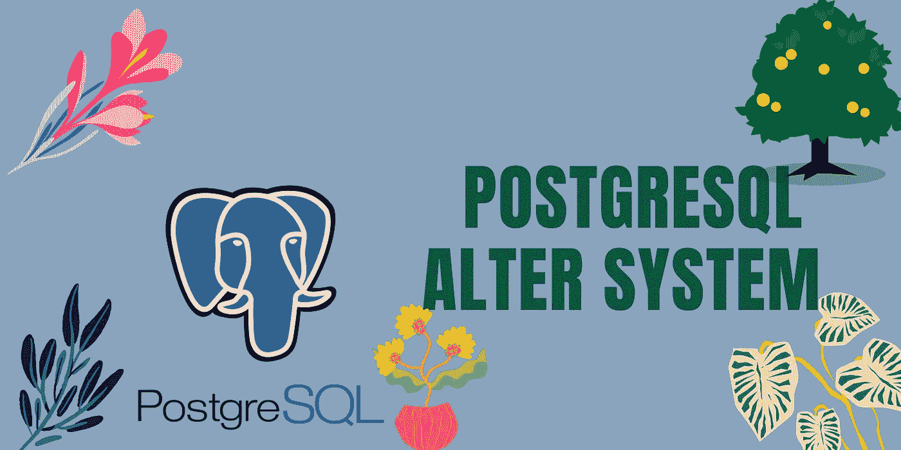

# PostgreSQL 中的 Alter System 是什么？|采访问答

> 原文：<https://medium.com/nerd-for-tech/what-is-the-alter-system-in-postgresql-interview-q-a-a0c046df8eaf?source=collection_archive---------4----------------------->

了解 PostgreSQL 中 alter system 命令的用法

什么是圣坛系统？

*Alter system 是 PostgreSQL 版本 9.4 及更高版本中引入的一个命令，这个特定的命令可以更改配置，并使该更改永久保存在配置文件中。

*如果我们需要在会话级更改配置设置，请使用 SET 命令进行用户级配置更改会话
和数据库级配置设置更改使用更改系统

**在服务器级别更改配置怎么样？**

*通过使用任何文本编辑器编辑 postgresql.conf 文件，我们可以在集群级别更改配置

*让我们考虑一下，作为 DBA，我们没有操作系统级别的访问权限，也就是说，我们不能在 postgresql.conf 配置中打开和进行更改，在这种情况下，我们可以通过 psql 终端和 pgadmin 在数据库中使用 alter 命令

*如果参数需要重启/重新加载，将永久更改配置，只有更改才会永久完成

*它帮助您在不打开 postgresql.conf 文件的情况下更改配置

**它是如何工作的？**

让我们假设我正在使用

> ALTER system SET work _ mem = 20480

*发出该命令后，它将写入新文件，即 postgresql.auto.conf

*它也驻留在集群的数据目录中，默认情况下它是空白的，但是一旦发出 alter system 命令，它不会直接更改 postgresql.conf 中的参数
,而是将这些更改添加到 postgresql.auto.conf 文件中，并且它总是在服务器重启/重新加载期间最后读取

*当我们重新启动我们的服务器或重新加载我们的服务器时，将读取该文件，然后在我们进行任何更改后读取这些文件，这些更改将被重新加载或在重新启动时应用。

*我可以手动更改 postgresql.conf 文件中的值，但不能在 postgresql.auto.conf 上编辑

**重置参数值:**

> alter system set work _ mem = Default；
> 
> 更改系统重置全部:

这将从 auto 中删除。会议文件