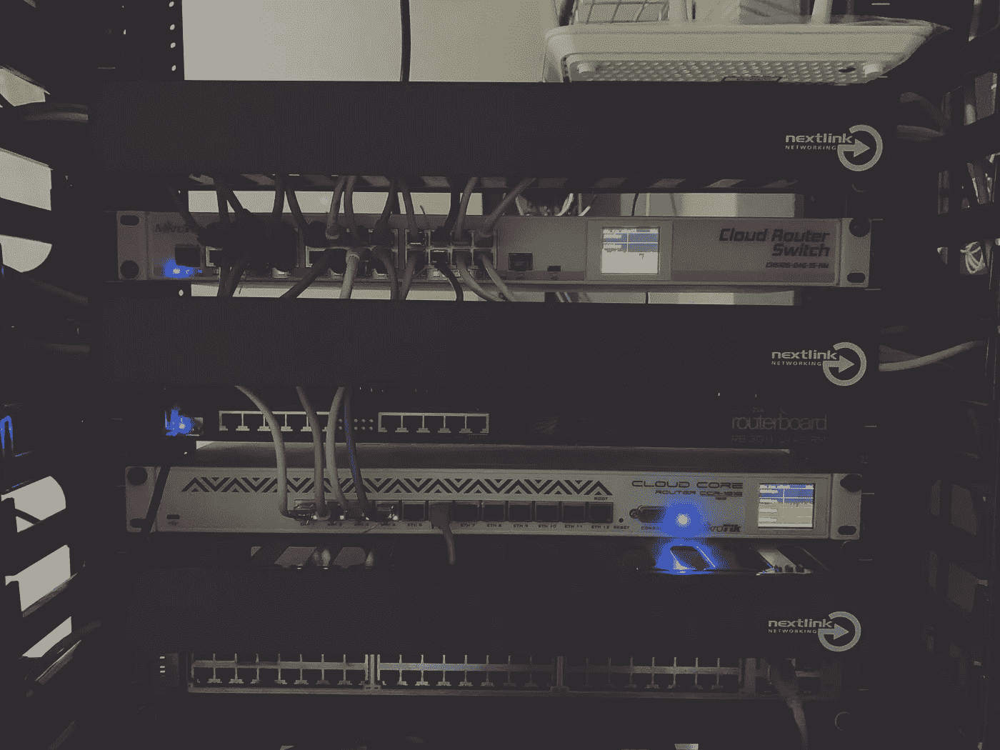
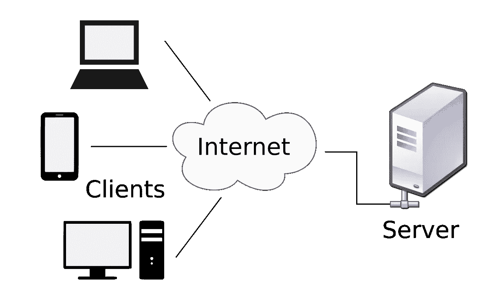

# 什么是客户端-服务器架构？

> 原文：<https://medium.com/nerd-for-tech/what-is-the-client-server-architecture-7f769c101c1f?source=collection_archive---------2----------------------->

客户端-服务器架构是几乎每个 web 应用程序都广泛使用的架构。很少有网络应用程序使用另一种叫做点对点的架构。

客户机-服务器体系结构是 web 的非常基本的构件。整个架构基于请求-响应模型工作。

客户机-服务器体系结构

让我们用基本部分来解释这个架构:什么是客户端？

想想吧。当你加载 youtube 时，你成为客户端(你用来访问 youtube 的设备成为客户端，例如:移动设备、Ipad、装有苹果 M1 芯片的 MacBook Pro[13 英寸、8GB 内存、256GB 固态硬盘])，向 youtube 使用的服务器(他们使用许多服务器)请求一些视频。这就成了客户机-服务器架构！为了简单起见，让我们总结一下。

1.  你加载 youtube(你的设备成为客户端)。
2.  当你加载 youtube 时，一个请求被发送到 youtube 的服务器。
3.  服务器接受您的请求，并向您发送响应。
4.  请求和响应都已完成。

网站使用客户机-服务器架构，客户机向服务器发送信息请求，服务器做出响应。服务器托管、交付和管理客户端使用的大部分资源和服务。

这就是客户端-服务器架构！