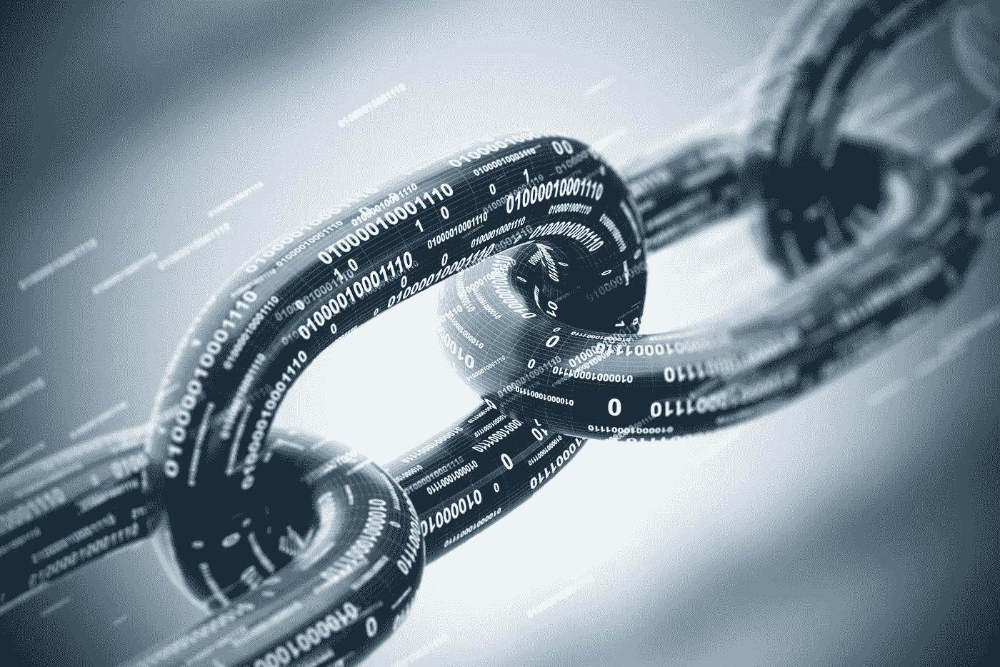
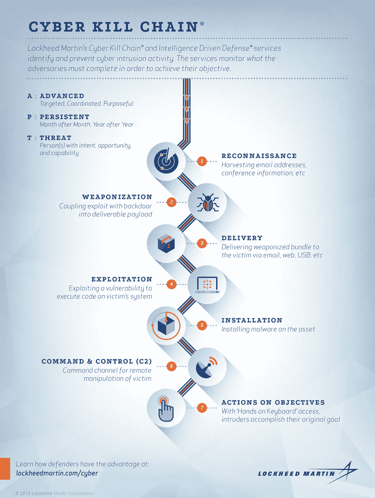

# 什么是网络杀伤链(CKC)？

> 原文：<https://medium.com/nerd-for-tech/what-is-the-cyber-kill-chain-ckc-b6af7541d561?source=collection_archive---------1----------------------->

图像[来源](https://www.e-spincorp.com/what-is-cyber-kill-chain/)

> 防御者不仅减轻脆弱性，还减轻威胁成分或风险。

您可能已经注意到，网络威胁持续上升，预计未来还会继续增加。保护关键资产在所有行业都至关重要，实施网络安全框架可以提供跟踪网络攻击各个阶段的能力。**高级持续威胁** (APT)是“资源充足、训练有素的对手，他们实施网络攻击，目标是高度敏感的经济、专有或国家安全信息”。像网络杀伤链这样的模型提供信息来更好地保护一个组织。随着威胁参与者变得越来越复杂和有效，传统的入侵检测/防御系统(IDS/IPS)已经不足以应对当今的威胁形势。

**网络杀伤链**是由 Lockhead Martin 创建的网络安全模型，允许组织利用情报并创建反馈回路，使防御者建立信息优势感。这降低了每次后续入侵尝试成功攻击的可能性。该模型是一种[威胁驱动的防御](https://www.lockheedmartin.com/content/dam/lockheed-martin/rms/documents/cyber/LM-White-Paper-Intel-Driven-Defense.pdf)。我将简要概述 **7 个阶段**中的每个阶段，以便对该模型有一个基本的了解，并深入了解作为一名网络安全专业人员理解该模型的重要性。

理解压井链中的步骤以及如何实施非常重要。这是一个反复的过程，每个阶段都起着至关重要的作用。当你身处真实场景中每一步的战壕中，你会获得更多的实践学习经验。然而，理解理论和获得真实世界的经验一样重要。CKC 需要情报驱动的计算机网络防御，这“需要对入侵本身有一个新的理解，不是作为一个单一事件，而是作为分阶段的进展。”这个模型是强大的，因为“一次缓解打破了链条，挫败了对手，因此对手的任何重复都是防御者必须认识和利用的责任。”缓解策略需要对手花费更多的时间和更多的费用。每一次后续攻击必须是不同的，并允许防御者创建一个战役分析。活动分析利用多个入侵杀伤链随时间推移收集的数据，识别共性和重叠指标。活动分析有助于“确定入侵者的模式和行为，他们的战术、技术和程序( **TTP** )，检测“**他们如何**”操作，而不是具体地“**他们做什么**”

**侦察**

*   这需要网络扫描，收集电子邮件地址，并列举面向公众的材料。程序用于探测网络基础设施，以特定的服务或平台为目标。

**武器化**

*   这包括将利用漏洞的远程访问特洛伊木马(RAT)耦合到可交付的有效负载中。(通常使用自动化工具或武器化工具。)

密码器、打包器和绑定器的使用被用来生成恶意的有效载荷。PDF 和微软文档作为武器化的交付物。

**交货**

*   最常见的是通过电子邮件、web、USB 等向收件人发送恶意有效负载。

电子邮件是分发恶意软件最常见的方法。群发邮件被用来大规模发送恶意电子邮件。

**剥削**

*   安装恶意负载的触发机制
*   利用漏洞在受害者的计算机上执行代码
*   通常针对应用程序或操作系统漏洞

运行一个可执行文件，它运行一个恶意脚本来利用服务(如 Apache Web Server)的漏洞。

**安装**

*   在主机上安装恶意软件，建立持久性，并通过 RAT 或后门在受损主机上站稳脚跟

一旦首次利用成功，就可以安装其他恶意软件，攻击者可以提升他们的权限以获得根用户或管理员权限。

**C2(命令&控制)**

*   从被入侵的主机与对手进行通信，并提供目标环境内部的*手按键盘*访问

C2 可以提供进入系统的后门，并产生远程外壳来监控、收集信息和安装额外的恶意软件。

**目标行动**

*   目标是数据渗透，包括从受害者的环境中收集、加密和提取信息。初始访问可以用作访问其他系统的跳跃点。每个 APT 可能有不同的目标，这就是为什么创建活动分析可以洞察他们的目标，并允许防御者优先考虑他们的安全以减轻这些威胁。

图片[来源](https://cystory-images.s3.amazonaws.com/blog_files/Cyber%20Kill%20Chain%20Infographic.png)

**这有什么关系？**

网络杀伤链之所以被采用，是因为它能有效地帮助组织确定其网络安全战略，并能全面保护他们的系统和敏感数据。在当今世界，攻击者已经侵入了您的网络，尽快检测并减轻损害至关重要。**CKC 帮助组织:**

*   利用威胁情报技术在威胁生命周期的每个阶段检测攻击者
*   防止未经授权的用户访问
*   防止敏感数据被未经授权的用户共享、保存、更改、泄露或加密
*   实时响应攻击
*   阻止攻击在网络中的横向移动

这种 CKC 是一个迭代过程，需要进行分析和实施，以便更好地了解攻击者和缓解策略，从而保护他们的环境。所有这些信息都有助于保护整个组织。保护组织的关键参与者，如威胁情报、反向恶意软件工程师和分析师、SOC、NOC 和网络管理员，都可以通过实施网络杀伤链受益，因为它提供了有关威胁参与者和目标的更多信息。

> 这种方法的制度化降低了对手成功的可能性，为网络防御投资和资源优先化提供了信息，并产生了相关的性能和有效性指标。

**来源**:

> 众筹。“什么是网络杀伤链？入门指南:Crowdstrike。”crowdstrike.com。2022 年 3 月 29 日众筹。https://www . crowd strike . com/cyber security-101/cyber-kill-chain/#:~:text = Role % 20 of % 20 the % 20 cyber % 20 kill % 20 chain % 20 cyber security&text =阻止% 20 access % 20in % unauthorized % 20 users，a % 20 攻击者% 20 in % 20 网络。

放大图片作者:Eric M .通过对手活动和入侵杀伤链分析，情报驱动的计算机网络防御，2011 年。[https://www . Lockheed Martin . com/content/dam/Lockheed-Martin/rms/documents/cyber/LM-White-Paper-Intel-Driven-defense . pdf](https://www.lockheedmartin.com/content/dam/lockheed-martin/rms/documents/cyber/LM-White-Paper-Intel-Driven-Defense.pdf.)