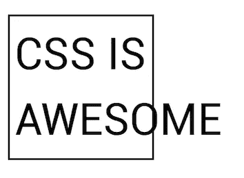

# 什么:交易是()吗？用:is()伪类简化 CSS

> 原文：<https://medium.com/nerd-for-tech/what-is-the-deal-simplifying-css-with-the-is-pseudo-class-e2116dbadf4f?source=collection_archive---------19----------------------->



在我们通往 web-developer good 的旅途中，我们中的许多人都曾在某个时候不得不面对 CSS 选择器的微妙的令人抓狂的本质。将元素链接在一起以获得我们想要的特定结果可能会成为这些小麻烦之一，我将向您展示如何通过一个巧妙的技巧让它变得不那么乏味。请随意点击我的代码沙盒链接，这里有更好的视觉帮助。

举例来说，假设您真的希望页眉中的两个特定元素是漂亮的红色耐火砖。在我们的例子中，我们想要“你好，多么美好的一天！”和“好吧，我们开始吧！”。为了在没有多个 CSS 规则的情况下做到这一点，我们通常必须使用一个复合选择器，并做类似这样的事情:

```
--- HTML ---<header>
 <h1>Hello, what a wonderful day!</h1>
 <span>Are you ready to learn about pseudo-classes?</span>
 <span><strong>Well, let's get started!</strong></span> 
</header><section>
 <span>This is another spaaaan.</span>
</section> --- CSS ---header h1, header strong{
    color: firebrick; 
}
```

这里，我们从 header 标签中获取 h1，因为我们在整个页面中有多个跨度，所以我们获取 header 的 strong 标签，以便更加具体。尽管这是完全有效的 CSS，而且通常非常有用，但它也存在一些问题。

首先，它有可能变得很长，这取决于选择器的数量和特异性的水平。其次，当将 CSS 选择器链接在一起时，单个错误/无效的选择器将导致整个 CSS 规则集中断和无法呈现。

```
--- CSS ---/* Oh no, your tired programmer brain made a typo in "strong" that messes up the entire rule! */ header h1, header :strong{
    color: firebrick; 
}/* This is quite different than a CSS declaration error (what's inside the brackets). If we did something like seen below, everything up until the error (font-size) will still render. */header h1, header strong{
    color: firebrick; 
    margin-bottom: 10px;
    font-size: "I'm LARGE!!!!"
}
```

在 [:is()伪类](https://developer.mozilla.org/en-US/docs/Web/CSS/:is)出现的地方，我们可以这样写，而不是像上面那样写我们的复合选择器:

```
header :is(h1, strong){
    color: firebrick 
}
```

但是有什么区别呢？为了进行更明显的比较，想象一下，如果最初的标题选择器有更多的后代，它可能看起来像这样:

```
/* Original Syntax */header h1, 
header strong, 
header img, 
header .btn, 
header p {
    color: firebrick; 
    margin-bottom: 10px;
    font-size: "Hello world!!!!"
}/* :is() Syntax, equivalent to above */header :is(h1, strong, img, .btn, p){
    color: firebrick: 
    margin-bottom: 10px;
}
```

使用这种语法，您只需要列出父选择器一次，然后在括号中提供您的后代。此外，即使您的后代选择器中有一个错误，其余的选择器也会正确呈现。

```
header :is(h1, strong, :img, .btn, :p){
    color: firebrick: 
    margin-bottom: 10px;
}/* Even though both **img** and **p** invalid selectors, the **h1**, **strong**, and **.btn** class will all still function correctly. */
```

这不仅要用于父代和后代，还可以用于单独对选择器进行分组。我认为这比上面的用途更实际。

```
:is(header, .card, small) p:hover {
    color: red;
}/* code below is equivalent to the code above */header p:hover, 
.card p:hover, 
small p:hover, {
    color: red;
}
```

我们在这里说，所有的 p 标签，无论是在一个标题标签，在一个类别的卡，或在一个小标签将是红色的悬停。本质上，is()函数将一个选择器列表作为它的参数，并将它们组合在一起，然后您可以根据需要分配属性。这是一个相对较新的 CSS [伪类](https://www.w3schools.com/css/css_pseudo_classes.asp)，并且是让你的页面更加[干燥](https://en.wikipedia.org/wiki/Don%27t_repeat_yourself)和可读的一个很好的技巧。

**注意:**使用:is()语法时要记住的一件事是选择器层次结构。假设我们有一个卡片类，我们希望这个卡片中的特定选择器是绿色的。但是后来我们忘记了我们做了这些，我们试图让这些相同的元素变成不同的颜色。如果一个或多个选择器具有更高的优先级，由于选择器的层次结构，这将不起作用。

```
 .card :is(.title, small){
    color: green;
}/* Because of the 'title' class in the brackets (classes have more priority than vanilla tags), the one above takes priority. */.card small{
    color: blue;
}
```

记住所有这些，享受让你的 CSS 内部和外部一样漂亮的乐趣吧！