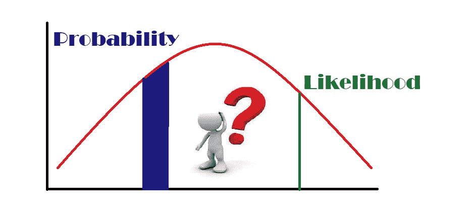
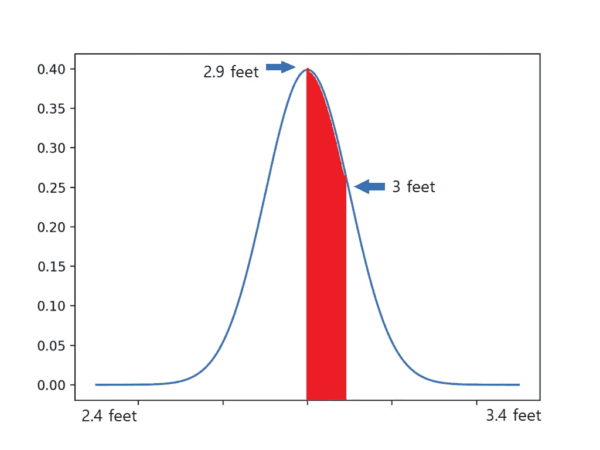
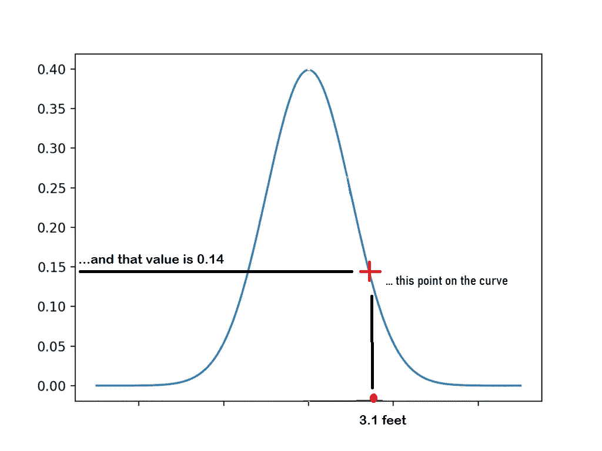
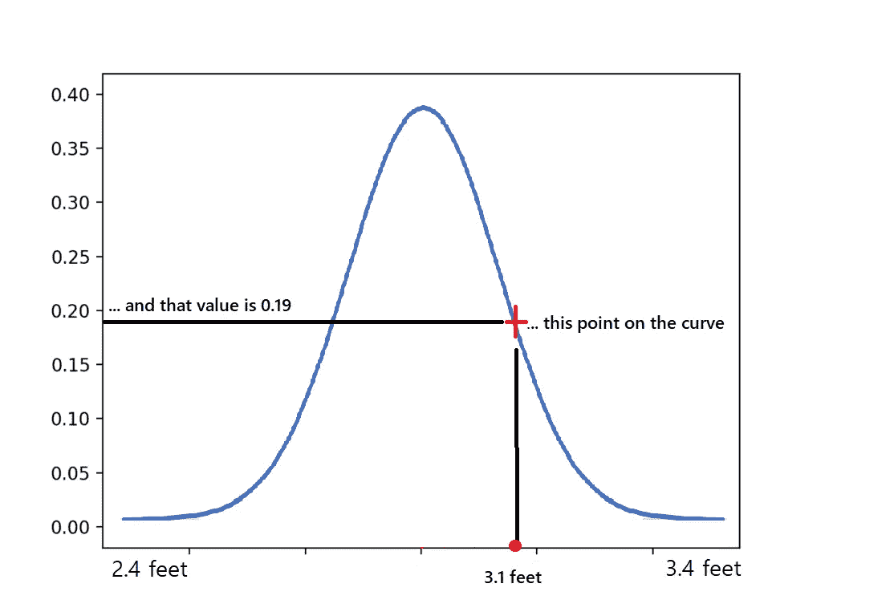

# 概率和似然的区别是什么？

> 原文：<https://medium.com/nerd-for-tech/what-is-the-difference-between-probability-and-likelihood-9a1caafcf921?source=collection_archive---------0----------------------->

让我们通俗易懂地理解这两个统计学术语吧！！

对我来说，可视化很容易理解，所以我将尝试使用简单的可视化来区分概率和可能性。下面的解释适用于所有的连续分布，但是现在，让我们从正态分布的概率开始。

**举例:**

让我们假设下面的分布是 3 岁孩子的身高。在低端，我们有 2.4 英尺，在高端，我们有 3.4 英尺。它的平均高度为 2.9 英尺，标准偏差为 0.5。

我们将在 2.9 和 3.0 英尺之间随机选择一个高度称重的**概率**是 2.9 和 3.0 英尺之间的曲线下面积。

在这种情况下，曲线下的面积= 0.21，这意味着随机选择的 3 岁儿童有 21%的可能性身高在 2.9 到 3.0 英尺之间。

从统计学上来说，我们用下面的符号来表示，

Prob(身高在 2.9 英尺和 3.0 英尺之间|平均值= 2.9，标准偏差=0.5) = 0.21，即假设分布的平均值为 2.9，标准偏差为 0.5，则 3 岁儿童身高在 2.9 英尺和 3.0 英尺之间的概率为 21%。

下面等式中突出显示的部分可以根据我们的研究要求进行更改。

Prob( ***身高在 2.9 英尺和 3.0 英尺之间*** |均值= 2.9，标准差=0.5) = 0.21

例如:如果我们想找出一个 3 岁小孩的身高大于 2.9 的概率，那么等式如下:

Prob( ***身高> 2.9 英尺*** |均值= 2.9 标准差=0.5) =？？

其中平均值和标准偏差是相同的。

现在让我们在相同的上下文中讨论**可能性**。

从可能性开始，我们假设我们已经知道了我们 3 岁的孩子 3.1 英尺高的替补演员的身高。

3.1 英尺高的孩子的可能性是下图中曲线上的点，该值是 0.14。

从统计学上来说，我们用下面的符号来表示:

可能性(平均值= 2.9，标准偏差= 0.5 | 3 岁儿童的身高为 3.1 英尺)=0.14

给定一个 3 岁小孩的身高为 3.1 英尺，均值为 2.9、标准差为 0.5 的分布的可能性等于 0.14。

如果我们改变分布，使平均值为 2.7，标准偏差为 0.7，那么新的可能性就是 0.19。

因此，概率是固定分布下的面积…

统计学上，概率(数据|分布)

可能性是分布可以移动的固定数据点的 y 轴值…

统计学上，可能性(分布|数据)

感谢你阅读❤

对于任何建议或疑问，请在下面留下您的评论，并关注更新。

如果你喜欢这篇文章，请点击👏图标来支持它。这将有助于其他媒体用户找到它。分享一下，让别人也能看！

快乐学习！😊