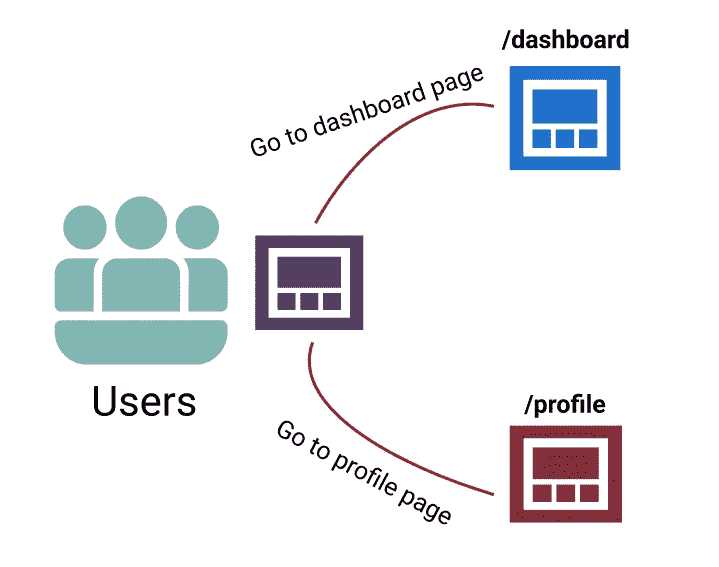
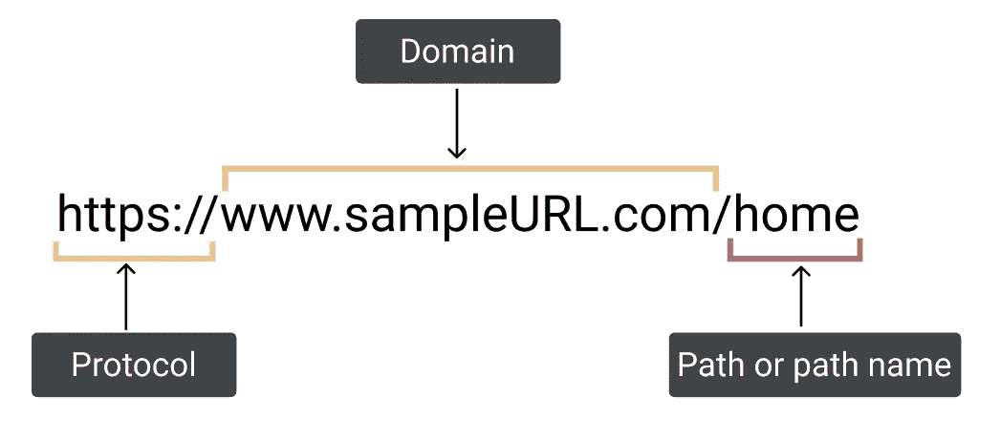
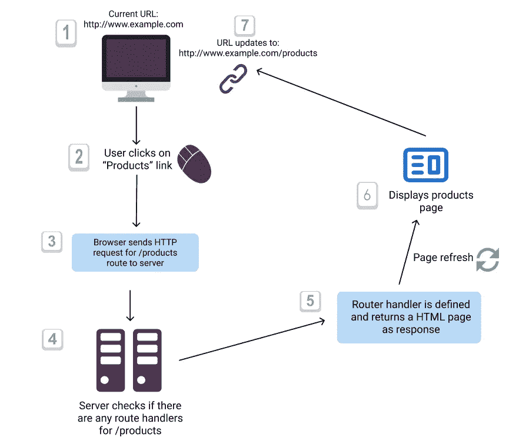
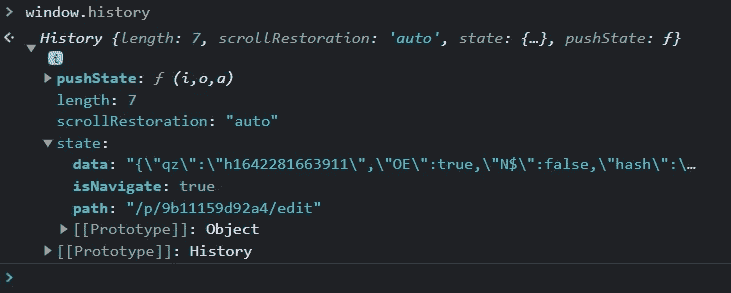
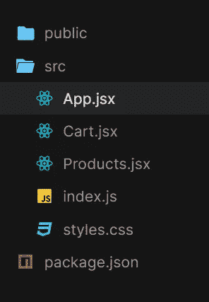
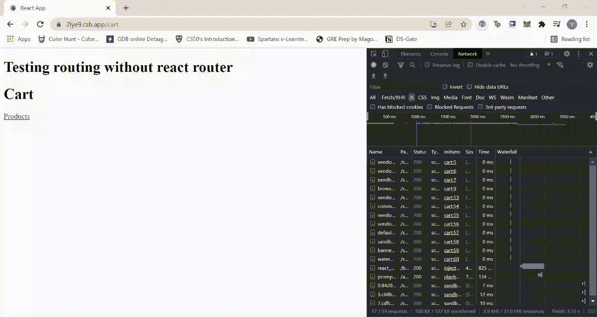
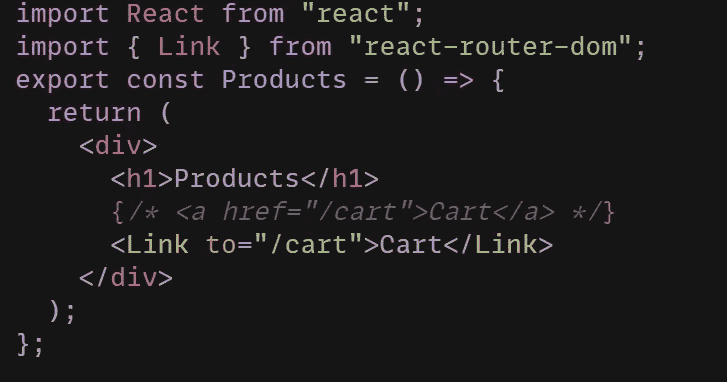
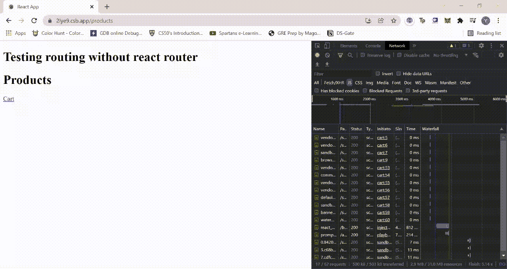
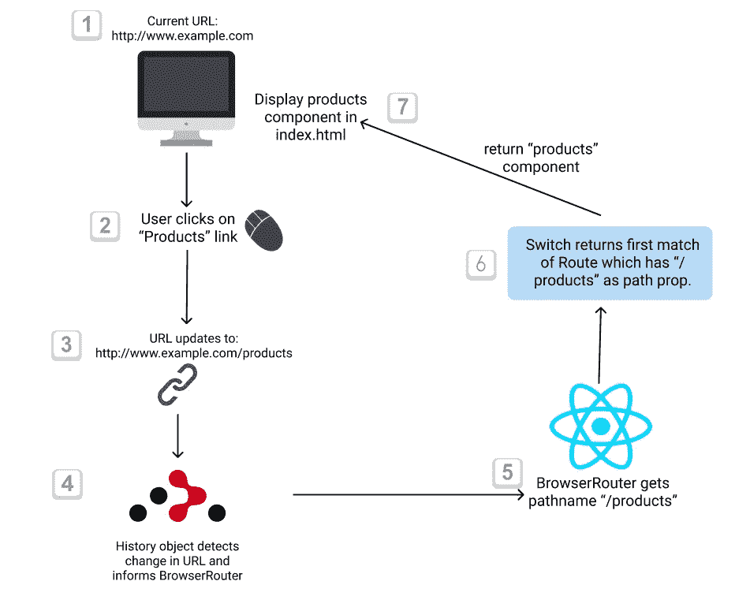

# React 路由器和常规路由有什么区别？

> 原文：<https://medium.com/nerd-for-tech/what-is-the-difference-between-react-router-and-conventional-routing-9b11159d92a4?source=collection_archive---------0----------------------->

# 介绍

web 开发中的路由构建了一个基于用户活动向用户显示的 web 页面流。通过路由，我们可以确保不同协议的请求被定向到为处理它们而编写的代码，以及应用程序应该如何响应客户端请求。

现在，实现路由可能取决于您正在使用什么框架/语言来开发您的应用程序。例如在 NodeJS 中，express。Router()用于创建处理请求的路由器对象。同样，Django 使用正则表达式处理 urls.py 文件中的 URL 路由，React 使用 React 路由器库进行路由。

然而，一个问题出现了，“为什么有用于路由的库，它们与通常的方式有什么不同？”

在本文中，我们将找到这个问题的答案，以及 React 路由器与传统路由有何不同。



路由允许用户导航和处理客户端对信息显示等操作的请求。

# 什么是“常规路由”？

在 web 应用程序中，用户可以借助导航栏中提供的链接或表单中提供的提交按钮来访问不同的页面。当用户点击这样的链接或按钮时，显示就会改变，URL 也会更新。

URL 的结构可以理解如下:



URL 的结构

每次点击一个链接，域名保持不变，但路径发生了变化。例如，当用户点击“注册”按钮时，URL 变为 https://www.sampleURL.com/register，当点击“登录”按钮时，URL 变为 https://www.sampleURL.com/login.

现在，每当 URL 发生变化时，浏览器的默认行为就是向应用程序的服务器发出请求。服务器检查 URL 中的路径名，并相应地用一个新的 HTML 页面进行响应。

服务器根据 URL 的路径名处理客户端请求的过程被称为**传统路由**。

为了进一步理解这一点，请考虑在浏览器中输入的以下 URL:

http://www.example.com/products

**在常规布线中，以下过程发生在引擎盖下:**

1.  **URL 的【http://www.example.com】部分用于定位该网站的服务器，**/产品**暗示一条路线。**
2.  **因此，整个 URL 可以被视为对“示例”服务器的 HTTP GET 请求，其中服务器中定义的路由器开始工作。**
3.  **路由器检查为处理“/products”路由请求而定义的任何功能/方法。如果路由器识别出这种功能的存在，则 HTTP 请求被定向到该功能。**
4.  **为处理各种路由的客户端请求而定义的函数被称为“**路由处理程序**”。现在，路由处理器的工作是返回合适的响应(产品页面)。**
5.  **来自服务器的新内容的响应导致浏览器刷新。浏览器重新加载以转储以前的 HTML 文件，并显示来自服务器的新文件。**
6.  **该 URL 还更新为[**【http://www.example.com/products】**](http://www.example.com/products)**，以便用户知道当前位置。****

****这整个过程被称为 ***传统路由或服务器端路由*** 。****

********

****查看产品页面的服务器端路由示例****

****关于上面示例中的服务器端路由，需要注意以下几点:****

*   ****服务器端请求相当于从服务器请求一个新的网页。对于使用服务器端路由的应用程序，每次用户单击页面中的链接或在浏览器中输入新的 URL 时，路由处理程序都必须返回一个新的文档来响应请求。****
*   ******服务器端路由导致整个页面刷新**，因为服务器用一个新页面响应。****
*   ****由于服务器端路由导致整页刷新，**从服务器请求不必要的数据**。如果只需要改变按钮的颜色作为对请求的响应，那么像页眉或页脚这样没有改变的组件就必须重新呈现。****
*   ****由于页面刷新，数据将在不同的时间加载，这对用户来说不是一个好的 UI。****

******因此，在常规路由中显示响应可能需要一段时间**。****

****我们如何克服这个缺点，使渲染时间减少并保持不变，并且整个页面不必刷新？在这个路由过程中，我们可以改进什么，以使 UI 的显示是无缝的，而不是每次刷新都加载持续的“空白”页面？这就是客户端路由或 React 路由器库发挥作用的地方。****

# ****客户端路由****

****在客户端路由中，每当请求路由时，**该请求不会被发送到服务器**。相反，页面上加载的 Javascript 处理路由过程。****

****客户端路由在“单页应用程序”中很流行，单页应用程序是单个 HTML 文件，HTML 文件的内容被分成“组件”。****

****与向服务器发送请求的传统方法不同，页面上加载的 Javascript 会拦截该请求，并执行以下过程:****

1.  ****URL 的变化是通过网页的 Javascript 代码来检测的，URL 的变化意味着应用的状态发生了变化。****
2.  ****改变的状态意味着网页的视图也必须被更新以与 URL 保持同步。****
3.  ****可以通过显示新的组件、更新已经显示的组件或者通过向服务器发送对来自数据库的数据的请求然后显示该数据来更新网页。****
4.  ****由于只有网页的一部分被更新， ***这意味着整个页面不会被刷新*** 。只有网页中的一些元素被改变。****

****因此，客户端路由不会导致每次更新 URL 时都刷新页面。****

# ****反应路由器****

********

****反应路由器****

****React router 是 React 中用于路由的标准库，并在网页中的各种组件之间提供平滑导航。React router 使用客户端路由，并提供 API 来操作历史堆栈，将路径名与定义的路由进行匹配，并在当前 URL 中显示与路径名匹配的组件。****

## ****React 中的声明性路由****

****你可能听说 React 允许我们用**“声明式路由”**构建应用程序，但是到底什么是声明式路由呢？****

****React 允许开发者使用 URL 中的 pathname 作为呈现组件的**条件。这意味着当 URL 改变时，路由被动态初始化。与静态路由不同，在静态路由中，路由必须与路由处理程序一起预先定义，React 允许我们有条件地加载不同的组件，而不会扰乱页面布局或加载新页面。******

****管理用户在浏览器上导航的一个重要概念是**浏览器历史堆栈**，这必须在讨论 React 路由器之前讨论。****

## ******历史堆栈******

****历史堆栈是用户访问的所有位置的堆栈，由浏览器维护。左上角的前进和后退按钮在历史堆栈的帮助下操作。**客户端路由允许开发人员在浏览器历史堆栈中进行更改**。如果用户点击一个链接，只需将新的路径名推送到堆栈上，并更改 URL。****

****浏览器历史可以通过 **window.history** 操作。功能包括:****

*   ****window.history.pushState()****
*   ****window.history.popState()****
*   ****window.history.replaceState()****

****负责添加、替换或返回堆栈中的位置。****

****通过右键单击->inspect 并键入 window.history 转到控制台。当我编辑这篇文章时，输出如下:****

********

****编辑媒体文章时的 window.history 输出****

********

****该路径与我的 URL 匹配****

****除了 window.history，还有 window.location，它告诉“用户当前在哪里”。您可以在您的控制台中尝试定位，就像我们对 window.history 所做的那样****

****现在你可能会疑惑，当窗口对象本身就可以为我们提供客户端导航的方法的时候，**像 React Router 这样的路由库有什么用？******

## ******为什么要 React 路由器？******

****浏览器的问题是它没有一个方法让**监听 URL** 的任何变化。在 window.history 函数的帮助下，我们可以更改 URL，但是组件不会被呈现，数据请求也不会被发送到后端。仅仅改变 URL 是不够的，我们必须编写更多的代码来检测 URL 的变化，然后显示组件。****

****React Router 定义了以下 APIs 包，使开发人员能够轻松发布历史堆栈中的更改，使用 URL 更改更新应用程序的状态，并显示正确的 UI:****

*   ******历史对象**:React 路由器的历史对象提供了检测 URL 变化的方法。它负责报告 URL 更改，以便可以加载和显示适当的路由组件。****
*   ******BrowserRouter** :这是一个基本路由器，它使用 HTML5 历史 API，因此显示给用户的 UI 与 URL 同步。这是必要的，因为它增加了路由组件的能力。****
*   ******Switch** : < Switch >功能类似于 Javascript switch 语句。BrowserRouter 提取的路径名被传递给<开关>。开关呈现路径与 URL 匹配的第一个路由。在 Switch 的帮助下，对于应该为哪条路线显示哪些组件，不会出现模糊或混乱。****
*   ******路由**:这是 React 路由器中最重要的组件。它的功能是当当前 URL 匹配其路径时显示特定的 UI。****
*   ******链路** : ***<链路>负责 React 路由器提供的声明式路由。*** 当用户点击<链接> ( <链接>在 UI 中显示为<一个>标签)时，服务器渲染新 HTML 页面的默认请求被阻止。<链接>仅导致 URL 改变。历史对象侦听 URL 更改，并将其传递给基本路由器以进行进一步路由。****

****下面是一个 React 应用程序的示例，演示了使用锚元素()进行传统路由和使用<link>进行 React 路由的路由。****

## ******<一个>标签在 React(页面刷新)******

****考虑具有以下目录结构的 React 应用程序的以下代码:****

********

****在该应用中，我们有以下组件:****

1.  ****Cart.jsx 中的 Cart 组件，它包含产品组件的链接。****
2.  ****Products.jsx 中的 Products 组件，它包含一个购物车组件的链接。****
3.  ****这两个组件都导入到 App.jsx 中。****
4.  ****不要忘记安装“***react-router-DOM***”。我们将使用这个库的 API 进行路由。****

****以下是 3 个文件的代码:****

```
**//App.jsx
import React from “react”;
import { BrowserRouter, Route, Switch } from “react-router-dom”;
import { Products } from “./Products.jsx”;
import { Cart } from “./Cart.jsx”;
export const App = () => {
return (
    <div className=”App”>
    <h1>Testing routing without react router</h1>
    <BrowserRouter>
        <Switch>
            <Route path=”/products”> 
                <Products />
            </Route> 
            <Route path=”/cart”>
                <Cart />
            </Route>
        </Switch>
    </BrowserRouter>
    </div>
);
};**
```

****Products.jsx 代码:****

```
**//Products.jsx
import React from “react”;export const Products = () => {
return (
    <div>
        <h1>Products</h1>
        <a href=”/cart”>Cart</a>
    </div>
);
};**
```

****Cart.jsx 代码:****

```
**//Cart.jsx
import React from “react”;export const Cart = () => {
return (
    <div>
        <h1>Cart</h1>
        <a href=”/products”>Products</a>
    </div>
);
};**
```

****当我们在浏览器中查看输出时，通过右键单击->检查选项打开网络选项卡。现在请注意，每当您单击“产品”或“购物车”链接时，都会发生以下情况:****

*   ****页面刷新。****
*   ****每次都会向运行在终端上的服务器发送一个新的请求，并加载整个 HTML 页面。您可以在下面输出中右侧的网络部分观察到这一点****

********

****每次 URL 更改时，页面都会不断刷新。****

****为什么会这样？？这是由于我们用来路由组件的锚元素()的行为。为了充分利用 React Router，**我们必须使用< Link >而不是< a >，因为这只会导致历史对象检测到的 URL 更改。******

******使用 React 路由器**中的<链路>****

****我们将简单地用<link>组件替换 Product.jsx 和 Cart.jsx 中的锚元素，并再次在浏览器中查看输出。****

********

****Cart.jsx 代码变更:用<link>替换****

********

****Product.jsx 代码变更:用<link>替换****

********

****请注意，使用<link>不会刷新页面和重新加载整个 HTML 页面****

****瞧啊。如您所见，无需刷新页面，您就可以在产品和购物车之间切换。****

****这不仅增强了用户体验，而且通过给用户一种正在显示“多个”网页的感觉而提高了应用程序的性能，而实际上这只是具有各种组件的单个页面。****

****当用户点击“产品”链接时，使用 React 路由器路由的过程是:****

1.  ****URL 更新为[**http://www.example.com/products.**](http://www.example.com/products.)**React 路由器的历史对象检测到 URL 的这种变化。******
2.  ******history 对象通知 browser router URL 的变化。BrowserRouter 提取路径名“/products”并将其传递给 React 路由器的交换机。******
3.  ******路径名“/产品”根据交换机中定义的不同“路由”的“路径”属性进行测试。******
4.  ******<switch>返回路径为“/产品”的“路线”，与该路线相关的组件被加载到 index.html 文件中。</switch>******
5.  ******因此，在浏览器没有向服务器发送任何请求的情况下，产品页面在没有刷新的情况下显示。******

************

******React 路由器工作，而不是在加载内容后更新 URL(像在服务器端路由中)，URL 首先更新，并基于 URL 加载组件。******

# ******结论******

******希望您能够理解 React 路由器与传统路由的不同之处。服务器端路由和客户端路由各有利弊，根据您项目的目标，您可以决定使用哪种方法进行路由！******