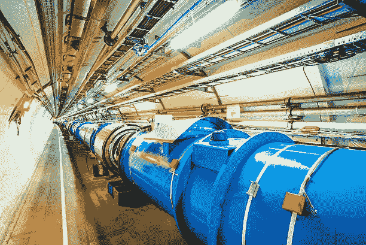

# 什么是大型强子对撞机？

> 原文：<https://medium.com/nerd-for-tech/what-is-the-large-hadron-collider-38359ec0089f?source=collection_archive---------3----------------------->

# 描述

大型强子对撞机(LHC)是迄今为止建造的最强有力的粒子加速器。LHC 运行的能量是以前任何机器的 7 倍。它成立于瑞士日内瓦附近的欧洲粒子物理实验室 CERN。

欧洲核子研究中心是世界上最大的实验室，致力于基础科学的研究。大型 Hardon 对撞机允许科学家通过高能质子束的高速碰撞来复制大爆炸后十亿分之一秒内的情况。巨大的速度接近光速。

大约 137 亿年前，这是宇宙被认为开始于能量和物质爆炸的时刻。所有形成我们宇宙的粒子和力都是在这些最初的时刻形成的，对我们现在所看到的是至关重要的。

# 背景

强子一词表示由夸克组成的亚原子复合粒子，这些夸克由强相互作用组成。最著名的强子是像质子和中子一样的重子；强子还包括介子，如π介子和 k 介子，它们是在 20 世纪 40 年代末和 50 年代初的电离辐射实验中发现的。

对撞机可能是一种带有两条定向粒子束的加速器。在高能物理学中，对撞机被用作搜索工具:它们将粒子加速到非常高的动能，并允许它们撞击其他粒子。对这些碰撞副产品的分析为科学家们提供了亚原子世界结构的有力证据，因此也是支配它的自然法则的有力证据。这些副产品中的许多只是由高能碰撞产生的，并且它们在你的时间的非常短的时期之后衰变。因此，他们中的许多人很难或几乎不可能以其他方式进行审查。

# 驱动力和目的

许多物理学家希望大型强子对撞机将有助于回答物理学中的一些基本公开问题，这些问题涉及基本物体之间相互作用和作用力的基本规律，空间和时间的深层结构，特别是量子物理学和广义相对论之间的相互关系。

还需要来自高能粒子实验的数据来表明当前科学模型的哪个版本更有可能是正确的——特别是在质量模型和无希格斯粒子模型之间做出决定，并验证它们的预测和允许进一步的理论发展。

**LHC 碰撞探索的问题包括:**

*   基本粒子的质量是希格斯机制通过电弱对称破缺制造出来的吗？对撞机实验可能会证明或者排除难以捉摸的希格斯玻色子的存在。
*   超对称是质量模型和庞加莱对称的延伸，在自然界中实现了吗，这意味着每个已知的粒子都有超对称的伙伴？
*   正如各种支持弦理论的模型所预测的那样，是否存在额外的维度，我们可以探测到它们吗？
*   看起来占宇宙质量能量 27%的物质是什么性质？

将使用高能粒子碰撞探索的其他未决问题:

*   众所周知，电磁力和弱核力是一种叫做电弱力的力的不同表现。正如各种大统一理论所预言的那样，LHC 可以简化电弱力和强核力是否同样只是一种宇宙统一力的不同表现。
*   为什么第四种基本力(引力)比相反的三种基本力弱无数个数量级？参见等级问题。
*   除了质量模型中已经存在的以外，还有其他夸克味混合的来源吗？
*   夸克胶子等离子体被认为存在于早期宇宙和今天某些致密而奇怪的天体中，它的特征和性质是什么？这可以通过重离子碰撞来研究，主要是在 ALICE，但也在 CMS，ATLAS 和 LHCb 中。2012 年发表的研究结果证实了重离子碰撞中的喷流猝灭现象。

# 革命性的研究

LHC 已经为它的两个主要实验，ATLAS 和 CMS，一起粉碎了原子，这两个实验在过去的 10 年里分别操作和分析他们的数据。这通常是为了确保任何一个合作都不会影响相反的实验，每个实验都提供了对其姐妹实验的检查。这些仪器已经在基本粒子物理学的许多领域产生了大约 2，000 篇科学论文。

2012 年 7 月 4 日，当 LHC 的研究人员宣布发现希格斯玻色子时，科学界屏息以待，希格斯玻色子是 50 年前被称为物理质量模型的理论中的最后一块拼图。[质量模型试图解释所有已知的粒子和力及其相互作用](https://www.technologiesinindustry4.com/)。英国物理学家彼得·希格斯写了一篇关于现在以他的名字命名的粒子的论文，解释了 1964 年宇宙中质量是如何产生的。

希格斯场实际上是一个弥漫整个空间的场，它会拖拽每一个穿过它的粒子。一些粒子在扇区中行进得更慢，这与它们更大的质量相对应。希格斯玻色子可能是这个领域的一种表现，物理学家已经追逐了半个世纪。公开建造 LHC 是为了最终捕获这个不确定的猎物。最终发现希格斯粒子的质量是一个质子的 125 倍，彼得·希格斯和比利时理论物理学家弗朗索瓦·恩格勒因预测其存在而获得了 2013 年诺贝尔奖。

更多详情请访问:[https://www . technologiesinindustry 4 . com/2020/12/what-is-large-hadron-collider . html](https://www.technologiesinindustry4.com/2020/12/what-is-large-hadron-collider.html)