# 什么是标准正态分布，我们如何解读？

> 原文：<https://medium.com/nerd-for-tech/what-is-the-standard-normal-distribution-and-how-do-we-interpret-it-6906b3c8e5c7?source=collection_archive---------0----------------------->

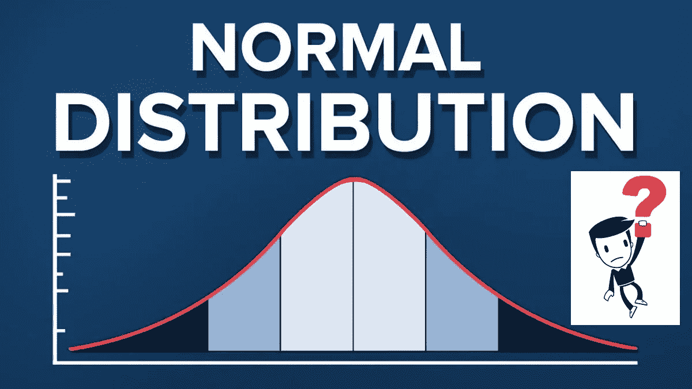

正态概率分布有什么特别的？为什么这么多数据科学和机器学习的文章都围绕正态概率分布？

***机器学习和数据科学的世界围绕着概率分布的概念，概率分布概念的核心是正态分布。*** 这篇文章阐述了什么是正态分布，以及为什么它被广泛使用，特别是对于一个数据科学家和一个机器学习专家来说。

我们有丰富的数据，但数据本身并不有趣。为了增加意义，数据必须被解释。数据可以以不同的方式“分布”(展开)，如下所示:

有些情况下，数据像“钟形曲线”一样分布，数据倾向于围绕一个中心值(即平均值)，没有左偏或右偏，没有多种模式，接近“正态分布”(对称和单峰)。

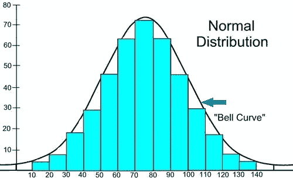

在上面的图表中，“钟形曲线”是一个正态分布，蓝色直方图显示了一些数据，这些数据非常接近但并不完美(这是常见的)。这种分布通常被称为钟形曲线，因为它看起来像一个钟。

## 主要遵循正态分布的示例

1.  血压
2.  班级学生的身高
3.  测量时出错
4.  考试等的分数

## **一些基本术语**

1.  **Mean(μ)** —是数据集的平均值。
2.  **中位数** —是一组数字的中间值。
3.  **模式** —是数据集中最常见的数字(峰值)。单峰分布在分布中只有一个峰，双峰分布有两个峰，多峰分布有三个或更多个峰。
4.  **偏差** —是统计数据高估或低估参数的趋势。

5.**偏斜度** —指一组数据中偏离对称钟形曲线或正态分布的扭曲或不对称。

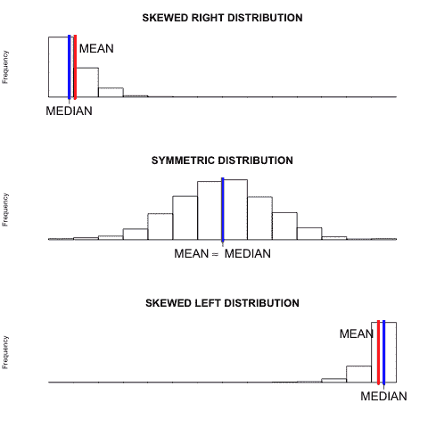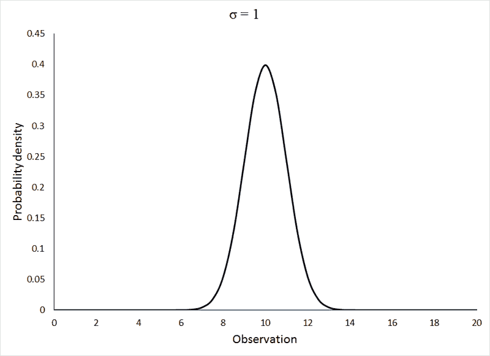

6.**标准偏差(σ)** —是一组值的变化量或离差的度量。低标准偏差表示这些值倾向于接近集合的平均值，而高标准偏差表示这些值分布在更大的范围内。

**班级学生智商得分示例:**

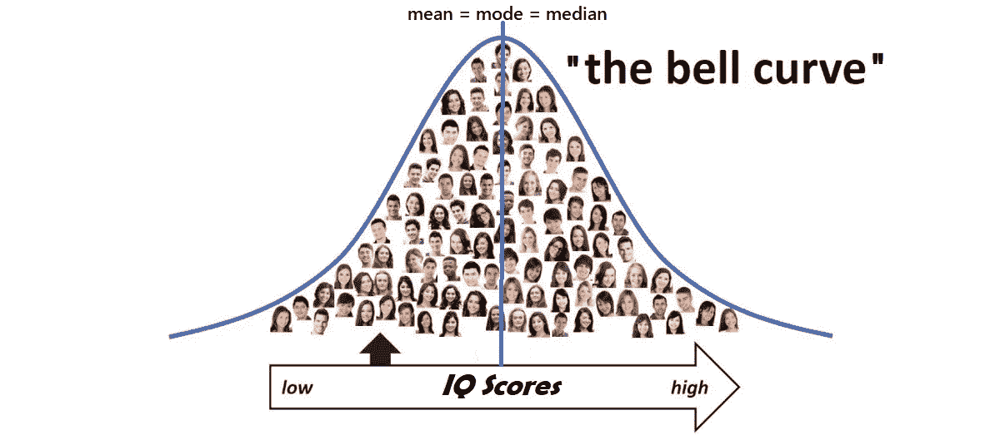

## **正态分布的特征**

*   均值=中位数=众数
*   关于中心对称
*   单峰的
*   50%的值小于平均值，50%的值大于平均值

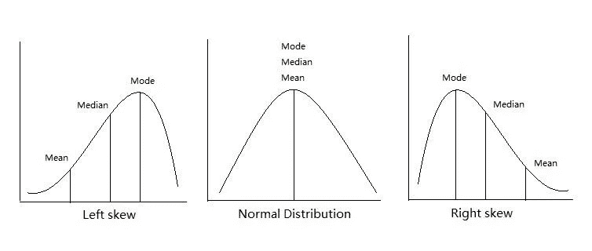

## **正态分布的形状**

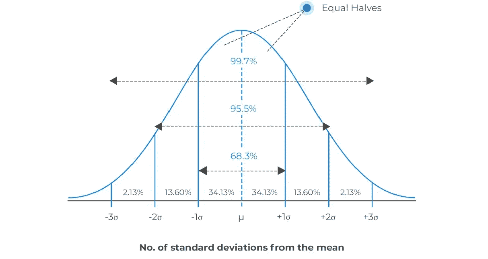

*   **68.3%** 的值在平均值的 **1 标准差** (1σ)内
*   **95.5%** 的值在平均值的 **2 个标准差** (2σ)内
*   **99.7%** 的值在平均值的 **3 个标准差** (3σ)内

知道标准差总是好的，因为我们可以说任何值都是:

*   **可能**在 1 个标准偏差(1σ)内(100 分中应是 68.3 分)
*   **很可能**在 2 个标准偏差(2σ)内(100 分中应该有 95.5 分)
*   **几乎可以肯定**在 3 个标准偏差(3σ)内(1000 个中应该有 997 个)

## 例子

## 95.5%的在校学生在 32 到 98 分之间的测试中得了分。

假设这个数据是正态分布的，我们可以计算平均值和标准偏差

平均值介于 32 和 98 之间:

平均值(μ)= (32+98) / 2 = 65

95.5 %是平均值两边的 2 个标准差(总共 4 个标准差)，所以:

1 标准偏差(σ)=(98–32)/4 = 66/4 = 16.5

# **标准正态分布**

**什么是“Z 得分”？**

平均值的**标准偏差数也称为“标准分数”、“sigma”或“Z 分数”。简单地说，Z 分数描述了原始分数的位置，即以标准差为单位测量时，原始分数与平均值的距离。**

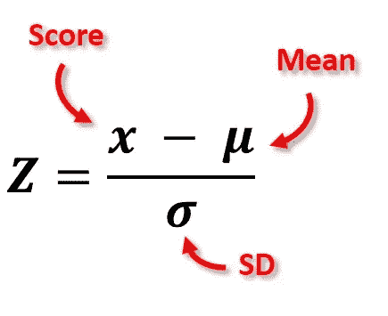

*   **Z** 是“Z 分数”(标准分数)
*   **x** 是要标准化的数值
*   **μ** (mu)是平均值
*   **σ** (sigma)是标准差

Z 得分可置于正态分布曲线上。z 分数的范围从-3 标准差(落在最左边)到+3 标准差(落在最右边)。

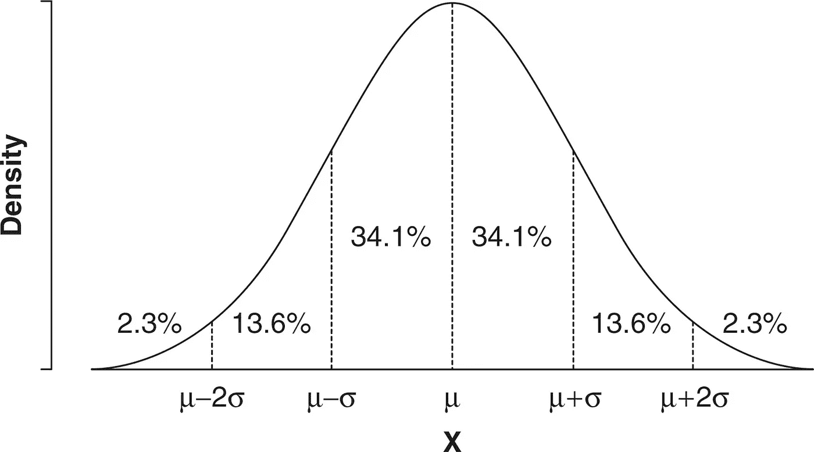

**μ** = 0， **σ** = 1

*   z 分数= 0-表示数据点的分数等于平均分数。
*   z 得分= 1.0-表示平均值的一个标准差。
*   z 分数可以是正值或负值，正值表示分数高于平均值，负值表示分数低于平均值。

## 使标准化

我们可以把任何正态分布转换成标准正态分布。

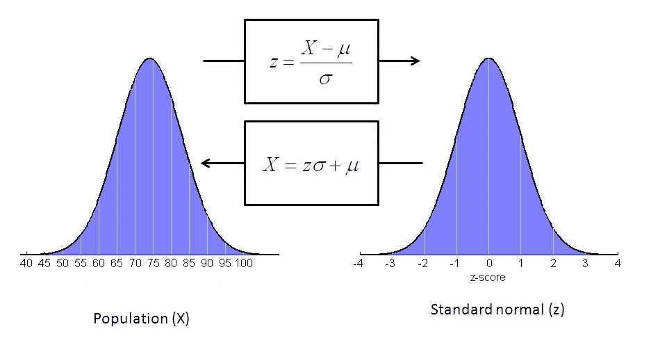

**标准正态分布**，也称为***-分布****，是一种均值(μ)为 0，标准差(σ)为 1 的特殊正态分布，用***【0，1】***表示。*

## ***为什么要规范价值观？***

*让我用一个例子来解释一下。*

*假设你的老师给你的期末考试打 100 分，及格标准是 45 分。*

*以下是你和你的同学的结果:*

***30，** 75 **，26，** 72 **，18，44，35，12，** 56 **，33，28***

*根据上面的分数，大多数人会不及格，只有 3 人会及格！！😰*

*考试一定很难，所以老师决定将所有分数标准化，只给低于平均值 1 个标准差以上的人不及格。😎*

***均值为 39** ，**标准差为 19.4** ，这些是标准分数:*

*-0.46，1.85，-0.67，1.70， **-1.08** ，-0.26，-0.21， **-1.39** ，0.87，0.21，-0.05*

*现在只有 2 个学生会不及格(< -1, the ones lower than −1 standard deviation since σ =1) 😇*

***用标准正态分布求概率***

*标准正态分布是一个**概率分布**，所以两点之间曲线下的面积告诉你变量取值范围的概率。曲线下的总面积为 1%或 100%。*

*每个 *z* 分数都有一个关联的 *p* 值，它告诉你所有低于或高于该 *z* 分数的值出现的概率。这是那个 *z* 分数左边或右边曲线下的区域。*

*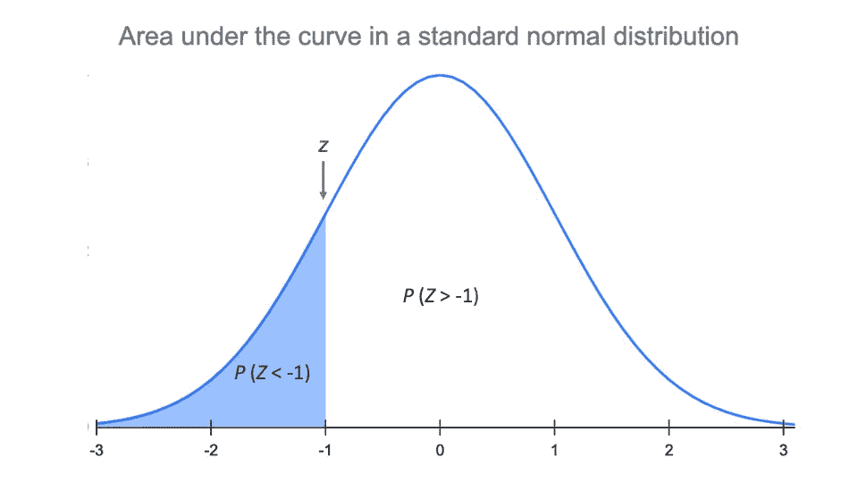*

*这就是正态分布在数据科学和机器学习领域的重要性！！*

*感谢你阅读❤*

*对于任何建议或疑问，请在下面留下您的评论，并关注更新。*

*如果你喜欢这篇文章，请点击👏图标来支持它。这将有助于其他媒体用户找到它。分享一下，让别人也能看！*

*快乐学习！😊*