# 什么是墓碑图？

> 原文：<https://medium.com/nerd-for-tech/what-is-tombstone-diagram-153fae04f613?source=collection_archive---------6----------------------->

**什么是墓碑图？🤔**

T **ombstone 图** (T 图)基本上是用来表示编译器和语言处理程序的片段，就像一些拼图。他们演示了在一个 [**实现语言**](https://en.wikipedia.org/wiki/Implementation_language) (L)中实现的 [**源语言**](https://en.wikipedia.org/wiki/Source_code) (S)到 [**目标语言**](https://en.wikipedia.org/wiki/Target_language_(computing)) (T)的转换。

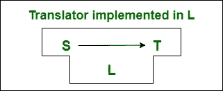

**通过实现语言(L)将源语言(S)转换为目标语言(T)**

它基本上说明了编译器和解释器如何相互合作来开发和执行软件。描述了解释器、编译器和宏处理器的 [**移植**](https://en.wikipedia.org/wiki/Porting)[**自举**](https://en.wikipedia.org/wiki/Bootstrapping_(compilers) 和 [**自编译**](https://en.wikipedia.org/wiki/Self-hosting_(compilers) 的复杂功能。块的**基**总是包含实现语言。

# 背景

T-Diagram 的蓝图最初是由 **McKeeman 等人**在 1971 年提出的，用于启发引导和交叉编译编译器。就其最初的方面而言，梅尔文·康威在 1958 年以他的**展示了一个更广泛的布局。后来，**布拉特曼**和 **P.D .特里**通过教科书将其概念扩展到编译器设计过程。**

**UNCOL(通用计算机导向语言)被设计成让编译器经济地适用于每一种新的 [**机器架构**](https://en.wikipedia.org/wiki/Instruction_set) 和编程语言。每种机器架构只需要一个编译器后端，每种编程语言只需要一个编译器前端。它从未被完全实现，所以最终由于组件的不成熟原则而成为一个失败。由于其 [**架构中性分发格式**](https://en.wikipedia.org/wiki/Architecture_Neutral_Distribution_Format) ，有时会引用 [**Java 字节码**](https://en.wikipedia.org/wiki/Java_bytecode) 。**

**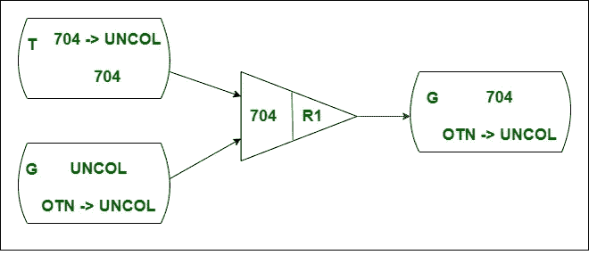**

****uncoll 编译过程****

**它是 T 图的前身，其中一个**uncoll-to-704**编译器(左上)正在 **IBM 704 机器上执行**(中)用于编译在**uncoll**(左下)中实现的**OTN-uncoll**编译器，在一个在 **704 机器代码**(右)中实现的 OTN-uncoll**编译器中提供结果。这是最初采用的汇编，后来由布拉特曼在 1961 年即兴创作。****

****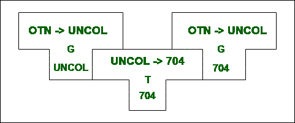****

******布拉特曼提出的 T 形图******

# ****问题****

****布拉特曼的提议似乎又有一些重大缺陷。由左 T 形件和中间 T 形件组合而成的右 T 形件看起来并不像它应该的那样。接口和对称问题影响了他的模型的效率。****

# ****不同的方法****

****后来又提出了其他几种图解系统。**用 **X 形件**替换了**布拉特曼的 T 形件**。 [**斯克兰斯基等人**](https://dl.acm.org/doi/abs/10.1145/321450.321451) 提出 **D 形件**。 [**松香**](https://onlinelibrary.wiley.com/doi/abs/10.1002/spe.4380070214) 建议用**各种形状的棋子**和 [**厄尔利&斯特吉斯**](https://dl.acm.org/doi/10.1145/355598.362740) 用体现**解释者**的**工字棋子**交换布拉特曼的丁字棋子。但是他们从未有效地解决上述问题。******

## ****1) X 形****

********

******布哈特提出的 X 形件******

****布哈特提出了这种接受语言 **N** 的程序输入的编译器的框图，即在 **IBM 709 机器码**中执行，以开发**【SPS】**语言的程序。****

## ****2) D 形****

****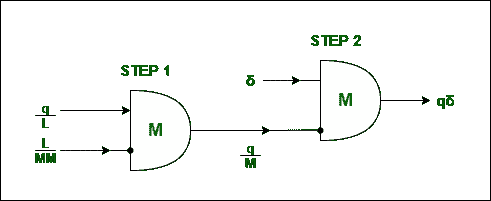****

******斯克兰斯基等人提出的 D 形件******

****在*步骤 1* 中，它定义了一个用语言 **L (q/L)** 编写的算法 **q** ，由机器 **M** 上 **M (L/MM)** 中处理的 **L-to-M 编译器**编译，产生一个 M (q/MM) 中 **q 的实现。在*步骤 2* 中，该实现是在具有**数据δ** 的机器 M 上进行的，以产生结果 **q(δ)** 。******

## **3)多形态**

**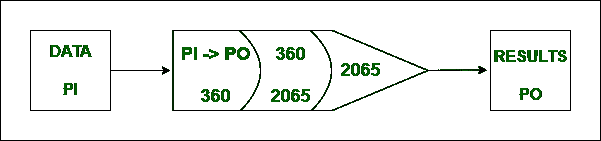**

****Rosin 提出的图****

**输入数据用 **PI 语言**编写，由用 **IBM 360 机器码**开发的编译器整理成 **PO** 语言。它在一个在 IBM 2065 机器上运行的 **2065 机器代码**中实现的 **360 机器代码**的解释器中运行。**

## **4)工字形**

**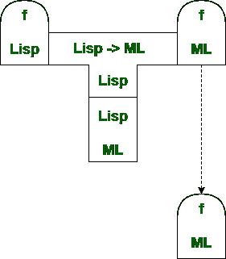**

****厄尔利-斯特吉斯提出的工字形件****

**用 **Lisp** 编写 **f 函数**，然后由用 **Lisp** 编写的编译器翻译成机器语言 **(ML)** 。该编译器在用机器语言编写的 Lisp 解释器中执行。虚线表明**右边的部分**是合成的结果。**

# **方面**

**墓碑图有一个独特的组合规则。**

**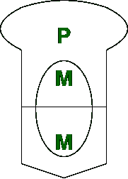**

****M-M 右组合****

**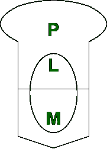**

****L-M 错误组合****

**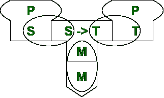**

****S-S，M-M，T-T 右组合****

**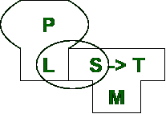**

****L-S 错误组合****

**这个**组合学**决定棋子的**组成，并调节**最终输出**。有 **2** 种组合:- (1) **水平组合**，其中第一编译器的输出被提供给第二编译器，而(2) **对角组合**包括第二编译器对第一编译器本身的编译。****

# **例子**

## **1) C 程序在 x86 机器上编译**

**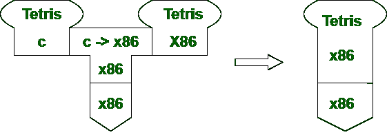**

****x86 机器上 C 程序的编译****

## **2) C 交叉编译器编译主机-> x86 到目标-> PPC**

**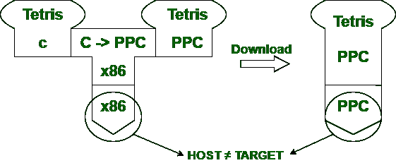**

****C 交叉编译器中的主机- > x86 和目标->PPC****

## **3)两阶段编译过程由两个翻译器组成，其中第一个翻译器的输出作为输入提供给第二个翻译器**

**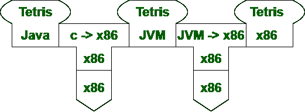**

****两阶段翻译过程****

# **应用**

**(1)墓碑图现在被用来理解**客户机-服务器互连性**在 [**万维网**](https://en.wikipedia.org/wiki/World_Wide_Web) 上。T 图的概念特征已经在许多领域得到应用。**

**(2)德国 Leizpig 大学开发了一种教学工具 [**TDiag**](http://www.michael-hielscher.de/atocc/Tut_TDiag1.pdf) 来说明墓碑图的理论和实践方面。**

**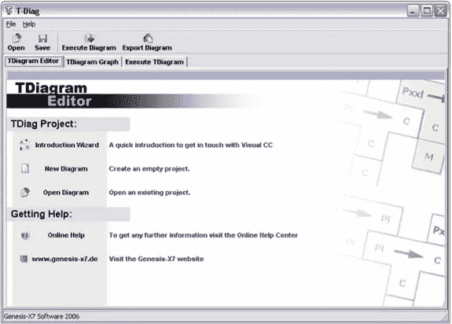**

****TDiag 接口****

****资源和数据归维基百科及其各自所有者所有。****

**保持安全，尽情享受。**

****快乐阅读😉****