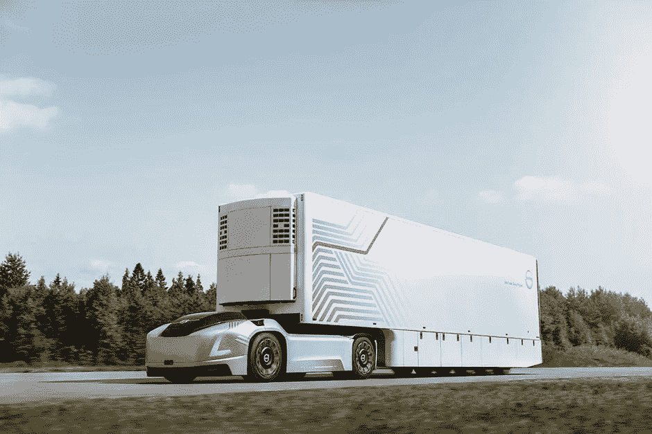

# 沃尔沃货运卡车技术是什么？

> 原文：<https://medium.com/nerd-for-tech/what-is-volvo-cargo-truck-technology-a760d884b40d?source=collection_archive---------2----------------------->

# 描述

沃尔沃集团是一家瑞典跨国制造公司，总部位于哥德堡。其主要业务是卡车、公共汽车和建筑设备的生产、分销和销售。沃尔沃还提供船舶和工业驱动系统以及金融服务。2016 年，它是世界第二大工业质量卡车制造商。总部设在哥德堡的沃尔沃汽车制造商在 1999 年被福特汽车公司收购之前一直是沃尔沃汽车公司的一部分。自 2010 年以来，它一直由中国跨国汽车公司吉利控股集团所有。沃尔沃标识由沃尔沃建筑设备公司和沃尔沃汽车公司共享，并在瑞典合作运营沃尔沃博物馆。沃尔沃成立于 1915 年。它是滚针轴承制造商 SKF 的子公司。

# 沃尔沃卡车

沃尔沃卡车公司是一家全球卡车制造商。它成立于瑞典哥德堡，由 AB 沃尔沃控股。2016 年，它曾是全球第二大工业质量卡车制造商。沃尔沃集团自 2012 年 1 月 1 日起开始高效运作。沃尔沃卡车不再是一个独立的公司，而是被纳入沃尔沃卡车集团作为该方法的一个领域。其他沃尔沃卡车品牌有雷诺卡车、麦克卡车和 UD 卡车。

第一辆沃尔沃卡车于 1928 年下线。沃尔沃卡车 2016 年在全球为 5.2 万人公平工作。[沃尔沃在位于瑞典哥德堡的国际总部的八家全资装配厂和九家当地企业拥有的工厂生产和组装卡车](https://www.technologiesinindustry4.com/)。沃尔沃卡车每年生产和销售超过 190，000 辆。中国公司吉利在 2017 年购买了沃尔沃卡车 14%的股份。

# 工业 4.0 和沃尔沃

沃尔沃卡车公司致力于发展新型卡车，使其更安全、更有效，并为熟练驾驶员提供更具吸引力的作业工具。沃尔沃货运卡车技术非常出色，令人惊叹。沃尔沃通过采用工业 4.0 的技术实现了生产产品的方式。沃尔沃卡车系列中的各种卡车型号可与许多不同的驾驶室型号一起使用，并可针对各种应用进行优化。在长途卡车上，驾驶室通常是司机的第二个家。外面的卡车也被提升到复制新卡车的属性，并作出有吸引力的整体设计。

# 新型驾驶室，提供更大的空间和更好的视野——沃尔沃 FM 和沃尔沃 FMX

新款沃尔沃 FM 和沃尔沃 FMX 拥有全新的驾驶室，还拥有与更大的沃尔沃同类产品一样多的同等仪表显示功能。它们的内部容积增加了至少一千升，提供了更好的舒适性和更多的工作空间。得益于更大的窗户、更低的门线和新的镜子，如今的亮度甚至更高了。车轮与颈部斜坡功能一样长，允许在更大程度上单独调整驾驶位置。卧铺驾驶室内的下铺比以前的位置更高，提供了更高的舒适度，并为下面的储物创造了额外的空间。日间驾驶室具有一个新的 40 升储物室，后壁上有内部照明。驾驶室的舒适性通过加强绝缘得到进一步提高，有助于排除寒冷、炎热和噪音的干扰，而传感器控制的气候单元和碳过滤器促进了良好的空气质量。

# 所有型号都配备了替换的驱动程序接口

驾驶员区域现在拥有一个全新的信息和通信界面，旨在使概览和管理不同功能变得更容易，减少压力和干扰。仪器显示器是完全数字化的，12 英寸的屏幕使驱动力可以随时轻松地掌握所需的知识。在驱动力触手可及的地方，还有一个补充的 9 英寸侧显示屏，可用于信息娱乐、导航、交通信息和摄像头监控。这些功能通常通过方向盘上的按钮、语音控制或触摸屏和显示仪表板来控制。

# 增强的安全系统有助于避免事故

沃尔沃 FH 和沃尔沃 FH16 的自适应光束大灯等功能进一步提高了安全性，沃尔沃卡车是首家推出这一功能的卡车制造商。当卡车接近迎面而来的车流或后面的另一辆车时，该系统会自动禁用 LED 光束的选定部分，从而提高所有道路使用者的安全性。

此外，改进的自适应控制(ACC)可在最低 0 km/h 的速度下行驶，下坡控制可在需要额外的制动力来保持恒定的下坡速度时自动激活车轮制动。现在，新型卡车标配了电子控制制动器(EBS ),这是安全功能的先决条件，如带手制动的碰撞警告和电子稳定控制。[带安全系统车道保持辅助和稳定性辅助的沃尔沃动态转向系统作为选装配置](https://www.technologiesinindustry4.com/)。道路标志识别系统检测道路交通标志，如超车限制、道路类型和速度限制，并将其显示在仪表显示屏上。

# 高效发动机和替代动力传动系统

对于运输公司来说，环境和经济都是重要因素。由于没有一种单一的能源可以解决所有的全球气候变化问题，而且由于不同的运输环节和任务需要不同的解决方案，在可预见的未来，几种动力传动系统仍将并行存在。

沃尔沃 FH 和沃尔沃 FM 在许多市场上都配备了符合欧 6 标准的天然气发动机。这使得燃油效率和性能与沃尔沃的同等柴油卡车不相上下，而对气候的影响却低得多。与沃尔沃的同等柴油卡车相比，内燃机既可以使用沼气，这可以减少高达 100%的二氧化碳排放量，也可以使用天然气，这可以减少高达 20%的二氧化碳排放量。这与车辆在使用过程中的排放有关，称为油箱到车轮。

新的沃尔沃 FH 还可以定制一种替代的高效欧 6 柴油，它包含在 I-Save 包中，可以节省大量的燃料和二氧化碳。以长途作业为例，新款沃尔沃 FH with I-Save 将新型 D13TC 发动机与一系列功能相结合，可节省高达 7%的燃油。

# 奇妙的技术

这篇文章的读者一定要看链接的视频是【https://www.youtube.com/watch?v=ridS396W2BY】T2&list = plbj 9 jygxruzdi 9 amlprtz 20 py 7 zet 1 isz&index = 7

该视频展示了重型货车安全系统的 IT 技术革命。这辆沃尔沃卡车承载着 40 吨的重量，并展示了 IIOT 设备、传感器和激光雷达技术(三维激光扫描~三维扫描+激光扫描的组合)如何使这辆卡车在几秒钟内停下来，避免了一起道路事故~令人惊叹的技术！！！

更多详情请访问:[https://www . technologiesinindustry 4 . com/2020/12/what-is-Volvo-cargo-truck-technology . html](https://www.technologiesinindustry4.com/2020/12/what-is-volvo-cargo-truck-technology.html)