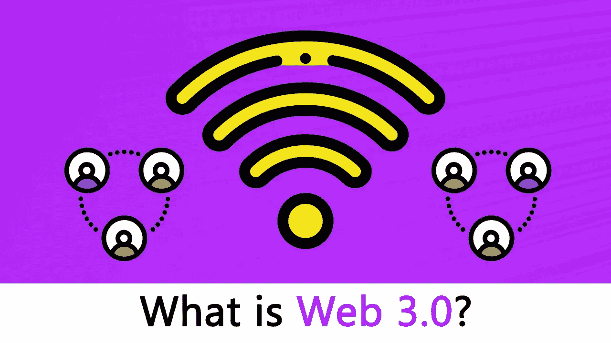

# 什么是 Web 3.0，为什么要关注它？

> 原文：<https://medium.com/nerd-for-tech/what-is-web-3-0-and-why-you-should-care-about-it-6038b0ca1bc8?source=collection_archive---------3----------------------->

## 关于 Web 3.0 和去中心化你应该知道什么

图片来自[blockgeeks.com](https://blockgeeks.com/)

我们今天经历的现代网络与 10 年或 20 年前有很大不同。网络已经有了很大的发展，而且还在不断发展。

> 1999 年，[蒂姆·伯纳斯·李](https://interestingengineering.com/origin-of-the-internet-who-invented-the-world-wide-web)引入了术语[语义网](https://www.w3.org/RDF/Metalog/docs/sw-easy)，一种现有互联网的进化版本，将主要由“智能代理”或机器运行，它们可以以类似人类的方式处理内容。伯纳斯-李和其他人在 2001 年 5 月的《科学美国人》的文章“语义网”中描述了这一愿景，作为“当前网络的延伸，信息被赋予明确的含义，更好地使计算机和人合作工作。”
> 来自[兴趣工程](https://interestingengineering.com/web-3-the-new-internet-is-about-to-arrive?fbclid=IwAR3DD2b1PTUyPaT2fQ5_GN1e-rHwkuzcWxdoKsoRDS42w8wDzYWMLs3PT94)

为了理解什么是 Web 3.0，我们需要理解 Web 从早期到今天的演变。

# 网络的演变

与早期相比，网络已经发生了很大的变化。我们今天正在体验的应用程序甚至在开始时都无法识别。web 分为三个独立的阶段，即 Web 1.0、Web 2.0 和 Web 3.0。

## Web 1.0，只读时代

Web 1.0 是万维网的起点。那时，内容创作者大多是建立网站的开发者。而且当时的信息大多是图片或者文字的形式。Web 1.0 时代被认为是在 1991 年到 2004 年之间。

Web 1.0 是一种只读网站，网站由静态内容组成，而不是动态 HTML。使用的不是数据库，而是静态文件系统，这些网站缺乏交互性，性能非常慢。

## Web 2.0，读写时代

随着脸书、Twitter、Youtube 和其他社交媒体平台的兴起，Web 1.0 发展到了 Web 2.0。Web 1.0 中的静态内容被转换成了动态内容，数据库取代了静态文件系统。最重要的事情之一是，创建内容不仅限于开发者，最终用户现在正在不同的社交媒体平台上创建大量数据。例如，用户可以创建一个脸书帐户，并可以创建内容，用户可以在他的 YouTube 频道上上传视频，其他许多社交平台也是如此。

当 Web 1.0 发展到 Web 2.0 时，主要的变化是易用性，这就是为什么许多人成为创造者。我们今天经历的网络是 Web 2.0，它对我们非常有用，我们可以从中获得很多好处，但仍然有一些需要改进的地方，这些地方可以改进。

## Web 2.0 中的安全性

正如我们之前所讨论的，Web 2.0 引入了 Web 技术的新视野，随着社交平台的引入，它的使用增加了很多。但是 Web 2.0 应用程序已经多次遭遇数据泄露，用户的数据也多次遭到破坏。

实际上，在 Web 2.0 中，用户可以创建内容，分享数据，但这些数据的保存方式让用户无法控制。公司经常跟踪和保存用户数据，即使没有用户的同意。这些平台提供免费服务，但向用户收取数据费用。

如果政府认为一个人表达了与他们宣传相反的观点，他们通常会关闭服务器或查封银行账户。有了中央服务器，政府可以很容易地干预、控制或关闭他们认为合适的应用程序。

因为银行也是数字化的，处于集中控制之下，政府也经常干预。在市场动荡、极度通货膨胀或其他政治动荡时期，他们可以关闭银行账户或限制资金的使用。

Web 3.0 的目的是通过从底层设计和构建应用程序来解决这类问题。

## Web 3.0，明天的互联网。

Web 3.0 在很多方面回归了 Berners-Lee 的语义网概念，即没有中央机构来授予许可，也不会有中央控制机构。Web 2.0 受到了移动互联网、社交媒体和云计算发展的影响，而 Web 3.0 将处于新技术创新的顶端，包括边缘计算、分散数据网络、人工智能和区块链。

虽然我们还没有见证到 Web 3.0 的完全转变，但是技术专家和区块链爱好者们已经对未来的互联网做出了一些充满希望的预测。其中一些如下:

*   Web 3.0 可以作为 Web 2.0 各种元素的延伸。例如，开发人员现在创建两个或更多应用程序的方式，在 Web 3.0 中，用户将能够为自己组合不同的程序和服务，以定制他们使用 Web 的方式。
*   目前，用户从位于世界不同地方的各种服务器和数据库获取因特网上的信息。不足为奇的是，超过 50%的数据中心归亚马逊、谷歌和微软所有。在 Web 3.0 中，数据将存储在[去中心化的云网络](https://mozartcultures.com/en/the-evolution-of-web-3-0-and-the-return-of-data-privacy/)和自主存储单元上。因此，Web 3.0 将不依赖于任何集中的数据中心来为用户提供信息。然而，创建这样一个强大的分散式数据存储系统本身就是一个非常大的挑战。
*   互联网搜索在 Web 3.0 上也会有所不同。类似于脸书和 YouTube 上的个性化广告和订阅源。通过使用[高级人工智能](https://interestingengineering.com/new-ai-technology-reshapes-customer-experiences-in-online-shopping)，Web 3.0 中的搜索引擎将根据每个用户的偏好和需求为他们提供个性化的结果。因此，举例来说，如果一个肉食者和一个素食者都在搜索栏上输入“附近最好的餐馆”，他们会根据自己的喜好得到不同的结果。当然，这也意味着算法会更加了解我们。
*   作为一名用户，您将在 Web 3.0 上拥有一个唯一的身份，这将使您能够访问和控制您的所有资产、数据和服务，而无需登录平台或寻求特定服务提供商的许可。你将能够从任何地方免费访问互联网，并且你将是你的数字资产的唯一所有者。
*   除了在 2D 的屏幕上体验互联网，用户还将在[参与更多种类的 3D 环境](https://www.expert.ai/blog/web-3-0/)。从任何地方，你都可以访问你搜索的任何历史地点的 3D 虚拟现实版本，作为 3D 玩家在游戏中玩游戏，在购买之前在你的虚拟自我上试穿衣服。在 Web 3.0 中，你还可以花时间沉浸在 3D 元宇宙中，在那里你可以收集或购买虚拟资产。简而言之，随着 VR、AR、语义网和人工智能的共同使用，Web 3.0 可以为你提供比 Web 2.0 更好的与虚拟世界互动的机会。

## 分散

Web 3.0 的核心是去中心化，开发人员通常不会构建和部署运行在单个服务器上的应用程序，或者将他们的数据存储在单个数据库(云提供商)上，相反，Web 3 应用程序要么运行在区块链、许多对等节点(服务器)的去中心化网络上，要么运行在形成加密经济协议的两者的组合上。这些应用程序通常被称为 dapps(去中心化应用程序)，你会看到这个术语在 web3 领域经常使用。

为了实现稳定和安全的分散式网络，网络参与者(开发者)受到激励，并竞相向使用该服务的任何人提供最高质量的服务。

当你听说 web3 时，你会注意到加密货币经常成为人们谈论的话题。这是因为加密货币在这些协议中扮演着重要角色。它为任何想要参与创建、管理、贡献或改进项目本身的人提供了财务激励(代币)。

这些协议通常可以提供各种不同的服务，如计算、存储、带宽、身份、托管和其他过去通常由云提供商提供的 web 服务。

人们可以通过以各种方式参与协议来谋生，包括技术层面和非技术层面。

该服务的消费者通常付费使用该协议，类似于他们今天支付给 AWS 等云提供商的方式。除了在 web3 中，资金直接流向网络参与者。

在这种情况下，就像在许多形式的去中心化中一样，你会发现不必要的、通常是低效的中介被剔除了。

许多 web 基础设施协议，如 [Filecoin](https://filecoin.io/blog/filecoin-circulating-supply/) 、 [Livepeer](https://livepeer.com/) 、 [Arweave](https://www.arweave.org/) 和 [The Graph](https://thegraph.com/blog/the-graph-grt-token-economics) (这是我在 Edge &节点上使用的)已经发布了管理协议如何运行的实用令牌。这些代币也奖励网络中许多级别的参与者。甚至像[以太坊](https://ethereum.org/en/)这样的区块链本地协议也以这种方式运行。

来源:我自己的研究， [FreeCodecamp](https://www.freecodecamp.org/news/what-is-web3/) ，和[有趣的工程](https://interestingengineering.com/web-3-the-new-internet-is-about-to-arrive?fbclid=IwAR3DD2b1PTUyPaT2fQ5_GN1e-rHwkuzcWxdoKsoRDS42w8wDzYWMLs3PT94)