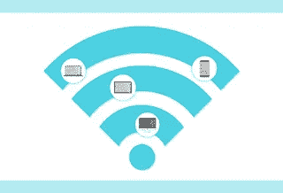
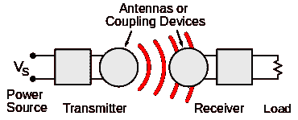

# 什么是无线电力传输技术？

> 原文：<https://medium.com/nerd-for-tech/what-is-wireless-power-transfer-technology-e4e6c1e17b3e?source=collection_archive---------8----------------------->

# 介绍

在 2020 ~ 2030 年的技术趋势中，无线电能传输技术是一个新兴的、快速发展的技术。它是没有电线作为物理连接的电能传播。一种发射器装置用于由电力驱动的无线电力传输系统中。该设备产生电磁场，该电磁场通过空间将电力传输到接收器设备，并从该电磁场中移除电力并将电力存储到电力负载。无线电力传输技术可能会消除电线和电池的使用。它将为所有消费者增加电子设备的移动性、机会性和安全性。无线电力传输对于给电气设备供电非常有用。它适用于互连线困难且危险的地方。

# 无线电力传输组

有两组主要的无线供电技术:

*   近场或非辐射技术:

利用线圈之间的感应耦合，通过磁场在短距离内传输电能。

*   远场或辐射技术:

在这种技术中，功率通过电磁辐射束传输，类似于微波或激光束。这些技术可以远距离传递能量，并且必须指向接收器。

# 无线电源系统框图

无线电力系统包括连接到电力基础(例如将电力转换成时变电磁场的主电力线)的发射器设备，以及获得电力并将其转换回 DC 或交流电流的接收器设备。[通过发射机上的某种类型的天线装置，输入功率被转换成振荡电磁场](https://www.technologiesinindustry4.com/)。接收器处的类似耦合装置或天线将振荡场转换成电流。频率是一个重要的参数，它控制决定波长的波的类型。无线电源与无线通信设备使用相同的场和波。在无线通信技术中，只有极少量的电能到达接收器。效率是最重要的参数，因为对于无线电力传输，接收的能量是重要的实体。由于这个原因，无线电力技术可能比无线通信技术受到距离的额外限制。

# 使用

无线电力传输可用于增强无线信息发射器或接收器。这种通信被认为是(WPC)无线供电的通信。当收集的电力用于为无线信息发射器供电时，该网络被称为(SWIPT)同时无线信息和电力传输。

# 现场区域

电场和磁场是由电子等物质中的带电粒子产生的。静止电荷在其周围的空间内产生电场。柔和的电流会在其周围产生静态磁通量。上述磁场包含能量，但不能携带能量，因为它们是静态的。然而，时变场可以携带能量。加速电荷，就像在电线中的电子交流过程中发现的那样，在它们周围的空间中产生了随时间变化的电场和磁场。在接收“天线”的过程中，这些场可以对电子施加振荡力，使它们来回移动。这些表示可能习惯于给负载供电的交流电。

**近场或无辐射区:**这指向天线约 1 个波长(λ)内的世界。振荡电场和磁场是不同的，并且通常通过金属电极之间的电容耦合经由电场或者通过电感耦合经由磁场来传输功率。这些场没有辐射，这意味着能量停留在发射器的短距离内。

**远场或辐射区:**磁场和电场相互垂直，以电磁波形式传播；例子是无线电波、微波或超过天线大约 1 个波长(λ)的光波。这部分能量是辐射性的，也就是说不管有没有接收器接收，它都会离开天线。[没有到达接收天线的那部分能量被耗散掉，损失在系统中。](https://www.technologiesinindustry4.com/)天线作为电磁波产生的功率量取决于天线尺寸 Dant 与波的波长λ之比，λ[40]由频率决定:λ = c/f。在低频 f 下，天线远小于波的尺寸，Dant > λ = c/f。实际的波束功率设备要求波长在厘米范围内或以下，如频率在 1 GHz 以上，在微波范围内或以上。

# 近场(非辐射)技术

电场和磁场的近场机制是大相对距离下的准静态振荡偶极子场。由于功率与扇区强度的平方成正比，因此传输的设施随着(d range/Dant)6 而减少。或每 10 年 60 分贝。换句话说，如果相距很远，两个天线之间的距离加倍会导致接收到的设施减少 26 = 64。不像在辐射系统中，当偶极天线横向于传播方向取向时，最大的辐射发生，在偶极场中，当偶极纵向取向时，最大的耦合发生。

**电感耦合:**电感耦合中通过磁场在线圈之间传递电能。

**谐振电感耦合:**是电感耦合的一种形式，通过两个谐振电路之间的磁场来传递功率。

**电容耦合:**它[利用电场在两个电极之间传输电能，形成电容](https://www.technologiesinindustry4.com/)传输电能。

**谐振电容耦合**:也可配合电容耦合使用，以扩大范围。

**磁动力耦合:**通过这种方法，功率在两个旋转电枢之间传输，一个在发射器中，一个在接收器中。

# 远场(辐射)技术

这些技术经常具有几千米的范围，其中距离比设备的直径大得多。准直激光和高方向性天线产生的能量束可以与接收区域的形状相匹配。

**微波:**在微波范围内，通过无线电波的电力传输可以更具方向性，允许更长距离的电力波束，具有更短波长的电磁辐射。

**激光:**在电磁辐射更接近光谱的可见区域的情况下，可以通过将电转换成激光束来传输功率，激光束被接收并聚集到光伏电池上。这种方法通常被认为是一种能量传输，就像能量被传输到一个接收器上，接收器将能量转化为电能。

更多详情请访问:[https://www . technologiesinindustry 4 . com/2020/12/what-is-wireless-power-transfer-technology . html](https://www.technologiesinindustry4.com/2020/12/what-is-wireless-power-transfer-technology.html)