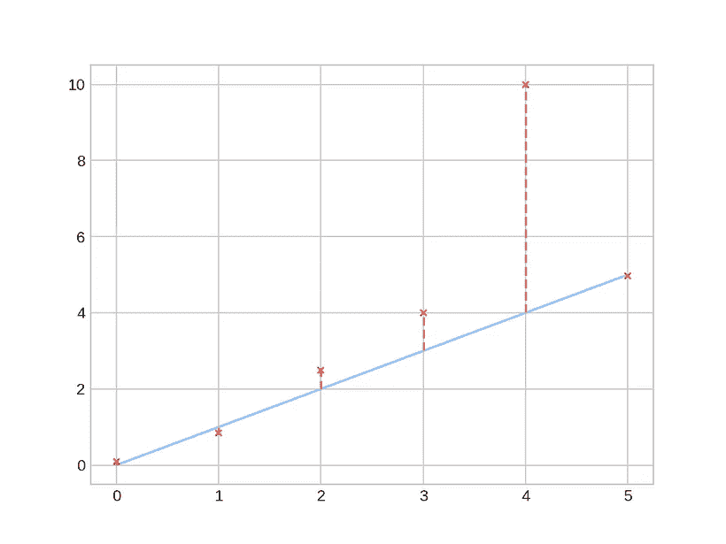
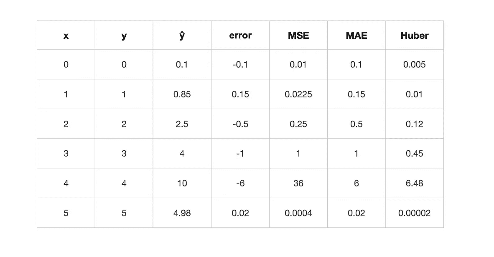
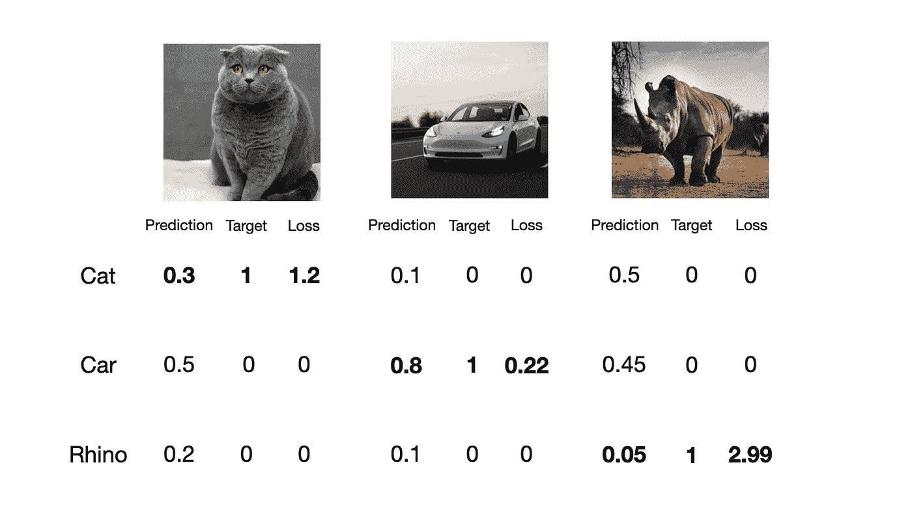
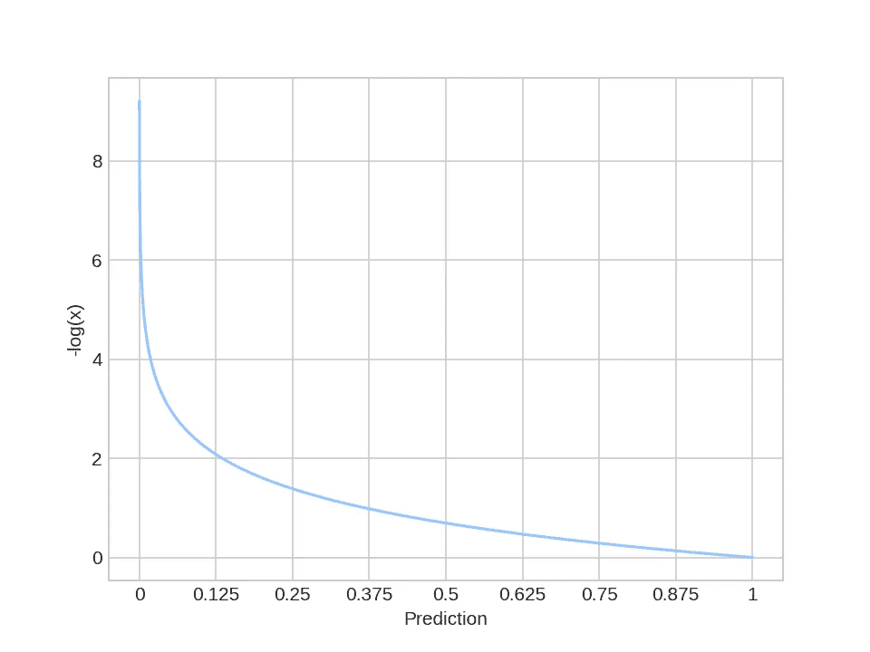
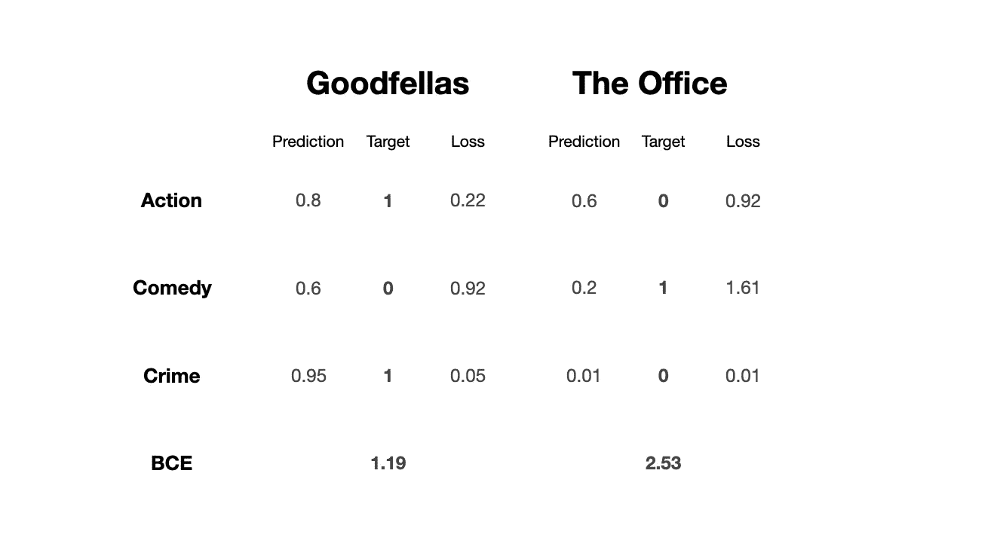

# 机器学习中的损失函数

> 原文：<https://medium.com/nerd-for-tech/what-loss-function-to-use-for-machine-learning-project-b5c5bd4a151e?source=collection_archive---------0----------------------->

在本教程中，我将解释在机器学习中在哪里以及为什么使用特定的损失函数。看完这篇博客，你会知道每个功能的优缺点，以及选择哪一个来解决你的问题。

艾萨克·史密斯在 [Unsplash](https://unsplash.com?utm_source=medium&utm_medium=referral) 上拍摄的照片

# 介绍

在机器学习中，损失函数定义了模型的预测距离目标值有多远。必须正确选择它，因为所有参数都是根据它的值更新的。损失函数的选择由模型的目的决定。

在这篇博客中，我将讨论两类问题，**回归**和**分类**。

# 回归

我从一个简单的解释和所有这些函数背后的数学开始。最后我会用观想呈现一些例子，应该会让理论更清晰，让你有更深的理解。

## 1.均方误差

y-目标，ŷ-预测，m-示例

**优点:**

*   易导数
*   存在解析解
*   小错误的小更新

**缺点:**

*   对异常值不稳健

如您所见， **MSE** 总体上严重地惩罚了错误，但这是一把双刃剑。想象一下远处的异常值和平方误差。我们有一个巨大的体重更新，可能会使模型失去平衡。

为了澄清，当损失的斜率(梯度)等于 0 时，存在**解析解**。在这种情况下，是有可能的。这是一个重要的属性，因为令人惊讶的是，并不是所有的函数都有这个属性。

> 简单的导数使得 **MSE** 成为一个非常流行的算法，你可以在一些**分类**问题中找到它。

## 2.绝对平均误差

y-目标，ŷ-预测，m-示例

**优点:**

*   对异常值稳健

**缺点:**

*   没有解析解
*   **梯度幅度**对于所有误差都是相同的

**MAE** 是目标和预测之差的绝对值。这个函数的主要问题是它实际上没有一个**解**。

如你所知，**解**应该是导数等于 0 的时候，这种情况下是不可能的。

此外，您可以看到，对于每个误差，**梯度**要么是 1，要么是-1。这意味着我们通过**相同的值**来更新权重，不管误差有多大。

> 这个函数的明显用途是回归问题，但它也用于其他领域，例如 **CycleGAN** 论文。它充当**一致性损失**，并计算原始图像和重新生成的图像之间的差异。[1]

## 3.伪 Huber 损失

y-目标，ŷ-预测，m-示例

**优点:**

*   对异常值稳健
*   存在解析解

**缺点:**

*   需要对 delta 参数[2]进行统计微调

**伪 Huber** 函数结合了 **MAE** 函数的健壮性和 **MSE** 的实际存在的解决方案。

还有一个额外的参数 **delta** ，它控制函数从二次到线性的切换。它还剪切梯度，限制了**异常值**的影响。

如果数据来自高斯分布，则**增量**的良好起始值为 1.35。[2]

δ= 5 时的 Huber 损失

> 由于剪切梯度的能力，在快速 R-CNN 模型中使用了**伪胡伯**来防止**爆炸梯度**。

## 比较

经过一点理论，这是一个好主意，看看每个函数的结果。

红点是预测值。

如您所见，**伪 Huber** 显示了**对来自 MAE 损失的异常值的鲁棒性**以及来自 MSE 的接近预测的较小值**更新**。

如果想看图和损失函数的 Python 代码，可以看看我的 [**Github**](https://github.com/maciejbalawejder/MLalgorithms-collection/blob/main/Loss%20functions/loss_functions.ipynb) 。

# 分类

## 1.范畴交叉熵

y-目标，ŷ-预测，c-类

**优点:**

*   严厉惩罚错误的预测
*   为多类问题做最好的工作

灵感来自于**信息论**，一种给定随机变量的两种概率分布之间的度量。如果想了解更多，可以看看这个 [**视频**](https://www.youtube.com/watch?v=ErfnhcEV1O8) 。

在机器学习中，一个分布是模型的**输出**(在 Softmax 函数之后)，第二个是**目标向量**。让我们创建一个简单的**多类**预测模型来对猫、汽车和犀牛进行分类，并看看它在实践中是如何工作的。

如你所见，交叉熵关注于**期望的**输出，并严重惩罚错误的预测。看函数图就变得很直观了。

> 它是大多数**多类**分类问题的 go-to 损失函数。

## 2.二元交叉熵

y-目标，ŷ-预测，c-类

**优点:**

*   适用于**多标签**问题和二元分类

二元交叉熵的工作方式类似于分类交叉熵。它以指数方式惩罚错误的预测。

主要区别在于应用。BCE 主要用于**多标签分类**，其中输入可以属于多个类。最简单的例子就是像**蜘蛛侠**这样的电影，同时被归为动作、冒险、奇幻、科幻类型。

好了，让我们建立一个简单的电影/电视剧类型分类器。

在分类交叉熵之后，BCE 应该非常直观。它们的工作原理相同，但应用不同。

## 3.KL-发散损失

y-目标，ŷ-预测，c-类

> 同样，这个想法来自于**信息论**，所以如果你想知道更多，并且用简单的英语得到 **KL** 的解释，我强烈推荐这篇[文章](https://www.countbayesie.com/blog/2017/5/9/kullback-leibler-divergence-explained)。

**优点**:

*   像图像一样近似复杂的目标分布

如您所见，KL-divergence 损失是从我们的网络预测的**交叉熵分布**和 **目标分布**的**熵之间的差异。它告诉我们模型离期望的分布有多远。因此，我们用它作为损失函数。**

*哪里可以用？*

假设您插入来自我们的 **CCE** 分类器的值。在这种情况下，输出将是与**相同的**(但计算速度较慢)，因为目标分配仅集中在**期望的**输出上。

但是想象一下，如果你要生成一个图像，那么你的目标分布就要复杂得多**。这种情况下， **KL** 效果最好。我们在深度生成模型中遇到过它，比如变分自动编码器( **VAE** )，但不仅限于此。**

> **我个人第一次听说是在一篇 **Comma.ai** [的博文](https://blog.comma.ai/end-to-end-lateral-planning/)里。他们使用 **KL** (🥬 ) loss 在模拟器中训练他们的自动驾驶软件。**

# **结论**

**损失函数是机器学习问题的核心组成部分。他们评估模型的性能并相应地更新权重。在本教程之后，您了解了特定函数的优缺点以及在哪里使用它们！**

**如果想看我的其他项目，可以查看我的 [**中**](https://maciejbalawejder.medium.com/) 和[**Github**](https://github.com/maciejbalawejder)**简介。****

# ****参考****

****[【1】](https://arxiv.org/pdf/1703.10593.pdf)使用循环一致对抗网络的不成对图像到图像翻译****

****[【2】](https://stats.stackexchange.com/questions/465937/how-to-choose-delta-parameter-in-huber-loss-function)Huber 损失函数中 delta 参数如何选择？****