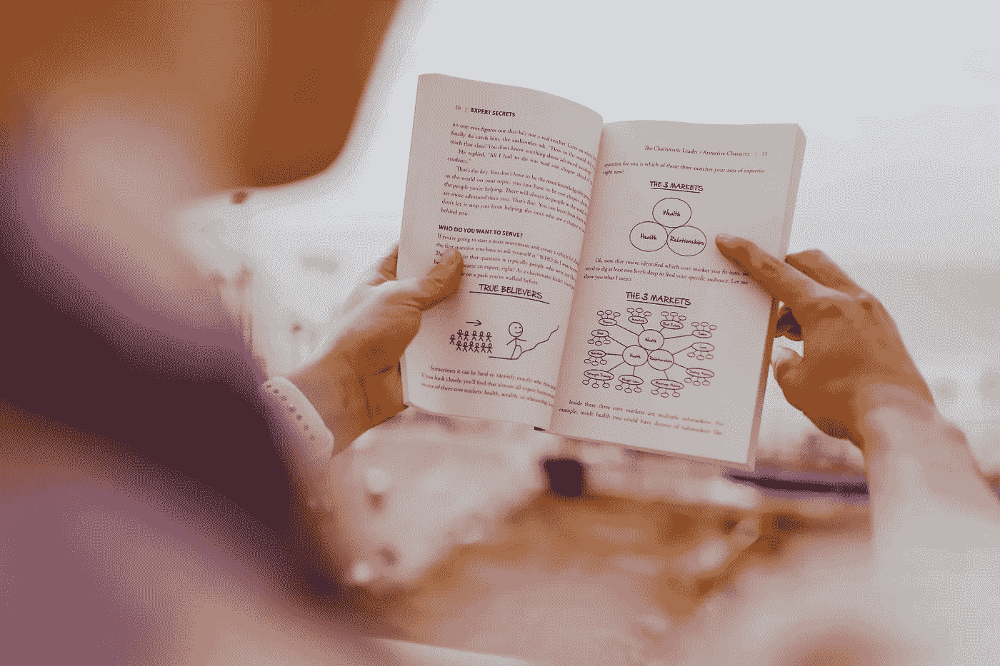

# 什么是高质量的反向链接？

> 原文：<https://medium.com/nerd-for-tech/what-makes-a-high-quality-back-link-5add7d92e348?source=collection_archive---------27----------------------->

在 [Unsplash](https://unsplash.com/s/photos/seo-backlink?utm_source=unsplash&utm_medium=referral&utm_content=creditCopyText) 上由 [Austin Distel](https://unsplash.com/@austindistel?utm_source=unsplash&utm_medium=referral&utm_content=creditCopyText) 拍摄的照片

今天，高质量的反向链接与好的 [**数字营销**](https://www.digitalgrowthmax.com/) 一样重要。从其他网站获得你的网站的反向链接(也称为外部链接)仍然是提高搜索引擎排名的最有效的方法之一。然而，并不是所有的反向链接都同样有价值。

少量高质量的反向链接会对你的 SEO 进度产生巨大的影响。另一方面，几百个低质量的链接，如果考虑进去，也没有什么区别，甚至会有负面影响。

# 质量反向链接的 3 个核心要素

很难定义什么是高质量的反向链接。没有人确切知道搜索引擎如何评价他们，但大多数 SEO 都认同三个关键要素。

# 自然的

反向链接应该是自然的，网站所有者必须链接到你的网站，因为它为他们的观众提供了价值，而不是因为你付钱给他们这样做或试图以其他方式影响他们。

这与非自然的反向链接截然不同，后者通常被用来欺骗搜索引擎，使其认为一个[网站](https://www.pinterest.com/DGM_Canada/_created/)比它本身有更好的声誉。

如果谷歌觉得一个反向链接是不自然的或垃圾的，它最初可能会忽略它，然后在其搜索引擎结果中惩罚和降级该网站。

# 声誉好的

为了确定一个网站有多可靠，现代搜索引擎寻找社会证据。谷歌有自己的 PageRank 算法来评估网站的重要性和可信度。

更重要的是，网页收到的反向链接越多，就越有可能在目标关键词中排名。

谷歌曾经提供了一个 PageRank 指标，计算出一个网页可信度的合理近似值。谷歌停止了它，因为垃圾邮件发送者正在使用它作为汇率来购买反向链接，这违反了谷歌的政策。

# 相关的

他们追求相似的相关性程序，就像搜索引擎如何考虑域名和反向链接页面的可信度一样。搜索引擎评估反向链接的页面和域的相关性。

**Digital Growth Max** 是**PPC**以及 SEO 的最佳代理。现在就提升你与 DGM 的业务！