# 是什么让一个政客在社交媒体上受欢迎？

> 原文：<https://medium.com/nerd-for-tech/what-makes-a-politician-popular-on-social-media-bd3b96cba5c8?source=collection_archive---------13----------------------->

## 数据科学教程

## K-Means 在 Twitter 政客上的聚类

当脸书和推特这样的社交媒体平台在十五年前首次创建时，很少有人能预测到它们最终会在塑造现代世界的政治格局中发挥多大的影响力。[【1】](https://knowledge.wharton.upenn.edu/article/how-social-media-is-shaping-political-campaigns/)

然而，今天，几乎每个政治家或公众人物都认识到了在线存在的重要性。巴拉克·奥巴马有时被称为第一位社交媒体总统，他利用脸书迅速崛起的力量将自己的影响力扩大到传统媒体之外，在 2008 年迅速将自己的形象从一个相对默默无闻的参议员培养成了全国希望和变革的象征。[【2】](https://www.washingtonpost.com/news/politics/wp/2015/05/26/heres-how-the-first-president-of-the-social-media-age-has-chosen-to-connect-with-americans/)

八年后，唐纳德·特朗普(Donald Trump)在 Twitter 上掀起了一场风暴，发起了一场前所未有的运动，其势头在很大程度上归功于持续不断的推文，这使他的名字成为互联网上被提及次数最多的词之一，并改变了他的命运，从一名房地产大亨和真人秀明星变成了地球上最有权力的人。[【3】](https://www.nytimes.com/interactive/2019/11/02/us/politics/trump-twitter-presidency.html)

现在，没有人能反驳数字公关的价值。但是，一个人到底该如何最大限度地利用社交媒体，尤其是在政治领域？都是关于追随者的吗？还是更多的是和陌生人交朋友？也许，一个必须链接到许多社交媒体页面或列表。也许就像喜欢很多别人发的帖子一样简单，或者尽可能多的自己发帖子。

如果我们能准确测量出是什么让一个政客在网上受欢迎，那会怎么样？如果我们能够将最受欢迎的美国政治家分组，分析哪些社交媒体统计数据决定了他们在虚拟世界中的成功，那么我们也许能够帮助下一代政治候选人提出他们自己的成为公务员的策略。

# k 均值聚类

图上的簇和质心

如果一个**聚类**被定义为由于某些相似性而被分组在一起的数据点的选择，那么**k-均值聚类**可以被定义为在数据集中寻找固定数量的聚类 ***k*** 的方法。对数据点进行聚类可以帮助我们指出数据中的趋势，否则我们可能无法检测到这些趋势，并且可视化它们是如何分组在一起的，可以让我们更清楚地了解整个集合。默认情况下，K-means 聚类依赖于**欧几里德距离**来确定相似性——这是一种基于欧几里德空间或几何平面中的点的实际距离的度量。该平面上簇的位置由其**质心**决定，质心是代表每个簇中心的特定点。使用 k-means 聚类的关键原因？虽然我们可以任意决定任何数量的质心或聚类来测量我们的数据集，但有些数量比其他数量更优。[【4】](https://towardsdatascience.com/understanding-k-means-clustering-in-machine-learning-6a6e67336aa1)

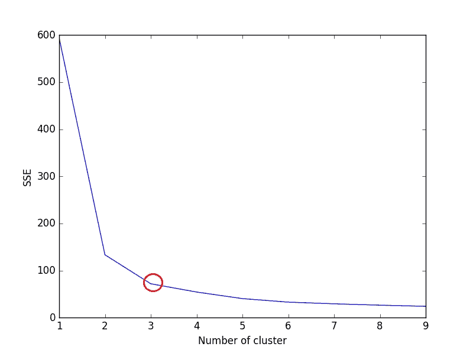

肘法

为了确定聚类的最佳数量 *k* ，我们可以使用一种流行的启发式方法，称为**肘方法，**该方法针对一系列 *k* 值对数据集运行 k 均值聚类，计算每个值的误差平方和(SSE)，并将 SSE 绘制在一条线上。虽然我们确实想要一个相对较小的 SSE，但是随着我们增加 *k，*，SSE 也向 0 减小，并且只有当簇的总数等于点的总数时，SSE 才达到 0。因此，最好的妥协是在中间的某个地方，这条线开始从一个极端方向弯曲到另一个极端方向。然后，该点被命名为图形的**弯头**。[【5】](https://www.geeksforgeeks.org/elbow-method-for-optimal-value-of-k-in-kmeans/)

# 设置和数据源

在这个项目中，我们将使用约 1800 名政治家及其 Twitter 用户名的现有集合来收集社交媒体平台上与他们的账户相关的各种数值的数据，如他们的总粉丝数、朋友数、列表数、收藏夹数和状态数。然后，我们将对数据运行肘方法，确定 *k、*并在图表上可视化 *k* 聚类进行分析。

Kaggle 上的一页以 CSV 的形式提供了我们所需要的东西。[6]

下载之后，我们可以打开 Jupyter 笔记本，导入一系列 Python 库，最终用于我们的项目。这是进口代码和每个代码的简要描述。

导入 Python 库

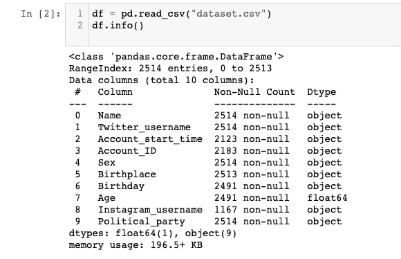

数据帧信息

有了它，我们就可以阅读。CSV 变成熊猫，检查它的信息，并显示它的头像。最初的一瞥显示了我们想要过滤掉的相同人员的许多重复帐户、空字段和列，例如帐户创建日期、帐户 ID、政治家的出生地、他们的生日以及他们在 Instagram 上的用户名。然而，我们确实希望保留的一条信息是人的年龄，这是我们可以轻松插入我们的聚类的唯一数值，如果我们将其与图表上的其他数据进行比较，可能会产生有趣的见解。

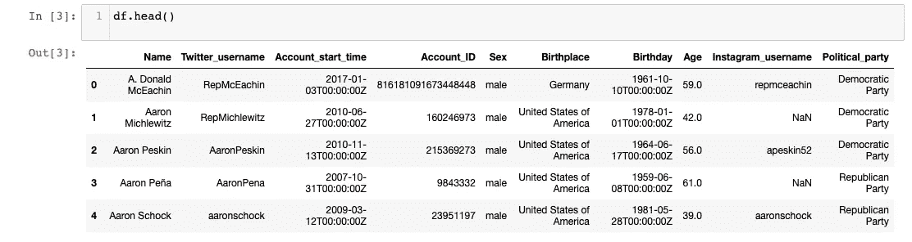

数据帧头

重命名和删除列

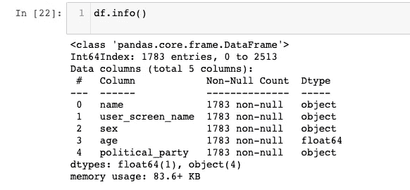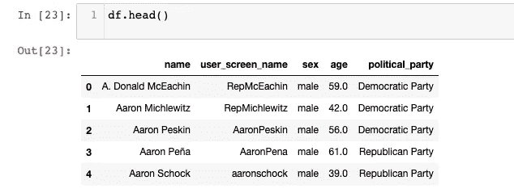

更改后的数据帧信息(左)和数据帧标题(右)

设置 Tweepy，Twitter API

现在我们已经有了一个漂亮、干净的近 1800 名用户的列表，是时候使用 Tweepy 连接到我们的 Twitter 开发人员帐户了。注意:我在这段代码中的密钥是经过审查的，以保护它们的匿名性。自己拿！

搜索用户(第一次尝试)

在这里，我们的第一次搜索尝试遍历数据集中的每个用户屏幕名称，在 Twitter 中找到实际的用户，从他们的帐户中提取所需的字段，并将数据追加到一个列表中供以后使用。代码开始工作一分钟左右，但是我们很快遇到一个问题——一个用户被挂起了！我们无法确切知道原因，但不管是什么情况，我们都必须解决它。

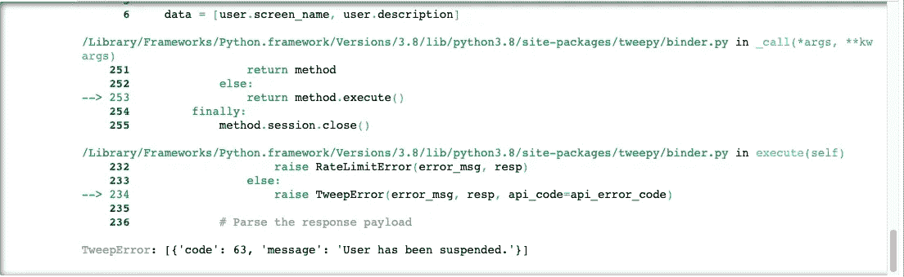

暂停用户

我们可以抛出一个异常来捕捉问题，发出警报，并继续执行其任务，而不是从数据中删除特定用户，然后等待问题无限期地重复出现。

搜索用户(第二次尝试)

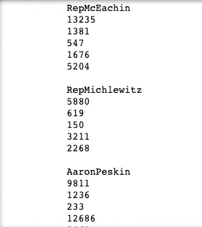

下载的数据

现在这个程序运行得很顺利，完全下载这些信息大约需要一个小时。一旦下载完成，我们就可以用它的值创建一个全新的数据帧。

创建新的数据框架

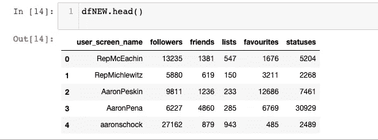

新数据帧头

合并数据帧

我们的下一步是将这个新的数据框架与包含政治家个人信息的旧数据框架合并，该数据框架包含所有新提取的 Twitter 统计数据。但是，由于我们无法访问上述暂停的帐户，这两个集合具有不同的行数，如果我们试图将它们合并，它们将无法正确对齐。因此，我们必须消除一个数据框架中不存在于另一个数据框架中的任何人，然后重置两个索引，使它们匹配。只有这样，我们才能将这两个数据框架合并成一组可用的数据。

# 基本可视化

现在，虽然政党不是我们计划在这个项目中进行聚类的数值，但对它进行一些基本的可视化操作可能会很有趣，以便了解我们数据集的性质。让我们确保这里的每一位政治家都来自美国的一个主要政党。

修改政党的数据集

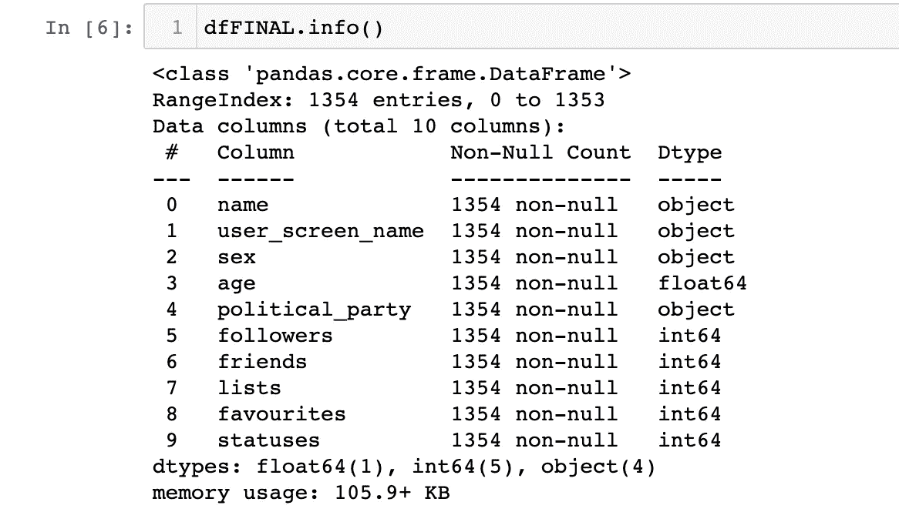

dfgdf

事实证明，名单上只有大约 1350 名政治家被认定为共和党人、民主党人、自由主义者、绿党成员或“无党派人士”。尽管该数据集被宣传为美国政治家的数据集，但出于某种原因，有几个人被列为与美国关系密切的其他国家的政党有关联的政治家，如加拿大或以色列。既然我们只孤立了美国的主要政治团体，我们应该是清白的。

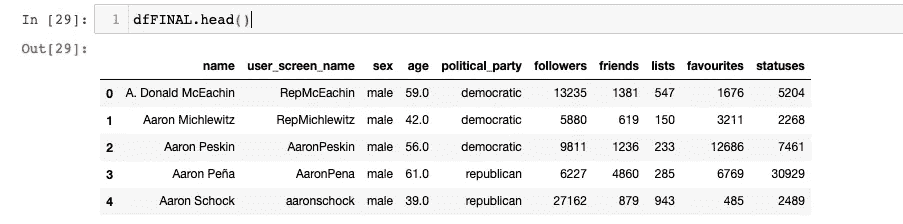

最终数据帧

此时，我们可以绘制基本的人口统计数据，如年龄、性别和党派。

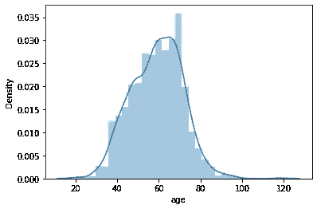

按年龄划分政治家

尽管几乎无法察觉，但数据集边缘的微弱信号暗示着我们的一个用户已经将近 120 岁了。我们确定那是真的吗？让我们通过按年龄对数据帧进行排序来检查一下。

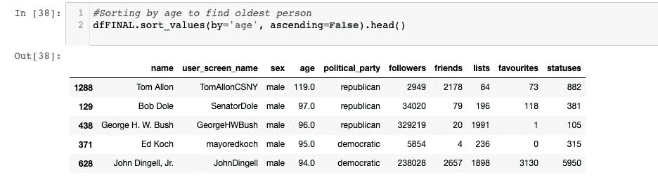

按年龄对数据帧排序

经过仔细观察，我们发现汤姆·艾伦要么是世界上最年轻的 119 岁老人，要么就是我们所谓的百岁老人的年龄不合适。因为我们希望在我们的聚类中包括年龄，并且因为这个人的表观年龄是如此引人注目的异常值(并且几乎肯定是不准确的)，我们应该将他从数据集中完全删除。再见汤姆。

据称是 119 岁的推特用户

我们也可以按年龄和性别来描绘政治家。正如我们所看到的，大多数政治家都在 50 多岁和 60 多岁，男性数量超过女性，比例超过 2 比 1，我们的名单上几乎没有跨性别政治家——这证实了年长男性确实主宰政治世界的说法。

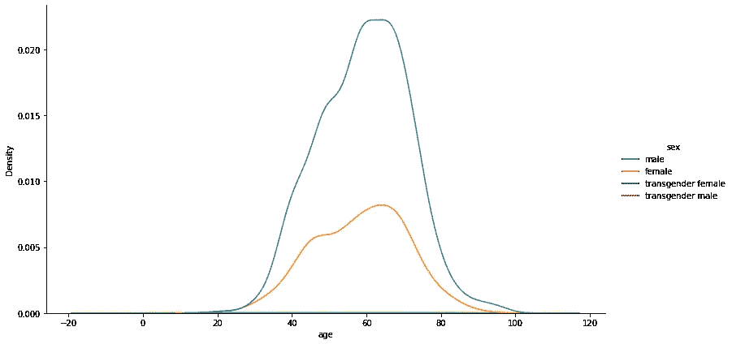

按年龄和性别绘制政治家图表(密度线图)

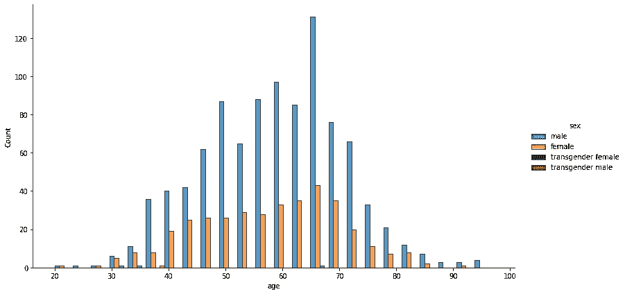

按年龄和性别绘制政治家图表(带计数的条形图)

事实上，在 1350 多名政治家中，只有 4 名跨性别者。

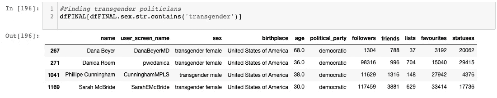

跨性别的美国政客

在这里我们可以看到政党的性别分布。共和党和民主党都让小党派相形见绌，虽然共和党男性是最大的个人群体，但女性在民主党中的比例要高得多，民主党整体上超过了共和党。

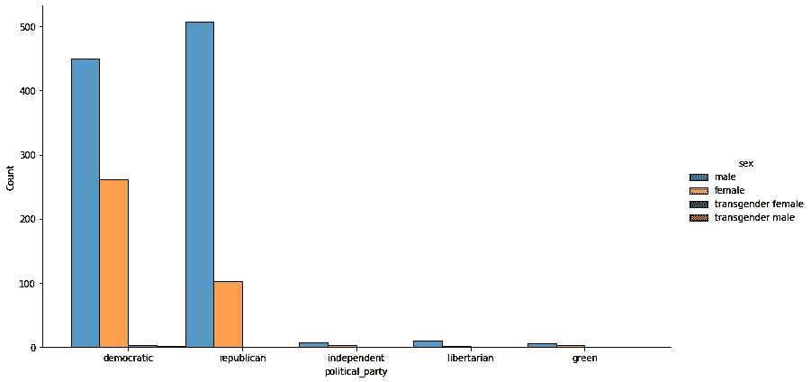

按性别和党派描绘政治家

# 数据聚类

既然我们已经满足了我们的好奇心，我们可以对数字数据执行我们的第一个肘方法，以确定对集合进行分组的最佳数量的 *k* 。值 4、6、7、8、9 和 10 指的是六列中每一列的索引号——年龄、关注者、朋友、列表、收藏夹和状态。

定义弯头方法

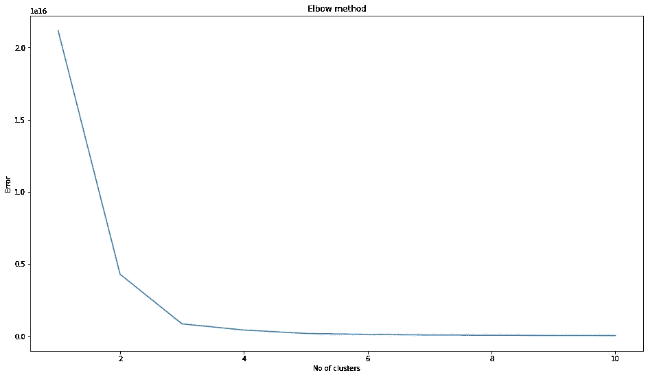

肘法(第一次尝试)

因为肘部在 3°左右向右弯曲，这个数字就成了我们的 *k.* 让我们为数据的每个特征识别聚类，并定位每个聚类的质心。

设置 K 个簇并识别质心

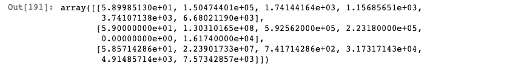

质心点(第一次尝试)

虽然乍一看有点混乱，但这里有 3 个总质心，用括号隔开，每个质心都有 6 组不同的奇异坐标，这些坐标基于我们输入系统的数值数据。让我们首先可视化集群本身，然后可视化集群内部的质心。

聚集关注者与年龄

在这里，我们可以问这样一个问题，一个 Twitter 政客的追随者数量与他们的年龄相关吗？让我们看看结果。

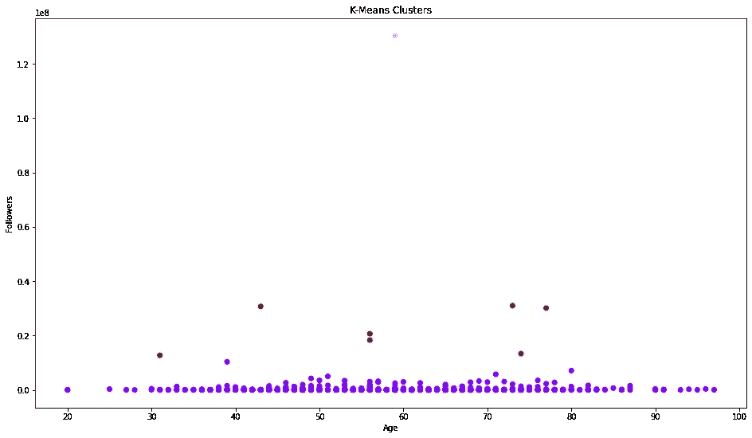

聚集关注者与年龄

虽然大多数数据点在 20 岁到 100 岁之间分布得相当广泛，但该图更集中在 40 岁到 80 岁的年龄范围内，在 50 岁和 70 岁出现了小高峰。基于这种观点，年龄并不是政治家受欢迎程度的决定性因素。绝大多数政治人物也聚集在一个由 0 到 1000 万追随者定义的集群中，第二大集群仅由 6 个拥有 1000 万到 3000 万追随者的用户组成。然而，这张图最显著的特征是第三个也是最后一个集群，它完全由一个远远高于其余的点组成，表现得如此引人注目，以至于它们成为了自己的集群。这个将近 60 岁的神秘人会是谁呢？

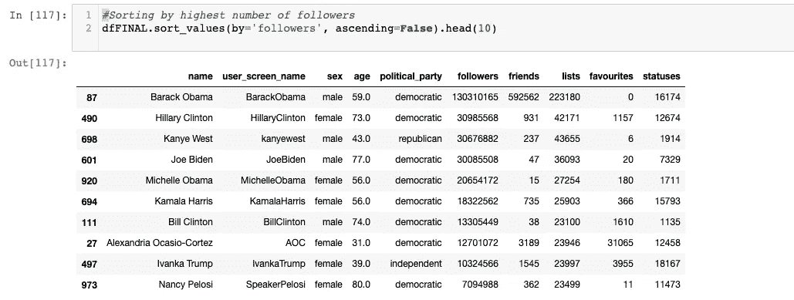

按大多数关注者排序

巴拉克·奥巴马——拥有最多追随者的人

巴拉克·奥巴马，美国第 44 任总统——拥有 1.3 亿推特粉丝的男人。这一数字是排名第二的政治家、前第一夫人和总统候选人希拉里·克林顿的四倍多，希拉里本人号称拥有 3000 多万。奥巴马的追随者数量和其他人之间的差异如此之大，以至于扭曲了图表，使得结果难以分析。

# 谢谢，奥巴马。

让我们将他从数据集中删除，只是为了消除异常值，并再次执行我们的肘方法和 k-means 聚类。

肘法(第二次尝试)

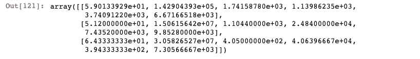

质心点(第二次尝试)

用质心对追随者和年龄进行聚类

虽然结果并不完全相同，但它们非常相似，所以我们可以继续对这个稍微更新的数据集进行聚类，并将 *k* 再次设置为 3——现在我们可以包括我们的质心了。

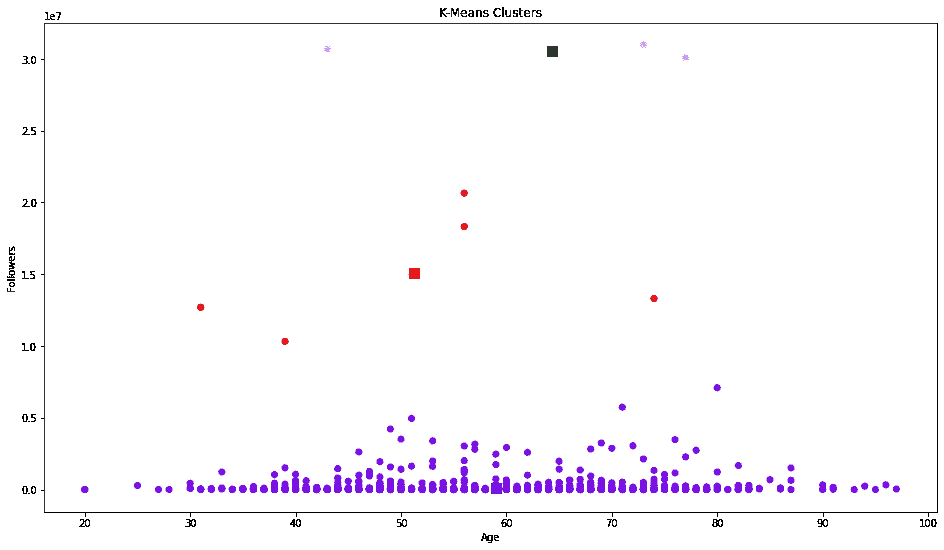

用质心对追随者和年龄进行聚类

现在，该图被扩展，单个集群被删除，第二个集群被分成两个，新用户群的 Twitter 粉丝数量最多，总数约为 3000 万:希拉里·克林顿、乔·拜登总统和前总统候选人/说唱明星坎耶·韦斯特。排在第二位的是那些拥有 1000 万到 2000 万粉丝的人:前第一夫人米歇尔·奥巴马、副总统卡玛拉·哈里斯、前总统比尔·克林顿、国会议员亚历山大·奥卡西奥·科尔特斯以及前总统的女儿伊万卡·特朗普。最后，第三个群集中的是其他所有人。

在大多数情况下，一个拥有 100 万粉丝的人会让他们远远超过其他普通人——但当你的竞争对手是来自世界上最强大国家的最杰出的政治家时，聚类算法会将 0 和 100 万归入同一类别:受欢迎程度最低。

那么，Twitter 上的总关注者和总朋友是如何关联的呢？

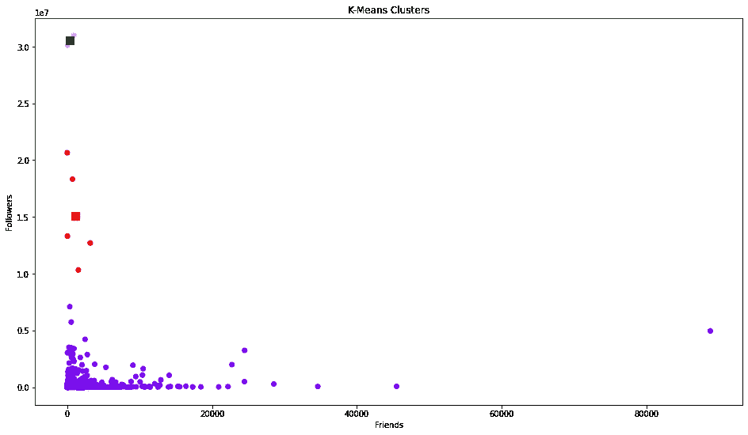

用质心聚集追随者和朋友

因为我们仍然基于关注者来绘制其中一个轴，所以该图中聚类的垂直分布与上一个图相似，只是点的水平排列发生了变化，以反映每个用户的朋友数量。

此外，尽管最受欢迎的政治家在社交媒体上几乎没有什么朋友，但许多追随者较少的人实际上有几千个自己的朋友。看起来受欢迎的政治家对其他人来说太酷了——或者那些追随者较少的人试图交更多的朋友以获得恶名。然而有一个人在平台上凭借近 9 万好友脱颖而出。这个非凡的合群个体是谁？

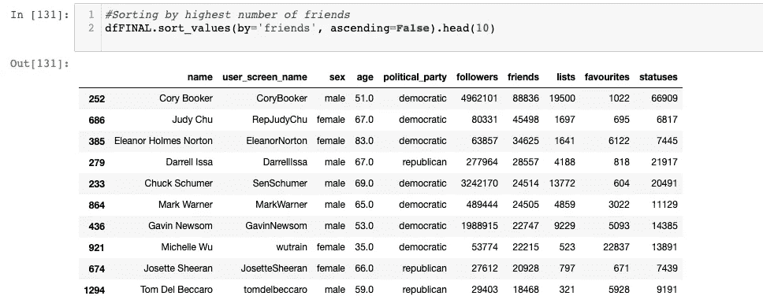

按大多数朋友排序

科里·布克——拥有最多朋友的男人

纽瓦克前市长、新泽西前参议员、前总统候选人科里·布克。布克拥有近 500 万粉丝，在第三组中名列前茅，仅次于众议院议长南希·佩洛西(7000 万人)和前总统候选人、马萨诸塞州参议员伊丽莎白·沃伦(5700 万人)。

然而不幸的是，很多朋友不是一个总统能交到的。

# 抱歉，科里。

我们还可以对关注者和喜爱者(或者用户喜欢另一个帖子的次数)进行聚类，这显示了与关注者和朋友有些类似的结果——大多数用户一般不太可能与其他人交往，但按照其他政治家的标准，那些交往的人几乎总是非常不受欢迎。

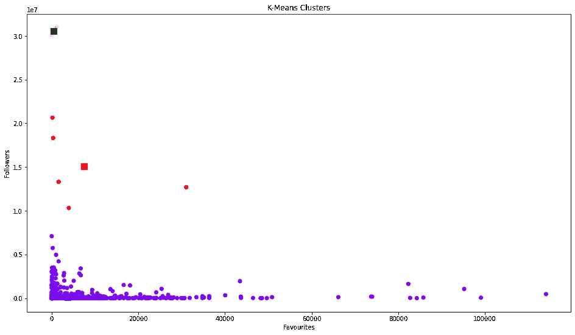

用质心聚类关注者与收藏夹

最突出的人是红色群集右侧的孤独红点，这是一个相对受欢迎的政治家，他也倾向于喜欢其他人发表的大量帖子。这个人的身份是什么？

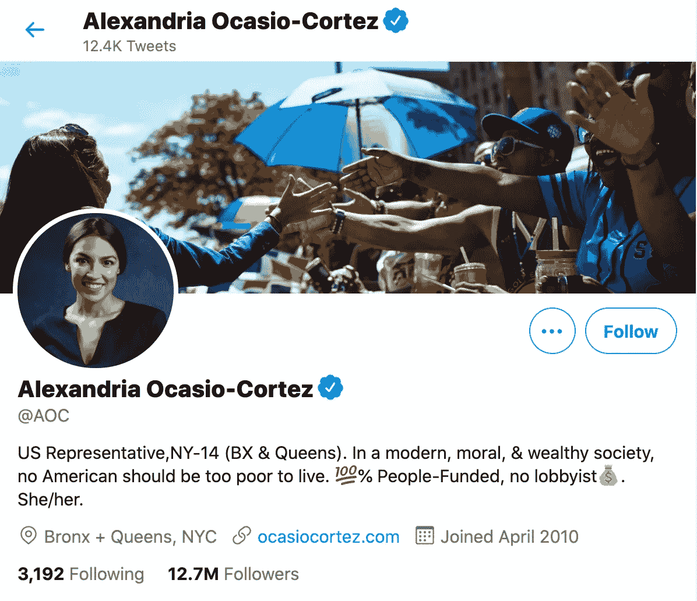

亚历山大·奥卡西奥·科尔特斯，这个女人有很多人喜欢(但不是最多)

来自纽约的美国众议员亚历山大·奥卡西奥·科尔特斯(Alexandria Ocasio-Cortez)是民主党的一名成员，这位勇敢的 31 岁女性在 2018 年的中期选举中击败了她的对手，一名 10 届在任者，赢得了全国的认可。虽然 AOC 不是这份名单中唯一最受欢迎的政治家，但她在前 10 名中，而且绝对是最年轻的之一。她还收藏了 3 万条帖子，这表明这位千禧一代比她周围的人更积极地使用社交媒体。

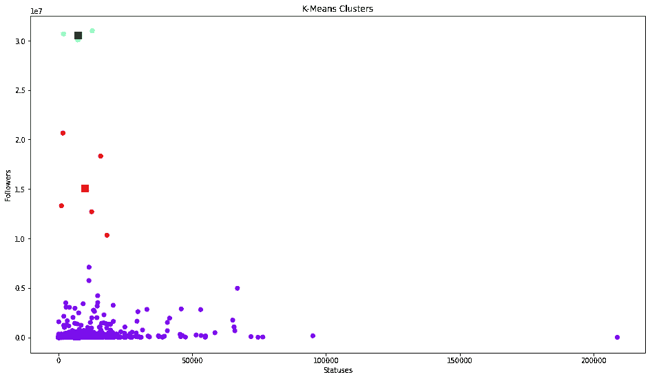

聚集关注者与具有质心的状态

上面显示的关注者与状态(或帖子)的可视化很像前面的那些——仅仅因为一个人发布了很多帖子并不意味着他们很受欢迎。但这并不意味着某些人不会尝试。

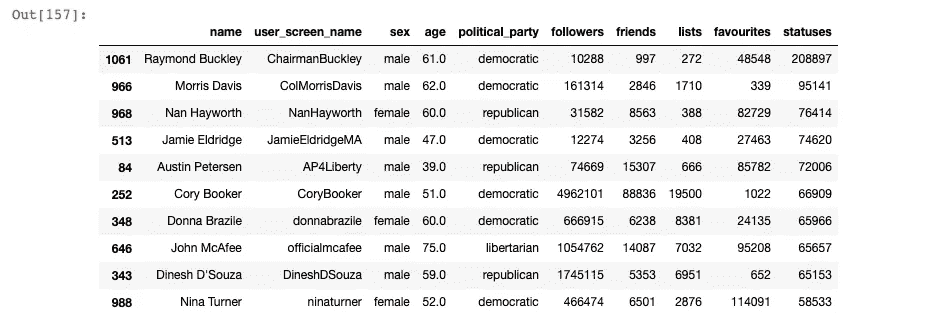

按大多数状态排序

雷蒙德·巴克利——最有地位的人

新罕布什尔州民主党主席雷蒙德·巴克利(Raymond Buckley)当然是尽最大努力发布最多的，迄今为止已有超过 20 万条状态。虽然人们永远不应该放弃成为社交媒体名人政治家的梦想，但除了发布大量内容之外，考虑其他策略可能会有所帮助。

最后，下面显示的关注者与列表的可视化揭示了这两个值之间的正相关关系:拥有最多关注者的人也是在最多列表上的人。Twitter 列表是不同帐户的精选组，任何人都可以创建和添加，一个人出现在许多列表上表明他们的生活或工作很有趣或与各种主题相关。

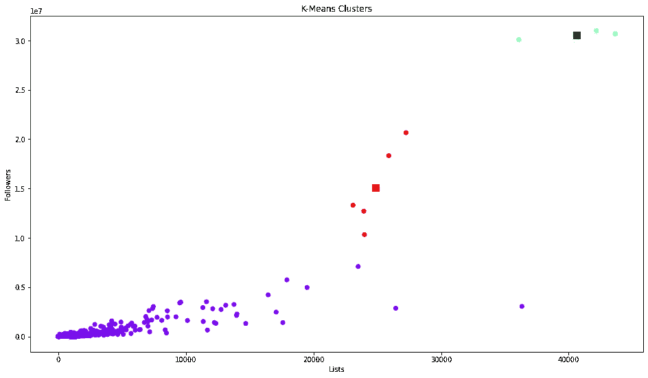

聚集关注者与具有质心的列表

有趣的是，图上有一个特殊的用户，他的追随者数量少，与他们的大量列表不一致:

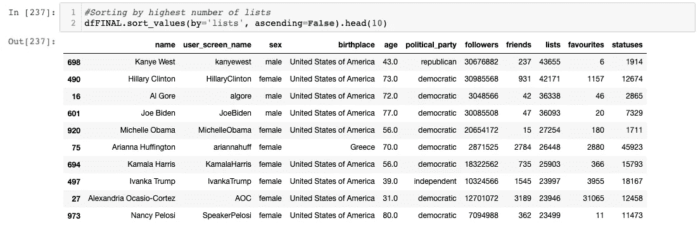

按大多数列表排序

阿尔·戈尔，一个有很多清单的人(但不是最多的)

阿尔·戈尔，美国第 45 任副总统，2000 年大选的前总统候选人，世界著名的环境保护主义者。我无法确定阿尔·戈尔出现在这么多名单上的确切原因(我也无法访问这些名单本身)，但我可以想象这与气候变化有关——这是他最著名的话题。然而，他的列表与关注者的比率完全是一个异常，在没有更多信息的情况下很难解释。

# 限制

在执行 k-means 聚类时，我观察到的第一个限制是聚类如何如此容易受到离群值的影响——这种情况下的主要例子是巴拉克·奥巴马，他的追随者数量如此之高，以至于盖过了所有其他人，导致他有了自己的聚类。在这种情况下，很难分析其他集群，因为它们之间的差异相比之下完全相形见绌。他必须完全从图表中删除，以便正确地测量其他细节。

这里的另一个限制是，我不能对非数字信息进行聚类，比如这个人的性别或政党。了解这两个因素中的任何一个是否与这个人在网上的受欢迎程度有关，或者他们在社交媒体上的表现如何，这将是一件有趣的事情。

如果这个数据集包括前总统唐纳德·特朗普(Donald Trump)也很有趣，他在 Twitter 上的活动非常独特，如果他没有被禁止，几乎肯定会成为图表上的另一个异常值。在 2021 年 1 月 8 日被永久删除之前，该男子拥有近 90，000，000 名粉丝和 6 万条推文。[【7】](https://www.tweetbinder.com/blog/trump-twitter/)

值得一提的最后一个细节是，Twitter(和一般的大型科技公司)倾向于在政治光谱上左倾，至少在社会政策方面。 [[8]](https://www.washingtonpost.com/technology/2018/08/19/twitter-ceo-jack-dorsey-admits-) 虽然其首席执行官杰克·多西声称他个人的偏见不会影响公司的政策，但该公司的实际服务条款主要反映了自由派的感受——特朗普当选总统后相对较新的用户禁令浪潮对共和党人、保守派和右翼的影响可以说超过了政治光谱的另一边。[【9】](https://www.usatoday.com/story/opinion/2021/01/14/trump-banned-twitter-rachel-bovard-column/4145532001/)结果，许多与这些意识形态团体结盟的用户放弃了 Twitter，在其他限制较少的平台上寻求庇护，如 Parler 或 Gab。根据这些信息，民主党政客在推特上更受欢迎是否是社交媒体外流的部分结果？还是民主党政客只是对科技更友好？如果我们分析其他社交媒体网站，我们会发现什么样的趋势？当政治人物转移到其他平台时，他们的行为和由此产生的统计数据会发生变化吗？这些都是有趣的问题，没有更多的数据我们根本无法回答。

# 结论

在做了这个分析后，我们可以给一个人的一个明显的建议是，要成为社交媒体上受欢迎的政治家，你不一定要年轻。

此外，虽然某些杰出的人，如巴拉克·奥巴马、唐纳德·特朗普、AOC(甚至可能还有坎耶·韦斯特)因利用强大的社交媒体存在来支持他们的个人成功而臭名昭著(尽管这仅适用于坎耶的音乐生涯，而不是他的政治竞选)，但他们并不是人们可能认为的多产海报。

事实上，*最受欢迎的*政客倾向于发布*最少的*，并且与其他人发布的帖子互动较少，这一悖论也暗示了社交媒体上的受欢迎程度不仅仅是某人在网上有多少活动的产物，而是他们*在他们的帖子中说了什么*，以及他们*在现实世界中做了什么*才值得开始发布。这也可能意味着他们只是太忙于在现实世界中说和做重要的事情，而没有时间不断更新他们在 Twitter 上的状态。

另一方面，数据集中一些最不受欢迎的政治家似乎有意通过大量的活动来吸引注意力——不幸的是，这种策略不太可能奏效，至少基于这一数据。

那么，这个故事的寓意是什么？或许在社交媒体上成为一个受欢迎的政治家，不在于你的朋友数量或你的帖子数量，而在于你的想法的价值和你的性格品质。

(或者，其他一些我尚未确定的更模糊的统计数据。)

# 参考

[1][https://knowledge . Wharton . upenn . edu/article/how-social-media-is-shaping-political-campaigns/](https://knowledge.wharton.upenn.edu/article/how-social-media-is-shaping-political-campaigns/)

[2][https://www . Washington post . com/news/politics/WP/2015/05/26/heres-how-the-first-president-of-the-social-media-age-has-choose-connect-with-Americans/](https://www.washingtonpost.com/news/politics/wp/2015/05/26/heres-how-the-first-president-of-the-social-media-age-has-chosen-to-connect-with-americans/)

[3][https://www . nytimes . com/interactive/2019/11/02/us/politics/trump-Twitter-presidency . html](https://www.nytimes.com/interactive/2019/11/02/us/politics/trump-twitter-presidency.html)

[4][https://towards data science . com/understanding-k-means-clustering-in-machine-learning-6a6e 67336 aa 1](https://towardsdatascience.com/understanding-k-means-clustering-in-machine-learning-6a6e67336aa1)

[5][https://www . geeks forgeeks . org/elbow-method-for-optimal-value-of-k-in-k means/](https://www.geeksforgeeks.org/elbow-method-for-optimal-value-of-k-in-kmeans/)

[6][https://www . ka ggle . com/Mr morj/us-politics-Twitter-dataset](https://www.kaggle.com/mrmorj/us-politicians-twitter-dataset)

[https://www.tweetbinder.com/blog/trump-twitter/](https://www.tweetbinder.com/blog/trump-twitter/)

[8][https://www.tweetbinder.com/blog/trump-twitter/](https://www.tweetbinder.com/blog/trump-twitter/)

[9][https://www . USA today . com/story/opinion/2021/01/14/trump-banned-Twitter-Rachel-bo vard-column/4145532001/](https://www.usatoday.com/story/opinion/2021/01/14/trump-banned-twitter-rachel-bovard-column/4145532001/)

[10][https://www . USA today . com/story/tech/2021/01/11/what-gab-social-network-getting-popularity-amid-parler-acryption/6620906002/](https://www.usatoday.com/story/tech/2021/01/11/what-gab-social-network-gaining-popularity-amid-parler-crackdown/6620906002/)