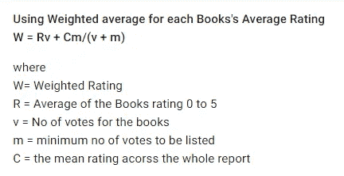
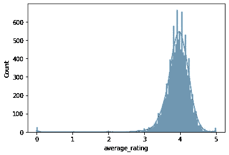

# 接下来该读什么？书籍推荐

> 原文：<https://medium.com/nerd-for-tech/what-should-i-read-next-books-recommendation-311666254817?source=collection_archive---------18----------------------->

## 利用加权平均技术实现图书推荐系统

照片由[🇸🇮·扬科·菲利](https://unsplash.com/@itfeelslikefilm?utm_source=medium&utm_medium=referral)在 [Unsplash](https://unsplash.com?utm_source=medium&utm_medium=referral) 上拍摄

一个**推荐系统**，或一个**推荐系统**(有时用一个同义词如平台或引擎代替‘系统’)，是[信息过滤系统](https://en.wikipedia.org/wiki/Information_filtering_system)的一个子类，它试图预测用户对一个项目的“评分”或“偏好”

推荐系统被用于各种领域，通常公认的例子采取视频和音乐服务的播放列表生成器、在线商店的产品推荐器、或者社交媒体平台的内容推荐器和开放网络内容推荐器的形式。这些系统可以使用单一输入(如音乐)或跨平台的多个输入(如新闻、书籍和搜索查询)来运行。

有许多方法可以建立一个推荐系统。我通过使用加权平均技术建立了推荐系统。

W ***八次平均***

最简单的解释方式是，虽然数据集包含用户收到的所有投票，但不是所有的*投票对最终评级都有相同的影响(或'*权重*')。因此，我们使用这个数学公式来计算每本书的加权评分。*

# 目录

1.  [关于数据集](#b2a6)
2.  [解释性数据分析](#dc5a)
3.  [实施加权平均值](#612b)
4.  [基于加权平均值的建议](#5214)
5.  [基于加权平均值和文本评论的建议](#f996)
6.  [总结](#a756)
7.  [未来工作](#4768)
8.  [参考文献](#8b3f)

# №1:关于数据集

这个文件主要包含关于书籍的详细信息。每一列的详细描述可以在旁边找到。

*   bookID:每本书的唯一标识号。
*   书名:这本书出版时所用的名字。
*   作者:书的作者的名字。多个作者用
*   average_rating:总收到的图书的平均评分。
*   isbn:另一个识别图书的唯一号码，国际标准书号。
*   isbn13:识别图书的 13 位 isbn，而不是标准的 11 位 ISBN。
*   language_code:帮助理解书籍的主要语言是什么。例如，eng 是英语的标准
*   num_pages:书籍包含的页数。
*   reatings _ count:该书获得的评分总数。
*   text_reviews_count:这本书收到的文字评论总数。

# №2:解释性数据分析

现在我们进行探索性的数据分析，以获得洞察力

数据集似乎没有空值。这很好！！！

让我们试着理解评级趋势

据观察，评级范围从 3 到 5，很少有书的评级低于 3。

从原始数据帧中提取相关特征

# №3:实施加权平均值

**对每本书的平均评分采用加权平均**
**W = Rv + Cm/(v + m)**

其中
W=加权评分
R =书籍评分 0 到 5 的平均值
v =书籍投票数
m =列出的最小投票数
C =整个报告的平均评分

# №4:基于加权平均值的建议

> 这是基于加权分数的最受欢迎书籍列表。《卡文和霍布斯全集》似乎在这个图表中名列前茅。

# №5:基于加权平均值和文本评论的建议

基于比例加权平均值和文本评论的建议(两者的优先级均为 50%)

当缩小两个字段的值时，执行数据规范化

以下是基于**加权平均**和**文本评论**同等加权的图书列表

下面我已经格式化了这些列，这样就可以显示这些书的完整名称😃

# №6:摘要

*   我们从 Kaggle 下载了图书数据集。
*   我们运行了 EDA 并分析了输入特性。
*   根据公式计算加权平均值。
*   我们根据加权分数推荐书籍。
*   我们根据加权分数和评论数推荐书籍。

# №7:未来的工作

*   尝试通过实现协作过滤来评估结果。
*   还可以实现皮尔逊相关，并且可以分析结果。
*   采用不同的数据集(movies IMDB)并实施加权平均技术。

# 8 号:参考文献

*   [https://www.youtube.com/watch?v=_hf_y-_sj5Y&list = plzotaelrmxvn 7 qgpcun-VG 35 hgjp 3 htvi&index = 1&ab _ channel = KrishNaikKrishNaikVerified](https://jovian.ai/outlink?url=https%3A%2F%2Fwww.youtube.com%2Fwatch%3Fv%3D_hf_y-_sj5Y%26list%3DPLZoTAELRMXVN7QGpcuN-Vg35Hgjp3htvi%26index%3D1%26ab_channel%3DKrishNaikKrishNaikVerified)
*   [https://github . com/krishnaik 06/Recommendation _ complete _ tutorial/blob/master/Average Weighted 推荐引擎使用 Python.ipynb](https://jovian.ai/outlink?url=https%3A%2F%2Fgithub.com%2Fkrishnaik06%2FRecommendation_complete_tutorial%2Fblob%2Fmaster%2FAverage%2520Weighted%2520Recommendation%2520Engines%2520using%2520Python.ipynb)
*   https://seaborn.pydata.org/generated/seaborn.histplot.html
*   链接工作代码—[https://github . com/hargurjeet/recommendation-Systems/blob/main/Books _ recommendations . ipynb](https://github.com/hargurjeet/Recommedation-Systems/blob/main/Books_Recommendations.ipynb)

我真的希望你们能从这篇文章中学到一些东西。随意👏如果你喜欢你所学的。如果有什么需要我帮忙的，请告诉我。