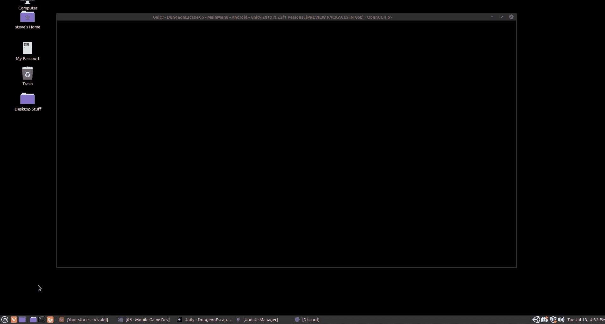
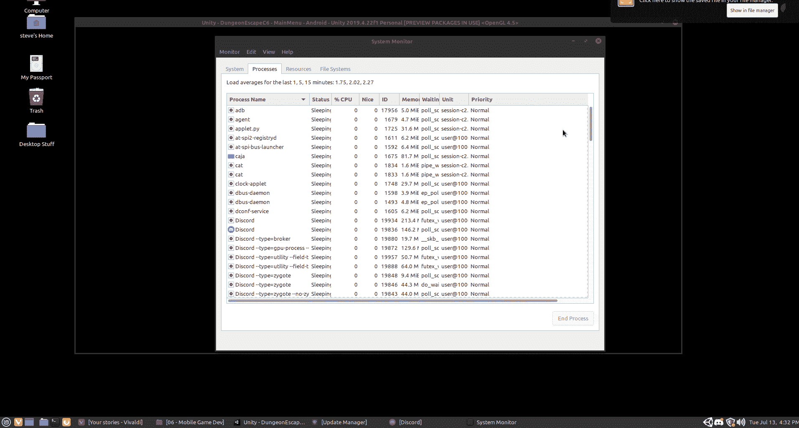

# Linux Mint 中 Unity 不关闭怎么办？

> 原文：<https://medium.com/nerd-for-tech/what-to-do-if-unity-wont-close-in-linux-mint-bc3423898e5a?source=collection_archive---------16----------------------->

我不知道其他人，但似乎 Unity 的最新版本一直不想关闭，似乎更经常地变成僵尸。如果这种情况发生在你身上，你可以使用系统监视器杀死它。

首先，单击开始菜单，在搜索框中查找系统显示器并选择它。

虽然您可能会在逻辑上寻找名为 Unity 的程序线程，但这太有意义了。相反，寻找“主线程”并点击右键，选择“杀死进程”,然后让 Unity 窗口脱离苦海！

希望这有所帮助！