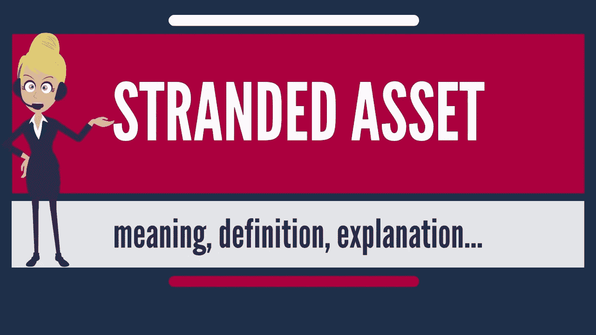

# 搁浅资产怎么办？

> 原文：<https://medium.com/nerd-for-tech/what-to-do-with-stranded-assets-5c56afe6ab1a?source=collection_archive---------14----------------------->

这是大流行后企业管理的一般指南。

大流行后时代极有可能以剧变为特征。一些资产注定会搁浅，被社会和技术变革淘汰。业务经理完全知道一些资产将被搁置，必须找到管理这些资产的方法。

大多数搁浅的资产对话都围绕着用可再生能源取代碳基能源。能源行业未来某个时候注定要搁浅的资产规模之大，引起了人们的关注。

然而，疫情引发并加速的社会变革将使更多能源部门以外的资产搁浅。在未来的十年或二十年，我们将目睹价值数十亿美元的资产就这样被搁置。否认在埃及不是一条河。许多人看到了当前的基础设施，观察到它是多么庞大，并否认如此辉煌和宏伟的资产可能会搁浅。

商业地产是普遍否认的一个领域。业主和企业主都坚信，人们会回到办公室。目前，自恋的老板痴迷于通过在员工面前昂首阔步和在电梯里保持安静来证明自己的重要性，他们要求员工应该回到办公室。人们肯定会大吃一惊。人才流失到灵活的竞争对手手中，旷工，以及从出现在办公室的员工那里得不到结果，将导致他们最终摆脱否认。当这种情况发生时，办公室和办公大楼将不复存在。数十亿人将会搁浅。管理商业房地产投资组合的家伙现在必须思考搁浅资产的问题。

搁浅资产将普遍存在的行业示例如下:

*   **商业地产**——部分写字楼将被滞留，成为商业租户的幽灵。
*   **购物中心**——在美国和一些高度发达的国家，购物中心正在消亡并陷入困境。在发展中国家，购物中心不会很快陷入困境。
*   **电信** — 5G 和 VOIP 快速取代 3G 蜂窝网络和 CDMA 网络。
*   教育——幽灵图书馆——一旦数字原住民成年，图书馆可能很快就会像恐龙一样古老。
*   **教育-幽灵校园-** 大部分非技术教育将在网上进行，留下一些空的校园建筑。
*   **工厂&设备** —制造业的技术创新将会以我们前所未有的速度淘汰工厂&设备(纳米技术应用于制造业和 3D 打印)。

# 库示例

面对这些变化的企业经理必须创造性地思考。假设开普敦市的一位经理负责监管该市拥有和运营的 103 个图书馆。人们普遍认为图书馆已死。谷歌和亚马逊杀了它。内容的数字化降低了对图书馆服务的需求。大多数内容都是以数字格式消费的。然而，图书馆仍然发挥着提供一个安静的学习场所的功能。临近考试日，大学附近的几个图书馆客流量很大。大部分流量是学生带来他们的笔记本电脑来学习和写作业。这些人大多很少接触图书馆的书籍。他们只是把图书馆当作一个学习的地方。在考试之外，大多数图书馆真的很安静，偶尔会有领养老金的人来，他们仍然有阅读实体书的文化。

这些年来，图书馆越来越空了。随着养老金领取者的死亡和数字原住民长大成人，经常使用图书馆的人数减少了。在接下来的几十年里，图书馆可能会真正消亡。

业务经理是否应该让图书馆在一年中的两个时间段(共 8 周)开放，供那些为考试而学习的人使用，他们并没有真正阅读图书馆中的任何书籍？经理应该如何处理这一搁浅的资产？

经理应该转向。被称为图书馆的实体建筑被搁置了，因为没有人真正再使用它们。这些建筑应该重新利用。事实是，开普敦人从未真正发展出一种在世界其他城市盛行的图书馆文化。这些图书馆，尤其是位于高密度区域的图书馆，一直未得到充分利用。管理者应该清空图书馆，将所有的图书集中到一个图书中心，通过数字界面提供图书馆服务，公民可以在家中舒适地浏览图书馆，并订购他们想要阅读的实体书，然后由免费送货服务送到他们的家中，该服务还执行检查还书的功能。这将确保那些想要阅读实体书的人仍然可以获得这项服务。管理者必须投资一个免费的交付服务，这比维护 103 个独立的图书馆要便宜。

业务经理可以重新调整物理库的用途。可以说开普敦的人们有更多的诊所比他们从不使用的图书馆更富裕。这 103 个闲置资产中的 100 个可以变成专门的孕产妇诊所，为公民释放巨大的价值。

如果业务经理不转向，他将不得不承担运营 103 个对社会毫无用处的图书馆的成本。他将不得不支付图书管理员、清洁工、保险等费用，来获得一项被迅速减少的一小部分人口所使用的服务。在接下来的几十年里，他将会维护一些注定会完全搁浅的东西。

# 处理滞留资产的一般要点

*   绕轴旋转
*   改变…的用途
*   变成一个旅游景点
*   退役—止损

上面给出的图书馆的例子包括业务的转变(通过数字接口访问图书馆服务)和再利用(将建筑物用作诊所)。这通常适用于许多企业。

**搁浅的商业地产可以转向并改变用途**。如果城市分区法允许的话，他们可以将该建筑改造成住宅地产。拥有并经营一个很少有人使用的大型办公空间的企业可以提供“我们工作”类型的共享工作空间。有些人偶尔需要办公空间，但不想租用整个办公室。他们可以利用这个空间，并为此向公司付费。相对于在低迷的商业地产市场以巨大的折扣直接出售资产，他们从定价工作中获得的微薄收入可能是管理搁浅资产的更好方式。

高层商业建筑的旋转和再利用的一个很好的例子是将屋顶出租给电信公司，这些公司可能有兴趣增加手机发射塔和 5G 助推器。由此收取的租金可以在很大程度上弥补维护建筑的运营成本。

**独特行业和独特地区的闲置资产可以变成旅游景点。**这是一项长期战略。它不是一夜之间发生的。大津巴布韦曾经是一个被称为津巴布韦废墟的搁浅资产。它变成了一个旅游景点。对于业务经理来说，这通常不是一个好的建议。

**退役是一个验收问题**。有些资产真的无望了。2010 年，我在一家电信公司工作，该公司正在推出 CDMA 网络，与成熟的 GSM 网络竞争。十年后，GSM 和 CDMA 都几乎寿终正寝。现在 LTE 和 5G 才是王道。当电信公司面对一大堆来自 CDMA 客户的取消请求，却没有注册时，该怎么办？迟早没有人会使用 CDMA 网络。保持一个没有被任何人使用的网络的存活是昂贵的。2021 年，没有人会傻到去买 CDMA 设备。因此，电信公司不能向任何人出售这些设备。退役是答案。接受你的损失。停止损失。限制损失。

员工是人力资源。他们是企业的资产。当这些资产被搁置时，退役是大多数业务经理的默认答案。在这种情况下，退役采取紧缩的形式。这将在大流行后的世界中得到保证。技术将会使工作变得更有效率，而束手无策的人力资源可能需要退役。我们谈论的是人类。他们有家庭。在采取解除搁置的人力资产之前，业务经理应该首先考虑转换和重新利用。

在您部署自动化客户服务系统之前，将一些即将陷入困境的客户服务人员送到编码训练营，这样他们就可以作为初级开发人员、系统分析师、用户界面分析师等，负责监督和完善您的自动化系统。

再见。