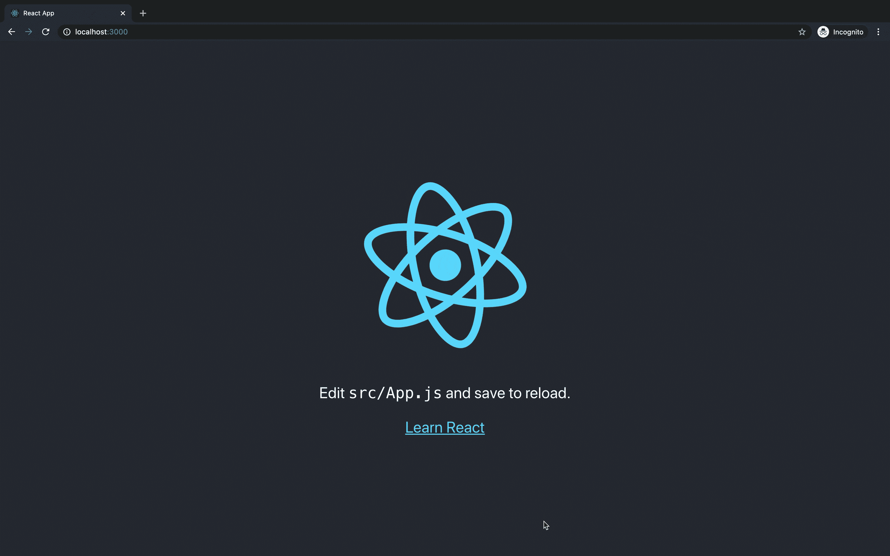

# 当你期待一个网络应用时，你会期待什么

> 原文：<https://medium.com/nerd-for-tech/what-to-expect-when-youre-expecting-a-web-application-440c7b985a54?source=collection_archive---------30----------------------->

## *使用 Rails API 后端和 React 前端构建 web 应用的描述和指南*

想象一下，你想出了一个关于网络工具的绝妙主意，它将彻底改变做事的方式。为了实现你的想法，你知道你需要建立一个网站或网络应用程序。要做出决定，问自己这两个问题:

1.  会不会涉及到需要管理的数据？
2.  它也需要客户端吗？

如果你对这两个问题的回答都是肯定的，那么很有可能你正在考虑构建一个 web 应用程序。太神奇了！但是什么是*一个**网络应用**呢？*

*到底什么是 web 应用程序？*

*简单来说，“[web app 是一款可以通过浏览器访问的软件。换句话说，我们可以说 web 应用程序是具有功能和交互元素的网站](https://www.freecodecamp.org/news/difference-between-a-website-and-a-web-application/)。Instagram、脸书和 Twitter 都是拥有大量互动元素的动态网络应用的典范。*

*既然您知道您需要构建一个 web 应用程序，让我们开始吧！*

# *作为 API 的 Rails*

*对于像我这样对后端构建毫不挑剔的人来说，Rails 是一个很好的 API 选项。“它提供了一组默认值，允许开发人员快速启动并运行，而不必做出许多琐碎的决定。”点击这里阅读更多关于 Rails 作为 API 为何如此伟大的信息。*

*不管怎样，我们开始吧！*

*启动并运行 API 的第一件事是在命令行中输入以下代码行:*

```
*$ rails new your-app-name — database=postgresql — api -T*
```

*让我们打破它，好吗？*

*代码的前半部分启动了一个新的 Rails 应用程序，就像您试图构建一个基本的 Rails 应用程序一样。下一部分代码将数据库从 SQLite 更改为 PostgreSQL。两者的主要区别在于性能。" **SQLite** 非常快，这要归功于它最小的设计和简单的操作。如果您需要的只是快速读取操作， **PostgreSQL** 可能是一个过度杀手，可能会显得性能较低。说到复杂运算， **PostgreSQL** 就是一头野兽。”你可以在这里阅读更多关于差异的[。下一部分告诉计算机你只是把它作为一个 api 来使用，因此，去掉任何额外的 gems，cookies 和 sessions。最后， *-T* 跳过所有的测试文件。](https://tableplus.com/blog/2018/08/sqlite-vs-postgresql-which-database-to-use-and-why.html)*

*接下来，让我们用这行代码向我们的应用程序添加一些模型:*

```
*$ rails g scaffold Employees name date_of_birth:date lucky_number:integer*
```

*它创建了一个名为 employees 的表，有三列。姓名列将由一个字符串(也可以写成这样*姓名:字符串*)、用日期列类型表示的出生日期和使用整数列类型的幸运数字组成。现在等一下，这个*脚手架*是什么？嗯，很高兴你问了！这是 Rails 继续用一点魔力照耀着我们。你看，这里不仅创建了表，还建立了我们的模型文件，路由，并在我们的控制器中为我们做了一些编码。要阅读更多关于*脚手架*、[的神奇之处，这里](/@matt.readout/rails-generators-model-vs-resource-vs-scaffold-19d6e24168ee)是一个很好的资源！*

*好了，让我们通过向我们的 *db/seeds.rb* 文件添加一些种子数据来完成我们的后端，如下所示:*

```
*10.times do
Employee.create(name: Faker::Name.name, date_or_birth: Faker::Date.birthday(min_age: 18, max_age: 65), lucky_number: Faker::Number.digit)
end*
```

*如您所见，我已经用指定的列名和它们的值创建了 10 个雇员。为了简单起见，我使用了一些 Faker 数据。要了解更多关于 Faker 宝石以及如何使用它，请看这里。*

*太神奇了！现在，让我们在 CL 中运行它:*

```
*$ rails db:create
$ rails db:migrate db:seed
$ rails s*
```

*这些代码行将建立您的数据库，播种您的数据，然后运行您的服务器。*

*恭喜你！您现在已经成功地设置了您的后端和它的生活！在浏览器中导航至[*http://localhost:3000*](http://localhost:3000)*。如果你看到下面的动画，那么你就成功了。**

**

*耶！你在铁轨上！*

*您还应该能够导航到[*http://localhost:3000/employees*](http://localhost:3000/employees)，并查看我们输入到种子文件中的所有数据。*

# *反应前端*

*既然您的后端已经启动并运行，是时候开始您的前端了。我们只需首先确保我们不在 rails 目录中，然后运行以下代码:*

```
*$ npx create-react-app my-app-name*
```

*完成后，继续导航到你的应用程序，然后输入 **npm start** 。如果你在浏览器中看到这个可爱的旋转图像，那么你就成功了！*

**

*祝贺您构建了您的 web 应用程序！*

*显然，要真正完成它还有很多工作要做，但是你已经开始着手构建你的新的非常令人兴奋的应用程序了！关于创建 React 应用的更多信息，请访问这个[站点](https://reactjs.org/docs/create-a-new-react-app.html)。我还发现这个[博客](/swlh/how-to-use-rails-backend-with-react-frontend-8cc81302eb63)非常有帮助，提供了更多关于构建应用程序的信息。*

*非常感谢你的阅读。如果你觉得这有用或有趣，请鼓掌、评论并关注！*

*编码快乐！🎉*