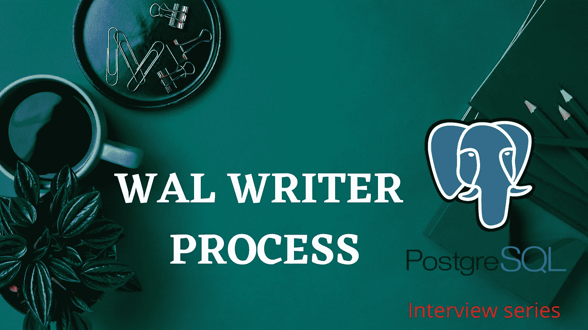
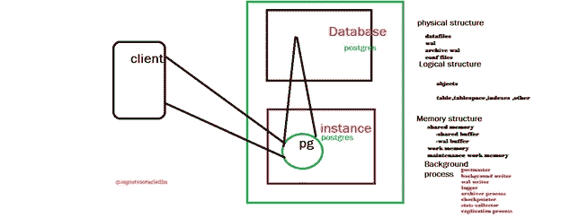
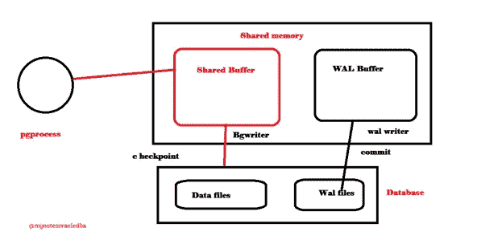

# 如果我们在 PostgreSQL 中杀死了 WAL Writer 进程会怎么样？|采访问答

> 原文：<https://medium.com/nerd-for-tech/what-will-happen-if-we-killed-the-wal-writer-process-in-postgresql-73cc0ea0e6df?source=collection_archive---------5----------------------->

为了理解 WAL Writer 进程的重要性并查看手动终止 WAL Writer 进程的演示结果



PostgreSQL 体系结构是一种客户端-服务器体系结构，当客户端发出请求时，服务器将对其做出响应。核心是 RDBMS，所以它将支持 SQL 和 NoSQL 数据。

该架构包含

1.  **实例**
2.  **后台进程**
3.  **数据库**
    i)物理结构
    ii)逻辑结构



PostgreSQL 数据库概述

**实例:**

它总是向数据库打开，它总是取决于 RAM 的大小。一旦集群启动，内存将被分配给实例。

它包含三个主要内存:

1.  **共享内存**
    **i)共享缓冲
    ii)WAL 缓冲**
2.  **工作记忆**

**3。维护工作记忆**

**共享内存:**

客户端或用户在与数据库建立成功连接后，如果请求 **PGPRocess** 的客户端将查看共享缓冲区中是否已有数据，或者如果共享缓冲区中已有数据，它将响应客户端，否则它将从数据文件中提取数据并复制到共享缓冲区中，并响应客户端请求。



如果数据库发生变化，原始数据将首先被复制到 WAL 缓冲区，因为要保持数据库的一致性。一旦发生检查点事件，脏缓冲区将通过 BG writer 进程写入数据文件。在提交时，发生一个事件，数据将通过 WAL 写进程从 WAL 缓冲区写入 WAL 文件。

注意:剩下的部分将在以后的博客中讨论。

让我们看看，如果我们手动终止 wal writer 进程，我们正在数据库上执行一个繁重的事务，并看看数据库端会发生什么情况。

让我们连接我的 PostgreSQL 机器

**检查运行状态:**

```
ps -ef|grep data
```

使用 psql 连接您的数据库，一旦我们连接到数据库中创建一个表

**创建表格:**

```
Create table sales (sal_id integer);
```

**上传批量数据到数据库**

```
Insert into sales select g.sal_id
FROM generate_series(1, 10000000) AS g (sal_id);
```

现在，我已经复制了会话来查看所有 Postgres 后台进程

**检查 Postgres 流程:**

```
$ps -ef|grep postgres
postgres 831 1 0 17:38 ? 00:00:00 /usr/pgsql-12/bin/postmaster -D /var/lib/pgsql/12/data/
postgres 998 831 0 17:38 ? 00:00:00 postgres: logger
postgres 1054 831 0 17:38 ? 00:00:00 postgres: checkpointer
postgres 1055 831 0 17:38 ? 00:00:00 postgres: background writer
**postgres 1056 831 0 17:38 ? 00:00:00 postgres: walwriter**
postgres 1057 831 0 17:38 ? 00:00:00 postgres: autovacuum launche r
postgres 1058 831 0 17:38 ? 00:00:00 postgres: stats collector
postgres 1059 831 0 17:38 ? 00:00:00 postgres: logical replicatio n launcher
root 1627 1607 0 17:40 pts/0 00:00:00 su - postgres
postgres 1628 1627 0 17:40 pts/0 00:00:00 -bash
postgres 1655 1628 0 17:41 pts/0 00:00:00 psql
postgres 1656 831 6 17:41 ? 00:00:20 postgres: postgres postgres [local] INSERT
root 1717 1696 0 17:45 pts/1 00:00:00 su - postgres
postgres 1718 1717 0 17:45 pts/1 00:00:00 -bash
postgres 1742 1718 0 17:46 pts/1 00:00:00 ps -ef
postgres 1743 1718 0 17:46 pts/1 00:00:00 grep - color=auto postgres
```

**杀死 WAL Writer 进程:**

现在，我将使用 kill 命令终止 wal writer 进程

```
kill -9 1056
```

成功杀死 wal writer 进程后。

**验证 Postgres 流程:**

```
ps -ef |grep postgres
postgres 831 1 0 17:38 ? 00:00:00 /usr/pgsql-12/bin/postmaster -D /var/lib/pgsql/12/data/
postgres 998 831 0 17:38 ? 00:00:00 postgres: logger
root 1627 1607 0 17:40 pts/0 00:00:00 su - postgres
postgres 1628 1627 0 17:40 pts/0 00:00:00 -bash
postgres 1655 1628 0 17:41 pts/0 00:00:00 psql
root 1717 1696 0 17:45 pts/1 00:00:00 su - postgres
postgres 1718 1717 0 17:45 pts/1 00:00:00 -bash
**postgres 1745 831 86 17:47 ? 00:00:09 postgres: startup recovering 0000000100000000000000CE**
postgres 1747 1718 0 17:47 pts/1 00:00:00 ps -ef
postgres 1748 1718 0 17:47 pts/1 00:00:00 grep - color=auto postgres
```

同时，它在终端内部显示以下结果

```
WARNING: terminating the connection because of crash of another server process
DETAIL: **The postmaster has commanded this server process to roll back the current transaction and exit, because another server process exited abnormally and possibly corrupted shared memory.**
HINT: In a moment you should be able to reconnect to the database and repeat your command.
server closed the connection unexpectedly
This probably means the server terminated abnormally
before or while processing the request.
The connection to the server was lost. Attempting reset: Failed.
!>
```

当前事务已经存在，数据库已经回滚

邮局主管已命令此服务器进程回滚当前事务并退出，因为另一个服务器进程异常退出并可能损坏了共享内存。

Postgres 本身所有的服务器进程都被终止并重新初始化。数据库从第一次重做恢复到最后一次应用的重做。一旦应用成功，数据库就准备好接受连接。

**集群重启后:**

```
$ps -ef |grep postgres
postgres 831 1 0 17:38 ? 00:00:00 /usr/pgsql-12/bin/postmaster -D /var/lib/pgsql/12/data/
postgres 998 831 0 17:38 ? 00:00:00 postgres: logger
root 1627 1607 0 17:40 pts/0 00:00:00 su - postgres
postgres 1628 1627 0 17:40 pts/0 00:00:00 -bash
postgres 1655 1628 0 17:41 pts/0 00:00:00 psql
root 1717 1696 0 17:45 pts/1 00:00:00 su - postgres
postgres 1718 1717 0 17:45 pts/1 00:00:00 -bash
postgres 1749 831 0 17:47 ? 00:00:00 postgres: checkpointer
postgres 1750 831 0 17:47 ? 00:00:00 postgres: background writer
**postgres 1751 831 0 17:47 ? 00:00:00 postgres: walwriter**
postgres 1752 831 0 17:47 ? 00:00:00 postgres: autovacuum launche r
postgres 1753 831 0 17:47 ? 00:00:00 postgres: stats collector
postgres 1754 831 0 17:47 ? 00:00:00 postgres: logical replicatio n launcher
postgres 1755 1718 0 17:48 pts/1 00:00:00 ps -ef
postgres 1756 1718 0 17:48 pts/1 00:00:00 grep - color=auto postgres
```

**概要:**

在 commit 事件发生时，WAL writer 进程会定期将数据从 WAL 缓冲区写入 WAL 文件，以保持数据库的一致性，即使进程失败，postmaster 进程也会退出当前事务并回滚服务器。