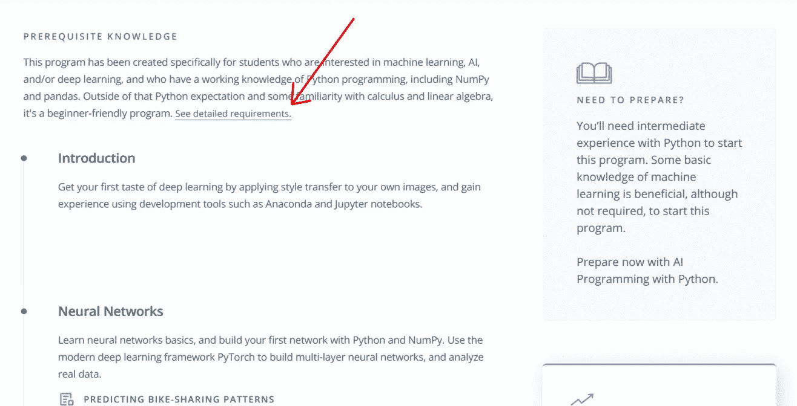
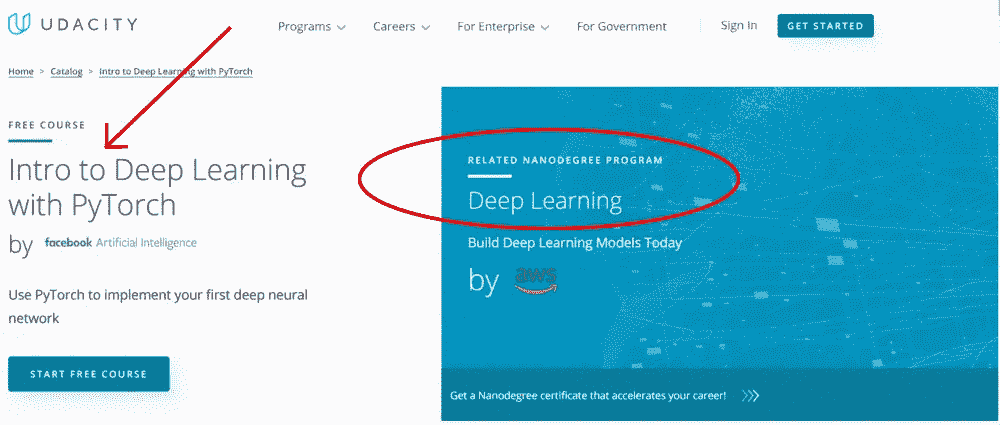
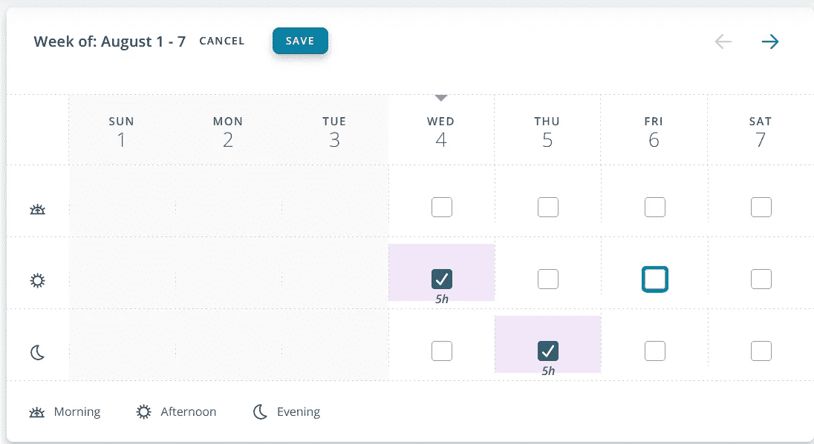
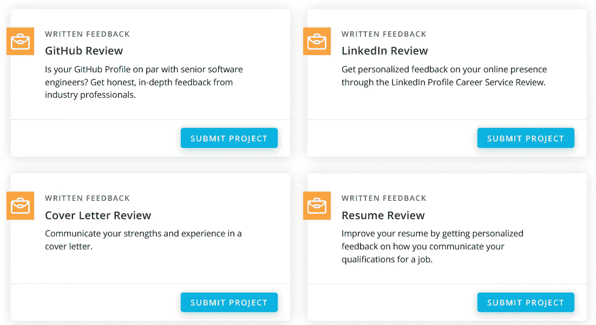
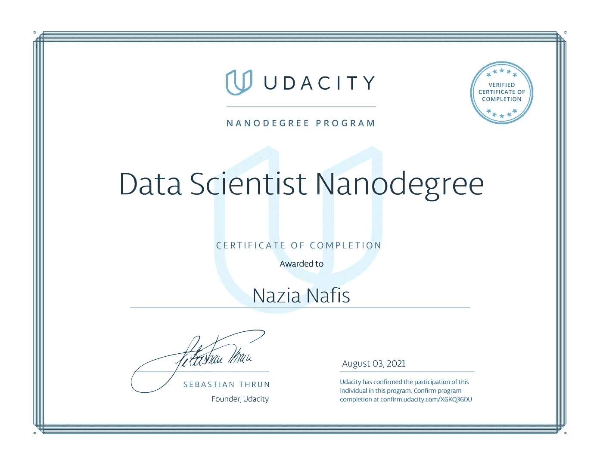

# 平稳的 Udacity 纳米学位体验的 11 个技巧

> 原文：<https://medium.com/nerd-for-tech/what-you-can-learn-from-my-udacity-nanodegree-experience-part-i-74aed83890?source=collection_archive---------15----------------------->

## 学习技巧

## 报名前先看这个！

📷— [约瑟夫·恩迪亚兹](https://unsplash.com/@josefandiaz?utm_source=unsplash&utm_medium=referral&utm_content=creditCopyText)

最近，我完成了数据科学的 uda city[纳米学位，简直棒极了！如果你也有兴趣加入这个项目，但不完全确定如何着手，**这里有一些你可能会觉得有用的提示:**](https://graduation.udacity.com/confirm/XGKQ3GDU)

# 1.忠于自己

你为什么想加入这个项目？

> “当你知道你的原因时，你就会知道你的方法。”
> 
> ―迈克尔·凯悦

我见过学生因为各种各样的原因中途辍学，包括但不限于时间限制(很难在全职工作/家庭责任/学习的情况下管理纳米学位)、财务限制、计划改变，甚至是对该学科的兴趣完全转移。

拯救你自己的一个方法是首先**决定你为什么想要它**，然后为它制定一个计划。是为了在一个领域里温习你的概念吗？这个话题让你感兴趣吗？是否要建立一个项目组合进行展示？你正在寻找职业转换，并希望利用纳米学位进入该领域吗？

这些都是完全正当的理由！关键是，你需要有一个理由。

一旦你有了这些，你就可以开始为它制定计划了。现在就开始阅读**技巧，它可以帮助你节省时间和金钱。**

# 2.通过教学大纲和先决条件

没有什么比报名参加一个项目，然后意识到它的要求没有得到满足更痛苦的了。这不仅会让你花更长的时间来完成这个项目(从而产生额外的费用)，而且还会造成不必要的压力。

这就是为什么当你瞄准一个项目时，浏览它的**大纲**以获得将要教授的内容的概述，以及**提高自己技能的先决条件**，以确保一旦项目开始，你不会落后。

# 3.留意奖学金

Udacity 不定期提供奖学金。关于它的信息定期更新[这里](https://www.udacity.com/scholarships)。

你可以帮助他们获得一个免费完成纳米学位课程的机会！

# 4.利用免费课程

Udacity 还与谷歌、微软 Azure、亚马逊 AWS 和脸书人工智能等科技巨头合作，提供大量免费课程。你可以在这里找到整个名单。

所以不要只是坐在那里等奖学金！选择一门课程并开始学习。

# 5.留意折扣

现在，你不必为推荐的 4 个月纳米学位课程支付 1600 美元。Udacity 不时(通常在接近月末时)进行**闪购，在闪购中可以以折扣价购买节目。**

好好利用它们吧！

# 6.选择正确的付款计划

有两种方案可供选择:一种是一次性预付，另一种是每月现收现付。

除非你在最后期限前挣扎，否则你会对每月计划满意的。一般来说，四个月的纳米学位课程应该花费你不超过两个月的时间——很多人甚至在一个月内就完成了。

# 7.安排你的学习

提前计划你的纳米学位之旅。特别是，**不要低估项目**——它们需要很长时间——甚至可能需要多次重新提交。

相应地计划！

# 8.项目优先的方法

与其他 MOOCs 不同，Udacity 纳米学位是围绕项目建立的，在其他 MOOCs 中，一个主题的基础是一砖一瓦的。这是一种有点自上而下的方法，你需要习惯它，以便顺利地通过课程。

根据纳米学位项目的不同，在毕业前大约会有 4 到 7 个项目需要你完成。 *Protip* : **优先提交项目**然后开始观看视频。

# 9.避免害羞

这是一个与技术导师、同行和校友建立关系网的绝佳机会。你可以打造终身有意义的关系。

好好利用吧！

# 10.可选但至关重要的练习

完成**类似 GitHub review 和 LinkedIn review 的可选课外练习**。它们提供了宝贵的现实生活智慧，你只会从中受益。

# 11.终身课程

## 11.1 回到课外活动

截至撰写这篇评论的日期，一旦你毕业，Udacity 提供终身静态访问课程内容。这是重温任何错过/忽略的课程的时候，以深入了解这些概念。

## 11.2 项目组合

接下来，展示你在个人作品集网站上做的项目。你猜对了，招聘人员更看重展示的技术实践经验，而不仅仅是证书！

最好是，试着在**博客上发布**解释问题陈述、你的方法和取得的成果。这就是企业界的运作方式。你已经对数据集进行了清理、调整、分析和可视化，但是如果你不能以一种简单、没有术语的方式向他人解释你的发现，那么它就不是最好的。

努力学习那些**沟通技巧**！

你的时间是宝贵的，世界各地的竞争每分钟都在变得更加激烈——这意味着你不能在时间或技能上有所损失。明智地导航！

祝你的数据科学/机器学习之旅一切顺利。如果你想在这个领域寻求指导，请告诉我，我很乐意帮助你。

*我希望这篇文章对你有用。可以在 LinkedIn* *上和我* [*联系，或者关注我的著作*](http://linkedin.com/in/nazianafis) [*这里*](https://nazianafis.medium.com/) *。*

*下次见！*(∫･‿･)ﾉ゛