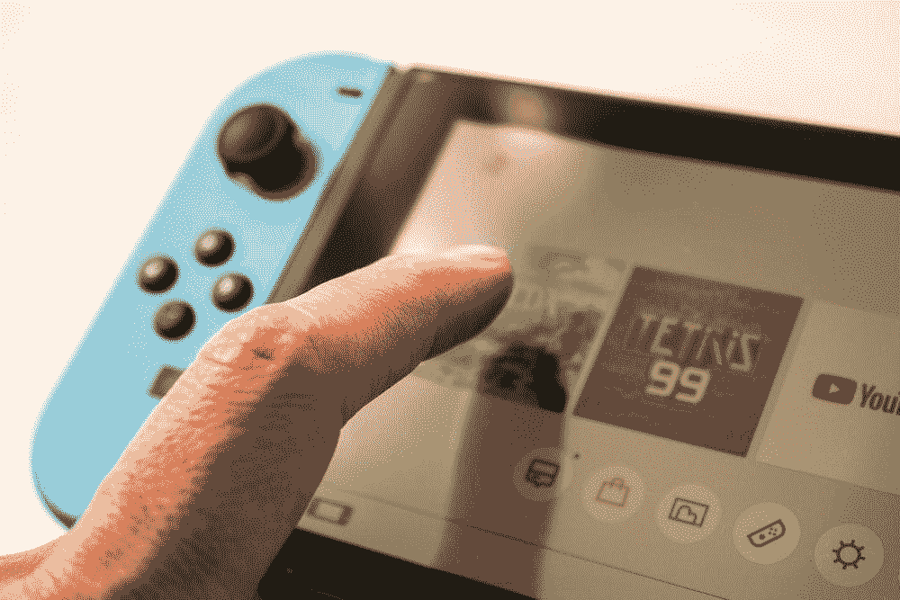

# 你通常在电子游戏中没有意识到的东西——音乐成分

> 原文：<https://medium.com/nerd-for-tech/what-youre-usually-unaware-in-videogames-the-musical-ingredient-b3e4931905a8?source=collection_archive---------1----------------------->

## 视频游戏音乐

## 其他任何行业都没有类似的东西。

Enrique Vidal Flores 通过 Unsplash 拍摄的照片

一旦视频游戏从单一的哔哔声和 boops(例如雅达利的 *Pong* 游戏，1972)演变成完整的配乐，音乐就成为了视频游戏中最重要的元素之一。