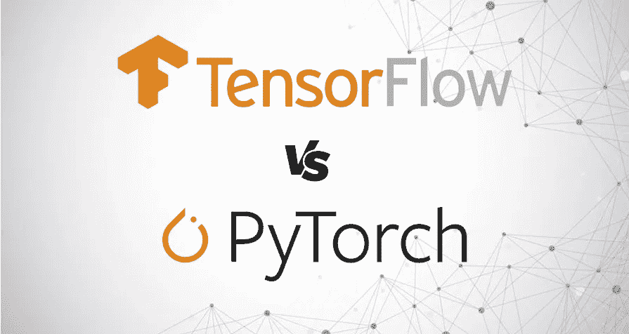
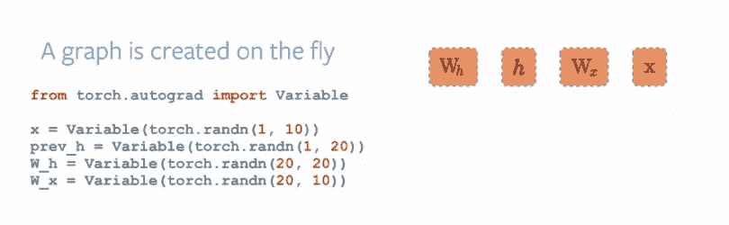

# Tensorflow 和 Pytorch 哪个更好？

> 原文：<https://medium.com/nerd-for-tech/whats-better-tensorflow-or-pytorch-2d36b84ed5d?source=collection_archive---------9----------------------->

Tensorflow 还是 Pytorch？

张量流和 Keras。它让你的生活更轻松。您想要尝试不同的网络，可以使用 Keras/Tensorflow 快速完成。是的，PyTorch 更 pythonic，速度更快。但是，缺乏足够的教程。

如果你喜欢玩并且热爱 NumPy 世界，使用 PyTorch，但是不要抱怨因为没有足够的教程。
面对事实:

**张量流:**
*由 Google 创建和支持。
*被用于研究和生产。
* Google 发布了对硬件加速张量流的支持。

*通过 TPU 提供支持。
*运行在 CPU 和 GPU 上。
*提供静态计算图形。
* Keras 是其中著名的高级 API。

PyTorch:
*由脸书创建和支持。
*仅用于研究。为了生产，通常使用 Caffe2(同样由脸书支持)。
*无特定硬件支持。
*在 CPU 和 GPU 上运行。
*提供动态计算图形，适用于 RNN 或 RNTN 模型。
* NN 是唯一的高级 API。

PyTorch 图

简而言之，我建议在这两方面都进行培训。根据你的舒适程度，这是最合适的。