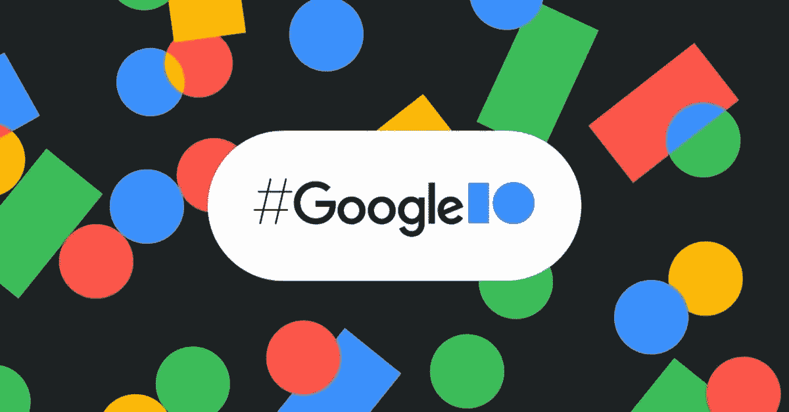
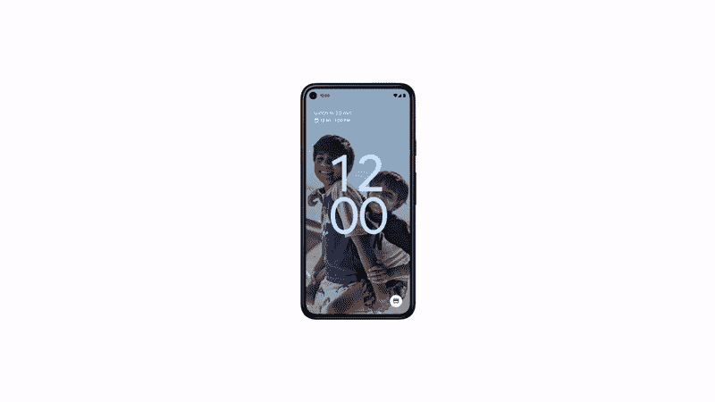
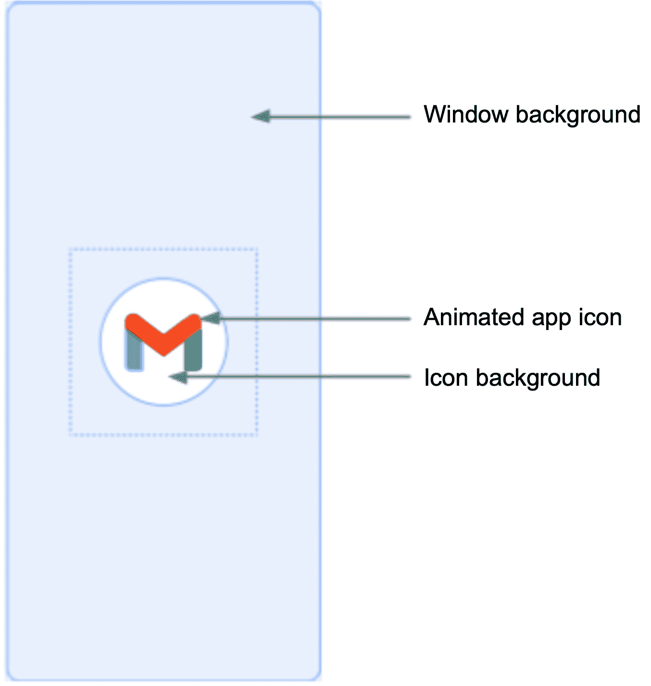
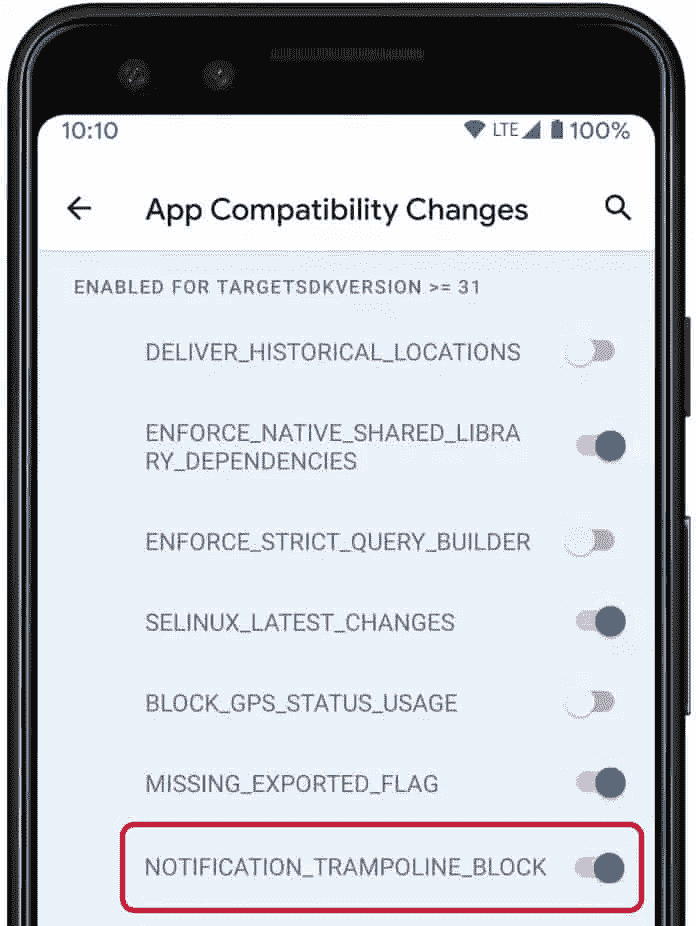
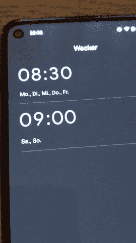
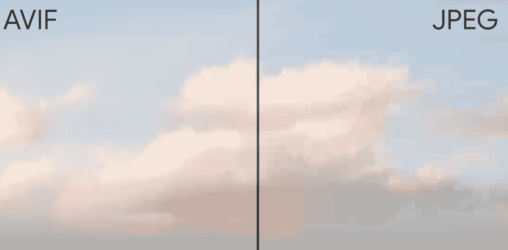

# Google I/O 21 上 Android 有什么新功能？

> 原文：<https://medium.com/nerd-for-tech/whats-new-in-android-at-google-i-o-21-63589acb97b1?source=collection_archive---------16----------------------->

作为一名 android 开发者，越多人依赖你的应用，期望就越高，Android 开发者的工作也不会变得更容易。我要说的是 Google I/O 期间已经推出的 Android 新特性，开始吧。



# **设计变更和新功能**

**颜色:**默认情况下，如果你作为一个应用开发者想要和默认的主题强调色协调，你可以只使用**主题。DeviceDefault.DayNight** 可让您适应亮主题和暗主题。



谷歌图片

在 Android 12 中，他们大大扩展了调色板，所有的系统服务都使用它。


正如你所看到的，锁定屏幕，主屏幕，通知和设置都使用相同的调色板，并协调在一起。调色板是根据壁纸自动选择的。

小部件:为了让小部件有更愉快的体验，有一个全新的 API，你可以用它来以一种新的方式构建这些小部件。

启动动画:Android 体验中最有趣的事情之一就是冷启动。在 Android 12 中，他们将添加一个新的闪屏，一个对每个应用程序来说都很棒的动画作为基线。每个应用程序将获得一个漂亮的新的放大动画，突出你的应用程序的图标。

如果这个动画不能满足你的需要，你可以替换你的，或者你可以自定义系统图标。



## Android 12 将摆脱烦人的通知功能

作为用户，当你点击一个通知，几秒钟内似乎什么都没有发生，这是因为应用程序使用了而不是直接从通知中启动活动，他们发送了一个广播或启动了一项服务，以便他们可以在后台做其他工作。它被称为蹦床，它引入了这个巨大的缺口，似乎手机只是没有反应。因此谷歌决定禁止应用程序使用这种延迟，并要求开发者根据新规则改变其应用程序的通知系统。



**祝酒词:**添加发送祝酒词的应用程序的图标，这样用户就会知道祝酒词来自哪里，同时减少了可以放在祝酒词上的文本数量。

**画中画(PiP):** 到目前为止，当用户使用向上滑动到主屏幕手势返回主屏幕时，系统必须等待过渡完成，然后才能动画显示从应用程序到画中画的过渡，这意味着应用程序很难控制这种体验。现在，在 Android 12 中，他们为 PiP 模式引入了新功能:

*   [新的 API 标志，可在手势导航中更平滑地过渡到画中画模式](https://developer.android.com/about/versions/12/features/pip-improvements#smoother-transition)
*   [禁用非视频内容无缝调整大小的新 API 标志](https://developer.android.com/about/versions/12/features/pip-improvements#seamless-resizing)
*   [退出画中画模式时动画更流畅](https://developer.android.com/about/versions/12/features/pip-improvements#smoother-exit)
*   [支持新手势](https://developer.android.com/about/versions/12/features/pip-improvements#gestures)

**模糊效果:**好消息**🎉🎉**一个新的视图 API 叫做 *setRenderEffect* ，你可以在任何视图上使用它。

```
imageView.setRenderEffect(
RenderEffect.createBlurEffect(
radiusX, radiusY, SHADER_TILE_MODE))
```

您还可以模糊窗口内容之外的内容。

**闪耀效果:✨** 这是 Android 12 新视觉语言的一部分。



**AVIF 图像支持:**为了给你更高的图像质量和更高效的压缩，Android 12 引入了对 [AV1 图像文件格式](https://en.wikipedia.org/wiki/AV1#AV1_Image_File_Format_(AVIF)) (AVIF)的平台支持，这种图像格式在某些轴上优于 JPEG 和 PNG。正如你所看到的，AVIG 图像在天空中不那么块状和弯曲。



AVIF vs JPEG

**音频耦合触觉回放:**这是一个非常有趣的名字，指的是非常简单和令人愉快的东西。你可以从媒体播放器中取出一个音轨，然后发送给触觉发生器，它会根据这个音轨产生振动模式或触觉模式。比方说，如果你有一个游戏，你有一个主要人物的脚步声或雨声的音轨，你可以将其输入触觉发生器，自动为用户创建这些非常好的振动模式，以增加沉浸感。

```
if( HapticGenerator.isAvailable()){
    val audioSession = audioTrack.audioSessionId
    generator = HapticGenerator.create(audioSession)
}
```

## 隐私仪表板和改进的权限:

为了更加透明和清晰地访问数据，Android 12 现在有一个隐私仪表盘，可以从设置中访问，使系统中发生的事情更加清晰，并给用户更多的控制权。


**大概位置:** [使用针对 Android 12 的 app 时，用户可以要求 app 只能访问大概的位置信息。](https://developer.android.com/about/versions/12/behavior-changes-12)

**拖拽& Drop:** 在 Android 12 中，他们折叠拖拽& drop，复制&粘贴和键盘贴纸到一个单独的 API 编码路径中，即*setOnReceiveContentListener*，它对所有这三个用例都正确。

有关更多信息，您可以查看:

*   [https://Android-developers . Google blog . com/2021/05/whats-new-for-Android-developers-at . html](https://android-developers.googleblog.com/2021/05/whats-new-for-android-developers-at.html)
*   [https://www.youtube.com/watch?v=D2cU_itNDAI&t = 856s&ab _ channel = Android developers](https://www.youtube.com/watch?v=D2cU_itNDAI&t=856s&ab_channel=AndroidDevelopers)
*   [https://developer . Android . com/about/versions/12/behavior-changes-12](https://developer.android.com/about/versions/12/behavior-changes-12)
*   [https://material.io/blog/announcing-material-you](https://material.io/blog/announcing-material-you)