# Java 14 有什么新特性？

> 原文：<https://medium.com/nerd-for-tech/whats-new-in-java-14-907190a984d9?source=collection_archive---------24----------------------->

## 让我们回顾一下 Java 14 的最新特性

照片由[法赫米·法克鲁丁](https://unsplash.com/@fahmipaping)在 [Unsplash](https://unsplash.com) 上拍摄

J ava 14 (Java SE 14)及其 Java 开发工具包 14 (JDK 14)开源已于 2020 年 3 月 17 日发布。版本 14 中发布了大量的 Java 增强建议(jep)。Java 14 解决了下面列出的总共 16 个主要增强/变化(jep)。

## ***JEP 305:实例的模式匹配(预览)***

Java 14 之前:

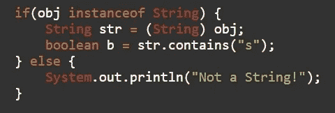

现在，在 Java 14 增强之后，我们可以像这样重构上面的代码:

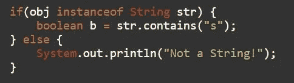

## ***JEP 343:包装工具(保温箱)***

JEP 343 提供了一个孵化工具 jpackage 来打包自包含的 Java 应用。这个 JEP 是 JDK 14 号的一部分。jpackage 将一个 Java 应用程序打包成一个特定于平台的包，其中包含所有必需的依赖项。它支持不同的特定于平台的包格式。

*   Linux — deb 和 rpm
*   macOS — pkg 和 dmg
*   Windows — msi 和 exe

## ***JEP 345:G1 的 NUMA 感知内存分配***

多核处理器现在是通用标准。在 NUMA 内存架构中，每个处理器内核接收少量本地内存，但其他内核有权访问。JEP 345 计划为 G1 垃圾收集器配备有利地使用这种架构的可能性。其中，这是为了提高非常强大的机器的性能。

JEP 345 专门用于实现对 G1 垃圾收集器的 NUMA 支持，仅用于内存管理(内存分配)并且也仅在 Linux 下。这种对 NUMA 架构的支持是否也适用于其他垃圾收集器或者其他部分，比如任务队列窃取，还不知道。

## ***JEP 349: JFR 事件流播***

Java 飞行记录器(JFR)现在是 OpenJDK 的一部分，因此可以免费获得。JEP 349 创建了一个 API，通过该 API，Java 飞行记录器收集的数据可用于持续监控活动和非活动的应用程序。

## ***JEP 352:非易失性映射字节缓冲器***

改进的 FileChannel API 可创建访问非易失性内存(NVM)的 MappedByteBuffer，这种内存即使在重启后也可以检索存储的数据。例如，该特性确保了可能仍在缓存中的任何更改都被写回到内存中。只有 Linux/x64 和 Linux/AArch64 操作系统支持这一点。

## ***JEP 358:有用的空指针异常***

通过告知哪个变量为空，改进了对 NullPointerExceptions 的描述。添加-XX:+ShowCodeDetailsInExceptionMessages 选项以启用此功能。

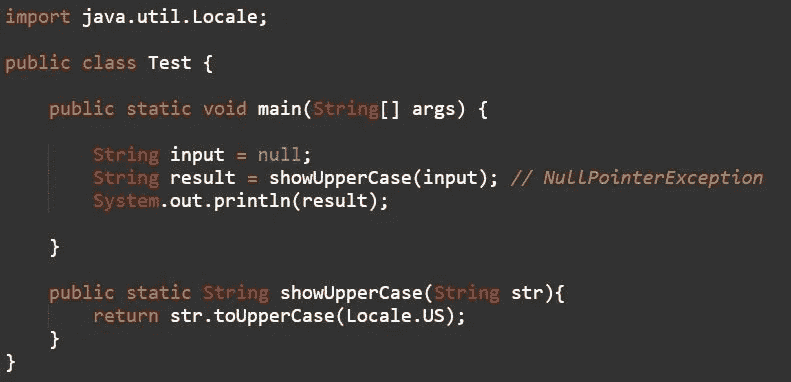

Java 14 之前:

带有-XX:+ShowCodeDetailsInExceptionMessages 选项的 Java 14:

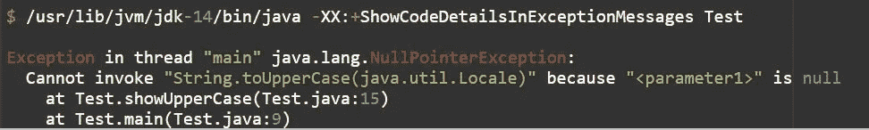

## ***JEP 359:首辅(预览)***

记录是存储纯数据的数据类。引入记录背后的想法是快速创建没有样板代码的简单明了的类。通常 Java 中的类需要你实现 equals()，hashCode()，getters 和 setters 方法。虽然有些 ide 支持自动生成这样的类，但是代码仍然很冗长。对于一个记录，你只需要用下面的方式定义一个类。

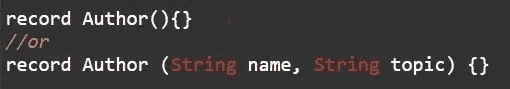

Java 编译器将自动生成一个构造函数、私有 final 字段、访问器、equals/hashCode 和 toString 方法。上述类的自动生成的 getter 方法是 name()和 topic()。

我们可以通过以下方式向记录中添加额外的字段、方法和构造函数:

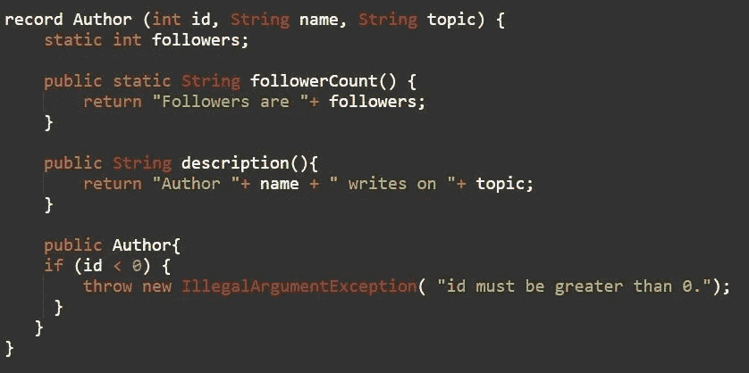

记录中定义的附加构造函数称为紧凑构造函数。它不包含任何参数，只是规范构造函数的扩展。编译器不会将紧凑构造函数生成为单独的构造函数。相反，它用于验证案例，并将在主构造函数开始时被调用。

关于记录，还有一些更重要的事情需要注意:

*   一个记录既不能扩展一个类，也不能被另一个类扩展。这是最后一门课。
*   记录不能是抽象的
*   记录不能扩展任何其他类，也不能在主体内定义实例字段。实例字段只能在状态描述中定义
*   声明的字段是私有的和最终的
*   记录的主体允许静态字段和方法
*   记录允许修改访问器方法
*   记录支持多个构造函数
*   记录可以实现接口
*   记录的引用字段内的值可以变异

此功能可以通过—启用—预览来测试。

## ***【JEP 361:开关表情(标准)***

在前两个版本中保留了预览特性之后，切换表达式——Java 12 和 Java 13 最终在 Java 14 中获得了永久的地位。

*   Java 12 为 switch 表达式引入了 lambda 语法，从而允许使用多个 case 标签进行模式匹配，并防止导致冗长代码的失败。它还强制执行了穷举的情况，如果没有覆盖所有的输入情况，就会抛出编译错误。
*   Java 13 的第二个预览版引入了 yield 语句，而不是 break 来从表达式返回值。

Java 14 现在终于让这些特性成为了标准。

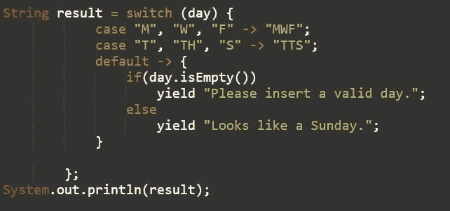

## ***JEP 362:弃用 Solaris 和 SPARC 端口***

放弃对 Solaris/SPARC、Solaris/x64 和 Linux/SPARC 端口的支持，更少的平台支持意味着新功能的交付速度更快。

## ***JEP 363:移除并发标记清扫(CMS)垃圾收集器***

Java 9 — JEP 291 不赞成使用这种并发标记清除(CMS)垃圾收集器，现在它被正式删除了。

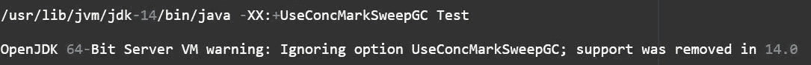

## ***JEP 364:MAC OS 上的 ZGC(实验)***

Java 11——JEP 333 在 Linux 上引入了 Z 垃圾收集器(ZGC ),现在它可以移植到 macOS。

## ***JEP 365:Windows 上的 ZGC(实验)***

Java 11 — JEP 333 在 Linux 上引入了 Z 垃圾收集器(ZGC)，现在它可以移植到 Windows 版本> = 1803。

## ***JEP 366:反对 ParallelScavenge + SerialOld GC 组合***

由于较少使用和大量维护工作，Java 14 不赞成并行年轻一代和串行老一代 GC 算法的组合。/usr/lib/JVM/JDK-14/bin/Java-XX:-useparallelloldgc 测试

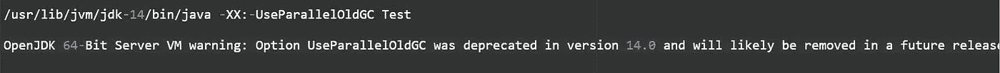

## ***JEP 367:移除 Pack200 工具和 API***

Java 11 — JEP 336 弃用了 pack200 和 unpack200 工具，以及 java.util.jar 包中的 Pack200 API，现在正式删除了。

## ***JEP 368:文字块(第二次预览)***

第一个预览版出现在 Java 13 — JEP 354 中，现在又增加了两个新的转义序列:

*   \ <end-of-line>取消行终止。</end-of-line>
*   \s 被转换成一个空格。

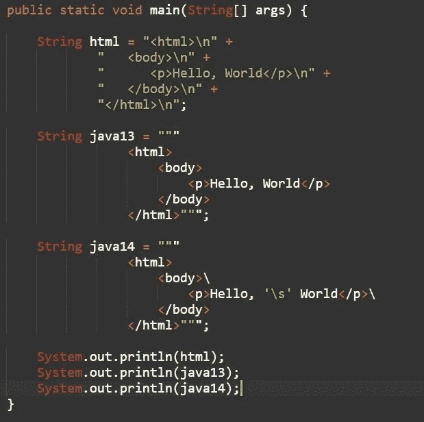

使用-启用-预览来启用该特征

输出:

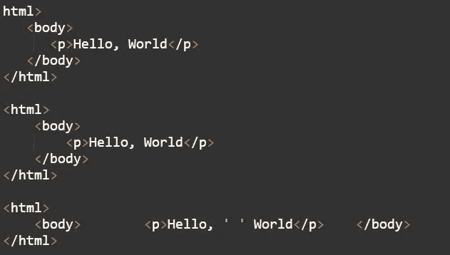

## ***JEP 370:外来内存访问 API(孵化器)***

一个孵化器模块，允许 Java API 访问 Java 堆之外的外部内存。

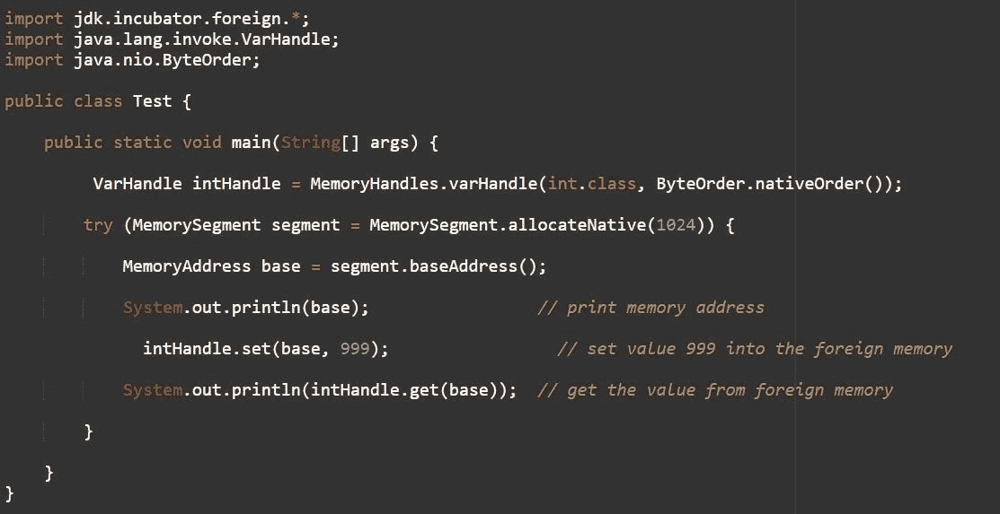

编译并运行孵化器模块 jdk.incubator.foreign

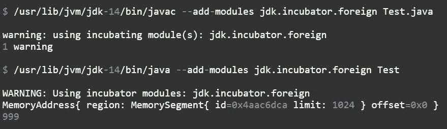