# 现代 JavaScript 的新特性

> 原文：<https://medium.com/nerd-for-tech/whats-new-in-modern-javascript-fb708c04b8f5?source=collection_archive---------3----------------------->


JavaScript 是一种广泛使用的脚本语言，它基于 ECMA 脚本规范。尽管 JavaScript 已经多年没有发展了，但 MEAN (MongoDB、Express、Angular、Node)栈的进入已经带来了一些有用的升级。因此，ECMAScript 6(也称为 ES6 和 ECMAScript 2015)于 2015 年 6 月发布，现在被广泛使用。

JavaScript ES6 引入了新的语法和几个新特性，旨在使您的代码更加现代和可读。它使您能够用更少的代码做更多的事情。

在本文中，我将介绍 ES6 中添加的一些新特性。

# 让和 const

在以前的版本中，我们使用`var`来声明变量。`var`语句声明了一个**函数作用域或全局作用域**的变量。这意味着在函数中使用`var`关键字会创建一个可以从函数中访问的函数范围变量。同样，如果我们在函数之外使用`var`关键字，它会产生**一个全局作用域变量**。这些**全局变量可以从代码文件**中的任何地方访问。重复的`var`声明**不会导致错误**，变量的值将**全局改变**。

参见下面的代码，

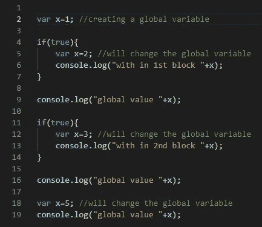

代码片段 1

*   在第 5 行和第 12 行，即使`var`是在`{}`块中声明的，它也会全局改变变量的值**。**
*   即使我们在第 18 行的同一个块(范围)中复制了`var`，也没有出现**错误**。

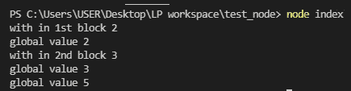

产出 1

## 让

在 ES6 中，`let`关键字可以用来声明阻塞的作用域变量。这些块范围变量只能从块内部访问，而不能全局访问(我们不能从块外部访问)。参见下面的代码，

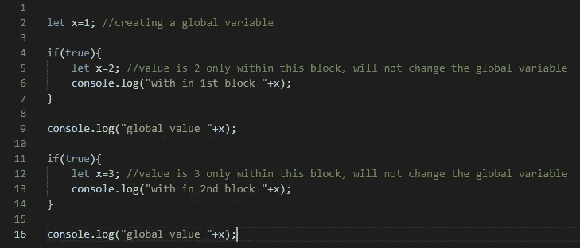

代码片段 2

*   在这里，第 5 行和第 12 行中创建的变量只在它们自己的块中可用。

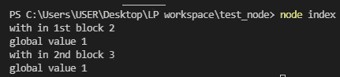

产出 2

此外，我们**不能在同一个作用域** (Block)内复制 let，这样做会导致**错误**。参见下面的代码，

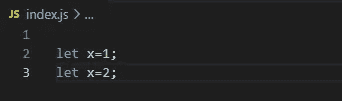

代码片段 3

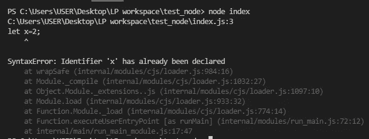

产出 3

> 注意:- `let`提供了一个可变变量，这意味着我们可以在声明之后随时更改值。对于 Ex:

```
var x=1;
x=2;
console.log(x);  //result is 2
```

## 常数

在 ES6 中，有另一个新的声明变量的关键字叫做 **const** 。但是**常量变量一旦被设置**，就不能被重新分配。换句话说，它提供了一个**不可变的变量**，除非它与对象或数组一起使用。参见下面的代码，

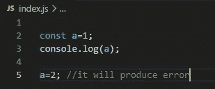

代码片段 4

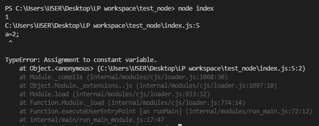

产出 4

> 注意:`const`只保护**直接变量**。它不能保护内部组件。例如，它不能保护数组中的元素或对象中的元素。参见下面的代码，

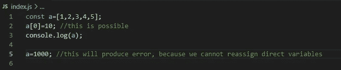

代码片段 5

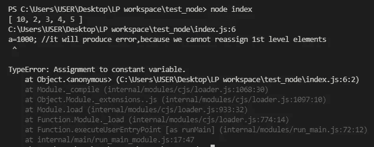

产出 5

# 箭头功能

arrow 函数非常棒，因为它使您的代码更具可读性、结构化和现代感。考虑以下代码:

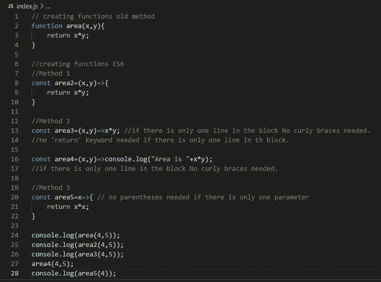

代码片段 6

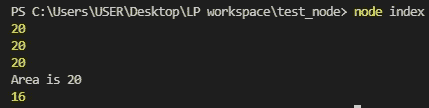

产出 6

> **注意:**如果我们在常规函数中使用‘this’关键字，那么‘this’关键字将代表函数的调用者。但是如果我们在一个箭头函数中使用“this”关键字，那么“this”关键字将不会表示函数的调用方。参见下面的例子。

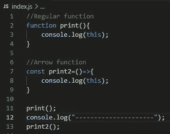

代码片段 7

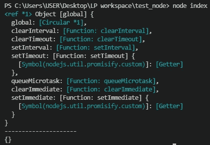

产出 7

# 目标

参见下面的例子，

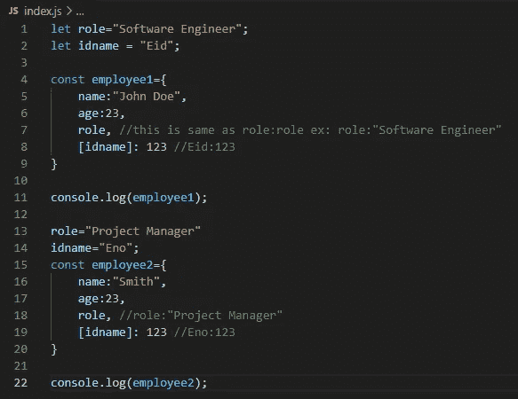

代码片段 8

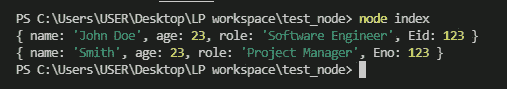

产出 8

**注:**

*   在 Es6 中，在上面的代码中，第 7 行和第 18 行将在键-值对中将变量名存储为“key ”,变量值存储为“value”。*当我们在创建对象时不知道键值对的“值”时，这是一个很好的方法。*
*   第 8 行和第 19 行将变量的值存储为键-值对中的“key”。这叫做**动态属性**。*当我们在创建对象时不知道键-值对的“键”时，这是一个好方法。*

# 冻结

Object.freeze()是一种用于冻结对象的方法。它用于使对象不可变。因此，我们不能添加、删除或修改冻结对象的组件。

> **注意:**冻结()方法只会冻结第一级组件。对象组件的内部组件不会被冻结。参见下面的代码，

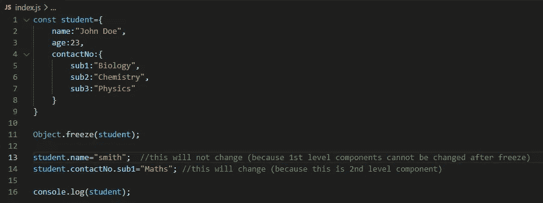

代码片段 9

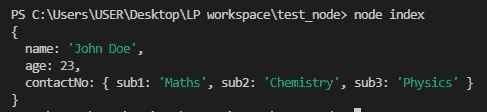

产出 9

> **注意:**如果你有一个对象将被从一个服务发送到另一个服务，并且你想确保它不被修改，你可以使用`freeze()`方法。

# 模板

ES6 的一个很好的特性是模板文字。当连接字符串或在字符串中使用变量时，我们不需要使用加号(+)操作符。

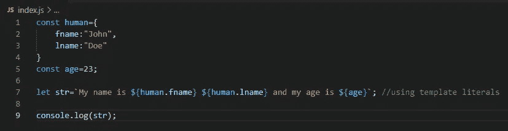

代码片段 10

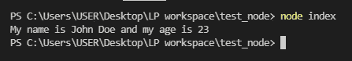

产出 10

# 班级

类是面向对象编程(OOP)的核心。ES6 允许您创建和利用类。参见下面的代码，

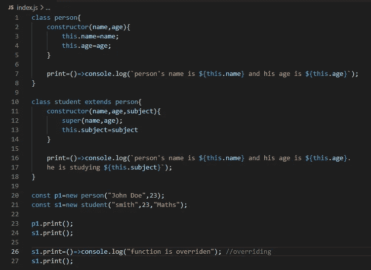

代码片段 11


产出 11

注意:

> *在 ES6 中，我们使用'**构造函数**'关键字来声明一个构造函数。
> 
> *没有必要为了存储实例变量而声明实例变量。我们需要做的就是**在构造函数**中赋值。(参见线 3 & 4)
> 
> *和 java 一样，我们使用'**扩展**关键字来实现继承。
> 
> *我们使用 **super()** 方法调用父类的构造函数。
> 
> *类中最酷的特性是我们可以在调用对象时**覆盖一个函数(参考第 26 行)**

# 破坏

解构是破坏一个结构的过程。从编程的角度来看，解构数据结构意味着将单个值从数据结构中解包出来。在 ES6 中，析构可以用在对象或数组上。考虑下面的代码，

销毁的代码片段

注意:

*   在上面的代码中，第 8 行解压 person 对象并给每个变量赋值。如果变量的名称与对象的一个键匹配，则该键的值将存储在该变量中。
*   第 19 行将根据数组的顺序为变量赋值。
*   第 28 行根据数组的顺序分配变量值。赋值后，数组中剩余的所有元素将被复制到一个新的数组(c1)中。
*   第 33 行将复制该数组。
*   第 41 行将合并这两个数组。
*   在第 54 行，即使我们将整个对象作为参数发送，该对象将被解压缩，并且该对象的这两个元素将作为参数传递给函数。

# 回调、承诺、异步/等待

Node.js 将异步运行。这里，一条语句不等待前一条语句完成执行。要理解异步代码是如何工作的，请看下面的代码。

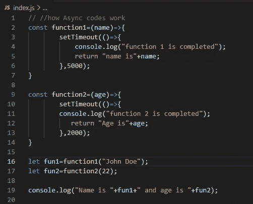

代码片段 12

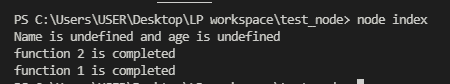

产出 12

> **注意:**以上，即使先调用 function1()，function2()也先完成其执行，如输出所示。这是因为执行是异步的。这里，function2()不等待 function1()的完成。此外，因为第 19 行在 function1()和 function2()完成之前执行，所以输出是“未定义的”。

## 回调函数

假设我们在一家比萨饼店，我们点了一份比萨饼，并指示店主在比萨饼做好时给我们打电话。然后我们就能继续工作了。披萨好了他们会打电话给我们，这样我们就可以去拿了。回调函数以类似的方式工作。

假设当我们调用 FunctionA()时，我们将 functionB()作为参数传递给 functionA()。因此，当 functionA()完成时，它调用 functionB()。这就是我们如何使用回调函数来管理异步代码。看看下面的代码，

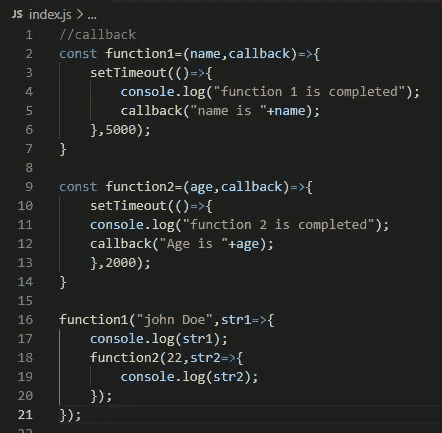

代码片段 13

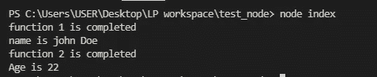

产出 13

我们可以看到，通过利用回调函数，我们可以让代码以特定的顺序执行。

## 承诺

当回调函数的数量增加时，它看起来会变得更加复杂。取名**《回调地狱》**。我们可以用承诺来有效地解决这个问题。

一个需要时间来完成执行的函数，当我们调用这个函数时，它会返回一个承诺。承诺有两种可能的状态，它们是“决定”和“拒绝”。当函数成功完成后，我们可以使用 then()继续执行。如果函数返回任何错误，我们可以使用 catch()来处理这些错误。

为了说明承诺是如何工作的，考虑下面的例子。让我们假设我们正在向系统发送关于我们客户的账户细节的信息。根据账户类型，系统将计算利息金额。如果没有找到记录，系统将抛出一个错误。看看下面的代码，

承诺的代码片段

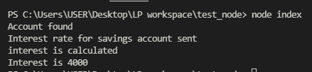

输出到上面的代码

## 异步等待

`async`和`await`让承诺更容易写。函数前的关键字`async`使函数返回一个承诺。一个函数前的关键字`await`让函数等待一个承诺。`await`关键字只能在`async`函数中使用。让我们使用 Async / Await 来转换上面的代码。

```
getAccount(client_accounts,"John Doe") .then(account=>getInterestDetails(account)) .then(interestDetails=>getInterest(interestDetails.amount,interestDetails.rate)).then(interest=>console.log("Interest is "+interest)).catch((error)=>console.log(error));
```

而不是用这个👆用这个👇

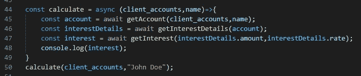

代码片段 14

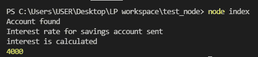

产出 14

# 继续学习❤️

# 参考

[](https://www.freecodecamp.org/news/write-less-do-more-with-javascript-es6-5fd4a8e50ee2/) [## JavaScript ES6 -写得更少，做得更多

### JavaScript ES6 带来了新的语法和令人惊叹的新特性，使您的代码更加现代，可读性更好。它允许…

www.freecodecamp.org](https://www.freecodecamp.org/news/write-less-do-more-with-javascript-es6-5fd4a8e50ee2/)