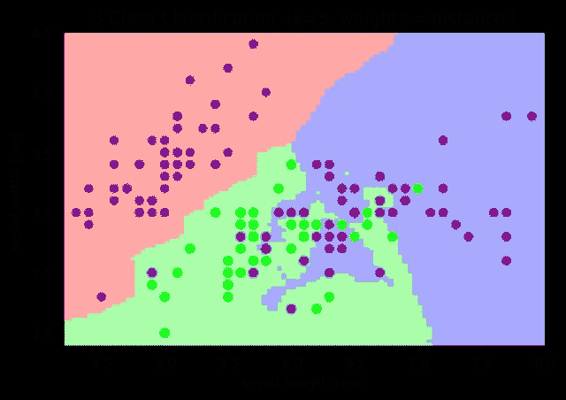
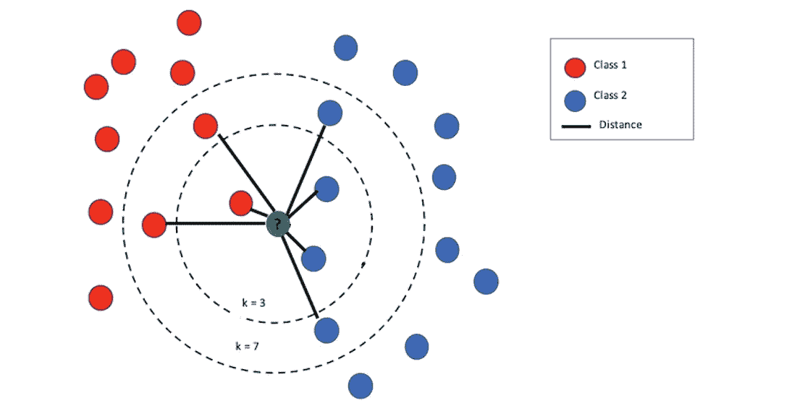
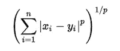
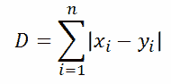
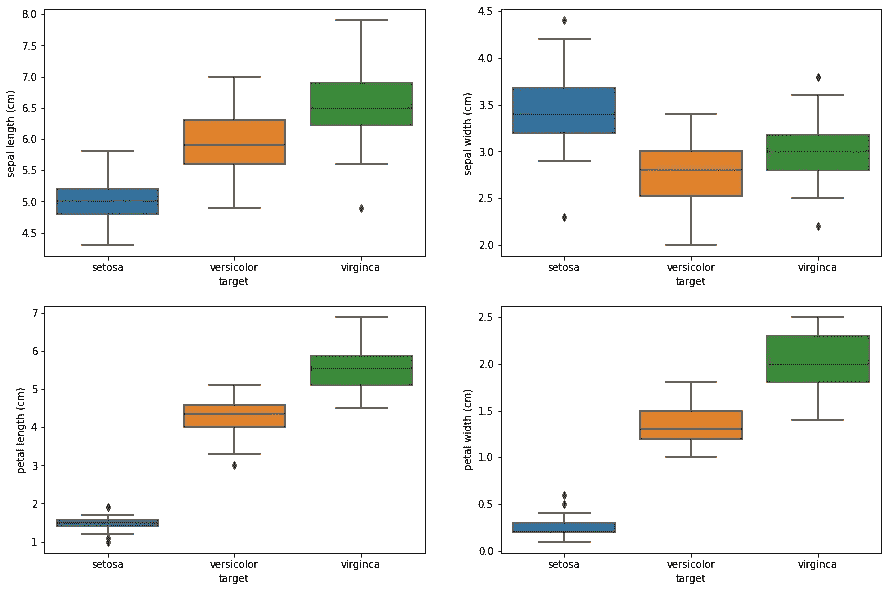
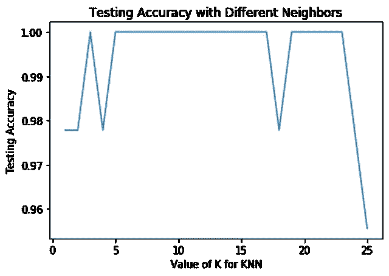

# 什么是 KNN？

> 原文：<https://medium.com/nerd-for-tech/whats-the-knn-74e84458bd24?source=collection_archive---------0----------------------->

通过从头开始创建来理解懒惰学习者算法。



具有 3 个最近邻的 Iris 数据集上最近邻决策的决策边界

# **什么是 KNN 算法？**

k 近邻(KNN)是一种非参数的监督机器学习算法。(有监督的机器学习是指机器根据标记的训练数据学习将输入映射到输出。)它是机器学习中用于回归和分类的最简单的算法之一。KNN 遵循“物以类聚”的策略来确定新数据的适用范围。KNN 使用所有可用的数据，并根据相似性度量或距离函数对新数据或案例进行分类。然后将新数据分配给大多数邻居所属的类。

# 为什么 KNN 被称为“懒惰的学习者”？

KNN 经常被称为**懒惰的学习者。这意味着该算法不使用训练数据点来进行任何归纳。换句话说，没有明确的训练阶段。缺乏通用性意味着 KNN 保留了所有的训练数据。它是一个**非参数学习算法**，因为它没有对底层数据做任何假设。**

# **如何使用 KNN 算法进行预测？**

为了将由一些特征向量表示的未知实例分类为特征空间中的点，KNN 分类器计算该点和训练数据集中的点之间的距离。通常，**欧几里德距离**被用作距离度量。



找到新数据最接近的标签模式。

## 距离公式

以下是 KNN 算法中使用的其他距离公式。

*   **闵可夫斯基距离**是一个赋范向量空间，可以认为是欧几里德距离和曼哈顿距离的推广。



闵可夫斯基距离

*   **欧几里德距离**是计算 KNN 时最常用的距离公式。欧几里得距离公式找到 A 点和 b 点之间的最短距离。这有时被称为勾股定理。


欧几里得距离

*   另一个距离公式是**曼哈顿距离**公式。该公式取坐标差的绝对值之和。



曼哈顿距离

*   其他公式包括切比雪夫，Wminkowski，Seuclidean，Mahalanobis。

你可以阅读这篇关于距离公式在计算 KNN 中的重要性的文章。[https://arxiv.org/pdf/1708.04321.pdf](https://arxiv.org/pdf/1708.04321.pdf)

# **如何选择 k 的值？**

KNN 中的“K”代表模型用来计算如何为新数据分配类的最近邻的数量。这是提高模型精度的一个重要参数。虽然没有找到 K 的最佳值的结构化方法，但这里有一些建议。

1.  取 N 的平方根，其中 N 是训练数据中的样本数(k=sqrt(N))
2.  选择一个奇数。这有助于避免两类数据之间的混淆。
3.  交叉验证。使用训练数据的一个小子集(称为验证集)，测试 K 的不同可能值，然后选择为验证集产生最佳结果的 K。

# **实现 KNN 算法**

KNN 模式可以通过 4 个简单的步骤来实施。为了演示 KNN 算法，我在虹膜数据集上使用它。这是来自 sklearn 库的预加载数据集。鸢尾数据集包括三种鸢尾属物种——Setosa、Versicolor 和 Virginica，每种都有 50 个样本。对于每个样本，我们有萼片长度，宽度，花瓣长度和宽度。


[面向初学者的 R 中的机器学习](https://www.datacamp.com/community/tutorials/machine-learning-in-r)

1.  **看数据**

KNN 算法将使用 4 个特征之间的关系，并对测试数据进行预测。



**虹膜特征方框图**

```
# Load Data
# Import library
from sklearn.datasets import load_irisiris = load_iris()**# Separate into target and features
# Scale features**
X = scale(iris.data)
y = iris.target
```

1a。将 K 初始化为您选择的邻居数量

```
**Instantiate model**
clf = KNN(k=13)
I used 13 because this is approximately the sqrt(n) as mentioned above.
```

1b。符合模型

```
**Fit on X_train and y_train**
clf.fit(X_train, y_train)
```

为了配合，KNN 只是将训练数据添加到内存中。没有活跃的训练阶段。

2.**对于数据中的每个示例:**

*   根据数据计算查询示例和当前示例之间的距离。
*   将示例的距离和索引添加到有序集合中

```
**# Distance Formula
def** euclidean_distance(self, point1, point2, length):
     distance = 0 for x in range(length):
          distance += (point1[x]-point2[x])**2 return np.sqrt(distance)**# Calculate distances between X_train and X_test
def** _get_distance(self, X_test): length = X_test.shape[1] *# Initialize distance array* distances = [] for idx in range(len(X_test)):
          *# record X_test id 
          # initialize an array to hold distances* distances.append([ X_test[idx], [] ]) *# Loop through each row in x_train* for row in self.X_train: *# find the euclidean distance 
              # append to distance list* dist = self.euclidean_distance(row, X_test[idx],   
                                             length)
              distances[idx][1].append(dist) return distances
```

**3。找到邻居**

*   按距离从小到大(按升序)对距离和索引的有序集合进行排序
*   从排序的集合中挑选前 K 个条目
*   获取所选 K 个条目的标签

```
**# Get Predictions
def** _get_labels(self, distances):
     *# Initialize y_pred array*     
     y_pred = [] for row in range(len(distances)):

          *# sort distances and record up to k values* distance = distances[row]
          y_indices = np.argsort(distance[1])[:self.k] *#  find the classes that correspond with nearest neighbors* k_nearest_classes = [self.y_train[i%len(self.y_train)] for 
                              i in y_indices]
         *# get label based on the mode of the classes
         label* = [stats.mode(k_nearest_classes)][0][0][0] y_pred.append(label)

     return y_pred
```

**4a。如果分类，返回 K 标签的模式。**

**4b。如果回归，返回 K 个标签的平均值**

```
**def** predict(self, X_test):
     distances = self._get_distance(X_test)
     return self._get_labels(distances)**Predict on X_test**
predict = clf.predict(X_test)**This returns:** [1, 0, 2, 1, 1, 0, 1, 2, 1, 1, 2, 0, 0, 0, 0, 1, 2, 1, 1, 2, 0, 2, 0, 2, 2, 2, 2, 2, 0, 0, 0, 0, 1, 0, 0, 2, 1, 0, 0, 0, 2, 1, 1, 0, 0]**Calculate accuracy**
accuracy_score(y_test, predict)KNN model accuracy: 1.0
```

# **用 K 值优化**

您可以检查不同 k 值的错误率。这将有助于确定 k 的选择是否最适合您的模型。

```
k_range = range(1, 26)
scores = {}
scores_list = []for k in k_range:
    knn = KNeighborsClassifier(n_neighbors = k)
    knn.fit(X_train, y_train)
    y_pred = knn.predict(X_test)
    scores[k] = metrics.accuracy_score(y_test, y_pred)
    scores_list.append(metrics.accuracy_score(y_test, y_pred))# plot the relationship between K and the testing accuracy
plt.plot(k_range, scores_list)plt.xlabel("Value of K for KNN")
plt.ylabel("Testing Accuracy")
```



# **如何使用 KNN？**

KNN 是一个简单而强大的算法，因为它不需要进行预测训练。下面是 KNN 算法的一些应用。

*   推荐系统:KNN 用于创建简单的推荐系统，如亚马逊或网飞使用的推荐系统，以提供电影建议或购买建议。
*   信用评级:KNN 算法可以用来找到一个人的信用评级，方法是对一个人的财务信息进行比较，并将其与其他具有类似信息的人进行比较。
*   银行业:银行应该给个人贷款吗？这个人会拖欠贷款吗？
*   其他示例包括手写检测、图像识别，甚至视频识别。

# 何时使用 KNN？

KNN 是一种强大的算法，但它不是所有机器学习模型的最佳算法。那么我们应该什么时候使用它呢？KNN 对于无噪声、小且有标签的数据很有用。

# **KNN 的利与弊**

**优点**

*   它很容易使用，只需要 k 和距离公式。
*   计算时间快，精度较高。因为它是一个懒惰的学习者，所以没有训练的必要。
*   多用途，可用于回归或分类。

**缺点**

*   计算量大，因为它必须存储所有的训练数据，并且需要很高的存储容量。
*   对不相关的特征和数据规模敏感。
*   可能会很慢，这取决于数据的大小。

# 摘要

KNN 是一种简单、强大且灵活的算法，可用于回归和分类问题。

**4 个简单的步骤:**

1.  看数据。
2.  计算距离。
3.  找邻居。
4.  找出最常见的标签。

# Find 代码:

在 [Github](https://github.com/jiobu1/CS_Build_Week_1) 上找到代码。

**具体文件:**

在这里找到我的 KNN 算法[的代码](https://github.com/jiobu1/CS_Build_Week_1/blob/main/KNN/knn.py)。

找到我的 KNN 测试的代码。py 文件[此处](https://github.com/jiobu1/CS_Build_Week_1/blob/main/KNN/knn_test.py)或作为 jupyter 笔记本[此处](https://github.com/jiobu1/CS_Build_Week_1/blob/main/KNN/knn_test.ipynb)。(我将我的算法与 sklearn 库中的 KNeighborsClassifier 进行比较)。

点击查看我的虹膜数据集[的数据可视化。](https://github.com/jiobu1/CS_Build_Week_1/blob/main/KNN/Exploratory_Analysis/iris_visuals.ipynb)

# **来源**:

*   [https://sci kit-learn . org/stable/modules/generated/sk learn . neighbors . kneighborsclassifier . html](https://scikit-learn.org/stable/modules/generated/sklearn.neighbors.KNeighborsClassifier.html)
*   [https://arxiv.org/pdf/1708.04321.pdf](https://arxiv.org/pdf/1708.04321.pdf)
*   [https://en . Wikipedia . org/wiki/K-nearest _ neighbors _ Algorithm # Algorithm](https://en.wikipedia.org/wiki/K-nearest_neighbors_algorithm#Algorithm)